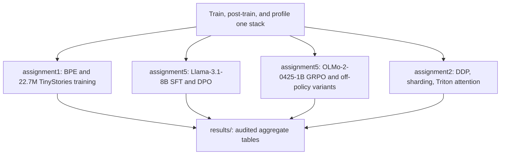

# LLM Training, Post-Training, and Performance Engineering

Independent implementations and experiments based on Stanford CS336. The work covers a small Transformer and byte-level BPE, Llama-3.1-8B supervised fine-tuning and DPO, OLMo-2-0425-1B GRPO on GSM8K, and custom GPU communication, sharding, and Triton attention kernels.

I wrote the training and evaluation code and ran the experiments below. The tables were checked on October 7, 2026 against the files committed in this repository. All 179 hashes in `results/source_manifest.json` match those files. The GPU jobs were not rerun for this page. The Assignment 5 training code here is the completed implementation.

## Problem

The course asks for three pieces that usually live in separate codebases:

1. Train a small language model, including the tokenizer, optimizer, and checkpointing.
2. Post-train a larger model with SFT, DPO, and GRPO, and measure whether the training recipe actually moves benchmark accuracy.
3. Replace stock distributed-training pieces with custom DDP, FSDP-style sharding, optimizer-state sharding, and a Triton attention backward kernel, then time and measure them.

## Personal contribution

The assignment scaffolding, tests, and handouts come from Stanford CS336. My part is the implementation and the experiment record:

- Transformer training, AdamW, checkpointing, generation, and byte-level BPE with incremental pair counting and parallel pretokenization.
- Full-parameter SFT and DPO, plus the benchmark evaluation whose counts are in `results/sft_dpo_results.csv`.
- Policy training in PyTorch with vLLM rollouts, weight synchronization, rewards, and the GRPO and off-policy variants in `assignment5/cs336_alignment/`.
- Custom DDP, FSDP components, optimizer-state sharding, and Triton attention forward and backward kernels.

## Workflow

## Key results

Rounded percentages below match the exact fractions in `results/key_results.csv`.

| Result | Model | Baseline | Dataset | Seeds | GPU | Evaluation |
|---|---|---|---|---|---|---|
| Off-policy clipped GRPO, **53.3%** mean answer accuracy, sample SD 2.2 percentage points | OLMo-2-0425-1B | On-policy standard GRPO, same `1e-5` learning rate and `r1_zero` prompt. Standard takes 1 optimizer update per rollout batch; this run takes 32. | GSM8K. First 6,400 training rows. Validation is the first **1,024** questions of `test.jsonl`. | **4 seeds, 0–3**, final step 200 | 2× RTX PRO 6000 Blackwell. Policy on `cuda:0`, vLLM on GPU 1. | Rollout batch 256, group size 8, temperature 1, top-p 1, 512 tokens, train batch 8, clip 0.2 |
| SFT, MMLU **61.2%**, GSM8K **31.5%** | Llama-3.1-8B, full parameters | Base zero-shot uses a different prompt, so that gap mixes prompt and training | MMLU 14,042 scored questions. GSM8K 1,319 scored questions. | Training seed 0 | 1× RTX PRO 6000 | Alpaca prompt, greedy decoding |
| DPO, MMLU **60.3%**, GSM8K **29.7%** | Llama-3.1-8B from the SFT checkpoint | Same Alpaca evaluation as SFT. Scores are lower under this recipe. | HH single-turn data. 200 validation pairs, 49,188 training rows. | Training seed 0 | Policy on `cuda:0`, reference on `cuda:1` | beta 0.1, lr `1e-6`, RMSprop, effective batch 64, greedy Alpaca eval |
| DDP overlap, **1,225.5 → 1,022.0 ms/step (−16.6%)** | Custom DDP, xl model, about 3.406B parameters | Custom naive DDP in the same benchmark | Synthetic `logits.mean()` loss | One timing run, 5 warmup and 10 measured steps | 2× RTX PRO 6000 Blackwell, PyTorch 2.11.0+cu128, NCCL | Context 512, global batch 4 |
| Optimizer-state sharding, **63.756 → 44.850 GiB (−29.7%)** rank-0 cumulative peak | Sharded AdamW state | Unsharded AdamW in a separate microbenchmark | Same xl shape. Gradients are not all-reduced. | One accounting run | 2× RTX PRO 6000 Blackwell | Step time rises 639.069 → 827.633 ms (+29.5%) |
| BPE run, **100.7 s** | Incremental byte-level BPE | Profiled baseline used different instrumentation. No controlled speedup is claimed. | TinyStories, 10,000 vocabulary, 9,743 merges | One saved run | CPU | `assignment1/runs/tinystories_bpe/optimize_console.txt` |
| TinyStories validation cross-entropy **1.402** | 22.7M Transformer | Single training run | TinyStories, about 328M processed tokens | 40,000 updates | Saved log | Final validation cell 1.4019526660442352 |

All 14 GRPO configurations, each with four seeds and 1,024 validation questions, are in [`results/grpo_config_summary.csv`](results/grpo_config_summary.csv). The 56 seed rows are in [`results/grpo_seed_results.csv`](results/grpo_seed_results.csv).

## Code entry points

| Component | Path |
|---|---|
| BPE optimization | `assignment1/cs336_basics/bpe_optimize.py` |
| TinyStories training log | `assignment1/runs/tinystories/training_log.csv` |
| DDP, FSDP, optimizer sharding | `assignment2/cs336_systems/ddp.py`, `fsdp.py`, `optimizer_state_sharding.py` |
| DDP benchmark | `assignment2/cs336_systems/benchmark_ddp.py` |
| Attention backward | `assignment2/cs336_systems/flash_attention_triton_backward.py` |
| On-policy GRPO | `assignment5/cs336_alignment/grpo.py` |
| Off-policy GRPO | `assignment5/cs336_alignment/grpo_offpolicy.py` |
| Recipe settings, including `offpolicy_clip` | `assignment5/cs336_alignment/training_runtime.py` |
| DPO loss | `assignment5/cs336_alignment/dpo.py` |
| Test adapters | `assignment5/tests/adapters.py` |
| Train standard GRPO | `assignment5/scripts/train_grpo.py` |
| Train GRPO variants and off-policy recipes | `assignment5/scripts/train_grpo_variants.py` |
| Train SFT and DPO | `assignment5/scripts/train_sft.py`, `assignment5/scripts/train_dpo.py` |
| Experiment notes | `assignment5/writeup.md`, `assignment5/writeup_safety.md` |

## Where the numbers live

- [Headline table with model, baseline, dataset, seeds, GPU, and evaluation conditions](results/key_results.csv)
- [Column definitions and the shared GRPO contract](results/README.md)
- [SFT and DPO counts](results/sft_dpo_results.csv)
- [Systems timing and memory](results/systems_results.csv)
- [Environment, data layout, commands, expected outputs, and completed checks](docs/REPRODUCIBILITY.md)
- [Source-artifact hashes](results/source_manifest.json)

## Findings that bound the claims

GRPO validation questions were taken from GSM8K `test.jsonl` and reused while configurations were selected. The 53.3% figure is the four-seed mean at step 200 on those 1,024 questions. Off-policy and standard runs do not use the same number of optimizer updates. The clipped and unclipped off-policy means are close: 0.532958984375 and 0.530029296875.

DPO is below the saved SFT MMLU and GSM8K scores under this recipe. The base-model evaluation uses a zero-shot prompt, and SFT and DPO use Alpaca, so the base-to-SFT difference mixes the prompt with training.

The optimizer-memory benchmark omits gradient all-reduce. It measures rank-0 peak memory and step time for that microbenchmark. The BPE baseline was profiled, and the optimized timing run was not, so 100.7 seconds is the saved optimized elapsed time rather than a controlled speedup.

## What this checkout includes

`assignment5/data/` contains GSM8K, MMLU, and the four Anthropic HH training files used above. `assignment5/results/` contains the GRPO `run_config.json`, `metrics.jsonl`, and final validation rollout files. `assignment5/results_safety/` contains the SFT and DPO benchmark generations and summaries. OLMo-2-0425-1B weights, Llama-3.1-8B weights, the SFT and DPO checkpoints, and the UltraChat training file are not committed. Assignment 3 and Assignment 4 are in the tree and are not part of the tables above.

## Attribution

Stanford CS336 supplied the assignment scaffolding, tests, and teaching material. The license at the repository root covers this checkout. Keep the upstream attribution when reusing the course materials.
