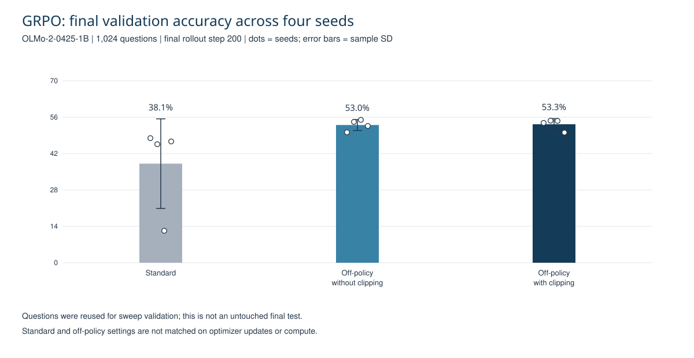
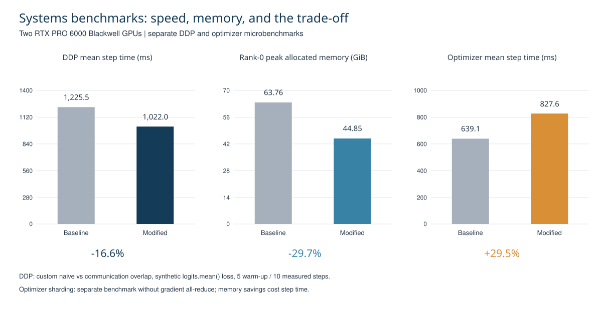

# LLM Training, Post-Training, and ML Systems

Independent implementations and experiments based on Stanford CS336: small-model pretraining, Llama-3.1-8B SFT/DPO, OLMo-2-0425-1B GRPO, and GPU communication/memory optimization.

I implemented the training and evaluation workflows, custom distributed components, and Triton attention kernels. The public Assignment5 code is the completed implementation. Results below are from saved experiments audited on October 7, 2026; GPU jobs were not rerun to prepare this page.

## Selected results

| Work | Result | Conditions |
|---|---|---|
| Off-policy clipped GRPO | **53.3%** mean answer accuracy; sample SD **2.2 pp** | Four seeds, 1,024 GSM8K validation questions, final step 200 |
| Llama-3.1-8B SFT → DPO | MMLU **61.2% → 60.3%**; GSM8K **31.5% → 29.7%** | Alpaca prompt; DPO regression under this recipe |
| DDP communication overlap | **1,225.5 → 1,022.0ms** per step (**−16.6%**) | Two RTX PRO 6000 GPUs, custom naive baseline |
| Optimizer-state sharding | **63.756 → 44.850GiB** rank-0 cumulative peak (**−29.7%**) | Separate microbenchmark; step time **+29.5%** |
| BPE / from-scratch training | **100.7s** BPE run with identical output; **1.402** final TinyStories validation loss | Saved run; no controlled BPE speedup claim |

## GRPO experiments

The PyTorch policy trains on GPU0; vLLM generates rollouts on GPU1. I implemented policy-weight synchronization, rewards, advantage/loss handling, and on/off-policy updates. There are 14 configurations × four seeds = 56 saved runs.

The 1,024 questions were drawn from GSM8K `test.jsonl` and reused for validation/configuration selection. Standard and off-policy settings use different numbers of optimizer updates. Clipped and unclipped off-policy means are close; this study does not isolate clipping as the cause of the standard-to-off-policy difference.

[All configuration results](results/grpo_config_summary.csv) · [Individual seeds](results/grpo_seed_results.csv) · [Off-policy implementation](assignment5/cs336_alignment/grpo_offpolicy.py)

## GPU systems experiments

The DDP benchmark compares custom synchronization strategies with a synthetic loss. The optimizer-memory experiment is separate and omits gradient all-reduce; it does not establish identical memory savings or convergence in complete synchronized training.

[Timing and memory table](results/systems_results.csv) · [DDP code](assignment2/cs336_systems/ddp.py) · [FSDP code](assignment2/cs336_systems/fsdp.py) · [Optimizer sharding](assignment2/cs336_systems/optimizer_state_sharding.py)

## Implementation map

| Component | Entry points |
|---|---|
| SFT / DPO | [SFT training](assignment5/scripts/train_sft.py), [DPO training](assignment5/scripts/train_dpo.py), [DPO loss](assignment5/cs336_alignment/dpo.py) |
| GRPO | [Standard training](assignment5/scripts/train_grpo.py), [variant training](assignment5/scripts/train_grpo_variants.py), [recipe settings](assignment5/cs336_alignment/training_runtime.py) |
| Triton attention | [Backward kernel](assignment2/cs336_systems/flash_attention_triton_backward.py) |
| BPE | [Optimized implementation](assignment1/cs336_basics/bpe_optimize.py) |
| Tests | [Completed adapters](assignment5/tests/adapters.py) |

## Reproduce and inspect

- [Environment, data preparation, commands, and completed checks](docs/REPRODUCIBILITY.md).
- [Full experiment contracts and all headline conditions](docs/EXPERIMENTS.md).
- [Result column definitions](results/README.md), [SFT/DPO counts](results/sft_dpo_results.csv), and [source hashes](results/source_manifest.json).
- [Assignment5 project page](assignment5/README.md).

## Findings and attribution

DPO did not improve the saved SFT benchmarks. Base evaluation used a different prompt, so base-to-SFT differences mix prompt and training. The BPE baseline was profiled while the optimized run was not; their ratio is not a controlled speedup.

Stanford CS336 supplied the scaffolding, tests, and teaching materials. My contribution is the implementation and experiment work above. Preserve the existing license and upstream attribution.
