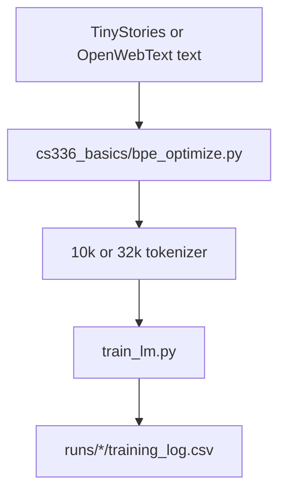

# Byte-level BPE and a Small Transformer LM

A from-scratch byte-level BPE tokenizer and a pre-norm Transformer language model, trained on TinyStories and a subsample of OpenWebText. The assignment scaffolding and tests come from Stanford CS336. The implementation and the saved runs are mine.

The headline numbers below were checked against `runs/tinystories/training_log.csv`, `runs/owt/training_log.csv`, and `runs/tinystories_bpe/optimize_console.txt`. These GPU and CPU jobs were not rerun for this page. Ablations, learning-rate sweeps, and the full measurement limits are in `writeup.md`.

## Problem

Train a tokenizer and a language model without using a stock training framework for the core pieces:

1. Train byte-level BPE from raw text and encode documents with the learned merges.
2. Implement attention, RoPE, RMSNorm, SwiGLU, AdamW, checkpointing, and sampling.
3. Train a small model long enough to record validation cross-entropy, and keep the hardware, data, and schedule attached to that number.

## Personal contribution

- BPE training, including incremental pair counting and parallel pretokenization in `cs336_basics/bpe_optimize.py`.
- The Transformer, AdamW, checkpointing, and generation used by `train_lm.py`.
- The TinyStories and OpenWebText runs whose final validation rows are cited below.

`tests/adapters.py` calls this implementation.

## Workflow



## Key results

| Result | Model | Baseline | Dataset | Seeds | GPU | Evaluation |
|---|---|---|---|---|---|---|
| TinyStories validation cross-entropy **1.402** | 22,696,448 parameters. 4 layers, `d_model=512`, 16 heads, `d_ff=1344`, context 256, pre-norm RMSNorm, RoPE θ=10,000. | Single main run. Ablations use a shorter 10,000-step schedule and are not this row. | TinyStories V2. Batch 32, 40,000 steps, 327,680,000 train tokens. | The main-run seed was not archived separately. | 1× RTX 3060 Ti, Windows desktop, PyTorch 2.11.0+cu128. | `max_lr=1e-3`, `min_lr=1e-4`, warmup 2,000, cosine 40,000. Final validation cell **1.4019526660442352** at step 40,000. |
| OpenWebText validation cross-entropy **4.157** | 45,224,448 parameters. Same depth and width, vocabulary 32,000. | Same architecture family as the TinyStories run, on a different corpus and vocabulary. | OpenWebText subsample. Batch 32, context 256, 40,000 steps, 327,680,000 train tokens processed. | Seed 42, from the reconstructed launch command. | 1× RTX 5090 on AutoDL. The PyTorch version for this run was not recorded. | Same `1e-3` to `1e-4` schedule as TinyStories. Final validation cell **4.157374262809753** at step 40,000. Validation every 500 steps, `--eval-iters 20`. |
| TinyStories BPE, **100.739 s** | Incremental byte-level BPE, vocabulary 10,000, 9,743 merges. | Wall-clock record of the earlier run is 898.850 s. That run was profiled; the 100.739 s run was not, so the ratio is not a controlled speedup. | TinyStories training text. Vocabularies, merges, and the special token match structurally. The two pickle files differ in metadata and SHA-256. | One saved run of each. | Same Windows desktop. The timed work is CPU-side. | `runs/tinystories_bpe/optimize_console.txt`. |

## Code entry points

| Component | Path |
|---|---|
| BPE | `cs336_basics/bpe.py` |
| Faster BPE | `cs336_basics/bpe_optimize.py` |
| Tokenizer | `cs336_basics/tokenizer.py` |
| Model | `cs336_basics/transformer.py`, `attention.py`, `rope.py`, `layers.py` |
| AdamW | `cs336_basics/optimizer.py` |
| Training | `train_lm.py` |
| Test adapters | `tests/adapters.py` |
| Experiment record | `writeup.md` |
| Handout | `cs336_assignment1_basics.pdf` |

## Setup

### Environment

We manage our environments with `uv`. Install `uv` from [the uv repository](https://github.com/astral-sh/uv#installation), or run `pip install uv` / `brew install uv`.

From this directory:

```sh
uv run <python_file_path>
```

### Run unit tests

```sh
uv run pytest
```

`tests/adapters.py` calls the completed implementation in `cs336_basics/`.

### Download data

Download the TinyStories data and a subsample of OpenWebText:

```sh
mkdir -p data
cd data

wget https://huggingface.co/datasets/roneneldan/TinyStories/resolve/main/TinyStoriesV2-GPT4-train.txt
wget https://huggingface.co/datasets/roneneldan/TinyStories/resolve/main/TinyStoriesV2-GPT4-valid.txt

wget https://huggingface.co/datasets/stanford-cs336/owt-sample/resolve/main/owt_train.txt.gz
gunzip owt_train.txt.gz
wget https://huggingface.co/datasets/stanford-cs336/owt-sample/resolve/main/owt_valid.txt.gz
gunzip owt_valid.txt.gz

cd ..
```
