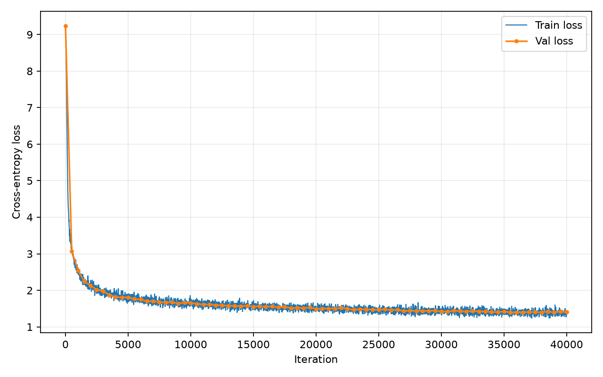
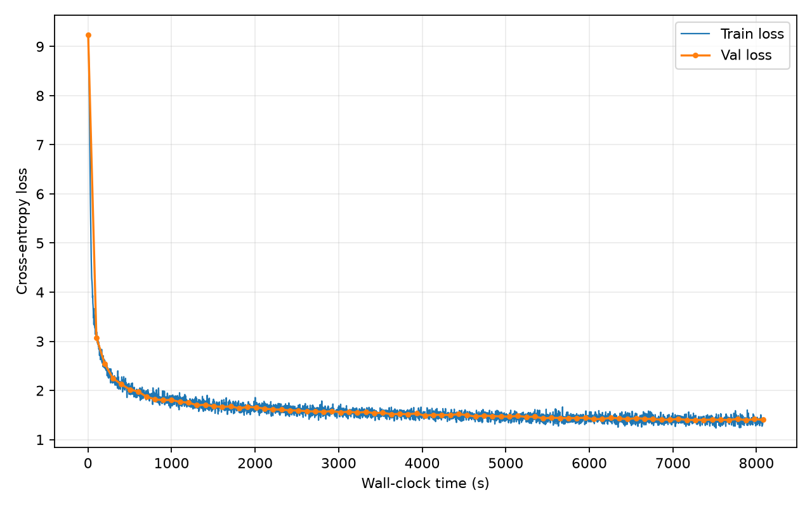
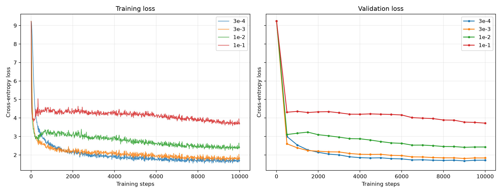
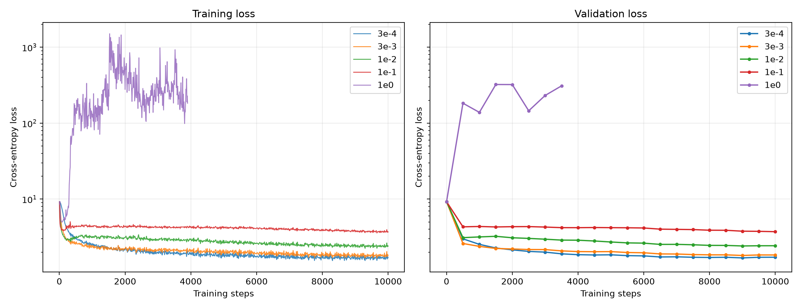
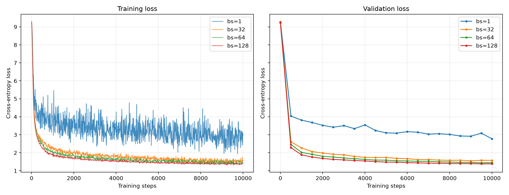
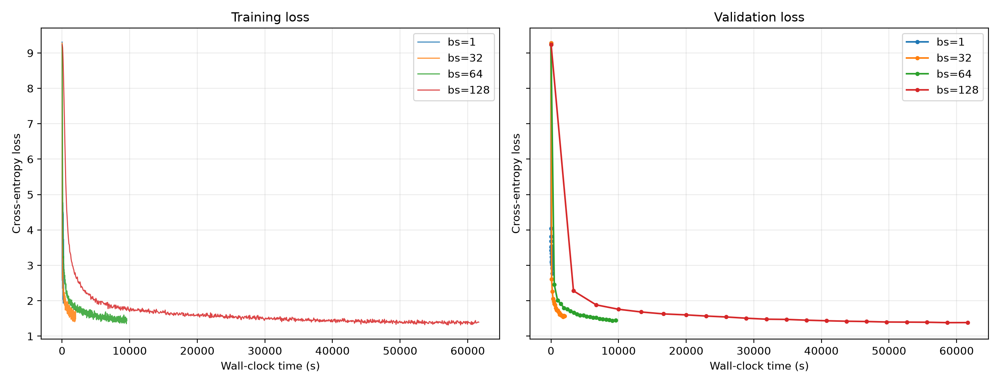
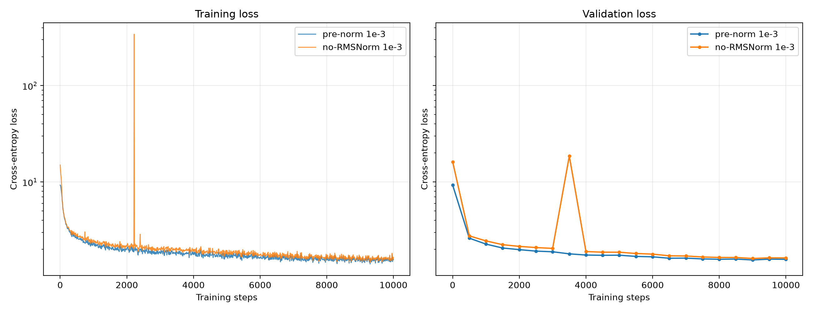
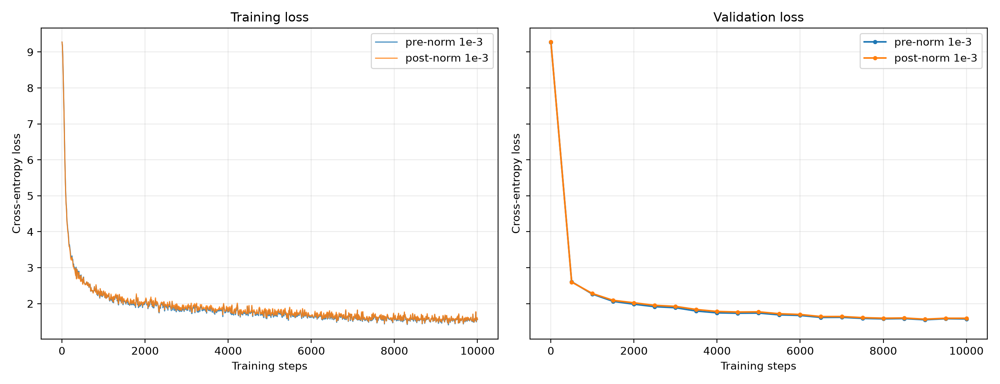
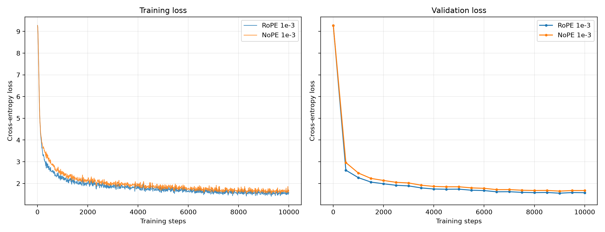
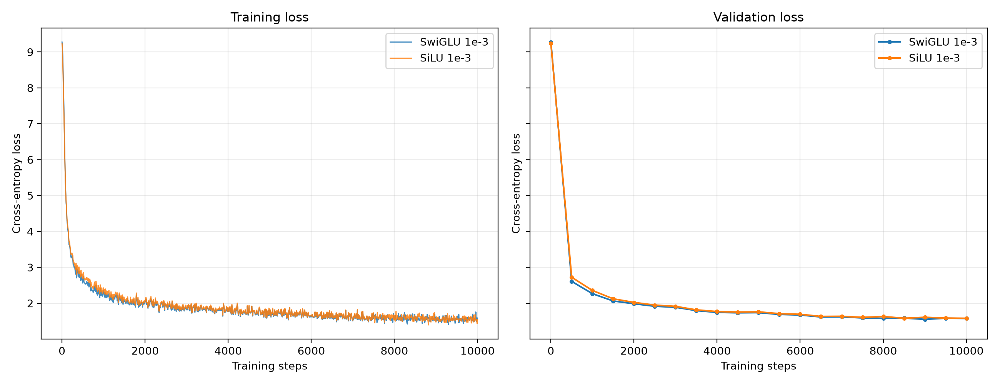

# CS336 Assignment 1

> Building a Transformer LM · Spring 2026 · Version 26.0.3

**姓名 / 日期：** Xiaofei Feng；2026-09

**报告版本：** v4（依据截至 2026-09-06 的本地与台式机记录整理）

**代码版本：** 当前仓库参考提交为 `f59313c`；工作区仍有未提交修改，且历史实验未逐个保存独立 commit，因此该提交不作为所有 run 的精确复现标识。

仓库：[项目仓库](https://github.com/xiaofei9289/CS336_Project)

## 内容导航

| 部分 | 题目 / 内容 |
| --- | --- |
| 实验设置 | 硬件、模型、优化器、评估方式 |
| Unicode 与分词 | unicode1 / unicode2 / 两项 BPE 训练 / `tokenizer_experiments` |
| 资源分析与优化器 | `transformer_accounting` / `learning_rate_tuning` / `adamw_accounting` |
| TinyStories 训练 | `experiment_log` / `learning_rate` / `batch_size_experiment` / `generate` |
| 架构消融 | `layer_norm_ablation` / `pre_norm_ablation` / `no_pos_emb` / `swiglu_ablation` |
| OWT 与改进 | `main_experiment` / `leaderboard` |
| 提交前整理 | 材料清单、引用与检查 |

## 实验设置

> 本页用于统一说明各实验的共同条件；有差异时，在对应实验中单独写明。

| 类别 | 已核实配置与复现限制 |
| --- | --- |
| 硬件 | TinyStories 主训、LR、batch 与 BPE：Windows 台式机 `desktop-pc`，Intel Core i5-12400F（6 核 12 线程），1× NVIDIA RTX 3060 Ti（8192 MiB），约 64 GiB RAM。Mac 仅用于 tokenizer 实验和 MPS 生成。OWT LM 的运行机器尚未由现有日志确认。 |
| 软件 | 台式机当前环境（2026-09-06 通过 SSH 核验）：Windows 10 10.0.19045、Python 3.13.14、PyTorch 2.11.0+cu128、NVIDIA 驱动 610.62。Tokenizer 小实验所用 Mac 为 macOS 26.5、Python 3.12.13；OWT LM 的运行环境未被现有日志记录。 |
| 数据 | TinyStories：`data/TinyStoriesV2-GPT4-train.txt`、`data/TinyStoriesV2-GPT4-valid.txt`；OWT：`data/owt_train.txt`、`data/owt_valid.txt`。本地保留 `data/tinystories/valid.bin` 与 `data/owt/valid.bin`；OWT 日志记录 train / valid 分别为 2,727,120,452 / 66,401,098 tokens。 |
| 分词器 | TinyStories 10k、OWT 32k，special token 均为 `<\|endoftext\|>`；产物分别为 `data/tinystories/tokenizer_train_10k.pkl` 与 `data/owt/tokenizer_train_32k.pkl`。 |
| 模型 | TinyStories：4 层、`d_model=512`、16 头、`d_ff=1344`、context 256、22,696,448 参数。OWT 日志直接记录 45,224,448 参数；其完整结构参数未随启动命令归档。 |
| 位置与归一化 | TinyStories 基线为 Pre-Norm RMSNorm，RoPE $\theta=10{,}000$，输入 embedding 与 LM head 不共享权重。第 10.1.1 节仅在 forward 中跳过 RMSNorm；OWT 的完整结构标志未单独归档。 |
| 优化器 | TinyStories 使用 AdamW。当前 `train_lm.py` 的默认值为 $\beta=(0.9,0.95)$、$\epsilon=10^{-8}$、weight decay 0.01、梯度范数裁剪阈值 1.0；历史 run 的完整命令未全部归档，因此这些细项作为当前复现配置，而非逐个 run 独立记录的实参。OWT 完整启动参数未归档。 |
| 学习率 | TinyStories 主实验：`max_lr=1e-3`、`min_lr=1e-4`、warmup 2,000、cosine 40,000；LR 与 batch 扫描及 no-RMSNorm 对照使用 warmup 500、cosine 10,000，具体候选见第 7、8、10 节。 |
| 训练预算 | TinyStories 主实验：batch 32、无梯度累积、40,000 步、327,680,000 个训练 tokens。扫描预算见第 7、8 节。OWT 完成 40,000 步，但 batch 未写入现有日志，故累计处理 tokens 不作推算。 |
| 精度与复现 | batch 扫描与 no-RMSNorm notes 明确记录 seed 42；其他历史 run 的 seed、数值精度与编译开关未全部独立归档，故不据脚本默认值补写。 |
| 验证 | CSV 可确认 TinyStories 主实验、各 10,000-step 对照与 OWT 均每 500 步留下验证值。当前脚本默认每次随机抽取 20 个 batch，但历史 run 的 `eval_iters` 实参未全部归档。 |

材料位置：`notes/进展记录.md`、`runs/batch_size_sweep_notes.txt`，以及各实验的实际运行配置与日志。

**不同实验的配置差异：** TinyStories 主实验训练 40,000 步，使用 2,000-step warmup / 40,000-step cosine；LR 扫描、batch 扫描和 no-RMSNorm 对照均训练 10,000 步，使用 500-step warmup / 10,000-step cosine。batch 扫描只改变 batch size；no-RMSNorm 对照只改变 forward 是否执行 RMSNorm。OWT 模型使用 32k 词表并训练 40,000 步，但其 batch、运行主机和完整命令未被归档，因此只报告日志能直接支持的结果。

## 1. Unicode

### 1.1 `unicode1` · Understanding Unicode

(a) `chr(0)` 返回什么 Unicode 字符？

**回答：`chr(0)` 返回 Unicode 码位 U+0000 对应的 NUL（空字符）。在 Python 中常表示为 `\x00`，它是一个不可见字符。**

(b) 这个字符的 `__repr__()` 表示与 print 显示有什么区别？

**回答：`print(chr(0))` 输出真实但不可见的 NUL 字符；`repr(chr(0))` 返回可见的文本表示 `\x00`，便于检查字符串的真实内容。**

(c) 当这个字符出现在文本中时，会发生什么？你可以在 Python 解释器中尝试以下代码，看看结果是否符合你的预期：

```python
>>> chr(0)
>>> print(chr(0))
>>> "this is a test" + chr(0) + "string"
>>> print("this is a test" + chr(0) + "string")
```

**回答：当 `chr(0)` 出现在文本中时，我观察到它在屏幕上不可见；Python 解释器的字符串表示中显示为 `\x00`，但使用 `print()` 输出时不可见，因此前后文本看起来直接连在一起。**

### 1.2 `unicode2` · Unicode Encodings

(a) 为什么选择 UTF-8 字节训练 tokenizer，而不是 UTF-16 或 UTF-32？

**回答：UTF-8 可以用较少的字节表示常见文本，与互联网、文件系统和编程工具具有良好兼容性，并能无损表示全部 Unicode 字符。**

(b) 原题中的逐字节解码函数为什么不正确？给出能暴露问题的输入。

```python
def decode_utf8_bytes_to_str_wrong(bytestring: bytes):
    return "".join(
        [bytes([b]).decode("utf-8") for b in bytestring]
    )

>>> decode_utf8_bytes_to_str_wrong("hello".encode("utf-8"))
'hello'
```

**回答：**

示例输入：

```python
b"\xe4\xb8\xad"  # "中" 的 UTF-8 编码
```

这个函数将每个字节单独解码。但是，UTF-8 中的一个字符可能由多个字节组成；因此，当处理中文字符“中”的第一个字节 `b"\xe4"` 时，就会触发 `UnicodeDecodeError`。

(c) 给出一个无法解码成有效 Unicode 字符的两字节序列。

**回答：例如 `b"\xff\xff"`，因为 `0xFF` 不允许出现在合法的 UTF-8 编码中，所以使用 UTF-8 解码时会触发 `UnicodeDecodeError`。**

## 2. BPE 训练实验

### 2.1 `train_bpe_tinystories`

(a) 训练 10,000 词表的 BPE，记录耗时、内存、最长 token，并说明该 token 是否合理。

| 项目 | 实测记录 |
| --- | --- |
| 语料范围 | `data/TinyStoriesV2-GPT4-train.txt` |
| 输入字节数 | `2,227,753,162 bytes`（约 2.075 GiB） |
| vocab_size | 10000 |
| 实际 vocab | 10000 |
| merges | 9743（10000 − 256 − 1 个 special） |
| special token | `<\|endoftext\|>` |
| 耗时 | 898.850 s（原版 `train_bpe`）；100.739 s（优化版，远端核验，原始计时日志未复制到本地） |
| 最长 token id | 7160 |
| 最长 token | ` accomplishment`（15 bytes，开头有空格） |
| ordinary 最长 | 同一个 |
| 机器 | Windows 台式机，Intel Core i5-12400F，64 GB RAM，NVIDIA RTX 3060 Ti（8 GB） |
| 原版设置 | 1 进程；`desired_num_chunks=32`，仅顺序分块 pretok，无多进程、无 GPU |
| 优化版设置 | 现有产物可核实总耗时及词表 / merges 一致性；精确并行参数未随该 run 单独归档 |
| 内存测量 | 原始 898.850 s run 未记录峰值 RSS；独立补测的 sampled max Working Set 为 847.69 MiB，sampled max Peak Working Set 为 868.67 MiB。两者均不应写成原始 run 的峰值 RSS。 |
| 测量方法 | 时间：`train_bpe_tinystories.py` 使用 `time.perf_counter()`，并将结果写入 pickle 的 `metadata.elapsed_seconds`。<br/>内存：原始 run 在 Windows 上完成，`resource.getrusage()` 无法提供 `ru_maxrss`，所以原 pickle 的 `peak_rss_mib=None`。补测通过 Windows 进程采样获得 Working Set 与 Peak Working Set；补测耗时 411.631 s。该补测未保存足以确认其代码版本的独立记录，只用于补充内存口径，不与 898.850 s 或 100.739 s 直接比较。 |
| 保存路径 | `data/tinystories/tokenizer_train_10k.pkl` |

补测产物仅保存在远端 `desktop-pc`：目录为 `D:\desktop\data\tinystories`，文件名为 `tokenizer_train_10k_memcheck.pkl`。

**(a) 回答：原版在台式机上训练 TinyStories 10k 词表耗时 898.850 s。远端 profiler `D:\desktop\data\tinystories\tokenizer_train_10k.prof` 记录总计时约 898.848 s，其中单进程 `pretokenize` 的累计时间约 775.617 s（约 86%），逐轮选择 pair 约 113.7 s（约 13%）。优化版在相同语料上的远端核验记录为 100.739 s，且词表和 merges 与原版一致，低于作业提示的 2 分钟目标；其原始计时日志与阶段级 profile 尚未复制到本地。**

**(b) BPE 训练的哪个阶段最耗时？**

**回答：原版最耗时的是预分词（pretok），远端 profile 中累计约 775.617 s，占总时间约 86%。优化版没有可复核的阶段级 profile，因此不报告其各阶段占比。**

证据摘要：`runs/tinystories_bpe/notes.txt`。

### 2.2 `train_bpe_expts_owt`

(a) 训练 32,000 词表的 BPE 后，最长 token 是什么？是否合理？

| 项目          | 实测记录                                                     |
| ------------- | ------------------------------------------------------------ |
| 语料范围      | OpenWebText train：`data/owt_train.txt`（作业的 owt-sample 训练集） |
| 输入字节数    | 11,920,511,059 bytes（11,368.29 MiB）                        |
| vocab_size    | 32000                                                        |
| 实际 vocab    | 32000                                                        |
| merges        | 31743（32000 − 256 − 1）                                     |
| special token | `<\|endoftext\|>`                                            |
| 耗时          | 原版 `train_bpe`：27,947.072 s（约 7 小时 46 分） |
| 最长 token id | 25822                                                        |
| 最长 token    | 64 bytes，由四字节模式 `\xc3\x83\xc3\x82` 重复 16 次组成（不是正常英文词） |
| ordinary 最长 | 同一个（id 25822）                                           |
| 机器          | Windows 台式机 `desktop-pc`，CPU-only                        |
| 并行设置      | 原版：单进程；`desired_num_chunks=32`，按 `<\|endoftext\|>` 顺序分块 pretok，无多进程、无堆优化 |
| 峰值内存      | 脚本未记到（`peak_rss_mib=unavailable`）；merge 期间一次人工抽样的工作集约 1.5 GB，不等同于峰值 |
| 保存路径      | `data/owt/tokenizer_train_32k.pkl`                           |

**回答：OpenWebText train（11,920,511,059 bytes）在台式机上用原版 `train_bpe`、32 块顺序 pretok 训练 32k 词表，耗时 27,947.072 s（约 7 h 46 min），得到 vocab 32,000 / merges 31,743；最长 token 为 id 25822、64 bytes 的重复乱码 `\xc3\x83\xc3\x82`，不是合理英文词。Windows 未记录 `ru_maxrss`，merge 期间人工抽样工作集约 1.5 GB。pickle 已写入 `data/owt/tokenizer_train_32k.pkl`；随后终端在打印最长 token 时触发 GBK `UnicodeEncodeError`，进程退出码为 1，因此应区分“产物已生成”和“进程正常退出”。**

(b) 比较 TinyStories 与 OpenWebText 训练所得 tokenizer。

**回答：**

#### 2.2.1 训练所得 tokenizer

|                    | TinyStories 10k                              | OpenWebText 32k                        |
| :----------------- | :------------------------------------------- | :------------------------------------- |
| 训练语料           | `TinyStoriesV2-GPT4-train.txt`               | `owt_train.txt`                        |
| 输入大小           | 2,227,753,162 B（约 2.07 GiB）               | 11,920,511,059 B（约 11.1 GiB）        |
| vocab / merges     | 10000 / 9743                                 | 32000 / 31743                          |
| special            | `<\|endoftext\|>`                              | `<\|endoftext\|>`                        |
| 实现（交作业那次） | 原版 `train_bpe`，单进程，chunks=32          | 同左                                   |
| 耗时               | 898.850 s（约 15 min）                       | 27,947.072 s（约 7 h 46 min）          |
| 峰值 RSS           | 原始 run 未测                                | 未测                                   |
| 工作集             | 独立补测：847.69 MiB；Peak Working Set 868.67 MiB | merge 时人工抽样约 1.5 GB（均不等于峰值 RSS） |
| 最长 token         | id 7160，` accomplishment`（15 B，前导空格） | id 25822，64 B 重复 `\xc3\x83\xc3\x82` |

优化版（同一 train 语料，不覆盖原 pickle）：TS 远端核验记录为 100.739 s，词表与原版逐条相同，但原始计时与一致性检查日志未复制到本地。优化版 OWT 运行目前没有可复核的本地日志，因此不纳入正式时间比较，也不报告其加速比。

#### 2.2.2 用两套 tokenizer 编码验证集（Mac）

| tokenizer | 语料              | UTF-8 bytes | tokens     | bytes/token | 墙钟     |
| :-------- | :---------------- | :---------- | :--------- | :---------- | :------- |
| TS 10k    | TinyStories valid | 22,502,601  | 5,465,883  | 4.1169      | 19.36 s  |
| OWT 32k   | OpenWebText valid | 289,998,753 | 66,401,098 | 4.3674      | 307.91 s |

交叉 10 篇（各 train 文件开头）：

| Tokenizer × 文本   | UTF-8 bytes | tokens | bytes/token |
| :----------------- | ----------: | -----: | ----------: |
| TS tok × TS 文本   | 7,565  | 1,818       | 4.1612 |
| OWT tok × OWT 文本 | 31,617 | 6,722       | 4.7035 |
| TS tok × OWT 文本  | 31,617 | 9,883       | 3.1991 |
| OWT tok × TS 文本  | 7,565  | 1,863       | 4.0607 |

- 规模：OWT 语料大约是 TS 的 5.4 倍，词表 3.2 倍，原版训练时间大约是 31 倍（15 min vs 7 h 46 min）。
- 最长 token：TS 像带 GPT-2 空格的英文词；OWT 是网页乱码重复，不像词。
- 匹配验证集：在各自匹配的验证集上，OWT tokenizer 的压缩率为 4.3674 bytes/token，TinyStories tokenizer 为 4.1169 bytes/token，前者略高。但两项结果来自不同语料，且词表大小分别为 32k 和 10k，因此该差异不能单独说明 OWT tokenizer 本身更好。
- 跨域覆盖：同一 OWT 样本上，OWT tokenizer 与 TinyStories tokenizer 分别为 4.7035 和 3.1991 bytes/token；同一 TinyStories 样本上，TinyStories tokenizer 与 OWT tokenizer 分别为 4.1612 和 4.0607 bytes/token。在本次各 10 篇的样本内，TinyStories 词表迁移到网页文本时明显碎片化，OWT 词表迁移到儿童故事时压缩率损失较小；结论仅限于本次样本。

完整验证集上的小实验不能替代完整 train run 的记录；OWT 峰值 RSS 未测，优化版 OWT 耗时缺少可复核的本地日志，均不纳入上述正式比较。

## 3. Tokenizer 实验

### 3.1 `tokenizer_experiments`

> 对应 handout §2.5–§2.7；下文分别报告 10 篇文档样本与完整验证集，避免混用两种口径。

**实验条件：** MacBook Air（arm64）、单进程；10 篇样本取自各自 train 文件开头，valid 实验编码完整验证集；墙钟计时覆盖 encode 调用。

(a) 从 TinyStories 和 OpenWebText 中**各抽取 10 篇文档**。使用你之前训练好的 TinyStories 分词器和 OpenWebText 分词器（词表大小分别为 10K 和 32K），将各自抽取的文档编码为整数 token ID。每个分词器的压缩比是多少（以 **字节数/token 数，即 bytes/token** 衡量）？

**(a) 回答：**

| Tokenizer / 文档 | UTF-8 bytes | token 数 | bytes/token |
| --- | --- | --- | --- |
| TS 10k / 10 篇 TS | 7565 | 1818 | 4.1612 |
| OWT 32k / 10 篇 OWT | 31,617 | 6,722 | 4.7035 |

(b) 如果使用 TinyStories 分词器对抽取的 OpenWebText 文档进行分词，会发生什么？请比较压缩比，和/或定性描述出现的现象。

**(b) 回答：**

| 同一 OWT 样本 | token 数 | bytes/token |
| --- | --- | --- |
| OWT tokenizer | 6,722    | 4.7035      |
| TinyStories tokenizer | 9,883    | 3.1991      |

(c) 估算你的分词器的吞吐量（例如，每秒处理的字节数）。按照这个速度，对 Pile 数据集（825 GB 文本）完成分词需要多长时间？

**(c) 回答：**

- 计时输入：MacBook Air、单进程、OWT 32k tokenizer、OpenWebText valid

- 字节数：289,998,753

- 秒数：307.91

- bytes/s：941,839

- 口径：825 GB = $825\times10^9$ 字节

- 公式与结果：

$$
T=\frac{825\times10^9}{941{,}839}
\approx 243\ \text{小时}
\approx 10.1\ \text{天}.
$$

这里按题目字面采用十进制 825 GB。若把“825 GB”解释为 825 GiB，即 $825\times2^{30}$ 字节，则同一吞吐率下约需 261.3 小时（10.9 天）；两者是单位口径不同，不是两次测速结果。

(d) 使用 TinyStories 和 OpenWebText 分词器，将各自对应的训练集和开发集（验证集）编码为整数 token ID 序列。这些数据将在之后用于训练语言模型。我们建议将 token ID 序列保存为数据类型为 `uint16` 的 NumPy 数组。为什么 `uint16` 是合适的选择？

**回答：**`uint16` 是 16 位无符号整数，能表示 0～65,535，而 TinyStories 和 OpenWebText 的词表大小分别为 10,000 和 32,000，其 token ID 均在这个范围内，因此可以无损存储。每个 token ID 仅占 2 字节，相比 `uint32` 或 `int64` 更节省内存和磁盘空间。

材料位置：`runs/tokenizer_experiments/results.json`；`runs/tokenizer_experiments/notes.txt`；`runs/owt_encode/notes.txt`。

## 4. Transformer

### 4.1 `transformer_accounting`

**(a)** 考虑一个规模与 GPT-2 XL 相当、但采用本次作业架构的模型，其配置如下：

```
vocab_size: 50,257       # 词表大小
context_length: 1,024    # 上下文长度
num_layers: 48           # Transformer 层数
d_model: 1,600           # 隐藏向量维度
num_heads: 25            # 注意力头数
d_ff: 4,288              # 前馈网络中间维度
```

其中，`d_ff` 是最接近 $\frac{8}{3}\times1600$ 的 64 的整数倍。

假设我们按照这一配置构建模型，该模型有多少个可训练参数？如果每个参数都使用单精度浮点数（FP32）表示，仅加载这个模型需要多少内存？

**计算过程与答案：**

**在 Embedding 与 LM Head 不共享权重、Linear 不含偏置的情况下，该模型共有 1,640,452,800 个可训练参数，约为 1.64B。每个 FP32 参数占 4 字节，因此仅存储模型参数需要 6,561,811,200 字节，约为 6.56 GB（6.11 GiB）。**

下面逐项计算。

**1. Embedding：将 token ID 转换为隐藏向量**

Embedding 表的形状为：
$$
(\text{vocab\_size},d_{\text{model}})=(50{,}257,1{,}600)
$$
因此参数量为：
$$
50{,}257\times1{,}600 =\boxed{80{,}411{,}200\text{ 个参数}}
$$
**2. 每个 Transformer Block 的参数**

每层包含注意力模块、SwiGLU，以及两个 RMSNorm。

| 组成部分             | 权重矩阵或向量               | 参数量     |
| -------------------- | ---------------------------- | ---------- |
| Q、K、V 投影         | 3 个 $1600\times1600$ 矩阵   | 7,680,000  |
| 注意力输出投影       | 1 个 $1600\times1600$ 矩阵   | 2,560,000  |
| SwiGLU 的 `w1`、`w3` | 2 个 $4288\times1600$ 矩阵   | 13,721,600 |
| SwiGLU 的 `w2`       | 1 个 $1600\times4288$ 矩阵   | 6,860,800  |
| 两个 RMSNorm         | 每个有 1600 个可学习缩放参数 | 3,200      |

因此，每层的参数量为：
$$
\begin{aligned} P_{\text{block}} &=4d_{\text{model}}^2 +3d_{\text{model}}d_{\text{ff}} +2d_{\text{model}}\\ &=4\times1600^2+3\times1600\times4288+2\times1600\\ &=\boxed{30{,}825{,}600\text{ 个参数}} \end{aligned}
$$
48 层合计：
$$
48\times30{,}825{,}600 =\boxed{1{,}479{,}628{,}800\text{ 个参数}}
$$
这里 **25 个注意力头不会让参数量再乘以 25**：1600 维会分成 25 个头，每个头为 1600/25=64 维。

**3. 最终 RMSNorm 和 LM Head**

所有 Transformer Block 之后，还有一个最终 RMSNorm：
$$
P_{\text{final norm}}=\boxed{1{,}600\text{ 个参数}}
$$
LM Head 将 1600 维隐藏向量映射为 50,257 个词表分数：
$$
P_{\text{LM Head}} =50{,}257\times1{,}600 =\boxed{80{,}411{,}200\text{ 个参数}}
$$
RoPE 没有可训练参数，因此这里不需要根据上下文长度 1024 添加位置嵌入参数。

**4. 总参数量**
$$
\begin{aligned} P_{\text{total}} &=P_{\text{Embedding}} +48P_{\text{block}} +P_{\text{final norm}} +P_{\text{LM Head}}\\ &=80{,}411{,}200 +1{,}479{,}628{,}800 +1{,}600 +80{,}411{,}200\\ &=\boxed{1{,}640{,}452{,}800\text{ 个参数}} \end{aligned}
$$
即约 **16.40 亿个参数（1.64B）**。

**5. FP32 内存占用**

每个 FP32 参数占用：
$$
32\text{ bit}\div8=\boxed{4\text{ bytes}}
$$
因此，模型参数占用：
$$
1{,}640{,}452{,}800\times4 =\boxed{6{,}561{,}811{,}200\text{ bytes}}
$$
换算为 GB 或 GiB：

| 单位口径   | 计算             | 结果        |
| ---------- | ---------------- | ----------- |
| 十进制 GB  | $6{,}561{,}811{,}200/10^9$ | 约 6.56 GB  |
| 二进制 GiB | $6{,}561{,}811{,}200/1024^3$ | 约 6.11 GiB |

这只统计模型参数，不包含梯度、优化器状态、激活值或运行时额外开销。

(b) 列出这个 GPT-2 XL 规模的模型完成一次前向传播所需的矩阵乘法。这些矩阵乘法总共需要多少次浮点运算（FLOPs）？假设输入序列包含 `context_length` 个 token。

**回答：**以下按 **batch size = 1** 计算，并采用一次乘法和一次加法共计 **2 FLOPs** 的计数方式。对于一条长度为 1024 的输入序列：
$$
(m\times k)\text{ 矩阵}\;\times\;(k\times n)\text{ 矩阵} \quad\Rightarrow\quad 2mkn\text{ FLOPs}
$$
使用题目配置：
$$
S=1024,\quad d=1600,\quad h=25,\quad d_k=64,\quad d_{\mathrm{ff}}=4288,\quad V=50{,}257,\quad L=48
$$
其中 $S$ 是序列长度，$d$ 是隐藏维度，且 $hd_k=d$。

**1. 每个 Transformer Block 中的矩阵乘法**

| 矩阵乘法                        | 作用与矩阵形状                                       | 每层 FLOPs                |
| ------------------------------- | ---------------------------------------------------- | ------------------------- |
| Q、K、V 投影（共 3 次）         | 将输入分别投影为 Q、K、V；每次 $(S,d)(d,d)$            | $6Sd^2=15{,}728{,}640{,}000$     |
| $QK^\top$                       | 每个头计算 token 间的注意力分数；每头 $(S,d_k)(d_k,S)$ | $2hS^2d_k=3{,}355{,}443{,}200$   |
| 注意力权重乘 V                  | 每个头汇总上下文信息；每头 $(S,S)(S,d_k)$              | $2hS^2d_k=3{,}355{,}443{,}200$    |
| 注意力输出投影                  | 合并各头后进行投影；$(S,d)(d,d)$                       | $2Sd^2=5{,}242{,}880{,}000$       |
| SwiGLU 的 `w1`、`w3`（共 2 次） | 生成门控特征和内容特征；每次 $(S,d)(d,d_{\mathrm{ff}})$ | $4Sd\,d_{\mathrm{ff}}=28{,}101{,}836{,}800$ |
| SwiGLU 的 `w2`                  | 将中间特征投影回隐藏维度；$(S,d_{\mathrm{ff}})(d_{\mathrm{ff}},d)$ | $2Sd\,d_{\mathrm{ff}}=14{,}050{,}918{,}400$ |

因此，每层的总计算量为：
$$
\begin{aligned} F_{\mathrm{block}} &=8Sd^2+4S^2d+6Sdd_{\mathrm{ff}} \end{aligned}
$$
直接代入各项数值：
$$
\begin{aligned} F_{\mathrm{block}} &=20{,}971{,}520{,}000 +6{,}710{,}886{,}400 +42{,}152{,}755{,}200\\ &=\boxed{69{,}835{,}161{,}600\text{ FLOPs}} \end{aligned}
$$
48 层合计：
$$
48F_{\mathrm{block}} =\boxed{3{,}352{,}087{,}756{,}800\text{ FLOPs}}
$$
**2. 最后的 LM Head 矩阵乘法**

LM Head 为每个位置计算整个词表的 logits：
$$
(S,d)(d,V)\rightarrow(S,V)
$$
其计算量为：
$$
\begin{aligned} F_{\mathrm{LM Head}} &=2SdV\\ &=2\times1024\times1600\times50257\\ &=\boxed{164{,}682{,}137{,}600\text{ FLOPs}} \end{aligned}
$$
**3. 一次前向传播的总 FLOPs**
$$
\begin{aligned} F_{\mathrm{total}} &=L\left(8Sd^2+4S^2d+6Sdd_{\mathrm{ff}}\right)+2SdV\\ &=3{,}352{,}087{,}756{,}800+164{,}682{,}137{,}600\\ &=\boxed{3{,}516{,}769{,}894{,}400\text{ FLOPs}}\\ &\approx\boxed{3.52\times10^{12}\text{ FLOPs}} \end{aligned}
$$
也就是约 **$3.52\times10^{12}$ FLOPs 的总运算量**；这里不是表示每秒计算速度。

本题只统计矩阵乘法：Embedding 是查表，不计矩阵乘法 FLOPs；RMSNorm、RoPE、Softmax、SiLU、逐元素乘法和残差加法也不计入上述结果。因果注意力按完整的 $S\times S$ 矩阵乘法计算，不因遮住未来位置而减半。

综上，对长度为 1024 的单条输入序列，以每次乘加计 2 FLOPs，48 层 Transformer 和最终 LM Head 的矩阵乘法总计需要 $3{,}516{,}769{,}894{,}400$ FLOPs，约为 $3.52\times10^{12}$ FLOPs。

------

(c) 根据上述分析，哪些部分消耗的 FLOPs 最多？

**回答：**SwiGLU 前馈网络消耗的 FLOPs 最多，约占总计算量的 **57.5%**；其次是注意力模块中的 Q、K、V 投影和输出投影，约占 **28.6%**。相比之下，注意力分数计算与对 V 的加权求和合计约占 **9.2%**，最终 LM Head 约占 **4.7%**。

| 模型部分             | 具体计算                                                     | 总 FLOPs（约） | 占比      |
| -------------------- | ------------------------------------------------------------ | -------------- | --------- |
| SwiGLU 前馈网络      | `w1`、`w3` 将 1600 维扩展到 4288 维，`w2` 将 4288 维映射回 1600 维 | $2.023\times10^{12}$ | **57.5%** |
| 注意力中的线性投影   | 生成 Q、K、V，以及合并各头后的输出投影                       | $1.007\times10^{12}$ | **28.6%** |
| 注意力分数与加权求和 | $QK^\top$ 计算 token 间的分数，注意力权重乘 V 汇总信息      | $3.221\times10^{11}$ | **9.2%**  |
| LM Head              | 将每个位置的 1600 维隐藏向量映射为 50,257 个词表分数         | $1.647\times10^{11}$ | **4.7%**  |

(d) 对以下模型重复上述分析：

- GPT-2 small：12 层，`d_model = 768`，12 个注意力头。
- GPT-2 medium：24 层，`d_model = 1024`，16 个注意力头。
- GPT-2 large：36 层，`d_model = 1280`，20 个注意力头。

随着模型规模增大，Transformer 语言模型中哪些部分占总 FLOPs 的比例会增加，哪些部分的比例会减少？

| 模型 | 层数 | `d_model` | 头数 | `d_ff` |
| --- | --- | --- | --- | --- |
| Small | 12 | 768 | 12 | 2048 |
| Medium | 24 | 1,024 | 16 | 2752 |
| Large | 36 | 1,280 | 20 | 3392 |
| XL（对照） | 48 | 1,600 | 25 | 4,288 |

其余共同假设：词表大小为 50,257，上下文长度为 1,024，batch size 为 1；使用 SwiGLU，`d_ff` 取最接近 $(8/3)d_{\mathrm{model}}$ 的 64 的整数倍。仅统计矩阵乘法，一次乘加计 2 FLOPs，注意力按完整的 $1024\times1024$ 矩阵计算，LM Head 为全部位置计算 logits。

| 模块 / FLOPs 占比                                | Small                     | Medium                    | Large                     | XL                        |
| ------------------------------------------------ | ------------------------- | ------------------------- | ------------------------- | ------------------------- |
| 注意力线性投影：Q、K、V 和输出投影               | 19.88%                    | 24.83%                    | 27.32%                    | 28.62%                    |
| 注意力分数与加权求和：$QK^\top$ 和注意力权重乘 V | 13.25%                    | 12.42%                    | 10.93%                    | 9.16%                     |
| SwiGLU：`w1`、`w3`、`w2`                         | 39.76%                    | 50.05%                    | 54.30%                    | 57.53%                    |
| LM Head：隐藏向量到词表的投影                    | 27.10%                    | 12.70%                    | 7.45%                     | 4.68%                     |
| **总 FLOPs**                                     | **$2.9165\times10^{11}$** | **$8.3017\times10^{11}$** | **$1.7685\times10^{12}$** | **$3.5168\times10^{12}$** |

百分比因四舍五入可能不恰好合计为 100%。

计算时，令 $L$ 为层数、$S$ 为上下文长度、$d$ 为隐藏维度、$V$ 为词表大小，各部分公式为：
$$
\begin{aligned} F_{\text{注意力投影}} &= 8LSd^2\\ F_{\text{注意力分数与加权求和}} &= 4LS^2d\\ F_{\text{SwiGLU}} &= 6LSdd_{\mathrm{ff}}\\ F_{\text{LM Head}} &= 2SdV \end{aligned}
$$
每个模块的占比就是其 FLOPs 除以这四项的总和。

随着模型规模增大，SwiGLU 和注意力线性投影的 FLOPs 占比上升，而注意力分数计算与加权求和、LM Head 的占比下降。这是因为在上下文长度和词表大小固定、$d_{\mathrm{ff}}\approx(8/3)d$ 时，前两者的计算量随 $Ld^2$ 增长，注意力分数与加权求和随 $Ld$ 增长，而 LM Head 仅随 $d$ 增长且不随层数增加。

------

(e) 将 GPT-2 XL 的上下文长度增加到 **16,384**。一次前向传播的总 FLOPs 会如何变化？模型各组成部分的 FLOPs 相对占比会如何变化？

上下文长度从 1,024 增加到 16,384，是原来的 **16 倍**。关键是：**线性投影的计算量增加 16 倍，而注意力分数计算与加权求和增加 $16^2=256$ 倍**。

沿用前面仅统计矩阵乘法的口径：

| 模块                     | 随上下文长度的变化         | 新 FLOPs            | 新占比     |
| ------------------------ | -------------------------- | ------------------- | ---------- |
| Q、K、V 及注意力输出投影 | 与 $S$ 成正比，增加 16 倍    | $1.611\times10^{13}$       | 12.06%     |
| $QK^\top$ 与注意力权重乘 V | 与 $S^2$ 成正比，增加 256 倍 | $8.246\times10^{13}$       | **61.73%** |
| SwiGLU 三个投影          | 与 $S$ 成正比，增加 16 倍    | $3.237\times10^{13}$       | 24.24%     |
| LM Head                  | 与 $S$ 成正比，增加 16 倍    | $2.635\times10^{12}$       | 1.97%      |
| **总计**                 | **约为原来的 37.98 倍**      | **$1.3358\times10^{14}$** | **100%**   |

注意力需要计算每个 token 与其他 token 的关系，因此序列变长时，这部分计算量按平方增长，最终超过 SwiGLU，成为主要计算开销。

将 GPT-2 XL 的上下文长度从 1,024 增加到 16,384 后，一次前向传播的矩阵乘法总 FLOPs 从约 $3.52\times10^{12}$ 增加到 $1.336\times10^{14}$，约为原来的 38 倍。由于注意力分数计算与对 V 的加权求和随序列长度平方增长，其占比从 9.16% 上升到 61.73%，而注意力线性投影、SwiGLU 和 LM Head 的占比分别下降到 12.06%、24.24% 和 1.97%。

## 5. 优化器与资源分析

### 5.1 `learning_rate_tuning`

**问题：**正如我们将看到的，**学习率是对训练影响最大的超参数之一**。让我们通过这个简单示例来实际观察它的影响。

使用另外三个学习率 **`1e1`、`1e2` 和 `1e3`（即 10、100 和 1000）**，分别运行上面的 SGD 示例，每次只进行 **10 次训练迭代**。在每个学习率下，损失会如何变化？它下降得更快、更慢，还是会发散（即在训练过程中不断增大）？

**回答：**

| 学习率 | 初始 / 最终 loss   | 你观察到的变化                              |
| --- | --- | --- |
| 1e1    | 19.676 / 2.644     | 单调下降，10 步后仍约 2.64                  |
| 1e2    | 28.090 / ≈0        | 该次轨迹在 10 步内降至接近 0                |
| 1e3    | 23.636 / $2.19\times10^{18}$ | 每步增大，发散                     |

学习率为 `1e1` 时，该次轨迹的损失从 19.676 单调降至 2.644；学习率为 `1e2` 时，该次轨迹从 28.090 降至接近 0；学习率为 `1e3` 时，损失持续增大，从 23.636 增至约 $2.19\times10^{18}$，出现明显发散。三次运行的初始 loss 不同，且没有归档共同初始权重或随机种子，因此这些结果只能描述各自的单次轨迹，不能作为严格受控的收敛速度排名。

### 5.2 `adamw_accounting`

**(a)** 运行 AdamW 需要多少峰值内存？请分别计算**模型参数、激活值、梯度和优化器状态**的内存占用。

使用 `batch_size` 和以下模型超参数表示答案：

- `vocab_size`：词表大小
- `context_length`：上下文长度
- `num_layers`：模型层数
- `d_model`：隐藏维度
- `num_heads`：注意力头数

假设：
$$
d_{\mathrm{ff}}=\frac{8}{3}d_{\mathrm{model}}
$$
为简化计算，在统计激活值的内存占用时，只考虑以下组成部分：

- Transformer Block：
  - RMSNorm（一个或多个）
  - 多头自注意力子层：Q、K、V 投影、$QK^\top$ 矩阵乘法、Softmax、对 V 的加权求和、输出投影
  - 逐位置前馈网络（SwiGLU）：$W_1$、$W_2$、门控分支上的 SiLU、逐元素乘法、$W_3$
- 最终 RMSNorm
- 输出嵌入层（即 LM Head，将隐藏向量映射为词表 logits）
- 基于 logits 计算的交叉熵

------

**回答：**

设 B 为 batch size，S 为上下文长度，V 为词表大小，L 为层数，d 为隐藏维度，h 为注意力头数，且：

$$
d_{\mathrm{ff}}=\frac{8}{3}d.
$$

假设 Linear 无偏置、Embedding 与 LM Head 不共享权重，则可训练参数总数为：

$$
P=2Vd+L(4d^2+3dd_{\mathrm{ff}}+2d)+d
=2Vd+12Ld^2+(2L+1)d.
$$

所有张量均使用 FP32，每个元素占 4 字节，以下内存单位均为 **bytes**。

| 内存组成   | 代数表达式 / 统计说明                                      |
| ---------- | ---------------------------------------------------------- |
| 参数       | $4P$：每个参数占 4 字节。                                    |
| 激活       | $4BS[L((56/3)d+2hS)+d+2V]$：具体统计见下方。                  |
| 梯度       | $4P$：每个参数对应一个 FP32 梯度。                           |
| 优化器状态 | $8P$：AdamW 为每个参数保存一阶矩 $m$ 和二阶矩 $v$，各占 4 字节。 |
| 总量       | $16P+4BS[L((56/3)d+2hS)+d+2V]$                               |

**激活统计说明**

按题目列出的操作输出各保留一份，每个 Transformer Block 的激活元素数为：

$$
8BSd+4BSd_{\mathrm{ff}}+2BhS^2.
$$

其中：

- $8BSd$：两个 RMSNorm、Q/K/V、注意力加权求和、注意力输出投影和 SwiGLU 降维投影的输出，共 8 份。
- $4BSd_{\mathrm{ff}}$：SwiGLU 两个升维投影、SiLU 和逐元素乘积的输出，共 4 份。
- $2BhS^2$：注意力分数矩阵 $QK^\top$ 和 Softmax 注意力权重，共 2 份。

代入 $d_{\mathrm{ff}}=(8/3)d$，得到：

$$
\begin{aligned}
A_{\mathrm{block}}
&=8BSd+4BS\left(\frac{8}{3}d\right)+2BhS^2\\
&=BS\left(\frac{56}{3}d+2hS\right).
\end{aligned}
$$

模型末端另外计入最终 RMSNorm 输出 $BSd$、LM Head 输出 logits $BSV$，以及交叉熵计算中额外保留的一份概率或对数概率张量 $BSV$。这里将交叉熵的中间张量计入激活，而不仅统计最终的逐 token loss。

因此，激活内存为：

$$
M_{\mathrm{activations}}
=4BS\left[
L\left(\frac{56}{3}d+2hS\right)+d+2V
\right].
$$

**总内存**

将参数、激活、梯度和优化器状态相加：

$$
\begin{aligned}
M_{\mathrm{total}}
&=M_{\mathrm{parameters}}
+M_{\mathrm{activations}}
+M_{\mathrm{gradients}}
+M_{\mathrm{optimizer}}\\
&=16P+
4BS\left[
L\left(\frac{56}{3}d+2hS\right)+d+2V
\right].
\end{aligned}
$$

将参数总数 $P$ 展开后：

$$
\boxed{
M_{\mathrm{total}}
=
16\left[2Vd+12Ld^2+(2L+1)d\right]
+
4BS\left[
L\left(\frac{56}{3}d+2hS\right)+d+2V
\right]
}
$$

上述峰值内存估算采用所列激活各保留一份的简化口径，不使用 activation checkpointing，并忽略少量标量、临时工作空间及内存分配器开销。

------

(b) 将 GPT-2 XL 规模模型的具体配置代入你的答案，得到一个仅依赖 `batch_size` 的表达式。在 **80 GB 内存**限制下，能够使用的最大 batch size 是多少？

------

沿用 (a) 的内存统计口径，**最大 batch size 为 3**。计算如下。

代入 GPT-2 XL 的配置：
$$
V=50{,}257,\quad S=1024,\quad L=48,\quad d=1600,\quad h=25.
$$
本小问按精确的 $d_{\mathrm{ff}}=(8/3)d$ 计算，不使用第 4 节取整后的 4288，因此参数量与之前略有不同。

参数总数为：
$$
\begin{aligned} P &=2Vd+12Ld^2+(2L+1)d\\ &=2\times50257\times1600 +12\times48\times1600^2 +97\times1600\\ &=1{,}635{,}537{,}600. \end{aligned}
$$
参数、梯度和优化器状态的固定内存为：

$$
16P=26{,}168{,}601{,}600\ \text{bytes}.
$$

激活内存为：

$$
\begin{aligned}
M_{\mathrm{activations}}
&=4B\times1024\left[48\left(\frac{56}{3}\times1600+2\times25\times1024\right)+1600+2\times50257\right]\\
&=16{,}356{,}614{,}144B\ \text{bytes}.
\end{aligned}
$$
因此，仅依赖 batch size 的总内存表达式为：
$$
\boxed{ M(B)=16{,}356{,}614{,}144B+26{,}168{,}601{,}600 \quad\text{bytes} }
$$
按十进制口径，$1\ \text{GB}=10^9\ \text{bytes}$，因此：

$$
\boxed{ M(B)=16.356614144B+26.1686016 \quad\text{GB} }
$$
在 80 GB 限制下：
$$
B_{\max} = \left\lfloor \frac{80-26.1686016}{16.356614144} \right\rfloor = \left\lfloor3.2911\right\rfloor = \boxed{3}.
$$
其中，$B=3$ 时约占 **75.24 GB**，$B=4$ 时约占 **91.60 GB**。该结果是 (a) 中简化内存模型下的估算，未计临时工作空间和内存分配器开销。

------

(c) AdamW 执行一次更新需要多少 FLOPs？

**回答：**

设模型包含 $P=2Vd+12Ld^2+(2L+1)d$ 个可训练参数，将基本算术运算和平方根各计为 1 FLOP，并提前计算公共标量系数，则每个参数的一阶矩更新、二阶矩更新、参数更新和权重衰减分别需要 3、4、5 和 2 FLOPs。因此，一步 AdamW 更新约需 $14P=14[2Vd+12Ld^2+(2L+1)d]$ FLOPs，不包含前向传播和反向传播，也忽略少量公共标量计算。

(d) 模型 FLOPs 利用率（MFU）通过比较实际吞吐量所对应的计算量与硬件理论峰值 FLOPs 吞吐能力来衡量。按本题给定口径，NVIDIA H100 GPU 的“float32”理论峰值取 **495 TFLOP/s**（这里实际指 TensorFloat-32，即 TF32）。

假设你能够达到 **50% MFU**，在单张 H100 上，以 **1024 的 batch size** 训练 GPT-2 XL **400,000 步**，需要多长时间？按照作业 handout 给定的近似，假设反向传播的 FLOPs 是前向传播的两倍。

------

**回答：**

按题目假设，训练约需 **4,836 小时，即 201.5 天**。这里沿用本小问的 $d_{\mathrm{ff}}=(8/3)d$、上下文长度为 1024 的配置。

**1. 每条序列的前向传播计算量**

沿用之前的矩阵乘法 FLOPs 公式：
$$
F_{\mathrm{forward}} =L\left(8Sd^2+4S^2d+6Sdd_{\mathrm{ff}}\right)+2SdV.
$$
代入 $L=48$、$S=1024$、$d=1600$、$V=50{,}257$ 和 $d_{\mathrm{ff}}=(8/3)d$：
$$
F_{\mathrm{forward}} =3{,}506{,}703{,}564{,}800 \approx3.5067\times10^{12}\ \text{FLOPs}.
$$
**2. 每步训练的计算量**

反向传播是前向传播的两倍，因此前向与反向合计为三倍；每个 batch 有 1024 条序列：
$$
F_{\mathrm{step}} =1024\times3F_{\mathrm{forward}} \approx1.07726\times10^{16}\ \text{FLOPs}.
$$
**3. 有效算力与训练时间**

按照题目给定的峰值算力和 50% MFU：
$$
C_{\mathrm{effective}} =0.5\times495\times10^{12} =2.475\times10^{14}\ \text{FLOPs/s}.
$$
训练 400,000 步需要：
$$
\begin{aligned} T &=\frac{400{,}000\times1024\times3\times3{,}506{,}703{,}564{,}800} {0.5\times495\times10^{12}\times3600}\\ &\approx\boxed{4{,}836.18\ \text{小时}} \approx\boxed{201.51\ \text{天}}. \end{aligned}
$$

------

## 6. `experiment_log` · 实验记录

### 6.1 实验跟踪（`experiment_log`）

**记录方法**

训练与评估由 `train_lm.py` 完成。每次运行将指标写入 `output_dir/training_log.csv`，并同步打印到终端。未使用 W&B。

CSV 包含以下字段：

| 字段                        | 含义                                      |
| --------------------------- | ----------------------------------------- |
| `iteration`                 | 梯度更新步数                              |
| `train_loss`                | 当前训练 batch 的交叉熵损失               |
| `validation_loss`           | 验证 batch 的平均交叉熵损失；非验证步为空 |
| `learning_rate`             | 当前学习率                                |
| `gradient_norm_before_clip` | 梯度裁剪前的梯度范数                      |
| `elapsed_seconds`           | 从训练循环开始累计的墙钟时间，单位为秒    |

默认每 10 步记录一次训练指标，第 1 步必记。验证在第 1 步及之后按 `--eval-interval` 指定的间隔执行。TinyStories 主实验约每 500 步验证一次。

当前 `train_lm.py` 的验证实现从验证集 memmap 中随机抽取 `--eval-iters` 个 batch（默认 20），计算平均交叉熵。历史 run 的完整命令未全部归档，因此 CSV 能直接证明验证频率与均值结果，但不能逐个证明 `eval_iters` 未被覆盖。随机抽样也会使验证 loss 存在一定波动。

曲线由 `plot_training_log.py` 从同一份 CSV 生成。

**曲线口径**

- **训练 loss：**记录步对应的单个训练 batch 的交叉熵，未做滑动平均，因此曲线可能较抖。默认每 10 步记录一次，不代表每个梯度步都有数据点。
- **验证 loss：**仅绘制 `validation_loss` 非空的行，使用该行对应的步数和时间作为横坐标。空值不会转换为 0；验证点之间的连线仅用于展示趋势。
- **墙钟时间：**使用 CSV 中的 `elapsed_seconds`。按当前 `train_lm.py`，代码先完成该步验证再记录时间戳，因此验证行会包含当次验证耗时；历史 run 未全部绑定代码提交，故本文将其统一解释为端到端累计时间，不尝试从中拆分纯训练与验证时间。
- **指标口径：**最终值按所列训练结束步汇总；若另列“最低已记录验证 loss”，会同时给出对应 step，并明确它不等同于已有的最佳 checkpoint。
- **Token 数：**按 `batch_size × context_length × steps` 计算，为累计处理的训练 token 数，包含可能重复采样的数据，不包含验证 token。

**TinyStories 主实验曲线**

主实验使用 batch size 32、序列长度 256，在 NVIDIA RTX 3060 Ti 上训练 40,000 个梯度步。



**图 6.1：TinyStories 基线的训练与验证交叉熵随梯度步变化。** 横轴为梯度更新步数（Iteration），纵轴为交叉熵损失（Cross-entropy loss）。蓝线为记录步对应的单个训练 batch 的 loss，橙色点线为验证 batch 的平均 loss。验证在第 1 步及之后约每 500 步进行，空缺验证值不绘制。



**图 6.2：TinyStories 基线的训练与验证交叉熵随墙钟时间变化。** 横轴为从训练循环开始累计的墙钟时间（Wall-clock time (s)），纵轴为交叉熵损失。两条曲线与图 6.1 使用相同的 loss 数据，横坐标改为对应行的 `elapsed_seconds`。

旧文件 `runs/tinystories/training_curve.png` 展示训练 loss 和学习率随步数的变化，仍保留在实验目录中，但未收入正文，也不替代上述两张图。

**实验日志**

TinyStories 基线配置为：`vocab_size=10000`、`context_length=256`、`d_model=512`、`num_layers=4`、`num_heads=16`、`d_ff=1344`，约 22.7M 参数。

| Run / 目的 | 预算 | 结果 | 日志 / 配置 |
| --- | --- | --- | --- |
| TinyStories 基线<br>完成主训练 | 40,000 步；batch 32；327,680,000 tokens | step 10,000：train 1.630 / val 1.656<br>step 40,000：train 1.382 / **val 1.401953**；最低已记录 val 为 1.395860（step 39,000）；约 8,078.954 s | `runs/tinystories/training_log.csv`<br>RTX 3060 Ti；warmup 2,000；cosine 40,000；LR 由 `1e-3` 衰减至 `1e-4` |
| LR 扫描<br>比较五档 `max_lr` | 四档完成 10,000 步，每档 81,920,000 tokens；`1.0` 于第 3,900 步停止 | step 10,000 的 val：`3e-4` **1.714**；`3e-3` 1.836；`1e-2` 2.429；`1e-1` 3.719<br>`1.0` 明显发散，不参与等预算排名 | 详见第 7 节 |
| Batch 扫描<br>比较 batch 1、32、64、128 | 各 10,000 步；累计 tokens 见第 8 节 | step 10,000 的 val：2.777 / 1.574 / 1.448 / 1.384<br>四组均完成 | `runs/bs_1`、`runs/bs_32`、`runs/bs_64`、`runs/bs_128`<br>`runs/batch_size_sweep_notes.txt` |
| 架构消融<br>no-RMSNorm、Post-Norm、NoPE、SiLU FFN | no-RMSNorm：10,000 步、batch 32、81,920,000 tokens；其余未运行 | no-RMSNorm 已完成：最终 train 1.611 / val 1.628；Post-Norm、NoPE、SiLU FFN **未运行** | 见第 10 节 |
| OWT LM<br>32k 词表 | 40,000 步；batch 与累计处理 tokens 未被现有日志记录 | step 40,000：train 4.137590 / val 4.157374；最低已记录 val 4.146008（step 39,500）；2,606.966 s<br>**尚未生成样例** | `runs/owt/training_log.csv` |
| 单 batch 过拟合<br>检查固定 batch 拟合能力 | 1,000 步 | train / val loss 接近 0；代码确认训练与验证都使用同一个固定 batch，因此仅作为拟合能力 sanity check，不作为泛化性能证据 | `runs/overfit/` |
| OWT BPE<br>检查完整语料训练流程 | — | 整文件读取触发 `MemoryError`；32 chunk 版本写入产物后，在打印最长 token 时因 GBK 编码错误以退出码 1 结束 | `runs/owt_bpe/` |
| Tokenizer 实验 | 见对应记录 | 具体指标见第 3 节 | `runs/tokenizer_experiments/` |
| TinyStories 生成<br>比较 $T=0.2,0.8,1.2$ | 三档温度 | 分别生成 146、123、156 个新 token 后遇到 EOS | `runs/tinystories/generate/` |

**结果解释与比较限制**

**学习率扫描：**五档候选中，3e-4 在完成 10,000 步的四档（3e-4、3e-3、1e-2、1e-1）中取得最低的最终验证 loss；1.0 发散并提前停止，不参与等预算性能排名。主实验 `max_lr=1e-3` 在 10k 步时的 val 为 1.656，但其 warmup 为 2,000 步、cosine 为 40,000 步，与扫描的 warmup 500 步、cosine 10,000 步不同，不纳入本次排名，也不能据此认定全局最优学习率。完整结果与限制见第 7 节。

**Batch 扫描：**实验固定训练步数，未固定累计训练 token 数。batch 越大，处理的训练 token 越多，因此验证 loss 的差异同时受到 batch size 和训练数据量的影响，不能全部归因于 batch size。

**跨数据集比较：**TinyStories 与 OWT 使用不同语料和词表，交叉熵数值不能直接用于判断哪个模型表现更好。

**完成情况：**四档 batch size 实验（1、32、64、128）和 no-RMSNorm 消融均已完成。当前未运行的架构消融是 Post-Norm、NoPE 和 SiLU FFN；OWT 模型训练已有 40,000-step 日志与 checkpoint，但生成样例尚未完成，且该 run 的 batch、主机和完整命令未被归档。

玩具 SGD 实验（讲义 4.2.1，lr=1e1、1e2、1e3，各运行 10 步）单独记录在书面题 `learning_rate_tuning` 中，不纳入上述 TinyStories 学习率扫描。

------

## 7. `learning_rate` · 学习率扫描

(a) 对学习率进行超参数扫描，报告各个学习率对应的最终损失；如果优化器出现发散，请注明。

### 7.1 学习率超参数搜索

#### 7.1.1 实验设置

本实验在 TinyStories 数据集上比较不同峰值学习率对模型训练的影响。各组使用相同的模型结构、数据划分、batch 与学习率调度形式，分别进行一次训练；正常完成的实验均训练 10,000 步，损失急剧增大的实验提前停止。历史完整命令未归档，因此随机种子和部分优化器细项只能按当前脚本配置复现，不能视为各 run 独立保存的元数据。

配置表中模型维度、batch、预算、调度、验证频率和设备由现有 notes / CSV 支持；标注“当前脚本默认”的细项未在每个历史 run 中独立记录。

| 配置项                      | 设置                    |
| --------------------------- | ----------------------- |
| 模型层数 `num_layers`       | 4                       |
| 隐藏维度 `d_model`          | 512                     |
| 注意力头数 `num_heads`      | 16                      |
| 前馈网络维度 `d_ff`         | 1344                    |
| 词表大小 `vocab_size`       | 10000                   |
| 上下文长度 `context_length` | 256                     |
| Batch size                  | 32                      |
| 训练预算                    | 10,000 步               |
| 优化器                      | AdamW                   |
| AdamW 的 `betas`            | `(0.9, 0.95)`（当前脚本默认） |
| AdamW 的 `eps`              | `1e-8`（当前脚本默认）  |
| 权重衰减                    | 0.01（当前脚本默认）    |
| 梯度裁剪阈值                | 1.0（当前脚本默认）     |
| Warmup 步数                 | 500                     |
| 学习率调度                  | 线性 warmup + 余弦衰减  |
| 最小学习率                  | `min_lr = 0.1 × max_lr` |
| 验证频率                    | 每 500 步               |
| 每次验证的 batch 数         | 20（当前脚本默认；run 未独立记录） |
| 随机种子                    | 42（当前脚本默认；run 未独立记录） |
| 训练设备                    | NVIDIA RTX 3060 Ti      |
| 数值精度                    | FP32（当前脚本默认；run 未独立记录） |

每个完整实验处理的训练 token 总数为：
$$
32 \times 256 \times 10000 = 81{,}920{,}000.
$$
若历史运行没有覆盖当前默认的 `eval_iters=20`，则每次验证处理的 token 总数为：
$$
20 \times 32 \times 256 = 163{,}840.
$$
学习率在前 500 步进行线性 warmup，随后进行余弦衰减，并在第 10,000 步达到最小学习率。CSV 将该列命名为 `gradient_norm_before_clip`；按当前 `train_lm.py` 实现，它对应梯度裁剪函数返回的裁剪前范数。历史 run 未绑定代码提交，因此本文保留日志字段语义，不把它作为历史裁剪实现已被独立归档的证据。

#### 7.1.2 搜索策略

本实验搜索学习率调度中的峰值学习率 `max_lr`，候选值为：
$$
\eta_{\max}\in \left\{ 3\times10^{-4}, 3\times10^{-3}, 10^{-2}, 10^{-1}, 1.0 \right\}.
$$
候选值覆盖多个数量级，用于观察学习率对收敛速度、最终损失和训练稳定性的影响。最小学习率始终设为峰值学习率的 10%，其余训练设置保持一致。

对于正常完成的实验，以第 10,000 步的最终验证损失作为选择学习率的主要依据，同时比较早期验证结果及训练稳定性。提前停止的实验仅用于分析过大学习率造成的不稳定，不作为完整 10,000 步实验进行最终损失排名。

本次搜索未进行第二轮局部加密，也未测试低于 $3\times10^{-4}$ 的学习率。因此，所得最佳值仅指已测试候选中的最佳值。

#### 7.1.3 学习曲线与结果



**图 7.1：不同峰值学习率下的训练损失和验证损失。** 纵轴为每 token 交叉熵损失。训练损失为对应记录步的训练 batch 损失，验证损失为 CSV 记录的随机抽样评估均值；当前脚本默认抽取 20 个 batch，但历史 run 未独立保存该实参。

正常完成实验的最终结果如下。

| `max_lr`         | `min_lr`         | 完成步数 | 最终训练损失 | 最终验证损失 | 训练状态                   |
| ---------------- | ---------------- | -------- | ------------ | ------------ | -------------------------- |
| $3\times10^{-4}$ | $3\times10^{-5}$ | 10,000   | 1.684        | **1.714**    | 正常完成                   |
| $3\times10^{-3}$ | $3\times10^{-4}$ | 10,000   | 1.801        | 1.836        | 正常完成                   |
| $10^{-2}$        | $10^{-3}$        | 10,000   | 2.392        | 2.429        | 正常完成，出现梯度范数尖峰 |
| $10^{-1}$        | $10^{-2}$        | 10,000   | 3.680        | 3.719        | 正常完成，最终损失较高     |

最终训练损失取第 10,000 步最后一个训练 batch 的交叉熵，未进行多步平均；因此，选择学习率时主要依据平均验证损失。

在第 500 步，`max_lr=3e-3` 的验证损失约为 2.601，低于 `max_lr=3e-4` 的 2.995，说明前者在训练早期下降更快。然而，第 10,000 步时，`3e-4` 的验证损失降至 1.714，优于 `3e-3` 的 1.836。因此，早期下降更快并不意味着在给定训练预算结束时获得更低的验证损失。

当峰值学习率增大至 `1e-2` 和 `1e-1` 时，最终验证损失分别为 2.429 和 3.719，明显高于两个较小学习率的结果。`1e-1` 实验中日志字段 `gradient_norm_before_clip` 的最大值约为 997，但该实验仍完成了 10,000 步训练，损失也低于初始水平，因此未将其判定为发散。

#### 7.1.4 过大学习率下的训练不稳定



**图 7.2：包含 `max_lr=1.0` 发散运行的学习率扫描曲线。** 该运行在第 3,900 步人工停止，仅用于展示训练不稳定，不参与完整 10,000 步的等预算排名。

当 `max_lr=1.0`、`min_lr=0.1` 时，训练损失从初始约 9.23 急剧增大，实验被人工提前停止。已观察到的部分记录如下。

| 步数 |             train |                   val | 日志中的 `gradient_norm_before_clip` |
| ---: | ----------------: | --------------------: | ---------------: |
|    1 |              9.23 |                  9.24 |             1.17 |
|  500 |             157.1 |                 183.1 |             99.8 |
| 1000 |             119.6 |                 138.7 |            105.6 |
| 3,500 |             321.7 | 310.0（最后一次 val） | $1.65\times10^6$ |
| 3,900 | 182.6（CSV 末行） |                     — | $4.29\times10^4$ |

尽管这些记录中未观察到 NaN 或 Inf，损失始终远高于初始值并剧烈波动，未恢复到正常收敛区间，表明该学习率配置下训练出现严重不稳定，呈现发散趋势。

#### 7.1.5 最佳学习率与达标情况

在本次模型配置和 10,000 步训练预算下，已测试候选中表现最好的峰值学习率为：
$$
\eta_{\max}^{*}=3\times10^{-4},
$$
其最终验证损失为 **1.714**。

由于该学习率位于搜索范围的下边界，且未进一步测试更小的学习率，本实验不能确定它是否为更大搜索空间中的最优值。

本次 10,000 步扫描未达到验证损失不高于 1.45 的目标。用于达标的 checkpoint 来自另一条训练 40,000 步的 TinyStories 主训练，其设置和结果如下。

| 项目                | 本次扫描最优实验 | 达标主训练 |
| ------------------- | ---------------- | ---------- |
| 峰值学习率          | `3e-4`           | `1e-3`     |
| Warmup 步数         | 500              | 2000       |
| 余弦衰减结束步数    | 10,000           | 40,000     |
| 完成训练步数        | 10,000           | 40,000     |
| 最终验证损失        | 1.714            | **1.402**  |
| 是否达到 val ≤ 1.45 | 否               | 是         |

达标主训练的 checkpoint 路径为 `runs/tinystories/checkpoint_final.pt`。由于两组实验的训练预算和学习率调度不同，不能将其验证损失差异单独归因于峰值学习率，也不能据此认定 `1e-3` 优于本次扫描中的其他候选值。

------

### 7.2 稳定性边缘分析

题目要求分析导致训练开始发散的学习率临界点，以及它与已找到最佳学习率之间的关系。

“最佳学习率位于稳定性边缘”这一经验说法认为，表现最好的学习率通常接近训练能够保持稳定的最大值，进一步增大学习率就可能导致发散。本实验通过比较不同峰值学习率下的损失和训练状态，考察这一关系。

在已测试的候选中，`max_lr=1e-1` 是最大的未出现明显发散的学习率。该实验完成了 10,000 步训练，最终验证损失为 3.719。虽然日志中的 `gradient_norm_before_clip` 最大值约为 997，但损失低于初始水平，因此没有仅凭该字段的尖峰将其判定为发散。

相比之下，`max_lr=1.0` 时，损失从初始约 9.23 显著升高，第 500 步的验证损失已达到约 183。该实验于第 3,900 步人工停止，该步训练损失约为 182.6；最后一次验证发生在第 3,500 步，验证损失约为 310.0。全程未出现 NaN 或 Inf，但损失显著升高并维持在很高水平，表明训练出现明显发散，未能正常收敛。

因此，`1e-1` 与 `1.0` 分别提供了未明显发散和发散的观测点。若假设两者之间存在随峰值学习率增大而跨越的稳定性阈值，则可以在这一范围内进一步搜索；当前网格不足以确定边界的精确位置。

台式机上还存在 `D:\desktop\runs\lr_3e-1\training_log.csv`，2026-09-06 远端核验时该记录只到第 910 步，最后一次验证发生在第 500 步（validation loss 4.8663），且没有对应训练进程。由于这不是完整的 10,000 步实验，本文不将其纳入等预算排名，也不使用它缩小稳定性边界；该 CSV 尚未复制到本地仓库。

然而，在相同的 10,000 步预算下，`3e-4` 的最终验证损失为 **1.714**，明显低于 `1e-1` 的 3.719，绝对差为 2.005 个 loss 点。虽然 `1e-1` 尚未明显发散，但其验证性能已经显著恶化；已测试的最佳学习率 `3e-4` 远低于当前观察到的发散区间。因此，本次实验没有观察到最佳学习率紧邻稳定性边缘的现象。各档结果如下。

| 峰值学习率 `max_lr` | 验证损失                 | 训练状态                       |
| ------------------- | ------------------------ | ------------------------------ |
| `3e-4`              | **1.714**（第 10,000 步） | 正常完成                       |
| `3e-3`              | 1.836（第 10,000 步）     | 正常完成                       |
| `1e-2`              | 2.429（第 10,000 步）     | 正常完成                       |
| `1e-1`              | 3.719（第 10,000 步）     | 正常完成，出现较大梯度范数尖峰 |
| `1.0`               | 约 310.0（第 3,500 步）   | 发散，第 3,900 步人工停止       |

随着峰值学习率从 `3e-4` 增大至 `3e-3`、`1e-2` 和 `1e-1`，最终验证损失逐渐变差。这说明，在出现明显发散之前，较大学习率下的验证性能就已经恶化；训练能够完成，并不意味着能够获得较好的最终结果。发散档的验证值来自较早步数，仅用于说明训练状态，不参与相同预算下的最终性能排名。

在本次搜索网格和训练预算下，最佳已测试学习率并不靠近已观察到的发散区域，因此没有观察到“最佳学习率位于稳定性边缘”的现象。这一结论仅针对当前模型、AdamW 优化器和学习率调度下已保存的实际训练轨迹；本实验未测量 Hessian 尖锐度，不能据此对以曲率定义的稳定性边缘作出判断。

本实验的限制包括搜索网格较稀疏、每档只有一次运行、历史随机种子实参未独立归档，以及最佳候选 `3e-4` 位于搜索范围的下边界。若进一步研究这一关系，可在 `1e-1` 至 `1.0` 之间加密搜索发散边界，同时在 `3e-4` 附近及更小学习率处补充实验，并使用多个已明确记录的随机种子检验结果的一致性。

------

## 8. `batch_size_experiment` · Batch size 对比

### 8.1 实验设置

本实验比较了 batch size 为 1、32、64、128 时的训练表现。实验使用 RTX 3060 Ti（8 GB，8192 MiB），在固定模型结构、序列长度（256）和训练精度的条件下，实际完成训练的最大 batch size 为 128（该组训练中采样显存约 7,918–7,929 MiB，无 OOM）。未再尝试 256，因此不能把 128 写成已测得的 OOM 边界，只能说明它已接近 8 GB 可用显存。

各组使用相同的 TinyStories 数据、同一 Transformer（vocab 10,000，`d_model=512`，4 层，16 头，`d_ff=1344`，RoPE $\theta=10{,}000$，约 22.7M 参数）和随机种子 42，比较预算为相同训练步数 10,000（因此不是等 token、也不是等墙钟）。初始最大学习率设为 `1e-3`。

各组均使用最大学习率 `1e-3`，未针对各 batch size 独立搜索学习率，因此结果仅反映该学习率设置下的表现。其余调度相同：`min_lr=1e-4`、warmup 500 步、cosine 10,000 步。主实验 `runs/tinystories`（batch 32、40,000 步、warmup 2,000 步、cosine 40,000 步）不进入本对比。

### 8.2 实验结果



**图 8.1：不同 batch size 下的训练与验证损失随训练步数变化。** 各组均训练 10,000 步，但累计处理的训练 token 数不同。



**图 8.2：不同 batch size 下的训练与验证损失随墙钟时间变化。** 横轴使用各日志中的 `elapsed_seconds`。

| Batch size | 最大学习率 | 训练步数 | 累计训练 token 数 | 最终验证损失（step 10,000） | 训练用时                 |
| :--------- | :--------- | :------- | :---------------- | :----------- | :----------------------- |
| 1          | 1e-3       | 10,000   | $2.560\times10^6$ | 2.777        | 200 s（约 3.3 min）      |
| 32         | 1e-3       | 10,000   | $8.192\times10^7$ | 1.574        | 2,007 s（约 33.4 min）   |
| 64         | 1e-3       | 10,000   | $1.638\times10^8$ | 1.448        | 9,580 s（约 2 h 40 min） |
| 128        | 1e-3       | 10,000   | $3.277\times10^8$ | 1.384        | 61,630 s（约 17 h 7 min） |

batch size 为 64 和 128 的训练均未发生 OOM。batch size 为 1 和 32 时未记录显存占用；64 组留下约 7,970 MiB 的采样值，128 组留下 7,918–7,929 MiB 的采样区间。这些只是不同时间点的显存快照，不是峰值测量，因而不能据此断言 batch 128 的峰值显存低于 batch 64。表中统一报告第 10,000 步的验证损失，而不是训练过程中记录到的最低验证损失，以保证四组比较口径一致。验证采用随机抽样，单个最低记录值可能受到抽样波动影响；当前脚本默认抽取 20 个 batch，但历史 run 未独立保存该实参。

### 8.3 结果讨论

本实验中，batch size 从 1 增加到 32、64 和 128 时，训练损失曲线的波动明显减小：batch 1 的 train loss 噪声较大，期末约为 2.96；batch 32 及以上明显更平滑。这与较大 batch 对更多样本的梯度取平均、降低梯度估计噪声相符。在第 10,000 步的统一比较点上，batch 128 的验证损失最低，为 1.384；从 64 增到 128，验证损失只再下降约 0.06（1.448→1.384），但墙钟时间从约 2.7 小时增至约 17 小时。batch 32 / 64 / 128 的平均步时分别约为 0.20 / 0.96 / 6.16 s；按“累计训练 tokens ÷ 总 `elapsed_seconds`”计算的有效吞吐约为 40.8k / 17.1k / 5.32k tokens/s。该时间包含验证开销，并非纯训练 kernel 吞吐。在这台机器上，batch 大于 32 后，这两个端到端指标都变差。从当前结果看，batch 32 是训练成本与损失之间的折中；TinyStories 基线也独立采用了 batch 32，但其 warmup 和 cosine 调度与本扫描不同。

由于各组训练步数相同，较大 batch size 处理了更多 token（1→32→64→128 依次为 $2.56\times10^6$、$8.19\times10^7$、$1.64\times10^8$、$3.28\times10^8$），因此等步数下的损失差异同时受到 batch size 和数据量的影响，不能仅归因于 batch size 本身。在约 $8.19\times10^7$ 个累计训练 tokens 的描述性切片上，batch 32 / 64 / 128 分别位于约 10,000 / 5,000 / 2,500 次更新，validation loss 约为 1.574 / 1.587 / 1.629；三者也处于学习率调度的不同阶段。因此该切片不能隔离 batch size 的因果影响，也不能据此作“更大 batch 必然更差”的一般结论。

------

## 9. `generate` · 文本生成

使用训练好的 TinyStories 模型进行文本生成，主样例采用 temperature = 0.8、top-p = 0.9，并与 temperature = 0.2 和 1.2 的输出进行比较。

| 生成设置                        | 实际取值                                                     |
| ------------------------------- | ------------------------------------------------------------ |
| Checkpoint                      | `runs/tinystories/checkpoint_final.pt`，训练迭代次数为 40,000 |
| Tokenizer                       | `data/tinystories/tokenizer_train_10k.pkl`                   |
| Prompt                          | `Once upon a time`（4 个 prompt token）                      |
| Temperature / top-p / seed      | 0.8 / 0.9 / 42                                               |
| 最大生成 tokens / 实际新 tokens | 256 / 123                                                    |
| 停止原因                        | EOS，即首次生成 `<\|endoftext\|>`                            |
| 推理设备                        | MPS                                                          |

本次生成在达到 256 个新 token 之前遇到了第一个 `<|endoftext|>`，因此提前停止，符合题目允许遇到 EOS 时结束生成的要求。

### 9.1 生成文本

**原始输出：**

```text
Once upon a time, there was a thin cat named Tim. Tim lived in a small house with his best friend, a dog named Sam. They loved to play together all day.
One day, Tim and Sam saw a big box. "What is that?" asked Tim. "I don't know," said Sam. They decided to open the box and find out what was inside.
When they opened the box, they found a lot of toys! Tim and Sam were very happy. They played with the toys all day long. And from that day on, they always played together and had lots of fun.
<|endoftext|>
```

### 9.2 质量观察

**流畅性：**主样例围绕猫 Tim、狗 Sam、盒子和玩具展开，具有开头、事件发展和收尾，整体符合儿童故事的风格，语法大体通顺，情节基本连贯。不过，表达仍较为公式化，例如使用了 “And from that day on...” 一类常见收尾，体现出生成内容在表达多样性上的局限。

**影响因素 1——温度：**在固定 prompt、top-p = 0.9 和 seed = 42 的条件下，不同温度的生成结果如下：

| Temperature | 实际新 tokens | 停止原因 | 输出观察                                                     |
| ----------- | ------------- | -------- | ------------------------------------------------------------ |
| 0.2         | 146           | EOS      | 围绕 Lily、泰迪熊和公园展开，语法较稳定，但情节和表达较为常规。 |
| 0.8         | 123           | EOS      | 故事基本连贯，仍有套话，但未出现高温样例中同样明显的异常短语。 |
| 1.2         | 156           | EOS      | 出现 “receive each other a hug” 和 “made their faces Mel chopping the ball” 等搭配或结构异常，影响可读性。 |

这些样例表明，本次实验中较低温度的输出更保守，而较高温度的输出出现了更多语言错误。从机制上看，提高温度会使下一 token 的概率分布更平坦，使低概率 token 更容易被采样，从而增加多样性，也可能降低连贯性。在本次三个样例中，temperature = 0.8 在流畅性与多样性之间取得了较好的平衡；但每档仅生成一个固定 seed 的样例，不能据此认定它是普遍最优的温度。

**影响因素 2——top-p：**本实验将 top-p 固定为 0.9，没有单独比较不同 top-p 的输出，因此上述差异不能归因于 top-p 的变化。从机制上看，nucleus sampling 按概率从高到低选取累计概率达到阈值的候选 token，再重新归一化并采样。较低的 top-p 通常会缩小候选范围，使输出更保守；较高的 top-p 则允许更多低概率 token 参与采样，可能增加多样性，也可能引入不合理的表达。这是对采样机制的解释，其对本模型输出质量的具体影响仍需控制其他参数进行对照实验验证。

实验记录：`runs/tinystories/generate/notes.txt`；生成样例：同目录下的 `t_0.2.txt`、`t_0.8.txt` 和 `t_1.2.txt`。

## 10. 消融

### 10.1 架构消融：归一化

#### 10.1.1 `layer_norm_ablation`：禁用 RMSNorm

##### 实验设置

本实验通过 `disable_rmsnorm=True` 在 forward 中跳过每个 Transformer Block 的 `ln1`、`ln2` 以及模型末端的 `ln_final`。这些 RMSNorm 模块及参数仍存在于模型对象中，但不参与前向计算；RoPE、SwiGLU 和残差连接保持不变。

对照组采用同调度的 TinyStories batch-32 基线。两组均使用 vocab 10,000、context 256、`d_model=512`、4 层、16 头、`d_ff=1344`、batch 32、10,000 步、warmup 500、cosine 10,000、`min_lr=1e-4`、seed 42，并在 RTX 3060 Ti 上运行。no-RMSNorm 组采用同调度 batch-32 基线的学习率 `1e-3`，目的是构造除 RMSNorm 是否执行之外其余条件一致的同配置对照；它不是第 7 节学习率扫描得到的最佳候选。第 7 节在另一组扫描中得到的最佳已测试候选是 `3e-4`。

本节没有为 no-RMSNorm 模型搜索学习率，也没有补跑更低 LR。因此，`1e-3` 只能称为“本次唯一测试的学习率”，不能称为该消融的最佳学习率。

> **数据口径：** 表格与曲线使用本地 clean copy `runs/ablate_no_rmsnorm_1e-3/training_log.csv`，对应耗时 1,948.517 s 的第二次完整运行。远端同名 CSV 目前串接了两次运行记录，未经拆分时不用于统计。

##### 学习曲线与结果



**图 10.1：同调度 RMSNorm 基线与 no-RMSNorm 对照的训练、验证损失。** 为同时显示正常收敛区间与尖峰，纵轴采用对数尺度；图例中的 `pre-norm 1e-3` 指正常执行 RMSNorm 的 Pre-Norm 基线。线性纵轴版本见 [`runs/ablate_no_rmsnorm/curve_step.png`](../runs/ablate_no_rmsnorm/curve_step.png)，但尖峰会压缩正常 loss 区间，因此不作为主图。

| 实验 | 学习率与预算 | 最终 train / val loss | 最低已记录 val loss | 训练表现 |
| --- | --- | ---: | ---: | --- |
| RMSNorm 基线 | `max_lr=1e-3`；10,000 步 | 1.558 / 1.574422 | 1.550517（step 9,000） | 稳定下降 |
| no-RMSNorm | 同配置 `max_lr=1e-3`；10,000 步；非最佳 LR 声明 | 1.611 / 1.628155 | 1.606834（step 9,000） | 出现明显尖峰，但无 NaN / Inf 并完成训练 |

在 `1e-3` 下，no-RMSNorm 训练能够完成，但开局 train / val 约为 15.005 / 16.155，梯度范数约 65.57；对应基线的初始 val 与梯度范数约为 9.28 与 1.22。no-RMSNorm 在 step 2,220 出现 train loss 342.19、梯度范数 $2.84\times10^5$ 的尖峰，并在下一条日志记录 step 2,230 回落到 train loss 2.159、梯度范数 0.714；validation loss 在 step 3,500 升至 18.587，到 step 4,000 回落至 1.895。最终 no-RMSNorm 的 train / val 为 1.611 / 1.628155，墙钟时间为 1,948.517 s；基线最终 val 为 1.574422，耗时约 2,007 s。

##### 结果分析

RMSNorm 对隐藏表示的数值尺度进行归一化，有助于控制进入注意力与前馈模块的输入尺度。在这一次单随机种子、单学习率、单模型配置的对照中，跳过 RMSNorm 后出现更高的初始 loss 与梯度范数，并出现训练和验证尖峰；最终验证 loss 比基线高约 0.054。结果支持“RMSNorm 在本次设置中改善了训练稳定性并获得更低的最终验证 loss”，但不能外推为对其他学习率、随机种子或模型规模均成立。降低学习率是否能缓解 no-RMSNorm 的震荡，本实验没有测试。

#### 10.1.2 `pre_norm_ablation`：Pre-norm 与 Post-norm

##### 实验目的与实现

本实验比较 pre-norm 与 post-norm Transformer 的训练表现，考察归一化位置对模型收敛和验证损失的影响。

两种架构在每个注意力子层和前馈子层中的处理顺序如下：

| 架构 | 每个子层的处理顺序 |
| --- | --- |
| Pre-norm | RMSNorm → 注意力或前馈网络 → 与子层输入残差相加 |
| Post-norm | 注意力或前馈网络 → 与子层输入残差相加 → RMSNorm |

具体来说，pre-norm 的计算为：

$$
h=x+\operatorname{Attention}(\operatorname{RMSNorm}_1(x))
$$

$$
y=h+\operatorname{FFN}(\operatorname{RMSNorm}_2(h))
$$

post-norm 的计算为：

$$
h=\operatorname{RMSNorm}_1(x+\operatorname{Attention}(x))
$$

$$
y=\operatorname{RMSNorm}_2(h+\operatorname{FFN}(h))
$$

本实验仅调整每个 Transformer Block 中两处 RMSNorm 的位置，保留模型末尾的 `ln_final`，并保持 RoPE、SwiGLU 和因果注意力掩码不变。

##### 实验设置

两组模型均从头训练，使用相同的数据集、模型规模、优化器、学习率调度、batch size、训练步数和随机种子，并采用相同的验证方式。对照组为同调度 TinyStories batch-32 基线 `runs/bs_32`，不是 40,000 步主实验 `runs/tinystories`。post-norm 组未单独重调学习率。

| 设置 | 两组共同取值 |
| --- | --- |
| 数据集 | TinyStories（`train.bin` / `valid.bin`，10k BPE 词表） |
| 模型配置 | vocab 10,000；`d_model=512`；4 层；16 头；`d_ff=1344`；RoPE $\theta=10000$；约 22.7M 参数 |
| Context length / Batch size | 256 / 32 |
| 优化器 | AdamW（$\beta_1=0.9$，$\beta_2=0.95$，weight decay $0.01$，梯度裁剪 $1.0$） |
| 最大 / 最小学习率 | $1\times10^{-3}$ / $1\times10^{-4}$ |
| Warmup / 学习率调度 | 500 步线性 warmup；随后余弦衰减，周期 10,000 步 |
| 训练步数 / 随机种子 | 10,000 / 42 |

##### 学习曲线与结果



**图 10.2：同调度 pre-norm 与 post-norm 的训练、验证损失。** 左为训练损失，右为验证损失；横轴为训练步数，纵轴为交叉熵损失。图例中 `pre-norm 1e-3` 对应 `runs/bs_32`，`post-norm 1e-3` 对应 `runs/ablate_post_norm`。墙钟对照见 [`curve_step_wallclock.png`](../runs/ablate_post_norm/curve_step_wallclock.png)。

| 架构 | 最后一次验证损失 | 最低验证损失 | 最低值对应步数 |
| --- | ---: | ---: | ---: |
| Pre-norm | 1.574 | 1.551 | 9,000 |
| Post-norm | 1.593 | 1.567 | 9,000 |

在相同的 10,000 步训练预算下，pre-norm 和 post-norm 的最终验证损失分别为 1.574 和 1.593，post-norm 相比 pre-norm 高了约 0.019。两组的最低已记录验证损失也都出现在 step 9,000。

从学习曲线看，post-norm 在训练早期的损失下降速度接近 pre-norm（step 1 均为约 9.276，step 500 的验证损失分别为 2.609 与 2.599）；训练后期，其验证损失持续略高于 pre-norm。稳定性方面，post-norm 未出现明显异常，具体表现为全程无 NaN / Inf、无训练或验证尖峰，并完成全部 10,000 步；墙钟约 1,983 s，与 pre-norm 的约 2,007 s 接近。

##### 结论

在本实验的数据集、模型规模、学习率调度和训练预算下，将 pre-norm 改为 post-norm 后，模型的验证表现略微变差，训练稳定性未观察到明显变化。

这表明，在当前实验条件下，两种归一化位置的表现接近，但 pre-norm 的最终验证损失略低。该结论基于单随机种子、未为 post-norm 单独调学习率的一次对照，不能直接推广到其他模型规模或分别调优后的最佳表现。

### 10.2 架构消融：位置与 FFN

#### 10.2.1 `no_pos_emb`

##### 实验目的与实现

本实验比较使用旋转位置编码（RoPE）与不使用显式位置编码（NoPE）时，Transformer 的训练表现。

在 NoPE 版本中，移除注意力机制中对 Q、K 的 RoPE 旋转操作，也不添加其他位置编码。因果注意力掩码保持不变，使模型仍然只能关注当前位置及之前的 token。

除位置编码外，两组均采用相同的 pre-norm 架构，保留 RMSNorm、最终的 `ln_final`、SwiGLU 和残差连接。

##### 实验设置

两组均从头训练，使用相同的数据、模型规模、优化器、学习率调度、batch size、训练步数及随机种子。对照组为同调度 TinyStories batch-32 基线 `runs/bs_32`（带 RoPE），不是 40,000 步主实验。NoPE 组未单独重调学习率。

| 设置 | 两组共同取值 |
| --- | --- |
| 数据集 | TinyStories（`train.bin` / `valid.bin`，10k BPE 词表） |
| 模型配置 | vocab 10,000；`d_model=512`；4 层；16 头；`d_ff=1344`；约 22.7M 参数 |
| Context length | 256 |
| Batch size | 32 |
| 最大 / 最小学习率 | $1\times10^{-3}$ / $1\times10^{-4}$ |
| Warmup / 学习率调度 | 500 步线性 warmup；随后余弦衰减，周期 10,000 步 |
| 训练步数 | 10,000 |
| 随机种子 | 42 |

RoPE 组使用 $\theta=10000$。NoPE 组通过 `--disable-rope` 使注意力不旋转 Q、K。

##### 学习曲线与结果



**图 10.3：同调度 RoPE 与 NoPE 的训练、验证损失。** 左为训练损失，右为验证损失；横轴为训练步数，纵轴为交叉熵损失。图例中 `RoPE 1e-3` 对应 `runs/bs_32`，`NoPE 1e-3` 对应 `runs/ablate_nope`。墙钟对照见 [`curve_step_wallclock.png`](../runs/ablate_nope/curve_step_wallclock.png)。

| 模型 | 最后一次验证损失 | 最低验证损失 | 最低值对应步数 |
| --- | ---: | ---: | ---: |
| RoPE | 1.574 | 1.551 | 9,000 |
| NoPE | 1.674 | 1.646 | 9,000 |

在相同的 10,000 步训练预算下，RoPE 和 NoPE 的最终验证损失分别为 1.574 和 1.674，NoPE 相比 RoPE 高了约 0.100。

从学习曲线看，NoPE 在训练早期的损失下降速度慢于 RoPE（step 500 的验证损失为 2.961 vs 2.609）；在训练后期，其验证损失持续较高。训练过程中，NoPE 未出现明显不稳定。

##### 结论

在本实验的数据集、模型规模和训练预算下，移除 RoPE 后，模型的验证表现变差。这说明在当前实验条件下，RoPE 有助于降低验证损失。

上述结论仅适用于本次实验条件；该实验没有直接测试更长上下文或长度外推能力。该对照为单随机种子、未为 NoPE 单独调学习率。

#### 10.2.2 `swiglu_ablation`

##### 实验目的与实现

本实验比较 SwiGLU 与普通 SiLU 前馈网络在参数量近似相同时的训练表现。

基线模型采用 SwiGLU：

$$
\operatorname{FFN}_{\text{SwiGLU}}(x)
=
W_2\left(\operatorname{SiLU}(W_1x)\odot W_3x\right)
$$

消融模型采用不含门控分支的 SiLU 前馈网络：

$$
\operatorname{FFN}_{\text{SiLU}}(x)
=
W_2\operatorname{SiLU}(W_1x)
$$

其中，SwiGLU 的两个输入投影分支逐元素相乘；SiLU 版本移除了 $W_3$ 分支及其乘法操作，保留“升维 → SiLU 激活 → 降维”的结构。

除前馈网络外，两组均保持 pre-norm、RMSNorm、最终的 `ln_final`、RoPE 和因果注意力掩码不变。对照组为同调度 TinyStories batch-32 基线 `runs/bs_32`，不是 40,000 步主实验。

##### 参数量匹配

不计偏置时，每个前馈网络的参数量为 $P_{\mathrm{SwiGLU}}=3d_{\mathrm{model}}d_{\mathrm{SwiGLU}}$，$P_{\mathrm{SiLU}}=2d_{\mathrm{model}}d_{\mathrm{SiLU}}$。按 $d_{\mathrm{SiLU}}\approx\frac{3}{2}d_{\mathrm{SwiGLU}}$，本实验 $d_{\mathrm{SwiGLU}}=1344$ 对应约 $2016$。作业同时要求 SiLU 使用 $d_{\mathrm{ff}}=4\times d_{\mathrm{model}}=2048$，与 2016 接近，因此采用 2048。

| 配置 | SwiGLU | SiLU |
| --- | ---: | ---: |
| 模型隐藏维度 `d_model` | 512 | 512 |
| 前馈中间维度 `d_ff` | 1,344 | 2,048 |
| 单个 FFN 参数量 | 2,064,384 | 2,097,152 |
| 模型总参数量 | 22,696,448 | 22,827,520 |

总参数量相差 131,072（约 0.58%），视为近似匹配。

##### 训练设置

| 设置 | 两组共同取值 |
| --- | --- |
| 数据集 | TinyStories（`train.bin` / `valid.bin`，10k BPE 词表） |
| 层数 / 注意力头数 | 4 / 16 |
| Context length / Batch size | 256 / 32 |
| 优化器 / 最大与最小学习率 | AdamW；$1\times10^{-3}$ / $1\times10^{-4}$ |
| Warmup / 学习率调度 | 500 步线性 warmup；随后余弦衰减，周期 10,000 步 |
| 训练步数 / 随机种子 | 10,000 / 42 |

SiLU 组曾在 step 9010 中断，从 `checkpoint_007500.pt` resume；正式日志为 ≤7500 的前半段与 resume 的 7510–10000 拼接。

##### 学习曲线与结果



**图 10.4：同调度 SwiGLU 与 SiLU FFN 的训练、验证损失。** 左为训练损失，右为验证损失；横轴为训练步数，纵轴为交叉熵损失。图例中 `SwiGLU 1e-3` 对应 `runs/bs_32`（`d_ff=1344`），`SiLU 1e-3` 对应 `runs/ablate_silu`（`d_ff=2048`）。墙钟对照见 [`curve_step_wallclock.png`](../runs/ablate_silu/curve_step_wallclock.png)。

| 前馈网络 | 最后一次验证损失 | 最低验证损失 | 最低值对应步数 |
| --- | ---: | ---: | ---: |
| SwiGLU | 1.574 | 1.551 | 9,000 |
| SiLU | 1.579 | 1.579 | 10,000 |

##### 结果讨论

在参数量近似相同、训练设置一致的条件下，训练 10,000 步后，SwiGLU 和 SiLU 的最终验证损失分别为 1.574 和 1.579，SiLU 相比 SwiGLU 高了约 0.005。

从学习曲线看，SiLU 的损失下降速度慢于 SwiGLU（step 500 的验证损失为 2.725 vs 2.609），训练后期的验证损失接近并略高；两组训练过程均较稳定，无 NaN / Inf。

这些结果表明，在本实验条件下，两种前馈网络的表现接近，带门控的 SwiGLU 在相近参数预算下最终验证损失略低。这一结论基于本次数据集、模型规模和训练预算，尚不能推广到其他设置。

## 11. OpenWebText 主实验与生成

### 11.1 `main_experiment` · 模型训练

OWT 模型训练已经完成。归档日志直接记录 `device=cuda`、模型参数量 45,224,448、训练集 2,727,120,452 tokens、验证集 66,401,098 tokens，以及 `overfit_one_batch=False`；对应 tokenizer 的词表大小为 32,000。最终 checkpoint 为 `runs/owt/checkpoint_final.pt`，逐步指标位于 `runs/owt/training_log.csv`。

该实验原计划沿用 TinyStories 主体架构，但现有归档没有保存完整启动命令。仅凭参数量或 checkpoint 权重形状不能恢复注意力头数、context length、RoPE 参数等无参数或形状不唯一的设置，因此本报告不把这些配置写成已核实事实。

现有日志没有保存 batch size、运行主机或完整启动命令，因此不能计算累计处理的训练 tokens，也不能把 2,727,120,452 个数据集 tokens 误写成训练过程中实际处理的 tokens。CSV 末行学习率约为 `1e-4`，但完整调度参数同样不由当前归档单独证明。

| 指标 | TinyStories | OpenWebText |
| --- | ---: | ---: |
| 词表大小 / 参数量 | 10,000 / 22,696,448 | 32,000 / 45,224,448 |
| 训练步数 | 40,000 | 40,000 |
| batch size | 32 | 未记录 |
| 累计处理的训练 tokens | 327,680,000 | 无法由现有日志计算 |
| 最终 train loss（step 40,000） | 1.381546 | 4.137590 |
| 最终 val loss（step 40,000） | 1.401953 | 4.157374 |
| 最低已记录 val loss | 1.395860（step 39,000） | 4.146008（step 39,500） |
| `elapsed_seconds` | 8,078.954 s | 2,606.966 s |
| 已记录运行主机 | RTX 3060 Ti 台式机 | 未记录 |

“最低已记录 val loss”来自离散验证点，不等同于最终 checkpoint 的验证 loss；除非保存了对应步 checkpoint，否则也不应称为可直接恢复的最佳模型。两组 `elapsed_seconds` 都作为日志记录的端到端累计时间使用；按当前代码，验证点包含评估耗时，但历史 run 未逐个绑定代码提交。OWT 运行主机又未记录，因此不能用 8,078.954 s 与 2,606.966 s 直接比较数据集训练速度。

| OWT step | train loss | val loss | elapsed seconds |
| ---: | ---: | ---: | ---: |
| 10,000 | 4.569535 | 4.575966 | 651.858 |
| 20,000 | 4.244348 | 4.377020 | 1,303.735 |
| 39,500 | 4.100405 | **4.146008** | 2,574.387 |
| 40,000 | 4.137590 | 4.157374 | 2,606.966 |

这些记录显示 OWT 验证 loss 总体随训练推进而下降，并在最后一次记录相对 step 39,500 略有回升。由于验证可能包含抽样波动，单个末点的小幅回升不足以证明过拟合。当前归档没有 OWT 曲线文件，因此只报告 CSV 中可复核的数值。

**Loss 比较与解释：** TinyStories 与 OWT 使用不同语料分布、不同词表及不同参数量，交叉熵是在各自 tokenization 下按 token 计算的，数值不能直接用于判断哪个数据集上的模型“更好”。这里并列表格的目的只是完整记录两个 run，而不是作同口径性能排名。

### 11.2 生成文本与质量

**完成状态：未运行。** 当前有 OWT 最终 checkpoint，但没有可复核的生成命令、prompt、采样参数或原始输出，因此不补写示例，也不比较生成质量。该项仍是提交前缺失的实验交付物。

材料位置：`runs/owt/training_log.csv`、`runs/owt/owt_lm.log`、`runs/owt/checkpoint_final.pt`；当前没有 OWT 生成记录。

训练完成与文本生成是两个独立状态：本节 11.1 已有训练证据，11.2 仍未完成。

## 12. Leaderboard · 模型改进与结果

按 handout §7.5 的排行榜规则记录模型改进、训练预算与最终结果。

**完成状态：未参加。** 当前没有能证明是在题目指定“单张 B200、最多 45 分钟、仅使用给定 OWT 训练数据”条件下完成的运行，因此不报告 leaderboard 成绩、改进幅度或曲线。

第 11.1 节 OWT run 的 `elapsed_seconds` 为 2,606.966 s（约 43.45 min），但其运行主机和完整命令未记录；时间数值落在 45 分钟内并不能证明它满足 B200 leaderboard 口径，故本报告不将其计为排行榜提交。

## 附录 A：提交前检查

> 本页记录当前报告的实际完成状态；未运行项目不会用推测结果补齐。

### 材料与状态

| 检查项 | 状态 / 备注 |
| --- | --- |
| 书面题及实验交付物均已逐项核对 | **未全部完成**：Post-Norm、NoPE、SiLU FFN 与 OWT 生成仍缺实验交付物；Leaderboard 未参加 |
| 配置、代码版本、日志与 checkpoint 能对应 | **部分完成**：现有 TinyStories run 可对应；OWT 缺 batch、主机和完整命令；历史 run 未逐个绑定 commit |
| 曲线有坐标、单位、图例与比较条件 | **部分完成**：已纳入的曲线已说明口径；未运行消融无曲线，OWT 当前仅列 CSV 数值 |
| 生成文本为真实原始输出，设置记录完整 | **部分完成**：TinyStories 已核实；OWT 未运行 |
| 未测指标、未完成实验和外推估算标注清楚 | **已处理** |
| 所有占位符已替换；写作提示已处理 | **已处理**：缺失项改为明确的“未运行 / 未记录”状态 |
| 导出 PDF 后检查公式、表格、分页和字体 | **未执行**：尚未导出 PDF |

### 引用与材料来源

CS336 Staff. CS336 Assignment 1 (basics): Building a Transformer LM. Spring 2026, Version 26.0.3.

作业文件：`cs336_assignment1_basics.pdf`

仓库：[项目仓库](https://github.com/xiaofei9289/CS336_Project)

**其他引用：** 本报告的实验结论只使用课程 handout、训练日志、checkpoint 元数据与本地 / 远端实验记录，没有另引外部论文作为结果依据。

**协作或工具使用说明：** 使用 AI 工具协助报告结构整理、排版检查和实验日志一致性核验；实现与实验运行由作者完成，报告中的数值由保存的本地 / 远端日志复核。
