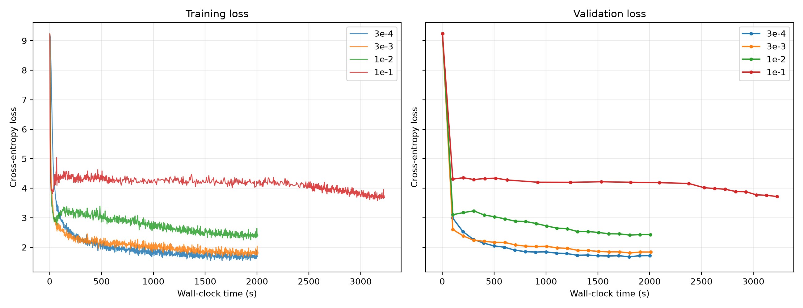
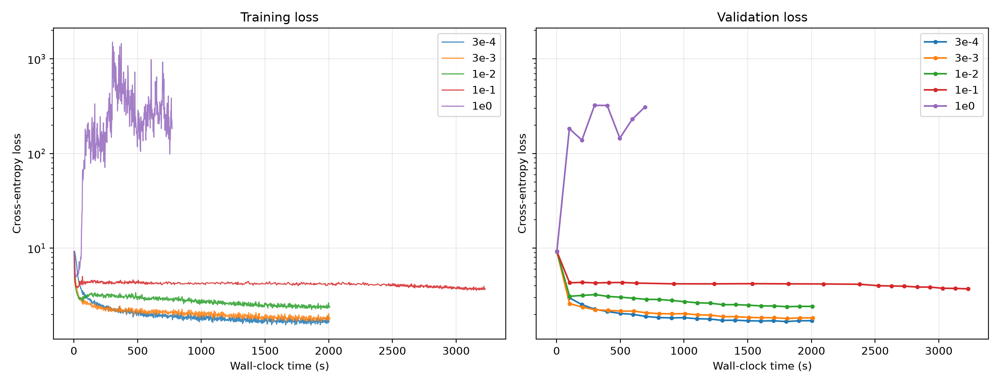
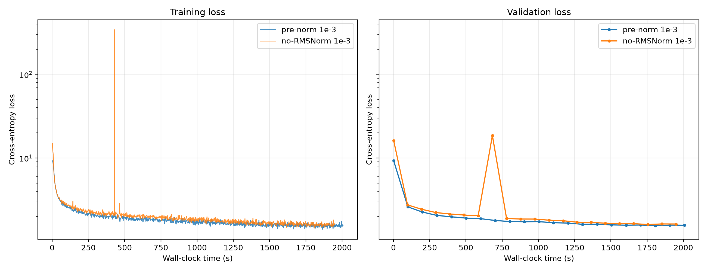
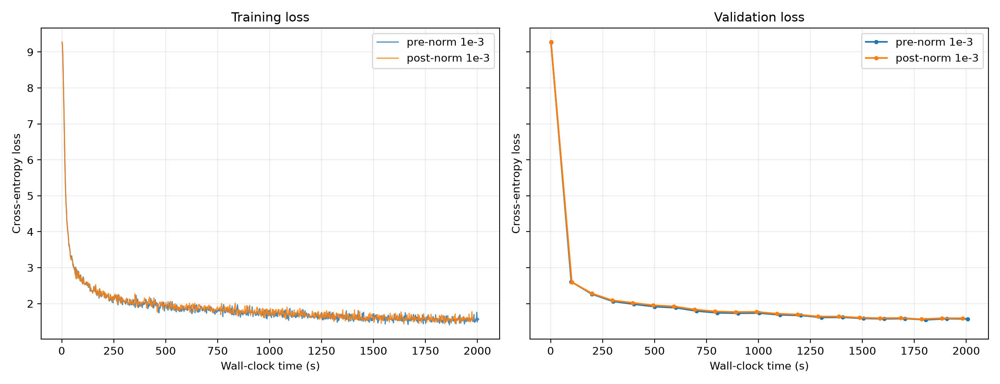
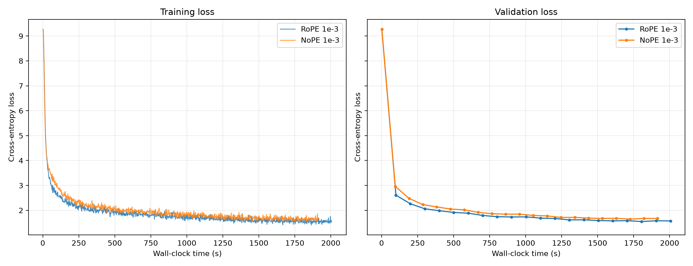
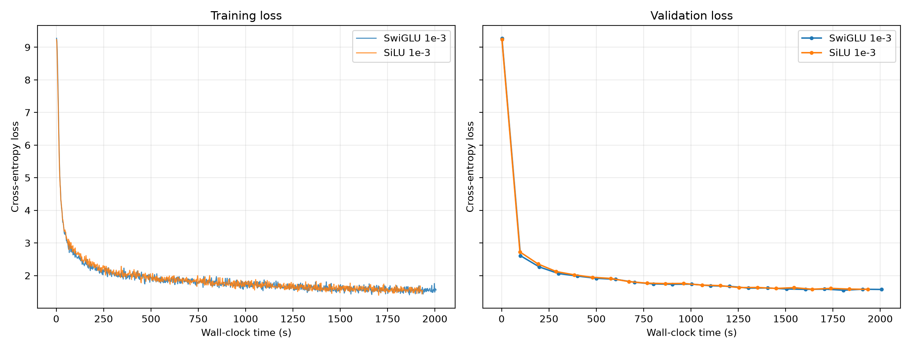
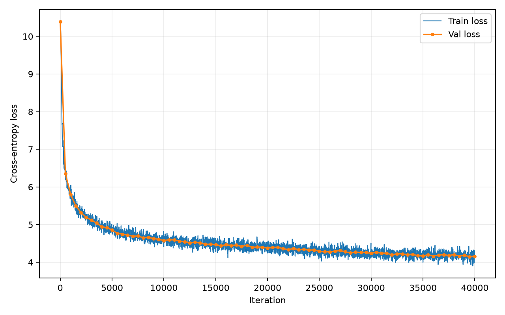
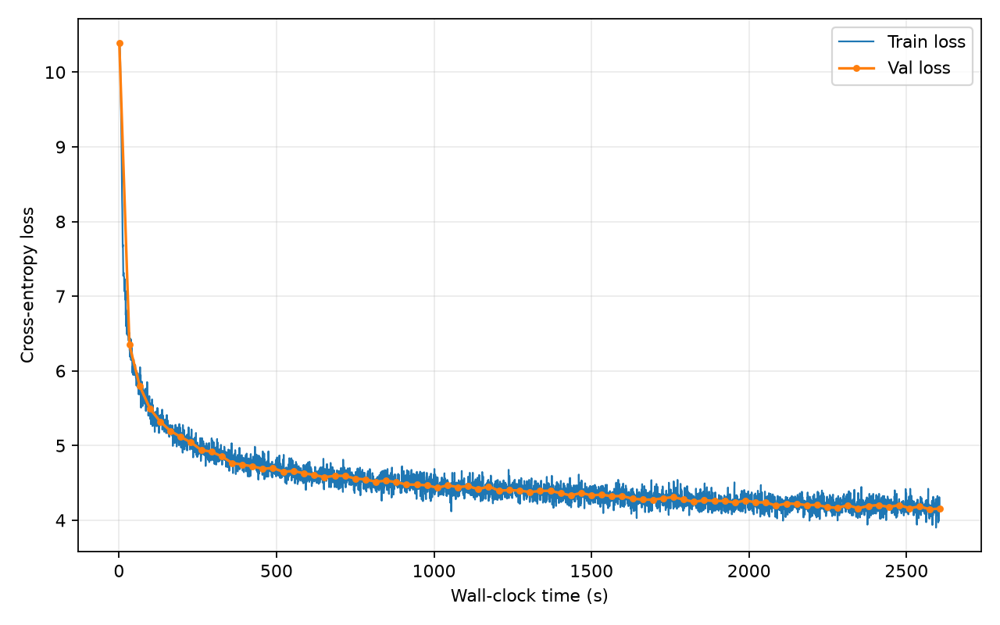

# CS336 Assignment 1

> Building a Transformer LM · Spring 2026 · Version 26.0.3

**Name / date:** Xiaofei Feng; 2026-09

**Report version:** v8 (compiled from local, desktop, and cloud records through 2026-09-07)

**Code version:** The reference commit in this repository is `f59313c`. The working tree still has uncommitted changes, and historical runs were not saved as separate commits, so this commit is not an exact reproduction identifier for every run.

Repository: [project repository](https://github.com/xiaofei9289/CS336_Project)

## Contents

| Part | Topic |
| --- | --- |
| Experimental setup | Hardware, model, optimizer, and evaluation |
| Unicode and tokenization | unicode1 / unicode2 / two BPE training runs / `tokenizer_experiments` |
| Resource accounting and the optimizer | `transformer_accounting` / `learning_rate_tuning` / `adamw_accounting` |
| TinyStories training | `experiment_log` / `learning_rate` / `batch_size_experiment` / `generate` |
| Architecture ablations | `layer_norm_ablation` / `pre_norm_ablation` / `no_pos_emb` / `swiglu_ablation` |
| OWT and improvements | `main_experiment` / OWT `generate` / `leaderboard` |
| Pre-submission checklist | Materials, citations, and checks |

## Experimental setup

> This section states the conditions shared across experiments. Differences are stated in the experiment where they apply.

| Category | Verified configuration and reproduction limits |
| --- | --- |
| Hardware | TinyStories main training, the learning-rate sweep, the batch sweep, and BPE: Windows desktop `desktop-pc`, Intel Core i5-12400F (6 cores, 12 threads), 1× NVIDIA RTX 3060 Ti (8192 MiB), about 64 GiB RAM. The Mac was used only for tokenizer experiments and MPS generation. OWT LM: AutoDL Beijing jump host `connect.bjb1.seetacloud.com:31970`. A sample taken during training showed 1× NVIDIA GeForce RTX 5090 (8477 / 32607 MiB, 96% utilization). When this was rechecked on 2026-09-07, the instance was already shut down, so `nvidia-smi` could not be run again. The GPU model and the sampled values come from verification recorded while the run was active. The western AutoDL node (RTX 4080 SUPER) was used only for optional BPE, not for this LM run. |
| Software | Desktop environment verified over SSH on 2026-09-06: Windows 10 10.0.19045, Python 3.13.14, PyTorch 2.11.0+cu128, NVIDIA driver 610.62. The Mac used for the small tokenizer experiments was macOS 26.5 with Python 3.12.13. The OWT LM used AutoDL `/root/miniconda3/bin/python`, with working directory `/root/autodl-tmp/assignment01`. The PyTorch version was not recorded separately. |
| Data | TinyStories: `data/TinyStoriesV2-GPT4-train.txt`, `data/TinyStoriesV2-GPT4-valid.txt`. OWT: `data/owt_train.txt`, `data/owt_valid.txt`. Local copies of `data/tinystories/valid.bin` and `data/owt/valid.bin` are kept. The OWT log records 2,727,120,452 train tokens and 66,401,098 valid tokens. |
| Tokenizer | TinyStories 10k and OWT 32k. Both use the special token `<\|endoftext\|>`. The artifacts are `data/tinystories/tokenizer_train_10k.pkl` and `data/owt/tokenizer_train_32k.pkl`. |
| Model | TinyStories: 4 layers, `d_model=512`, 16 heads, `d_ff=1344`, context 256, 22,696,448 parameters. Fields that can be checked in the reconstructed OWT launch argv agree with the log and the checkpoint: vocabulary 32,000, `d_model=512`, 4 layers, 16 heads, `d_ff=1344`, context 256, RoPE $\theta=10{,}000$, and 45,224,448 parameters in the log. The checkpoint state dict independently verifies the vocabulary size, `d_model`, the number of layers, and `d_ff`. |
| Position and normalization | The TinyStories baseline is pre-norm RMSNorm with RoPE $\theta=10{,}000$. The input embedding and the LM head do not share weights. Section 10.1.1 skips RMSNorm inside each block and at the end of the model during the forward pass. Section 10.1.2 moves the two RMSNorms inside each block to after the residual add, but keeps the final `ln_final`. The accurate description is therefore a post-norm-blocks variant plus a final RMSNorm. The reconstructed OWT launch argv does not enable any ablation switch, so it uses the same pre-norm + RoPE setup as the TinyStories baseline. |
| Optimizer | TinyStories uses AdamW. The current defaults in `train_lm.py` are $\beta=(0.9,0.95)$, $\epsilon=10^{-8}$, weight decay 0.01, and a gradient-norm clipping threshold of 1.0. Complete commands for historical runs were not all archived, so these details are the current reproduction configuration, not arguments recorded independently for every run. The reconstructed OWT launch argv does not override these optimizer details. The checkpoint optimizer parameter group directly verifies $\beta=(0.9,0.95)$, $\epsilon=10^{-8}$, weight decay 0.01, and a learning rate of about $10^{-4}$ at save time. |
| Learning rate | TinyStories main experiment: `max_lr=1e-3`, `min_lr=1e-4`, warmup 2,000, cosine 40,000. The learning-rate sweep, the batch sweep, and the no-RMSNorm, post-norm, NoPE, and SiLU FFN comparisons use warmup 500 and cosine 10,000. The candidates are in Sections 7, 8, and 10. The reconstructed OWT launch argv uses the same main-experiment schedule, and the CSV learning-rate trajectory matches it. |
| Training budget | TinyStories main experiment: batch 32, no gradient accumulation, 40,000 steps, 327,680,000 training tokens. Sweep budgets are in Sections 7 and 8. OWT: batch 32, context 256, 40,000 steps, 327,680,000 training tokens processed in total. |
| Precision and reproduction | The batch sweep and the notes for no-RMSNorm, post-norm, NoPE, and SiLU FFN all record seed 42. The OWT seed 42 comes from the reconstructed launch argv. Seeds, numeric precision, and compilation flags for the other historical runs were not all archived independently, so they are not filled in from script defaults. |
| Validation | The CSVs confirm that the TinyStories main experiment, each 10,000-step comparison, and OWT all leave a validation value every 500 steps. The reconstructed OWT launch argv uses `--eval-iters 20`. The `eval_iters` argument was not archived for every other historical run. |

Materials: `notes/进展记录.md`, `runs/batch_size_sweep_notes.txt`, and the actual run configurations and logs for each experiment.

**Configuration differences across experiments:** The TinyStories main experiment trains for 40,000 steps with a 2,000-step warmup and a 40,000-step cosine schedule. The learning-rate sweep, the batch sweep, and the four tested ablations (no-RMSNorm, the post-norm variant, NoPE, and SiLU FFN) all run for 10,000 steps with a 500-step warmup and a 10,000-step cosine schedule. All four use batch size 32, seed 42, and maximum / minimum learning rates of `1e-3` / `1e-4`. This `1e-3` is the learning rate used by the matched-schedule batch-32 baseline. It is not called the best candidate from Section 7. The no-RMSNorm run completes only this setting and does not complete the best-learning-rate or lower-learning-rate search required by the handout. The post-norm variant moves RMSNorm inside each block but keeps the final RMSNorm. NoPE does not apply RoPE to the attention queries and keys, and it does not add a replacement positional encoding. The SiLU FFN replaces the SwiGLU with `d_ff=1344` by an ungated two-layer FFN with `d_ff=2048`, so that the parameter counts are approximately matched. The batch sweep changes only the batch size, but it only reaches a successfully completed batch of 128. It does not obtain a batch of 256 or an out-of-memory boundary. OWT uses a 32k vocabulary, the same main architecture, and the main-experiment schedule, and trains for 40,000 steps on an AutoDL RTX 5090. The reconstructed launch command is in `runs/owt/notes.txt` and Section 11.1.

## 1. Unicode

### 1.1 `unicode1` · Understanding Unicode

(a) What Unicode character does `chr(0)` return?

**Answer: `chr(0)` returns the NUL (null) character at Unicode code point U+0000. In Python it is often written `\x00`. It is an invisible character.**

(b) How does this character's `__repr__()` differ from what `print` displays?

**Answer: `print(chr(0))` emits the real but invisible NUL character. `repr(chr(0))` returns the visible text representation `\x00`, which makes the actual contents of a string easier to inspect.**

(c) What happens when this character appears in text? You can try the following code in a Python interpreter and see whether the result matches your expectation:

```python
>>> chr(0)
>>> print(chr(0))
>>> "this is a test" + chr(0) + "string"
>>> print("this is a test" + chr(0) + "string")
```

**Answer: When `chr(0)` appears in text, I observe that it is invisible on the screen. The Python interpreter displays it as `\x00` in the string representation, but `print()` does not show it, so the text before and after it looks contiguous.**

### 1.2 `unicode2` · Unicode Encodings

(a) Why train a tokenizer on UTF-8 bytes rather than UTF-16 or UTF-32?

**Answer: UTF-8 represents common text with fewer bytes, is compatible with the internet, file systems, and programming tools, and can represent every Unicode character without loss.**

(b) Why is the byte-by-byte decoding function in the original problem incorrect? Give an input that exposes the problem.

```python
def decode_utf8_bytes_to_str_wrong(bytestring: bytes):
    return "".join(
        [bytes([b]).decode("utf-8") for b in bytestring]
    )

>>> decode_utf8_bytes_to_str_wrong("hello".encode("utf-8"))
'hello'
```

**Answer:**

Example input:

```python
b"\xe4\xb8\xad"  # UTF-8 encoding of "中"
```

This function decodes each byte separately. A UTF-8 character can consist of more than one byte, so the first byte of the Chinese character "中", `b"\xe4"`, raises `UnicodeDecodeError`.

(c) Give a two-byte sequence that cannot be decoded into a valid Unicode character.

**Answer: For example, `b"\xff\xff"`. The byte `0xFF` is not allowed in valid UTF-8, so decoding it as UTF-8 raises `UnicodeDecodeError`.**

## 2. BPE training experiments

### 2.1 `train_bpe_tinystories`

(a) Train a BPE tokenizer with a 10,000-token vocabulary. Record the runtime, memory use, and longest token, and say whether that token is reasonable.

| Item | Measured record |
| --- | --- |
| Corpus | `data/TinyStoriesV2-GPT4-train.txt` |
| Input bytes | `2,227,753,162 bytes` (about 2.075 GiB) |
| vocab_size | 10000 |
| Actual vocab | 10000 |
| merges | 9743 (10000 − 256 − 1 special token) |
| special token | `<\|endoftext\|>` |
| Runtime | 898.850 s (original `train_bpe`); 100.739 s (optimized version; the original console log and pickle were both copied locally) |
| Longest token id | 7160 |
| Longest token | ` accomplishment` (15 bytes, with a leading space) |
| Longest ordinary token | The same token |
| Machine | Windows desktop, Intel Core i5-12400F, 64 GB RAM, NVIDIA RTX 3060 Ti (8 GB) |
| Original settings | 1 process; `desired_num_chunks=32`, sequential chunked pre-tokenization only, no multiprocessing and no GPU |
| Optimized settings | Desktop command: `train_bpe_tinystories.py --input data/TinyStoriesV2-GPT4-train.txt --output data/tinystories/tokenizer_train_10k_optimize.pkl --overwrite`. The console records `desired_num_chunks=32`, but the exact worker / process configuration was not archived separately |
| Memory measurement | Neither the original 898.850 s run nor the optimized 100.739 s run recorded peak RSS. An independent follow-up measurement gives a sampled max working set of 847.69 MiB and a sampled max peak working set of 868.67 MiB. Neither should be written as the peak RSS of either timed run. |
| Measurement method | Time: `train_bpe_tinystories.py` uses `time.perf_counter()` and writes the result to `metadata.elapsed_seconds` in the pickle.<br/>Memory: the original run finished on Windows, where `resource.getrusage()` cannot provide `ru_maxrss`, so the original pickle has `peak_rss_mib=None`. The follow-up samples the Windows process working set and peak working set. That follow-up took 411.631 s. It does not have a separate record sufficient to identify its code version. It only supplements the memory definition and is not compared directly with 898.850 s or 100.739 s. |
| Saved paths | Original: `data/tinystories/tokenizer_train_10k.pkl`. Optimized: `data/tinystories/tokenizer_train_10k_optimize.pkl` |

The follow-up artifact exists only on the remote `desktop-pc`: directory `D:\desktop\data\tinystories`, filename `tokenizer_train_10k_memcheck.pkl`.

**(a) Answer: The original implementation trained the TinyStories 10k vocabulary on the desktop in 898.850 s. The locally saved original profiler `data/tinystories/tokenizer_train_10k.prof` records about 898.848 s in total, of which single-process `pretokenize` accounts for about 775.617 s (about 86%) and per-round pair selection accounts for about 113.7 s (about 13%). The optimized version's console record on the same corpus is 100.739 s, about 8.92 times faster by the two wall-clock records, below the two-minute target suggested by the assignment. Local structural checks show that the two versions have equal vocabularies, merges, and special tokens. The two pickles have different SHA-256 hashes because their metadata differ, so this is structural agreement, not byte-for-byte file identity. The longest token, ` accomplishment`, is a common complete English word with a leading space. The leading space comes from the GPT-2-style pre-tokenization boundary, so the result is reasonable.**

**(b) Which stage of BPE training takes the most time?**

**Answer: In the original version, pre-tokenization (pretok) is the slowest stage. In the profile now copied locally it accounts for about 775.617 s, about 86% of the total. The optimized console directly confirms a total of 100.739 s and about 3.3 s in the merge stage, but it has no cProfile-level stage breakdown. The remaining about 97.4 s is all cost outside that merge timing interval. The available records cannot reliably split that remainder into stages, so it cannot all be reported as pure pretok time.**

Evidence: [`notes.txt`](runs/tinystories_bpe/notes.txt), [`optimize_console.txt`](runs/tinystories_bpe/optimize_console.txt), [`compare_ts_bpe.out`](runs/tinystories_bpe/compare_ts_bpe.out), and [`tokenizer_train_10k_prof.txt`](runs/tinystories_bpe/tokenizer_train_10k_prof.txt).

### 2.2 `train_bpe_expts_owt`

(a) After training a BPE tokenizer with a 32,000-token vocabulary, what is the longest token? Is it reasonable?

| Item | Measured record |
| ------------- | ------------------------------------------------------------ |
| Corpus | OpenWebText train: `data/owt_train.txt` (the assignment's owt-sample training set) |
| Input bytes | 11,920,511,059 bytes (11,368.29 MiB) |
| vocab_size | 32000 |
| Actual vocab | 32000 |
| merges | 31743 (32000 − 256 − 1) |
| special token | `<\|endoftext\|>` |
| Runtime | Original `train_bpe`: 27,947.072 s (about 7 hours 46 minutes) |
| Longest token id | 25822 |
| Longest token | 64 bytes, the four-byte pattern `\xc3\x83\xc3\x82` repeated 16 times (not a normal English word) |
| Longest ordinary token | The same token (id 25822) |
| Machine | Windows desktop `desktop-pc`, CPU only |
| Parallelism | Original: one process; `desired_num_chunks=32`, sequential pre-tokenization split on `<\|endoftext\|>`, no multiprocessing and no heap optimization |
| Peak memory | Not recorded by the script (`peak_rss_mib=unavailable`). One manual sample of the working set during merging was about 1.5 GB. That is not the peak. |
| Saved path | `data/owt/tokenizer_train_32k.pkl` |

**Answer: OpenWebText train (11,920,511,059 bytes) was trained on the desktop with the original `train_bpe` and 32 sequential pretok chunks to a 32k vocabulary. It took 27,947.072 s (about 7 h 46 min) and produced a vocabulary of 32,000 and 31,743 merges. The longest token is id 25822, 64 bytes of repeated garbage `\xc3\x83\xc3\x82`, not a reasonable English word. Windows did not record `ru_maxrss`. A manual working-set sample during merging was about 1.5 GB. The pickle was written to `data/owt/tokenizer_train_32k.pkl`. The terminal then raised a GBK `UnicodeEncodeError` while printing the longest token, and the process exited with code 1. "The artifact was written" and "the process exited normally" should therefore be distinguished.**

(b) Compare the tokenizers trained on TinyStories and OpenWebText.

**Answer:**

#### 2.2.1 Tokenizers obtained from training

|                    | TinyStories 10k                              | OpenWebText 32k                        |
| :----------------- | :------------------------------------------- | :------------------------------------- |
| Training corpus    | `TinyStoriesV2-GPT4-train.txt`               | `owt_train.txt`                        |
| Input size         | 2,227,753,162 B (about 2.07 GiB)             | 11,920,511,059 B (about 11.1 GiB)      |
| vocab / merges     | 10000 / 9743                                 | 32000 / 31743                          |
| special            | `<\|endoftext\|>`                            | `<\|endoftext\|>`                      |
| Implementation (assignment run) | Original `train_bpe`, one process, chunks=32 | Same |
| Runtime            | 898.850 s (about 15 min)                     | 27,947.072 s (about 7 h 46 min)        |
| Peak RSS           | Not measured for the original run            | Not measured                           |
| Working set        | Independent follow-up: 847.69 MiB; peak working set 868.67 MiB | Manual sample during merging, about 1.5 GB (neither equals peak RSS) |
| Longest token      | id 7160, ` accomplishment` (15 B, leading space) | id 25822, 64 B repeated `\xc3\x83\xc3\x82` |

Optimized version (same training corpus; the original pickle is not overwritten): the TinyStories console records 100.739 s. The optimized pickle, console log, and structural-check output were all copied locally. The check finds equal vocabularies, merges, and special tokens, but the two pickles have different metadata and SHA-256 hashes. The optimized OWT run has no local log that can be rechecked, so it is excluded from the formal timing comparison and no speedup is reported for it.

#### 2.2.2 Encoding the validation sets with both tokenizers (Mac)

| tokenizer | corpus            | UTF-8 bytes | tokens     | bytes/token | wall clock |
| :-------- | :---------------- | :---------- | :--------- | :---------- | :------- |
| TS 10k    | TinyStories valid | 22,502,601  | 5,465,883  | 4.1169      | 19.36 s  |
| OWT 32k   | OpenWebText valid | 289,998,753 | 66,401,098 | 4.3674      | 307.91 s |

Cross-encoding of 10 documents (the start of each training file):

| Tokenizer × text   | UTF-8 bytes | tokens | bytes/token |
| :----------------- | ----------: | -----: | ----------: |
| TS tok × TS text   | 7,565  | 1,818       | 4.1612 |
| OWT tok × OWT text | 31,617 | 6,722       | 4.7035 |
| TS tok × OWT text  | 31,617 | 9,883       | 3.1991 |
| OWT tok × TS text  | 7,565  | 1,863       | 4.0607 |

- Scale: the OWT corpus is about 5.4 times the TinyStories corpus, the vocabulary is 3.2 times larger, and the original training time is about 31 times longer (15 min versus 7 h 46 min).
- Longest token: the TinyStories token looks like an English word with a GPT-2 space. The OWT token is repeated web-text garbage and does not look like a word.
- Matched validation sets: on their own matched validation sets, the OWT tokenizer has a compression rate of 4.3674 bytes/token and the TinyStories tokenizer has 4.1169 bytes/token. The former is slightly higher. The two results come from different corpora, and the vocabularies are 32k and 10k, so the difference alone does not show that the OWT tokenizer is better.
- Cross-domain coverage: on the same OWT sample, the OWT and TinyStories tokenizers give 4.7035 and 3.1991 bytes/token. On the same TinyStories sample, the TinyStories and OWT tokenizers give 4.1612 and 4.0607 bytes/token. Within these 10-document samples, the TinyStories vocabulary fragments web text substantially, while the OWT vocabulary loses less compression on children's stories. The conclusion is limited to this sample.

The small experiment on the full validation set does not replace a record of the full training run. OWT peak RSS was not measured, and the optimized OWT runtime has no local log that can be rechecked. Neither enters the formal comparison above.

## 3. Tokenizer experiments

### 3.1 `tokenizer_experiments`

> Corresponds to handout §2.5–§2.7. The 10-document sample and the full validation set are reported separately so the two definitions are not mixed.

**Conditions:** MacBook Air (arm64), one process. The 10 documents are taken from the start of each training file. The validation experiment encodes the full validation set. Wall-clock time covers the encode call.

(a) **Sample 10 documents each** from TinyStories and OpenWebText. Using the TinyStories and OpenWebText tokenizers trained earlier (vocabulary sizes 10K and 32K), encode the sampled documents from each corpus into integer token IDs. What is each tokenizer's compression ratio, measured in **bytes per token**?

**(a) Answer:**

| Tokenizer / documents | UTF-8 bytes | tokens | bytes/token |
| --- | --- | --- | --- |
| TS 10k / 10 TS documents | 7565 | 1818 | 4.1612 |
| OWT 32k / 10 OWT documents | 31,617 | 6,722 | 4.7035 |

(b) What happens if the TinyStories tokenizer tokenizes the sampled OpenWebText documents? Compare compression ratios and/or describe the behavior qualitatively.

**(b) Answer:**

| Same OWT sample | tokens | bytes/token |
| --- | --- | --- |
| OWT tokenizer | 6,722    | 4.7035      |
| TinyStories tokenizer | 9,883    | 3.1991      |

(c) Estimate your tokenizer's throughput (for example, bytes processed per second). At that speed, how long would it take to tokenize the Pile dataset (825 GB of text)?

**(c) Answer:**

- Timed input: MacBook Air, one process, OWT 32k tokenizer, OpenWebText valid

- Bytes: 289,998,753

- Seconds: 307.91

- bytes/s: 941,839

- Unit: 825 GB = $825\times10^9$ bytes

- Formula and result:

$$
T=\frac{825\times10^9}{941{,}839}
\approx 243\ \text{hours}
\approx 10.1\ \text{days}.
$$

This uses decimal 825 GB, as the problem states it. If "825 GB" is interpreted as 825 GiB, that is $825\times2^{30}$ bytes, and the same throughput would take about 261.3 hours (10.9 days). The two numbers differ in the unit definition. They are not two measured speeds.

(d) Using the TinyStories and OpenWebText tokenizers, encode the corresponding training and development (validation) sets into integer token-ID sequences. These data will later be used to train the language model. We suggest saving the token-ID sequences as NumPy arrays with dtype `uint16`. Why is `uint16` an appropriate choice?

**Answer:** `uint16` is a 16-bit unsigned integer and can represent 0 through 65,535. The TinyStories and OpenWebText vocabulary sizes are 10,000 and 32,000, so every token ID fits without loss. Each token ID occupies 2 bytes, which uses less memory and disk than `uint32` or `int64`.

Materials: `runs/tokenizer_experiments/results.json`; `runs/tokenizer_experiments/notes.txt`; `runs/owt_encode/notes.txt`.

## 4. Transformer

### 4.1 `transformer_accounting`

**(a)** Consider a model at GPT-2 XL scale that uses this assignment's architecture, with the following configuration:

```text
vocab_size: 50,257       # vocabulary size
context_length: 1,024    # context length
num_layers: 48           # number of Transformer layers
d_model: 1,600           # hidden dimension
num_heads: 25            # number of attention heads
d_ff: 4,288              # feed-forward intermediate dimension
```

Here `d_ff` is the multiple of 64 closest to $\frac{8}{3}\times1600$.

If a model is built with this configuration, how many trainable parameters does it have? If every parameter is a single-precision float (FP32), how much memory is required just to load the model?

**Calculation and answer:**

**When the embedding and the LM head do not share weights and the linear layers have no bias, the model has 1,640,452,800 trainable parameters, about 1.64B. Each FP32 parameter occupies 4 bytes, so storing the parameters alone requires 6,561,811,200 bytes, about 6.56 GB (6.11 GiB).**

The terms are computed below.

**1. Embedding: token IDs to hidden vectors**

The embedding table has shape
$$
(\text{vocab\_size},d_{\text{model}})=(50{,}257,1{,}600)
$$
so the parameter count is
$$
50{,}257\times1{,}600 =\boxed{80{,}411{,}200\text{ parameters}}
$$
**2. Parameters in each Transformer block**

Each layer contains an attention module, SwiGLU, and two RMSNorms.

| Component | Weight matrices or vectors | Parameters |
| -------------------- | ---------------------------- | ---------- |
| Q, K, V projections | 3 matrices of $1600\times1600$ | 7,680,000 |
| Attention output projection | 1 matrix of $1600\times1600$ | 2,560,000 |
| SwiGLU `w1`, `w3` | 2 matrices of $4288\times1600$ | 13,721,600 |
| SwiGLU `w2` | 1 matrix of $1600\times4288$ | 6,860,800 |
| Two RMSNorms | 1600 learnable scale parameters each | 3,200 |

The parameter count per layer is therefore
$$
\begin{aligned} P_{\text{block}} &=4d_{\text{model}}^2 +3d_{\text{model}}d_{\text{ff}} +2d_{\text{model}}\\ &=4\times1600^2+3\times1600\times4288+2\times1600\\ &=\boxed{30{,}825{,}600\text{ parameters}} \end{aligned}
$$
Across 48 layers:
$$
48\times30{,}825{,}600 =\boxed{1{,}479{,}628{,}800\text{ parameters}}
$$
The **25 attention heads do not multiply the parameter count by another 25**: the 1600 dimensions are split into 25 heads, and each head has $1600/25=64$ dimensions.

**3. Final RMSNorm and LM head**

After all Transformer blocks there is one final RMSNorm:
$$
P_{\text{final norm}}=\boxed{1{,}600\text{ parameters}}
$$
The LM head maps the 1600-dimensional hidden vector to 50,257 vocabulary scores:
$$
P_{\text{LM Head}} =50{,}257\times1{,}600 =\boxed{80{,}411{,}200\text{ parameters}}
$$
RoPE has no trainable parameters, so no positional-embedding parameters are added for the context length of 1024.

**4. Total parameter count**
$$
\begin{aligned} P_{\text{total}} &=P_{\text{Embedding}} +48P_{\text{block}} +P_{\text{final norm}} +P_{\text{LM Head}}\\ &=80{,}411{,}200 +1{,}479{,}628{,}800 +1{,}600 +80{,}411{,}200\\ &=\boxed{1{,}640{,}452{,}800\text{ parameters}} \end{aligned}
$$
That is about **1.640 billion parameters (1.64B)**.

**5. FP32 memory**

Each FP32 parameter occupies
$$
32\text{ bit}\div8=\boxed{4\text{ bytes}}
$$
so the model parameters occupy
$$
1{,}640{,}452{,}800\times4 =\boxed{6{,}561{,}811{,}200\text{ bytes}}
$$
Converted to GB or GiB:

| Unit | Calculation | Result |
| ---------- | ---------------- | ----------- |
| Decimal GB | $6{,}561{,}811{,}200/10^9$ | about 6.56 GB |
| Binary GiB | $6{,}561{,}811{,}200/1024^3$ | about 6.11 GiB |

This counts only model parameters. It does not include gradients, optimizer state, activations, or extra runtime overhead.

(b) List the matrix multiplications required for one forward pass of this GPT-2 XL-scale model. How many floating-point operations (FLOPs) do these matrix multiplications require in total? Assume the input sequence contains `context_length` tokens.

**Answer:** The calculation below uses **batch size = 1** and counts one multiplication and one addition as **2 FLOPs**. For one input sequence of length 1024,
$$
(m\times k)\text{ matrix}\;\times\;(k\times n)\text{ matrix} \quad\Rightarrow\quad 2mkn\text{ FLOPs}
$$
The problem configuration is
$$
S=1024,\quad d=1600,\quad h=25,\quad d_k=64,\quad d_{\mathrm{ff}}=4288,\quad V=50{,}257,\quad L=48
$$
where $S$ is the sequence length, $d$ is the hidden dimension, and $hd_k=d$.

**1. Matrix multiplications in each Transformer block**

| Matrix multiplication | Role and shapes | FLOPs per layer |
| ------------------------------- | ---------------------------------------------------- | ------------------------- |
| Q, K, V projections (3 times) | Project the input to Q, K, and V; each is $(S,d)(d,d)$ | $6Sd^2=15{,}728{,}640{,}000$ |
| $QK^\top$ | Attention scores between tokens in each head; per head $(S,d_k)(d_k,S)$ | $2hS^2d_k=3{,}355{,}443{,}200$ |
| Attention weights times V | Aggregate context in each head; per head $(S,S)(S,d_k)$ | $2hS^2d_k=3{,}355{,}443{,}200$ |
| Attention output projection | Project after the heads are merged; $(S,d)(d,d)$ | $2Sd^2=5{,}242{,}880{,}000$ |
| SwiGLU `w1`, `w3` (2 times) | Produce the gate and content features; each is $(S,d)(d,d_{\mathrm{ff}})$ | $4Sd\,d_{\mathrm{ff}}=28{,}101{,}836{,}800$ |
| SwiGLU `w2` | Project the intermediate features back to the hidden dimension; $(S,d_{\mathrm{ff}})(d_{\mathrm{ff}},d)$ | $2Sd\,d_{\mathrm{ff}}=14{,}050{,}918{,}400$ |

The total compute per layer is
$$
\begin{aligned} F_{\mathrm{block}} &=8Sd^2+4S^2d+6Sdd_{\mathrm{ff}} \end{aligned}
$$
Substituting the values:
$$
\begin{aligned} F_{\mathrm{block}} &=20{,}971{,}520{,}000 +6{,}710{,}886{,}400 +42{,}152{,}755{,}200\\ &=\boxed{69{,}835{,}161{,}600\text{ FLOPs}} \end{aligned}
$$
Across 48 layers:
$$
48F_{\mathrm{block}} =\boxed{3{,}352{,}087{,}756{,}800\text{ FLOPs}}
$$
**2. The final LM-head matrix multiplication**

The LM head computes vocabulary logits at every position:
$$
(S,d)(d,V)\rightarrow(S,V)
$$
Its cost is
$$
\begin{aligned} F_{\mathrm{LM Head}} &=2SdV\\ &=2\times1024\times1600\times50257\\ &=\boxed{164{,}682{,}137{,}600\text{ FLOPs}} \end{aligned}
$$
**3. Total FLOPs for one forward pass**
$$
\begin{aligned} F_{\mathrm{total}} &=L\left(8Sd^2+4S^2d+6Sdd_{\mathrm{ff}}\right)+2SdV\\ &=3{,}352{,}087{,}756{,}800+164{,}682{,}137{,}600\\ &=\boxed{3{,}516{,}769{,}894{,}400\text{ FLOPs}}\\ &\approx\boxed{3.52\times10^{12}\text{ FLOPs}} \end{aligned}
$$
That is a total of about **$3.52\times10^{12}$ FLOPs**. It is not a rate in operations per second.

This problem counts only matrix multiplications. The embedding is a lookup and is not counted as matrix-multiplication FLOPs. RMSNorm, RoPE, softmax, SiLU, elementwise multiplication, and residual addition are also excluded. Causal attention is counted as a full $S\times S$ matrix multiplication and is not halved because future positions are masked.

For one input sequence of length 1024, counting 2 FLOPs per multiply-add, the matrix multiplications in the 48 Transformer layers and the final LM head require $3{,}516{,}769{,}894{,}400$ FLOPs, about $3.52\times10^{12}$ FLOPs.

------

(c) From the analysis above, which parts consume the most FLOPs?

**Answer:** The SwiGLU feed-forward network consumes the most FLOPs, about **57.5%** of the total. Next are the Q, K, V, and output projections in attention, about **28.6%**. The attention-score computation and the weighted sum over V together account for about **9.2%**, and the final LM head accounts for about **4.7%**.

| Model component | Computation | Total FLOPs (approx.) | Share |
| -------------------- | ------------------------------------------------------------ | -------------- | --------- |
| SwiGLU feed-forward | `w1` and `w3` expand 1600 dimensions to 4288; `w2` maps 4288 dimensions back to 1600 | $2.023\times10^{12}$ | **57.5%** |
| Linear projections in attention | Produce Q, K, and V, and project the merged heads | $1.007\times10^{12}$ | **28.6%** |
| Attention scores and weighted sum | $QK^\top$ scores tokens against each other; attention weights times V aggregate information | $3.221\times10^{11}$ | **9.2%** |
| LM head | Map each position's 1600-dimensional hidden vector to 50,257 vocabulary scores | $1.647\times10^{11}$ | **4.7%** |

(d) Repeat the analysis for the following models:

- GPT-2 small: 12 layers, `d_model = 768`, 12 attention heads.
- GPT-2 medium: 24 layers, `d_model = 1024`, 16 attention heads.
- GPT-2 large: 36 layers, `d_model = 1280`, 20 attention heads.

As the model grows, which parts of a Transformer language model take a larger share of total FLOPs, and which take a smaller share?

| Model | Layers | `d_model` | Heads | `d_ff` |
| --- | --- | --- | --- | --- |
| Small | 12 | 768 | 12 | 2048 |
| Medium | 24 | 1,024 | 16 | 2752 |
| Large | 36 | 1,280 | 20 | 3392 |
| XL (reference) | 48 | 1,600 | 25 | 4,288 |

Shared assumptions: vocabulary size 50,257, context length 1,024, batch size 1, SwiGLU, and `d_ff` equal to the multiple of 64 closest to $(8/3)d_{\mathrm{model}}$. Only matrix multiplications are counted, one multiply-add is 2 FLOPs, attention uses the full $1024\times1024$ matrices, and the LM head computes logits at every position.

| Component / FLOP share | Small | Medium | Large | XL |
| ------------------------------------------------ | ------------------------- | ------------------------- | ------------------------- | ------------------------- |
| Attention linear projections: Q, K, V, and output | 19.88% | 24.83% | 27.32% | 28.62% |
| Attention scores and weighted sum: $QK^\top$ and attention weights times V | 13.25% | 12.42% | 10.93% | 9.16% |
| SwiGLU: `w1`, `w3`, `w2` | 39.76% | 50.05% | 54.30% | 57.53% |
| LM head: hidden vector to vocabulary | 27.10% | 12.70% | 7.45% | 4.68% |
| **Total FLOPs** | **$2.9165\times10^{11}$** | **$8.3017\times10^{11}$** | **$1.7685\times10^{12}$** | **$3.5168\times10^{12}$** |

Percentages may not sum to exactly 100% because of rounding.

Let $L$ be the number of layers, $S$ the context length, $d$ the hidden dimension, and $V$ the vocabulary size. The formulas are
$$
\begin{aligned} F_{\text{attention projections}} &= 8LSd^2\\ F_{\text{attention scores and weighted sum}} &= 4LS^2d\\ F_{\text{SwiGLU}} &= 6LSdd_{\mathrm{ff}}\\ F_{\text{LM head}} &= 2SdV \end{aligned}
$$
Each component's share is its FLOPs divided by the sum of these four terms.

As the model grows, the FLOP shares of SwiGLU and the attention linear projections increase, while the shares of the attention scores and weighted sum, and of the LM head, decrease. With context length and vocabulary size fixed and $d_{\mathrm{ff}}\approx(8/3)d$, the first two scale as $Ld^2$, the attention scores and weighted sum scale as $Ld$, and the LM head scales only as $d$ and does not grow with the number of layers.

------

(e) Increase the GPT-2 XL context length to **16,384**. How do the total FLOPs of one forward pass change? How do the relative FLOP shares of the model components change?

Increasing the context length from 1,024 to 16,384 multiplies it by **16**. The key point is that **linear projections grow by 16, while the attention scores and weighted sum grow by $16^2=256$**.

Using the same matrix-multiplication accounting as above:

| Component | Dependence on context length | New FLOPs | New share |
| ------------------------ | -------------------------- | ------------------- | ---------- |
| Q, K, V, and attention output projections | Proportional to $S$, ×16 | $1.611\times10^{13}$ | 12.06% |
| $QK^\top$ and attention weights times V | Proportional to $S^2$, ×256 | $8.246\times10^{13}$ | **61.73%** |
| Three SwiGLU projections | Proportional to $S$, ×16 | $3.237\times10^{13}$ | 24.24% |
| LM head | Proportional to $S$, ×16 | $2.635\times10^{12}$ | 1.97% |
| **Total** | **About 37.98 times the original** | **$1.3358\times10^{14}$** | **100%** |

Attention computes a relation between every token and every other token, so this cost grows quadratically as the sequence gets longer and eventually exceeds SwiGLU, becoming the main compute cost.

After increasing the GPT-2 XL context length from 1,024 to 16,384, the matrix-multiplication FLOPs of one forward pass rise from about $3.52\times10^{12}$ to $1.336\times10^{14}$, about 38 times the original. Because the attention scores and the weighted sum over V grow with the square of the sequence length, their share rises from 9.16% to 61.73%, while the shares of the attention linear projections, SwiGLU, and the LM head fall to 12.06%, 24.24%, and 1.97%.

## 5. Optimizer and resource accounting

### 5.1 `learning_rate_tuning`

**Problem:** As we will see, **the learning rate is one of the hyperparameters with the largest effect on training**. This simple example shows that effect in practice.

Run the SGD example above with three additional learning rates, **`1e1`, `1e2`, and `1e3` (that is, 10, 100, and 1000)**, for **10 training iterations** each. At each learning rate, how does the loss change? Does it fall faster, fall more slowly, or diverge (keep growing during training)?

**Answer:**

| Learning rate | Initial / final loss | Observed change |
| --- | --- | --- |
| 1e1 | 19.676 / 2.644 | Decreases monotonically and is still about 2.64 after 10 steps |
| 1e2 | 28.090 / ≈0 | This trajectory falls to near 0 within 10 steps |
| 1e3 | 23.636 / $2.19\times10^{18}$ | Increases at every step and diverges |

At learning rate `1e1`, this trajectory's loss falls monotonically from 19.676 to 2.644. At `1e2`, this trajectory falls from 28.090 to near 0. At `1e3`, the loss keeps growing, from 23.636 to about $2.19\times10^{18}$, and diverges clearly. The three runs have different initial losses, and no shared initial weights or random seed were archived, so these results describe individual trajectories. They are not a strictly controlled ranking of convergence speed.

### 5.2 `adamw_accounting`

**(a)** How much peak memory does running AdamW require? Compute the memory used by **model parameters, activations, gradients, and optimizer state** separately.

Express the answer in terms of `batch_size` and the following model hyperparameters:

- `vocab_size`: vocabulary size
- `context_length`: context length
- `num_layers`: number of layers
- `d_model`: hidden dimension
- `num_heads`: number of attention heads

Assume
$$
d_{\mathrm{ff}}=\frac{8}{3}d_{\mathrm{model}}
$$
To simplify the activation-memory calculation, consider only the following components:

- Transformer block:
  - RMSNorm (one or more)
  - Multi-head self-attention sublayer: Q, K, and V projections, the $QK^\top$ matrix multiplication, softmax, the weighted sum over V, and the output projection
  - Position-wise feed-forward network (SwiGLU): $W_1$, $W_2$, SiLU on the gating branch, elementwise multiplication, and $W_3$
- Final RMSNorm
- Output embedding (the LM head, which maps hidden vectors to vocabulary logits)
- Cross-entropy computed from the logits

------

**Answer:**

Let $B$ be the batch size, $S$ the context length, $V$ the vocabulary size, $L$ the number of layers, $d$ the hidden dimension, and $h$ the number of attention heads, with

$$
d_{\mathrm{ff}}=\frac{8}{3}d.
$$

Assume linear layers have no bias and the embedding does not share weights with the LM head. The number of trainable parameters is

$$
P=2Vd+L(4d^2+3dd_{\mathrm{ff}}+2d)+d
=2Vd+12Ld^2+(2L+1)d.
$$

Every tensor uses FP32, so each element occupies 4 bytes. Memory below is in **bytes**.

| Memory component | Expression / accounting |
| ---------- | ---------------------------------------------------------- |
| Parameters | $4P$: 4 bytes per parameter. |
| Activations | $4BS[L((56/3)d+2hS)+d+2V]$: see the breakdown below. |
| Gradients | $4P$: one FP32 gradient per parameter. |
| Optimizer state | $8P$: AdamW stores a first moment $m$ and a second moment $v$ per parameter, 4 bytes each. |
| Total | $16P+4BS[L((56/3)d+2hS)+d+2V]$ |

**Activation accounting**

If one copy of each listed operation output is retained, each Transformer block has this many activation elements:

$$
8BSd+4BSd_{\mathrm{ff}}+2BhS^2.
$$

where:

- $8BSd$: outputs of the two RMSNorms, Q/K/V, the attention weighted sum, the attention output projection, and the SwiGLU down-projection, eight copies in total.
- $4BSd_{\mathrm{ff}}$: outputs of the two SwiGLU up-projections, SiLU, and the elementwise product, four copies in total.
- $2BhS^2$: the attention-score matrix $QK^\top$ and the softmax attention weights, two copies in total.

Substituting $d_{\mathrm{ff}}=(8/3)d$ gives

$$
\begin{aligned}
A_{\mathrm{block}}
&=8BSd+4BS\left(\frac{8}{3}d\right)+2BhS^2\\
&=BS\left(\frac{56}{3}d+2hS\right).
\end{aligned}
$$

At the end of the model, the accounting also includes the final RMSNorm output $BSd$, the LM-head logits $BSV$, and one extra probability or log-probability tensor $BSV$ retained for cross-entropy. The cross-entropy intermediate tensor is counted as an activation, not only the final per-token loss.

Activation memory is therefore

$$
M_{\mathrm{activations}}
=4BS\left[
L\left(\frac{56}{3}d+2hS\right)+d+2V
\right].
$$

**Total memory**

Adding parameters, activations, gradients, and optimizer state:

$$
\begin{aligned}
M_{\mathrm{total}}
&=M_{\mathrm{parameters}}
+M_{\mathrm{activations}}
+M_{\mathrm{gradients}}
+M_{\mathrm{optimizer}}\\
&=16P+
4BS\left[
L\left(\frac{56}{3}d+2hS\right)+d+2V
\right].
\end{aligned}
$$

Expanding the parameter count $P$:

$$
\boxed{
M_{\mathrm{total}}
=
16\left[2Vd+12Ld^2+(2L+1)d\right]
+
4BS\left[
L\left(\frac{56}{3}d+2hS\right)+d+2V
\right]
}
$$

This peak-memory estimate uses the simplification that one copy of each listed activation is retained. It does not use activation checkpointing, and it ignores a small number of scalars, temporary workspace, and allocator overhead.

------

(b) Substitute the GPT-2 XL configuration into your answer and obtain an expression that depends only on `batch_size`. Under an **80 GB memory** limit, what is the largest usable batch size?

------

Using the memory accounting from (a), **the maximum batch size is 3**. The calculation follows.

Substitute the GPT-2 XL configuration:
$$
V=50{,}257,\quad S=1024,\quad L=48,\quad d=1600,\quad h=25.
$$
This subquestion uses the exact $d_{\mathrm{ff}}=(8/3)d$ and not the rounded value 4288 from Section 4, so the parameter count differs slightly from the earlier one.

The parameter count is
$$
\begin{aligned} P &=2Vd+12Ld^2+(2L+1)d\\ &=2\times50257\times1600 +12\times48\times1600^2 +97\times1600\\ &=1{,}635{,}537{,}600. \end{aligned}
$$
The fixed memory for parameters, gradients, and optimizer state is

$$
16P=26{,}168{,}601{,}600\ \text{bytes}.
$$

Activation memory is

$$
\begin{aligned}
M_{\mathrm{activations}}
&=4B\times1024\left[48\left(\frac{56}{3}\times1600+2\times25\times1024\right)+1600+2\times50257\right]\\
&=16{,}356{,}614{,}144B\ \text{bytes}.
\end{aligned}
$$
The total memory as a function of batch size is
$$
\boxed{ M(B)=16{,}356{,}614{,}144B+26{,}168{,}601{,}600 \quad\text{bytes} }
$$
In decimal units, $1\ \text{GB}=10^9\ \text{bytes}$, so

$$
\boxed{ M(B)=16.356614144B+26.1686016 \quad\text{GB} }
$$
Under the 80 GB limit,
$$
B_{\max} = \left\lfloor \frac{80-26.1686016}{16.356614144} \right\rfloor = \left\lfloor3.2911\right\rfloor = \boxed{3}.
$$
At $B=3$ this is about **75.24 GB**, and at $B=4$ it is about **91.60 GB**. This is an estimate under the simplified memory model in (a). Temporary workspace and allocator overhead are not included.

------

(c) How many FLOPs does one AdamW update require?

**Answer:**

Let the model have $P=2Vd+12Ld^2+(2L+1)d$ trainable parameters. Count each basic arithmetic operation and each square root as 1 FLOP, and precompute shared scalar coefficients. Per parameter, the first-moment update, second-moment update, parameter update, and weight decay require 3, 4, 5, and 2 FLOPs. One AdamW update therefore requires about $14P=14[2Vd+12Ld^2+(2L+1)d]$ FLOPs. This excludes the forward and backward passes and ignores a small amount of shared scalar computation.

(d) Model FLOPs utilization (MFU) compares the compute implied by the achieved throughput with the hardware's theoretical peak FLOP throughput. Under the definition given in this problem, the "float32" theoretical peak of an NVIDIA H100 GPU is **495 TFLOP/s** (this actually refers to TensorFloat-32, TF32).

Assume you can reach **50% MFU**. On a single H100, how long does it take to train GPT-2 XL for **400,000 steps** at **batch size 1024**? Following the approximation given in the assignment handout, assume the backward pass costs twice as many FLOPs as the forward pass.

------

**Answer:**

Under the problem assumptions, training takes about **4,836 hours, or 201.5 days**. This uses this subquestion's configuration: $d_{\mathrm{ff}}=(8/3)d$ and context length 1024.

**1. Forward compute per sequence**

Using the earlier matrix-multiplication FLOP formula:
$$
F_{\mathrm{forward}} =L\left(8Sd^2+4S^2d+6Sdd_{\mathrm{ff}}\right)+2SdV.
$$
Substitute $L=48$, $S=1024$, $d=1600$, $V=50{,}257$, and $d_{\mathrm{ff}}=(8/3)d$:
$$
F_{\mathrm{forward}} =3{,}506{,}703{,}564{,}800 \approx3.5067\times10^{12}\ \text{FLOPs}.
$$
**2. Compute per training step**

The backward pass is twice the forward pass, so forward plus backward is three times the forward cost. Each batch contains 1024 sequences:
$$
F_{\mathrm{step}} =1024\times3F_{\mathrm{forward}} \approx1.07726\times10^{16}\ \text{FLOPs}.
$$
**3. Effective compute and training time**

Using the peak given in the problem and 50% MFU:
$$
C_{\mathrm{effective}} =0.5\times495\times10^{12} =2.475\times10^{14}\ \text{FLOPs/s}.
$$
Training for 400,000 steps takes
$$
\begin{aligned} T &=\frac{400{,}000\times1024\times3\times3{,}506{,}703{,}564{,}800} {0.5\times495\times10^{12}\times3600}\\ &\approx\boxed{4{,}836.18\ \text{hours}} \approx\boxed{201.51\ \text{days}}. \end{aligned}
$$

------

## 6. `experiment_log` · Experiment log

### 6.1 Experiment tracking (`experiment_log`)

**Recording method**

Training and evaluation are done by `train_lm.py`. Each run writes metrics to `output_dir/training_log.csv` and also prints them to the terminal. W&B is not used.

The CSV contains these fields:

| Field | Meaning |
| --------------------------- | ----------------------------------------- |
| `iteration` | Gradient-update step |
| `train_loss` | Cross-entropy loss of the current training batch |
| `validation_loss` | Mean cross-entropy of the validation batches; empty on non-validation steps |
| `learning_rate` | Current learning rate |
| `gradient_norm_before_clip` | Gradient norm before clipping |
| `elapsed_seconds` | Wall-clock time accumulated from the start of the training loop, in seconds |

By default, training metrics are recorded every 10 steps, and step 1 is always recorded. Validation runs at step 1 and then at the interval given by `--eval-interval`. The TinyStories main experiment validates about every 500 steps.

The current `train_lm.py` validation implementation draws `--eval-iters` batches at random from the validation memmap (default 20) and computes the mean cross-entropy. Complete commands for historical runs were not all archived, so the CSV directly shows the validation frequency and the mean, but it does not prove for every run that `eval_iters` was left at the default. Random sampling also makes the validation loss fluctuate.

Curves are produced by `plot_training_log.py` from the same CSV.

**Curve definitions**

- **Training loss:** cross-entropy of the single training batch at the recorded step, with no moving average, so the curve can be noisy. The default records every 10 steps, so there is not a point for every gradient step.
- **Validation loss:** only rows with a non-empty `validation_loss` are plotted, using that row's step and time as the x coordinate. Empty values are not converted to 0. Lines between validation points only show the trend.
- **Wall-clock time:** `elapsed_seconds` from the CSV. In the current `train_lm.py`, the code finishes that step's validation before recording the timestamp, so a validation row includes the cost of that validation. Historical runs are not all tied to a code commit, so this report treats the value as end-to-end accumulated time and does not try to split pure training time from validation time.
- **Metric definition:** final values are taken at the listed end-of-training step. When a "lowest recorded validation loss" is also listed, its step is given, and it is stated explicitly that this is not the same as an available best checkpoint.
- **Token count:** `batch_size × context_length × steps`. This is the number of training tokens processed, including possible repeated samples. It does not include validation tokens.

**TinyStories main-experiment curves**

The main experiment uses batch size 32 and sequence length 256, and trains for 40,000 gradient steps on an NVIDIA RTX 3060 Ti.


**Figure 6.1: Training and validation cross-entropy of the TinyStories baseline versus gradient step.** The x-axis is the gradient-update step (Iteration), and the y-axis is cross-entropy loss. The blue line is the loss of the single training batch at each recorded step. The orange dotted line is the mean loss of the validation batches. Validation occurs at step 1 and then about every 500 steps. Missing validation values are not plotted.


**Figure 6.2: Training and validation cross-entropy of the TinyStories baseline versus wall-clock time.** The x-axis is wall-clock time accumulated from the start of the training loop (Wall-clock time (s)), and the y-axis is cross-entropy loss. Both curves use the same loss values as Figure 6.1. The x coordinate is `elapsed_seconds` from the corresponding row.

The older file `runs/tinystories/training_curve.png` shows training loss and learning rate versus step. It remains in the experiment directory, but it is not included in the body and does not replace the two figures above.

**Experiment log**

The TinyStories baseline is `vocab_size=10000`, `context_length=256`, `d_model=512`, `num_layers=4`, `num_heads=16`, `d_ff=1344`, about 22.7M parameters.

| Run / purpose | Budget | Result | Log / configuration |
| --- | --- | --- | --- |
| TinyStories baseline<br>complete the main training run | 40,000 steps; batch 32; 327,680,000 tokens | step 10,000: train 1.630 / val 1.656<br>step 40,000: train 1.382 / **val 1.401953**; lowest recorded val is 1.395860 (step 39,000); about 8,078.954 s | `runs/tinystories/training_log.csv`<br>RTX 3060 Ti; warmup 2,000; cosine 40,000; LR decays from `1e-3` to `1e-4` |
| Learning-rate sweep<br>compare five `max_lr` values | Four settings complete 10,000 steps, 81,920,000 tokens each; `1.0` stops at step 3,900 | val at step 10,000: `3e-4` **1.714**; `3e-3` 1.836; `1e-2` 2.429; `1e-1` 3.719<br>`1.0` diverges clearly and is excluded from the equal-budget ranking | See Section 7 |
| Batch sweep<br>compare batch 1, 32, 64, 128 | All four complete 10,000 steps; cumulative tokens are in Section 8; 128 is the largest completed value, not a measured OOM boundary | val at step 10,000: 2.777 / 1.574 / 1.448 / 1.384<br>All four tested configurations finish, but the memory limit required by the handout has not been measured | `runs/bs_1`, `runs/bs_32`, `runs/bs_64`, `runs/bs_128`<br>`runs/batch_size_sweep_notes.txt` |
| Normalization ablations<br>no-RMSNorm and the post-norm variant | Both tested configurations complete 10,000 steps; batch 32; 81,920,000 tokens each. no-RMSNorm completes only the `1e-3` setting and does not complete the best / lower learning-rate search required by the handout. The post-norm configuration keeps the final RMSNorm | no-RMSNorm: final train 1.611 / val 1.628155; lowest recorded val 1.606834 (step 9,000)<br>Post-norm blocks + final RMSNorm: final train 1.567661 / val 1.593177; lowest recorded val 1.566550 (step 9,000); 1,983.013 s | See Section 10.1; both have a definition boundary |
| Position and FFN ablations<br>NoPE and SiLU FFN | NoPE: 10,000 updates / 81,920,000 tokens. The SiLU final checkpoint is iteration 10,000, and the trajectory adopted for reporting corresponds to 81,920,000 tokens. Including the discarded recomputation, the run actually executes 11,510 updates / 94,289,920 tokens | NoPE: final train 1.647827 / val 1.673660; lowest recorded val 1.646345 (step 9,000); 1,916.212 s<br>SiLU: final train 1.546622 / val 1.579230; lowest val on the adopted trajectory is 1.579230 (step 10,000); 1,935.183 s accumulated on the adopted interval | See Section 10.2; SiLU is a resumed run |
| OWT LM<br>32k vocabulary | 40,000 steps; batch 32; 327,680,000 tokens | step 40,000: train 4.137590 / val 4.157374; lowest recorded val 4.146008 (step 39,500); 2,606.966 s<br>Generation: T=0.2 / 0.8 each records 256 new tokens and stops at `max_tokens`; T=1.2 records 165 new tokens and stops at EOS | Training: `runs/owt/`<br>Generation: `runs/owt_repro/generate/`<br>Training source and checkpoint identity limits are in Section 11 |
| Single-batch overfitting<br>check whether a fixed batch can be fit | 1,000 steps | train / val loss near 0. The code confirms that training and validation use the same fixed batch, so this is only a sanity check of fitting ability, not evidence of generalization | `runs/overfit/` |
| OWT BPE<br>check training on the full corpus | — | Reading the whole file raises `MemoryError`. After the 32-chunk version writes the artifact, printing the longest token fails with a GBK encoding error and exit code 1 | `runs/owt_bpe/` |
| Tokenizer experiments | See the corresponding record | Metrics are in Section 3 | `runs/tokenizer_experiments/` |
| TinyStories generation<br>compare $T=0.2,0.8,1.2$ | Three temperatures | Generation stops at EOS after 146, 123, and 156 new tokens | `runs/tinystories/generate/` |

**Interpretation and comparison limits**

**Learning-rate sweep:** Among the five candidates, 3e-4 has the lowest final validation loss among the four that complete 10,000 steps (3e-4, 3e-3, 1e-2, and 1e-1). The run at 1.0 diverges and stops early, so it is excluded from the equal-budget ranking. The main experiment with `max_lr=1e-3` has val 1.656 at 10k steps, but its warmup is 2,000 steps and its cosine schedule is 40,000 steps, unlike the sweep's warmup of 500 and cosine of 10,000. It is not included in this ranking, and it cannot be used to claim a globally optimal learning rate. Full results and limits are in Section 7.

**Batch sweep:** The experiment fixes the number of training steps and does not fix the number of training tokens. A larger batch processes more training tokens, so differences in validation loss reflect both batch size and the amount of training data. They cannot all be attributed to batch size.

**Cross-dataset comparison:** TinyStories and OWT use different corpora and vocabularies. Cross-entropy values cannot be used directly to decide which model is better.

**Completion status:** As of 2026-09-07, the TinyStories and OWT 40,000-step main runs, the learning-rate sweep, the four batch configurations, TinyStories / OWT generation, and the four ablation configurations (no-RMSNorm, the post-norm variant, NoPE, and SiLU FFN) all have run artifacts. Step and wall-clock curves for OWT have also been generated. Having run artifacts does not mean every handout deliverable is complete: no-RMSNorm still lacks the best / lower learning-rate search, the batch sweep has not measured an OOM boundary, the post-norm run keeps an extra final RMSNorm, and the leaderboard was not entered. The final `writeup.pdf`, `code.zip`, and a frozen code version are also not done. The SiLU resume trajectory and the actual compute accounting are in Section 10.2.2. The source boundary for `owt_repro` is in Section 11.1.1.

The toy SGD experiment (lecture 4.2.1, lr=1e1, 1e2, and 1e3, 10 steps each) is recorded separately under the written question `learning_rate_tuning`. It is not part of the TinyStories learning-rate sweep above.

------

## 7. `learning_rate` · Learning-rate sweep

(a) Run a hyperparameter sweep over the learning rate. Report the final loss for each learning rate. If the optimizer diverges, say so.

### 7.1 Learning-rate hyperparameter search

#### 7.1.1 Experimental setup

This experiment compares the effect of different peak learning rates on training on TinyStories. Every group uses the same model, data split, batch, and learning-rate schedule form, and is trained once. Runs that finish normally train for 10,000 steps. The run whose loss grows sharply is stopped early. Complete historical commands were not archived, so the random seed and some optimizer details can be reproduced only from the current script configuration. They are not metadata saved independently for each run.

The model dimensions, batch, budget, schedule, validation frequency, and device in the configuration table are supported by the existing notes and CSVs. Details marked "current script default" were not recorded independently for every historical run.

| Setting | Value |
| --------------------------- | ----------------------- |
| `num_layers` | 4 |
| `d_model` | 512 |
| `num_heads` | 16 |
| `d_ff` | 1344 |
| `vocab_size` | 10000 |
| `context_length` | 256 |
| Batch size | 32 |
| Training budget | 10,000 steps |
| Optimizer | AdamW |
| AdamW `betas` | `(0.9, 0.95)` (current script default) |
| AdamW `eps` | `1e-8` (current script default) |
| Weight decay | 0.01 (current script default) |
| Gradient clipping threshold | 1.0 (current script default) |
| Warmup steps | 500 |
| Learning-rate schedule | Linear warmup + cosine decay |
| Minimum learning rate | `min_lr = 0.1 × max_lr` |
| Validation frequency | Every 500 steps |
| Batches per validation | 20 (current script default; not recorded independently per run) |
| Random seed | 42 (current script default; not recorded independently per run) |
| Device | NVIDIA RTX 3060 Ti |
| Numeric precision | FP32 (current script default; not recorded independently per run) |

Each complete experiment processes this many training tokens:
$$
32 \times 256 \times 10000 = 81{,}920{,}000.
$$
If a historical run did not override the current default `eval_iters=20`, each validation processes
$$
20 \times 32 \times 256 = 163{,}840
$$
tokens. The learning rate warms up linearly for the first 500 steps, then decays by cosine, and reaches the minimum learning rate at step 10,000. The CSV names this column `gradient_norm_before_clip`. In the current `train_lm.py`, it is the pre-clip norm returned by the gradient-clipping function. Historical runs are not tied to a code commit, so this report keeps the meaning of the logged field and does not treat it as independent evidence that the historical clipping implementation was archived.

#### 7.1.2 Search strategy

This experiment searches the peak learning rate `max_lr` of the schedule. The candidates are
$$
\eta_{\max}\in \left\{ 3\times10^{-4}, 3\times10^{-3}, 10^{-2}, 10^{-1}, 1.0 \right\}.
$$
The candidates span several orders of magnitude, so the effect of learning rate on convergence speed, final loss, and training stability can be observed. The minimum learning rate is always 10% of the peak, and the other training settings stay the same.

For runs that finish normally, the final validation loss at step 10,000 is the main basis for choosing a learning rate. Early validation results and training stability are compared as well. The run that stops early is used only to analyze instability from a learning rate that is too large. It is not ranked by final loss as a complete 10,000-step experiment.

This search does not run a second, locally refined round, and it does not test learning rates below $3\times10^{-4}$. The best value is therefore the best among the tested candidates only.

#### 7.1.3 Learning curves and results


**Figure 7.1a: Training loss and validation loss at different peak learning rates.** The x-axis is the gradient-update step, and the y-axis is per-token cross-entropy. Training loss is the training-batch loss at the recorded step. Validation loss is the mean of the random evaluation recorded in the CSV. The current script draws 20 batches by default, but historical runs did not save that argument independently.



**Figure 7.1b: Training loss and validation loss versus wall-clock time at different peak learning rates.** Each run's wall-clock time is zeroed at the start of its own training loop, so it shows that run's accumulated training time. It does not mean the runs started together.

Final results for the runs that finish normally:

| `max_lr` | `min_lr` | Steps completed | Final training loss | Final validation loss | Training status |
| ---------------- | ---------------- | -------- | ------------ | ------------ | -------------------------- |
| $3\times10^{-4}$ | $3\times10^{-5}$ | 10,000 | 1.684 | **1.714** | Finished normally |
| $3\times10^{-3}$ | $3\times10^{-4}$ | 10,000 | 1.801 | 1.836 | Finished normally |
| $10^{-2}$ | $10^{-3}$ | 10,000 | 2.392 | 2.429 | Finished normally, with gradient-norm spikes |
| $10^{-1}$ | $10^{-2}$ | 10,000 | 3.680 | 3.719 | Finished normally, with a high final loss |

The final training loss is the cross-entropy of the last training batch at step 10,000. It is not averaged over several steps, so the learning-rate choice relies mainly on the mean validation loss.

At step 500, the validation loss at `max_lr=3e-3` is about 2.601, lower than 2.995 at `max_lr=3e-4`, so the former falls faster early in training. At step 10,000, however, the validation loss at `3e-4` is 1.714, better than 1.836 at `3e-3`. A faster early decrease does not mean a lower validation loss at the end of the given budget.

When the peak learning rate increases to `1e-2` and `1e-1`, the final validation losses are 2.429 and 3.719, clearly higher than the two smaller learning rates. In the `1e-1` run, the maximum logged `gradient_norm_before_clip` is about 997, but the run still completes 10,000 steps and the loss stays below its initial level, so it is not classified as divergent.

#### 7.1.4 Instability at a learning rate that is too large


**Figure 7.2a: Learning-rate sweep including the divergent `max_lr=1.0` run.** The x-axis is the gradient-update step. This run was stopped manually at step 3,900. It only illustrates training instability and is not included in the equal-budget ranking of complete 10,000-step runs.



**Figure 7.2b: Wall-clock learning-rate sweep including the divergent `max_lr=1.0` run.** The wall-clock axis is zeroed at each run's own training-loop start. The divergent run has a shorter time range because it was stopped manually.

At `max_lr=1.0` and `min_lr=0.1`, the training loss grows sharply from an initial value of about 9.23, and the experiment was stopped manually. The recorded portion is below.

| Step | train | val | Logged `gradient_norm_before_clip` |
| ---: | ----------------: | --------------------: | ---------------: |
| 1 | 9.23 | 9.24 | 1.17 |
| 500 | 157.1 | 183.1 | 99.8 |
| 1000 | 119.6 | 138.7 | 105.6 |
| 3,500 | 321.7 | 310.0 (last val) | $1.65\times10^6$ |
| 3,900 | 182.6 (last CSV row) | — | $4.29\times10^4$ |

These records do not contain NaN or Inf, but the loss stays far above its initial value and fluctuates strongly. It never returns to a normal convergence range. Under this learning-rate configuration, training is severely unstable and shows a divergent trend.

#### 7.1.5 Best learning rate and whether the target is met

Under this model configuration and a 10,000-step budget, the best peak learning rate among the tested candidates is
$$
\eta_{\max}^{*}=3\times10^{-4},
$$
with a final validation loss of **1.714**.

Because this learning rate is at the lower edge of the search range, and smaller learning rates were not tested, this experiment cannot determine whether it is optimal over a larger search space.

This 10,000-step sweep does not reach the target of a validation loss no higher than 1.45. The checkpoint used to meet the target comes from a separate TinyStories main run of 40,000 steps. Its settings and results are below.

| Item | Best experiment in this sweep | Main run that meets the target |
| ------------------- | ---------------- | ---------- |
| Peak learning rate | `3e-4` | `1e-3` |
| Warmup steps | 500 | 2000 |
| Cosine-decay end step | 10,000 | 40,000 |
| Steps completed | 10,000 | 40,000 |
| Final validation loss | 1.714 | **1.402** |
| val ≤ 1.45 reached | No | Yes |

The checkpoint for the main run that meets the target is `runs/tinystories/checkpoint_final.pt`. The two experiments have different training budgets and learning-rate schedules, so the validation-loss difference cannot be attributed to the peak learning rate alone, and `1e-3` cannot be claimed to beat the other candidates in this sweep.

------

### 7.2 Stability-edge analysis

The problem asks for the learning-rate threshold at which training starts to diverge, and for its relation to the best learning rate found.

The informal claim that "the best learning rate sits at the edge of stability" says that the best-performing learning rate is usually close to the largest value that still keeps training stable, and that increasing it further can cause divergence. This experiment examines that relation by comparing loss and training status across peak learning rates.

Among the tested candidates, `max_lr=1e-1` is the largest learning rate that does not diverge clearly. The run completes 10,000 steps with a final validation loss of 3.719. The maximum logged `gradient_norm_before_clip` is about 997, but the loss stays below its initial level, so the spike in that field alone is not treated as divergence.

By contrast, at `max_lr=1.0` the loss rises substantially from an initial value of about 9.23, and the validation loss at step 500 is already about 183. The run was stopped manually at step 3,900, where the training loss is about 182.6. The last validation is at step 3,500, with a validation loss of about 310.0. There is no NaN or Inf, but the loss rises substantially and stays very high, so training diverges clearly and does not converge normally.

Thus `1e-1` and `1.0` provide one observation that does not diverge clearly and one that does. If a stability threshold is assumed to lie between them and to be crossed as the peak learning rate increases, that interval can be searched further. The current grid is not fine enough to locate the boundary exactly.

The desktop also has `D:\desktop\runs\lr_3e-1\training_log.csv`. When it was checked remotely on 2026-09-06, the record reached only step 910, the last validation was at step 500 (validation loss 4.8663), and no corresponding training process was running. Because this is not a complete 10,000-step experiment, it is not included in the equal-budget ranking and is not used to narrow the stability boundary. That CSV has not been copied into the local repository.

Under the same 10,000-step budget, however, the final validation loss at `3e-4` is **1.714**, clearly lower than 3.719 at `1e-1`, an absolute difference of 2.005 loss points. Although `1e-1` has not diverged clearly, its validation performance has already degraded substantially. The best tested learning rate, `3e-4`, is far below the divergence region observed here. This experiment therefore does not observe the best learning rate sitting next to the edge of stability. The results by setting are below.

| Peak learning rate `max_lr` | Validation loss | Training status |
| ------------------- | ------------------------ | ------------------------------ |
| `3e-4` | **1.714** (step 10,000) | Finished normally |
| `3e-3` | 1.836 (step 10,000) | Finished normally |
| `1e-2` | 2.429 (step 10,000) | Finished normally |
| `1e-1` | 3.719 (step 10,000) | Finished normally, with a large gradient-norm spike |
| `1.0` | about 310.0 (step 3,500) | Diverged; stopped manually at step 3,900 |

As the peak learning rate increases from `3e-4` to `3e-3`, `1e-2`, and `1e-1`, the final validation loss gets worse. Validation performance therefore degrades at larger learning rates before clear divergence appears. Finishing training does not mean obtaining a good final result. The validation value for the divergent setting comes from an earlier step. It only describes the training status and is not ranked as final performance under the same budget.

Under this search grid and training budget, the best tested learning rate is not near the observed divergence region, so the claim that "the best learning rate sits at the edge of stability" is not observed. This conclusion applies only to the saved training trajectories under the current model, AdamW, and learning-rate schedule. The experiment does not measure Hessian sharpness and cannot judge a stability edge defined by curvature.

Limits of this experiment include a coarse search grid, one run per setting, historical random-seed arguments that were not archived independently, and a best candidate `3e-4` that sits at the lower edge of the search range. A further study of this relation could refine the divergence boundary between `1e-1` and `1.0`, add runs near `3e-4` and at smaller learning rates, and check consistency with several explicitly recorded random seeds.

------

## 8. `batch_size_experiment` · Batch-size comparison

### 8.1 Experimental setup

This experiment compares training at batch sizes 1, 32, 64, and 128. It uses an RTX 3060 Ti (8 GB, 8192 MiB). With the model, sequence length (256), and training precision fixed, the largest batch size that actually finishes is 128 (sampled memory during that run is about 7,918–7,929 MiB, with no OOM). Batch 256 was not tried, so 128 cannot be written as a measured OOM boundary. It only shows that 128 is already close to the 8 GB of available memory.

> **Handout completion: partial.** All four tested batches finish, but the handout asks for the batch size to be increased from 1 up to the GPU memory limit. Because 256 was not tested and no OOM record was obtained, the current result is only "the largest completed batch is 128." The memory boundary has not been measured.

Every group uses the same TinyStories data, the same Transformer (vocab 10,000, `d_model=512`, 4 layers, 16 heads, `d_ff=1344`, RoPE $\theta=10{,}000$, about 22.7M parameters), and random seed 42. The comparison budget is the same number of training steps, 10,000 (so it is neither equal-token nor equal-wall-clock). The initial maximum learning rate is `1e-3`.

Every group uses maximum learning rate `1e-3`. The learning rate was not searched independently for each batch size, so the results reflect performance only under this learning-rate setting. The rest of the schedule is the same: `min_lr=1e-4`, warmup 500 steps, cosine 10,000 steps. The main experiment `runs/tinystories` (batch 32, 40,000 steps, warmup 2,000, cosine 40,000) is not part of this comparison.

### 8.2 Results


**Figure 8.1: Training and validation loss versus training step at different batch sizes.** Every group trains for 10,000 steps, but the number of training tokens processed differs.


**Figure 8.2: Training and validation loss versus wall-clock time at different batch sizes.** The x-axis uses `elapsed_seconds` from each log.

| Batch size | Maximum learning rate | Steps | Cumulative training tokens | Final validation loss (step 10,000) | Training time |
| :--------- | :--------- | :------- | :---------------- | :----------- | :----------------------- |
| 1 | 1e-3 | 10,000 | $2.560\times10^6$ | 2.777 | 200 s (about 3.3 min) |
| 32 | 1e-3 | 10,000 | $8.192\times10^7$ | 1.574 | 2,007 s (about 33.4 min) |
| 64 | 1e-3 | 10,000 | $1.638\times10^8$ | 1.448 | 9,580 s (about 2 h 40 min) |
| 128 | 1e-3 | 10,000 | $3.277\times10^8$ | 1.384 | 61,630 s (about 17 h 7 min) |

Training at batch sizes 64 and 128 does not run out of memory. Memory use was not recorded at batch sizes 1 and 32. The batch-64 group leaves a sample of about 7,970 MiB, and the batch-128 group leaves a sampled range of 7,918–7,929 MiB. These are memory snapshots at different times, not peak measurements, so they cannot be used to claim that the peak memory of batch 128 is lower than that of batch 64. The table reports validation loss at step 10,000 for every group, not the lowest validation loss recorded during training, so the four groups use the same definition. Validation uses random sampling, and a single lowest recorded value can be affected by sampling noise. The current script draws 20 batches by default, but historical runs did not save that argument independently.

### 8.3 Discussion

In this experiment, as the batch size increases from 1 to 32, 64, and 128, fluctuations in the training-loss curve become clearly smaller: batch 1 has noisy train loss and ends near 2.96, while batch 32 and above are clearly smoother. This matches the fact that a larger batch averages gradients over more examples and reduces gradient-estimate noise. At the common comparison point of step 10,000, batch 128 has the lowest validation loss, 1.384. From 64 to 128, validation loss falls only about 0.06 more (1.448 to 1.384), but wall-clock time rises from about 2.7 hours to about 17 hours. Average step times for batch 32 / 64 / 128 are about 0.20 / 0.96 / 6.16 s. Effective throughput, computed as cumulative training tokens divided by total `elapsed_seconds`, is about 40.8k / 17.1k / 5.32k tokens/s. That time includes validation cost and is not pure training-kernel throughput. On this machine, both end-to-end metrics get worse once the batch is larger than 32. From the current results, batch 32 is the compromise between training cost and loss. The TinyStories baseline also uses batch 32 independently, but its warmup and cosine schedule differ from this sweep.

Because every group uses the same number of steps, a larger batch size processes more tokens (from 1 to 32 to 64 to 128: $2.56\times10^6$, $8.19\times10^7$, $1.64\times10^8$, $3.28\times10^8$). Loss differences at equal step count therefore reflect both batch size and data volume, and cannot be attributed to batch size alone. On a descriptive slice of about $8.19\times10^7$ cumulative training tokens, batch 32 / 64 / 128 are at about 10,000 / 5,000 / 2,500 updates, with validation losses of about 1.574 / 1.587 / 1.629. The three are also at different points in the learning-rate schedule. That slice cannot isolate a causal effect of batch size, and it does not support a general claim that a larger batch is necessarily worse.

------

## 9. `generate` · Text generation

Text is generated with the trained TinyStories model. The main sample uses temperature = 0.8 and top-p = 0.9, and is compared with outputs at temperature = 0.2 and 1.2.

| Generation setting | Actual value |
| ------------------------------- | ------------------------------------------------------------ |
| Checkpoint | `runs/tinystories/checkpoint_final.pt`, training iteration 40,000 |
| Tokenizer | `data/tinystories/tokenizer_train_10k.pkl` |
| Prompt | `Once upon a time` (4 prompt tokens) |
| Temperature / top-p / seed | 0.8 / 0.9 / 42 |
| Maximum generated tokens / actual new tokens | 256 / 123 |
| Stop reason | EOS, the first generated `<\|endoftext\|>` |
| Inference device | MPS |

This generation hits the first `<|endoftext|>` before 256 new tokens, so it stops early. That matches the problem's permission to stop at EOS.

### 9.1 Generated text

**Raw output:**

```text
Once upon a time, there was a thin cat named Tim. Tim lived in a small house with his best friend, a dog named Sam. They loved to play together all day.
One day, Tim and Sam saw a big box. "What is that?" asked Tim. "I don't know," said Sam. They decided to open the box and find out what was inside.
When they opened the box, they found a lot of toys! Tim and Sam were very happy. They played with the toys all day long. And from that day on, they always played together and had lots of fun.
<|endoftext|>
```

### 9.2 Quality observations

**Fluency:** The main sample follows the cat Tim, the dog Sam, a box, and toys. It has a beginning, an event, and an ending. It fits the style of a children's story. The grammar is mostly sound, and the plot is mostly coherent. The wording is still formulaic, for example the common ending "And from that day on...", which shows a limit on variety.

**Factor 1, temperature:** With the prompt, top-p = 0.9, and seed = 42 fixed, the generations at different temperatures are below.

| Temperature | Actual new tokens | Stop reason | Observation |
| ----------- | ------------- | -------- | ------------------------------------------------------------ |
| 0.2 | 146 | EOS | The story follows Lily, a teddy bear, and a park. Grammar is relatively stable, but the plot and wording are conventional. |
| 0.8 | 123 | EOS | The story is mostly coherent. Stock phrasing remains, but it does not contain the same obvious malformed phrases as the high-temperature sample. |
| 1.2 | 156 | EOS | Phrases such as "receive each other a hug" and "made their faces Mel chopping the ball" are malformed in collocation or structure and hurt readability. |

These samples show that, in this experiment, lower temperature is more conservative, while higher temperature produces more language errors. Mechanically, raising the temperature flattens the next-token distribution, so low-probability tokens are easier to sample. That increases diversity and can reduce coherence. Among these three samples, temperature = 0.8 balances fluency and diversity relatively well. Each setting has only one sample at a fixed seed, so it cannot be claimed as a generally optimal temperature.

**Factor 2, top-p:** This experiment fixes top-p at 0.9 and does not compare outputs at different top-p values, so the differences above cannot be attributed to a change in top-p. Mechanically, nucleus sampling takes candidates in descending probability until their cumulative probability reaches the threshold, then renormalizes and samples. A lower top-p usually shrinks the candidate set and makes the output more conservative. A higher top-p lets more low-probability tokens enter the sample, which can increase diversity and can also introduce implausible wording. This is an account of the sampling mechanism. Its specific effect on this model's output quality still needs a controlled comparison with the other parameters held fixed.

Records: `runs/tinystories/generate/notes.txt`. Samples: `t_0.2.txt`, `t_0.8.txt`, and `t_1.2.txt` in the same directory.

## 10. Ablations

### 10.1 Architecture ablations: normalization

#### 10.1.1 `layer_norm_ablation`: disabling RMSNorm

##### Setup

This experiment sets `disable_rmsnorm=True` and skips `ln1` and `ln2` in every Transformer block, and `ln_final` at the end of the model, during the forward pass. Those RMSNorm modules and their parameters remain on the model object, but they do not participate in the forward computation. RoPE, SwiGLU, and the residual connections stay unchanged.

The control is the matched-schedule TinyStories batch-32 baseline. Both use vocab 10,000, context 256, `d_model=512`, 4 layers, 16 heads, `d_ff=1344`, batch 32, 10,000 steps, warmup 500, cosine 10,000, `min_lr=1e-4`, and seed 42, and both run on an RTX 3060 Ti. The no-RMSNorm group uses the matched-schedule batch-32 baseline learning rate `1e-3`, so that the comparison matches every condition except whether RMSNorm is executed. It is not the best candidate from the Section 7 learning-rate sweep. The best tested candidate in that separate sweep is `3e-4`.

This section does not search a learning rate for the no-RMSNorm model, and it does not run a lower learning rate. Therefore `1e-3` can be called only "the only learning rate tested here." It cannot be called the best learning rate for this ablation.

> **Handout completion: partial.** The handout's `layer_norm_ablation` also asks for no-RMSNorm to be trained at the best candidate learning rate from the previous section, and for a lower learning rate to be tried in order to see whether stability returns. The current result completes only the matched `1e-3` comparison. It does not run `3e-4` or a lower learning rate. Completing one setting is not the same as completing every required deliverable for this question.

> **Data definition:** The table and curves use the local clean copy `runs/ablate_no_rmsnorm_1e-3/training_log.csv`, corresponding to the second complete run, which took 1,948.517 s. The remote CSV of the same name currently concatenates two run records and is not used for statistics unless it is split.

##### Learning curves and results


**Figure 10.1a: Training and validation loss for the matched-schedule RMSNorm baseline and the no-RMSNorm comparison.** The x-axis is the gradient-update step. The y-axis is logarithmic so that the normal convergence range and the spikes can be shown together. In the legend, `pre-norm 1e-3` is the pre-norm baseline that executes RMSNorm normally. The linear-axis version is [`curve_step.png`](runs/ablate_no_rmsnorm/curve_step.png). A linear plot compresses the normal loss range because of the spikes, so it is not the main figure.



**Figure 10.1b: Training and validation loss versus wall-clock time for the matched-schedule RMSNorm baseline and the no-RMSNorm comparison.** The y-axis is again logarithmic. Each wall-clock axis is zeroed at that run's own training-loop start. The figure compares accumulated time. It does not mean the two experiments started together.

| Experiment | Learning rate and budget | Final train / val loss | Lowest recorded val loss | Training behavior |
| --- | --- | ---: | ---: | --- |
| RMSNorm baseline | `max_lr=1e-3`; 10,000 steps | 1.558 / 1.574422 | 1.550517 (step 9,000) | Decreases steadily |
| no-RMSNorm | Same configuration, `max_lr=1e-3`; 10,000 steps; not claimed as the best LR | 1.611 / 1.628155 | 1.606834 (step 9,000) | Clear spikes, but no NaN / Inf, and training finishes |

At `1e-3`, no-RMSNorm training finishes, but the opening train / val losses are about 15.005 / 16.155 and the gradient norm is about 65.57. The corresponding baseline starts at a validation loss of about 9.28 and a gradient norm of about 1.22. no-RMSNorm spikes at step 2,220 to a train loss of 342.19 and a gradient norm of $2.84\times10^5$, then falls back at the next logged step, 2,230, to a train loss of 2.159 and a gradient norm of 0.714. Validation loss rises to 18.587 at step 3,500 and falls back to 1.895 at step 4,000. The final no-RMSNorm train / val losses are 1.611 / 1.628155, with a wall-clock time of 1,948.517 s. The baseline's final validation loss is 1.574422, and it takes about 2,007 s.

##### Analysis

RMSNorm normalizes the scale of hidden representations and helps control the scale of inputs to attention and the feed-forward module. In this single-seed, single-learning-rate, single-configuration comparison, skipping RMSNorm produces a higher initial loss and gradient norm, and produces training and validation spikes. The final validation loss is about 0.054 higher than the baseline. The result supports the claim that, in this setting, RMSNorm improves training stability and gives a lower final validation loss. It cannot be extrapolated to other learning rates, random seeds, or model scales. Whether a lower learning rate would reduce the no-RMSNorm oscillations was not tested.

#### 10.1.2 `pre_norm_ablation`: pre-norm versus post-norm blocks plus a final RMSNorm

##### Purpose and implementation

This experiment compares pre-norm with a narrowly defined post-norm variant, and looks at how the position of normalization inside the block affects convergence and validation loss.

The order of operations in each attention sublayer and feed-forward sublayer is:

| Architecture | Order within each sublayer |
| --- | --- |
| Pre-norm | RMSNorm → attention or feed-forward → residual add with the sublayer input |
| Post-norm blocks | Attention or feed-forward → residual add with the sublayer input → RMSNorm |

Concretely, pre-norm computes

$$
h=x+\operatorname{Attention}(\operatorname{RMSNorm}_1(x))
$$

$$
y=h+\operatorname{FFN}(\operatorname{RMSNorm}_2(h))
$$

and post-norm computes

$$
h=\operatorname{RMSNorm}_1(x+\operatorname{Attention}(x))
$$

$$
y=\operatorname{RMSNorm}_2(h+\operatorname{FFN}(h))
$$

This experiment changes only the position of the two RMSNorms in each Transformer block. It keeps `ln_final` at the end of the model, and it keeps RoPE, SwiGLU, and the causal attention mask. The configuration actually tested should therefore be called **post-norm blocks + an extra final RMSNorm**. It is not strict standard post-norm with that extra final norm removed. The handout formula does not clearly include this extra final norm, so the results in this section support this implementation variant only. They do not unconditionally represent standard post-norm.

##### Setup

Both models are trained from scratch. The post-norm run notes state directly that, apart from the normalization position, it uses the same model, data, and learning-rate schedule as the TinyStories batch-32 baseline `runs/bs_32`. Both use batch size 32, train for 10,000 steps, and use seed 42. The control is not the 40,000-step main experiment `runs/tinystories`. The post-norm group does not retune the learning rate separately. The CSVs confirm that both leave a validation result at step 1 and then every 500 steps, but this run did not save a complete command independently, so the CSV alone cannot prove `eval_iters`.

| Setting | Shared value |
| --- | --- |
| Dataset | TinyStories (`train.bin` / `valid.bin`, 10k BPE vocabulary) |
| Model | vocab 10,000; `d_model=512`; 4 layers; 16 heads; `d_ff=1344`; RoPE $\theta=10000$; about 22.7M parameters |
| Context length / batch size | 256 / 32 |
| Optimizer | AdamW. $\beta_1=0.9$, $\beta_2=0.95$, weight decay $0.01$, and gradient clipping $1.0$ are reconstructed from the matched baseline and the script defaults at the time. They were not archived independently in this run's complete launch command |
| Maximum / minimum learning rate | $1\times10^{-3}$ / $1\times10^{-4}$ |
| Warmup / schedule | 500-step linear warmup, then cosine decay with a 10,000-step cycle |
| Steps / seed | 10,000 / 42 |
| Validation record | Step 1 and then every 500 steps; `eval_iters` was not archived independently |

##### Learning curves and results


**Figure 10.2a: Training and validation loss for matched-schedule pre-norm and post-norm blocks plus a final RMSNorm.** Training loss is on the left and validation loss is on the right. The x-axis is the gradient-update step, and the y-axis is cross-entropy. In the legend, `pre-norm 1e-3` is `runs/bs_32` and `post-norm 1e-3` is `runs/ablate_post_norm`.



**Figure 10.2b: Training and validation loss versus wall-clock time for matched-schedule pre-norm and post-norm blocks plus a final RMSNorm.** Each trajectory is timed from its own training-loop start, so the figure compares convergence against accumulated training time.

| Architecture | Final validation loss (step 10,000) | Lowest recorded validation loss | Step of the lowest value |
| --- | ---: | ---: | ---: |
| Pre-norm | 1.574422 | 1.550517 | 9,000 |
| Post-norm blocks + final RMSNorm | 1.593177 | 1.566550 | 9,000 |

Under the same 10,000-step budget, the final validation losses of pre-norm and this post-norm variant are 1.574422 and 1.593177. The latter is higher by 0.018756. Both lowest recorded validation losses occur at step 9,000, and the variant is higher by 0.016032 on that metric. Differences are computed from the unrounded CSV values, so subtracting the six-decimal table entries directly can differ by $10^{-6}$.

On the learning curves, this post-norm variant falls at a similar rate to pre-norm early in training (both are about 9.276 at step 1; validation losses at step 500 are 2.609 for pre-norm and 2.599 for this variant). Later in training, its validation loss stays slightly higher. On stability, the variant shows no clear abnormality: there is no NaN / Inf, no training or validation spike, and all 10,000 steps finish. Wall-clock time is about 1,983 s, close to about 2,007 s for pre-norm.

##### Conclusion

Under this dataset, model scale, learning-rate schedule, and training budget, changing in-block pre-norm to post-norm while keeping the final RMSNorm makes validation performance slightly worse. No clear change in training stability is observed.

Under the current conditions, the two tested configurations are close, but pre-norm has a slightly lower final validation loss. The conclusion is based on one comparison with a single random seed and no separate learning-rate tuning for the post-norm variant. It cannot be generalized to a "standard post-norm" conclusion. To match the handout definition strictly, the final-norm definition should be confirmed first, and the run should be repeated with it removed if necessary.

### 10.2 Architecture ablations: position and the FFN

#### 10.2.1 `no_pos_emb`

##### Purpose and implementation

This experiment tests whether the current model benefits from explicit rotary position encoding. The NoPE configuration stops applying RoPE to Q and K in self-attention, and it does not add absolute position embeddings or any other replacement positional encoding. The causal mask and the rest of the Transformer stay unchanged. "NoPE" in this section means RoPE on Q and K is turned off. It does not mean that a previously existing absolute-position embedding table is deleted.

##### Setup

NoPE uses the training configuration of the matched-schedule batch-32 baseline: batch size 32, 10,000 steps, 500-step warmup, maximum learning rate `1e-3`, minimum learning rate `1e-4`, and random seed 42. This `1e-3` is the baseline learning rate used for the matched comparison. It is not the "best learning rate" from the Section 7 sweep. Apart from turning RoPE off, the model, data, and training settings stay the same. The control is `runs/bs_32`, not the 40,000-step main experiment. NoPE does not retune the learning rate separately.

| Setting | Shared value |
| :------------------ | :----------------------------------------------------------- |
| Dataset | TinyStories (`train.bin` / `valid.bin`, 10k BPE vocabulary) |
| Model | vocab 10,000; `d_model=512`; 4 layers; 16 heads; `d_ff=1344`; about 22.7M parameters |
| Context length | 256 |
| Batch size | 32 |
| Maximum / minimum learning rate | $1\times10^{-3}$ / $1\times10^{-4}$ |
| Warmup / schedule | 500-step linear warmup, then cosine decay with a 10,000-step cycle |
| Steps | 10,000 |
| Random seed | 42 |

The existing CSV can be checked for the full 10,000-step metric trajectory and the validation frequency, but this run did not save a complete launch command independently. The CSV alone therefore cannot prove fields that are not in the table, such as `eval_iters`.

##### Learning curves and results


**Figure 10.3a: Training and validation loss for matched-schedule RoPE and NoPE.** Training loss is on the left and validation loss is on the right. The x-axis is the gradient-update step. Blue is the RoPE baseline and orange is NoPE.



**Figure 10.3b: Training and validation loss versus wall-clock time for matched-schedule RoPE and NoPE.** Wall-clock time is zeroed at each run's own training-loop start.

| Configuration | Final validation loss (step 10,000) | Lowest recorded validation loss | Step of the lowest value |
| --- | ---: | ---: | ---: |
| RoPE baseline | 1.574422 | 1.550517 | 9,000 |
| NoPE | 1.673660 | 1.646345 | 9,000 |
| NoPE − RoPE | +0.099238 | +0.095828 | — |

In this matched-schedule, single-seed experiment, NoPE's final validation loss is 0.099238 higher than the RoPE baseline, and its lowest recorded validation loss is 0.095828 higher. NoPE's final train / validation losses are 1.647827 / 1.673660. The lowest recorded validation loss is 1.646345 (step 9,000). The accumulated log time is 1,916.212 s.

On the learning curves, NoPE falls more slowly than RoPE early in training (validation loss at step 500 is 2.961 versus 2.609), and its later validation loss also stays higher. No NaN / Inf or clear spike is recorded. A single wall-clock time can be affected by machine state, so the time difference between NoPE and the baseline is not used to draw a speed conclusion.

##### Conclusion

The result supports a limited conclusion: under this model, data, training budget, and context length, applying RoPE to Q and K gives a lower validation loss.

The result cannot be generalized directly to a general claim about positional encoding. NoPE does not retune the learning rate, there is no multi-seed replication, and extrapolation beyond the training context length is not tested. This experiment can describe only the observed difference in the current configuration. It does not prove that RoPE is better than NoPE for every model or sequence length.

#### 10.2.2 `swiglu_ablation`

##### Purpose and implementation

This experiment compares training with SwiGLU and with an ordinary SiLU feed-forward network when the parameter counts are approximately matched.

The baseline uses SwiGLU:

$$
\operatorname{FFN}_{\text{SwiGLU}}(x)
=
W_2\left(\operatorname{SiLU}(W_1x)\odot W_3x\right)
$$

The ablation uses a SiLU feed-forward network without a gating branch:

$$
\operatorname{FFN}_{\text{SiLU}}(x)
=
W_2\operatorname{SiLU}(W_1x)
$$

In SwiGLU, the two input-projection branches are multiplied elementwise. The SiLU version removes the $W_3$ branch and that multiplication, and keeps the structure "up-project → SiLU → down-project."

Apart from the feed-forward network, both keep pre-norm, RMSNorm, the final `ln_final`, RoPE, and the causal attention mask. The control is the matched-schedule TinyStories batch-32 baseline `runs/bs_32`, not the 40,000-step main experiment.

##### Parameter matching

Ignoring bias, the parameter count of each feed-forward network is approximately

$$
P_{\mathrm{SwiGLU}}=3d_{\mathrm{model}}d_{\mathrm{SwiGLU}},
\qquad
P_{\mathrm{SiLU}}=2d_{\mathrm{model}}d_{\mathrm{SiLU}}.
$$

With $d_{\mathrm{SiLU}}\approx\frac{3}{2}d_{\mathrm{SwiGLU}}$, this experiment's $d_{\mathrm{SwiGLU}}=1344$ corresponds to about 2016. The assignment also requires the SiLU network to use $d_{\mathrm{ff}}=4\times d_{\mathrm{model}}=2048$, which is close to 2016, so 2048 is used.

| Configuration | SwiGLU | SiLU |
| --- | ---: | ---: |
| Hidden dimension `d_model` | 512 | 512 |
| Feed-forward intermediate dimension `d_ff` | 1,344 | 2,048 |
| FFN weight parameters in one layer | 2,064,384 | 2,097,152 |
| Total model parameters | 22,696,448 | 22,827,520 |

SiLU has 32,768 more FFN weight parameters per layer than SwiGLU (about 1.59% relative to SwiGLU). The four-layer models differ by 131,072 parameters (about 0.58%). The match is therefore approximate, not exact.

##### Training setup

| Setting | Shared value |
| --- | --- |
| Dataset | TinyStories (`train.bin` / `valid.bin`, 10k BPE vocabulary) |
| Layers / attention heads | 4 / 16 |
| Context length / batch size | 256 / 32 |
| Optimizer / maximum and minimum learning rate | AdamW; $1\times10^{-3}$ / $1\times10^{-4}$ |
| Warmup / schedule | 500-step linear warmup, then cosine decay with a 10,000-step cycle |
| Steps / seed | 10,000 / 42 |

This `1e-3` is the learning rate used by the matched batch-32 baseline. It is not called the "best learning rate" from the Section 7 sweep. Apart from the FFN form and the corresponding `d_ff`, the other settings stay the same. SiLU does not retune the learning rate separately.

The original SiLU run stops after step 9,010 and is later resumed from `checkpoint_007500.pt`. The reason for the interruption was not archived independently. The official curve uses recorded points with step ≤ 7,500 from the original run and appends recorded points from step 7,510 to 10,000 from the resumed run. The resumed process actually continues updates from step 7,501. Step 7,510 is only the first resumed point in the log, which is written every 10 steps.

The checkpoint saves the model, the optimizer, and the iteration. It does not save the Python, NumPy, or PyTorch RNG state. The resumed process sets seed 42 again, so the resumed segment restarts the random batch and validation-sample sequence. It is not a strict continuation of the original run's random trajectory. The two logs have train losses of 1.680885 and 1.631366 at step 7,510, which directly reflects the difference in the sampled batches before and after the resume. The final checkpoint reaches iteration 10,000, but the experiment is not a strictly uninterrupted, paired same-seed trajectory.

At batch size 32 and context length 256, the trajectory adopted for reporting corresponds to 10,000 updates and 81,920,000 tokens. The original process actually runs through step 9,010, and the resumed process runs again from step 7,501 to 10,000, so the two processes together actually execute 11,510 updates and 94,289,920 tokens. The discarded original branch is steps 7,501–9,010, which is 1,510 updates and 12,369,920 tokens.

The reported 1,935.183 s is the accumulated training time of the interval adopted for reporting. Adding the actual execution time in the two process logs gives about 2,230.561 s. The difference of about 295.378 s is compute on the branch that was later discarded. Neither time includes the wait during the interruption or the manual restart gap, so neither can be interpreted as the end-to-end wall-clock cost of one uninterrupted run.

##### Learning curves and results


**Figure 10.4a: Training and validation loss for the matched-schedule SwiGLU and SiLU FFNs.** Training loss is on the left and validation loss is on the right. The x-axis is the gradient-update step, and the y-axis is cross-entropy. In the legend, `SwiGLU 1e-3` is `runs/bs_32` (`d_ff=1344`) and `SiLU 1e-3` is `runs/ablate_silu` (`d_ff=2048`).



**Figure 10.4b: Training and validation loss versus wall-clock time for the matched-schedule SwiGLU and SiLU FFNs.** Both x-axes are zeroed at each training-loop start. The SiLU trajectory includes the continuous log after the checkpoint resume. The resume boundary and the time definition are in the limits of this section.

| Configuration | Final validation loss (step 10,000) | Lowest validation loss on the adopted trajectory | Step of the lowest value |
| --- | ---: | ---: | ---: |
| SwiGLU baseline | 1.574422 | 1.550517 | 9,000 |
| SiLU FFN | 1.579230 | 1.579230 | 10,000 |
| SiLU − SwiGLU | +0.004808 | +0.028712 | — |

Note: differences are computed by subtracting the unrounded CSV values and then keeping six decimals, so they can differ by a final `0.000001` from subtracting the two already-rounded table entries. For example, the lowest-value column is `1.579229540 - 1.550517470 = 0.028712070`, which is `0.028712` at six decimals.

##### Discussion

The SiLU FFN's final train / validation losses are 1.546622 / 1.579230. On the adopted ancestor trajectory that leads to the final checkpoint, the lowest validation loss is 1.579230, at step 10,000. The discarded original branch recorded a lower value of 1.565528 at step 9,000, but that point is not on the ancestor trajectory of the final checkpoint, so it is not mixed into the main table or used as the main comparison with the baseline. The final validation losses of SwiGLU and SiLU are 1.574422 and 1.579230. The observed difference is 0.004808.

On the learning curves, SiLU falls more slowly than SwiGLU (validation loss at step 500 is 2.725 versus 2.609). Later validation loss is close and slightly higher. No NaN / Inf is recorded in the two saved run fragments.

The two FFNs are close in this experiment. Because this is a single-seed experiment, SiLU changes the random sequence at the resume point, and the validation samples are not strictly paired, this resumed run is not sufficient to prove that SwiGLU is stably better than SiLU. The difference in the lowest value on the adopted trajectory should also not be interpreted apart from random validation sampling, branch selection, and the resume limits.

## 11. OpenWebText main experiment and generation

### 11.1 `main_experiment` · Model training

OWT model training is complete. The archived log directly records `device=cuda`, 45,224,448 model parameters, 2,727,120,452 training tokens, 66,401,098 validation tokens, and `overfit_one_batch=False`. The corresponding tokenizer vocabulary size is 32,000. Step-level metrics are in `runs/owt/training_log.csv`, and a local stdout copy is in `runs/owt/owt_lm.log`. The final checkpoint was originally stored on AutoDL and has been copied locally to [`runs/owt/checkpoint_final.pt`](runs/owt/checkpoint_final.pt).

This experiment keeps the TinyStories architecture and changes only the vocabulary to 32,000. It trains on an AutoDL RTX 5090. The launch was on 2026-09-04, the Beijing-node working directory was `/root/autodl-tmp/assignment01`, and the interpreter was `/root/miniconda3/bin/python`. The training data are `data/owt/train.bin.uploaded`, encoded on the desktop and uploaded (5,454,240,904 bytes, consistent with 2,727,120,452 uint16 tokens). The validation data are `data/owt/valid.bin`. A separate cloud encoding of `owt_train.txt` was still writing `train.bin` at the time, but the LM did **not** use that file.

The launch command below was reconstructed afterward from the launch record kept on 2026-09-04/05. It is not an original command snapshot archived automatically by the training script. The CSV, stdout, and checkpoint cross-check some of the fields. The remaining fields depend on that reconstructed record.

```bash
cd /root/autodl-tmp/assignment01
export PYTHONPATH=/root/autodl-tmp/assignment01
nohup /root/miniconda3/bin/python -u train_lm.py \
  --train-data data/owt/train.bin.uploaded \
  --valid-data data/owt/valid.bin \
  --vocab-size 32000 \
  --context-length 256 \
  --d-model 512 \
  --num-layers 4 \
  --num-heads 16 \
  --d-ff 1344 \
  --rope-theta 10000 \
  --batch-size 32 \
  --max-iterations 40000 \
  --max-lr 1e-3 \
  --min-lr 1e-4 \
  --warmup-iters 2000 \
  --cosine-cycle-iters 40000 \
  --log-interval 10 \
  --eval-interval 500 \
  --eval-iters 20 \
  --checkpoint-interval 10000 \
  --output-dir runs/owt \
  --device cuda \
  --seed 42 \
  > /root/autodl-tmp/logs/owt_lm.log 2>&1 &
```

Different materials support different ranges of information:

- stdout directly supports launch output such as the device, the parameter count, and the data token counts;
- the CSV directly supports training and validation loss, recorded steps, the learning-rate trajectory, the validation frequency, and `elapsed_seconds`;
- the checkpoint directly supports `iteration=40000`, and tensor shapes and optimizer state can verify vocabulary size, `d_model`, the number of layers, `d_ff`, and some optimizer hyperparameters;
- the 2026-09-04/05 launch-record reconstruction supports batch size, the number of attention heads, context length, RoPE theta, seed, `eval_iters`, file paths, and the full argv.

The full command therefore cannot be described as fully recovered from the CSV or the checkpoint. The checkpoint optimizer parameter group records `betas=(0.9, 0.95)`, `eps=1e-8`, and `weight_decay=0.01`, and the learning rate at save time is about `1e-4`.

The CSV learning rate starts at 0 on step 1, rises to `1e-3` through warmup, and falls to `1e-4` at step 40,000, consistent with the schedule above. The validation loss of 4.941 at step 4,000 matches the live check on the 5090 during training. Cumulative training tokens processed are `32 × 256 × 40{,}000 = 327{,}680{,}000`. This is a count of tokens processed, not the number of unique tokens in the dataset.

Sample taken during training: `nvidia-smi` reports an NVIDIA GeForce RTX 5090, 8477 / 32607 MiB, 96% utilization, process `train_lm.py` PID 8451. The jump host is `connect.bjb1.seetacloud.com:31970`. On 2026-09-07 the instance was shut down, so the GPU table could not be printed again. The western 4080 SUPER node is not this LM run.

| Metric | TinyStories | OpenWebText |
| --- | ---: | ---: |
| Vocabulary size / parameters | 10,000 / 22,696,448 | 32,000 / 45,224,448 |
| Training steps | 40,000 | 40,000 |
| Batch size | 32 | 32 |
| Training tokens processed | 327,680,000 | 327,680,000 |
| Final train loss (step 40,000) | 1.381546 | 4.137590 |
| Final val loss (step 40,000) | 1.401953 | 4.157374 |
| Final val perplexity (from $\exp(\text{loss})$) | about 4.06 | about 63.90 |
| Lowest recorded val loss | 1.395860 (step 39,000) | 4.146008 (step 39,500) |
| `elapsed_seconds` | 8,078.954 s | 2,606.966 s |
| Recorded host | RTX 3060 Ti desktop | AutoDL RTX 5090 |

"Lowest recorded val loss" comes from discrete validation points. It is not the validation loss of the final checkpoint. Unless a checkpoint for that step was saved, it also should not be called a best model that can be restored directly. Both `elapsed_seconds` values are used as end-to-end accumulated time recorded in the log. Under the current code, validation points include evaluation time, but historical runs are not each tied to a code commit. The two machines have different GPUs, so 8,078.954 s and 2,606.966 s cannot be compared directly as dataset training speed.

| OWT step | train loss | val loss | elapsed seconds |
| ---: | ---: | ---: | ---: |
| 10,000 | 4.569535 | 4.575966 | 651.858 |
| 20,000 | 4.244348 | 4.377020 | 1,303.735 |
| 39,500 | 4.100405 | **4.146008** | 2,574.387 |
| 40,000 | 4.137590 | 4.157374 | 2,606.966 |

These records show that the OWT validation loss generally falls as training proceeds, and that it rises slightly at the last record relative to step 39,500. Because validation can include sampling noise, a small rise at a single final point is not enough to prove overfitting.

The curves are produced by `plot_training_log.py` from the same `runs/owt/training_log.csv`. The definition matches the TinyStories curves in Section 6: training loss is the cross-entropy of the single training batch at the recorded step, and validation loss plots only the non-empty validation points in the CSV.



**Figure 11.1: Training and validation cross-entropy of the OpenWebText baseline versus gradient step.** The x-axis is the gradient-update step (Iteration), and the y-axis is cross-entropy. AutoDL RTX 5090, batch 32, 40,000 steps.



**Figure 11.2: Training and validation cross-entropy of the OpenWebText baseline versus wall-clock time.** The x-axis is wall-clock time accumulated from the start of the training loop (Wall-clock time (s)), about 2,607 s. The loss values are the same as in Figure 11.1.

**Loss / perplexity comparison and interpretation:** TinyStories and OWT use different corpus distributions, vocabularies, and parameter counts. Cross-entropy, and the perplexity obtained by exponentiating it, are both computed per token under each tokenization. The numbers cannot be used directly to decide which dataset's model is "better." The side-by-side table is only a complete record of the two runs. It is not a same-definition performance ranking.

**Why OWT is harder to turn into coherent text under a similar update budget:** The OWT training set contains 2,727,120,452 encoded tokens, while this run processes 327,680,000 tokens in total. The ratio of the training-token budget to the training-set token count is about 12.0%. That ratio only compares budget scale. It is not a unique-sample coverage rate, and it does not mean that training walked through 12.0% of the corpus in order. Compared with TinyStories, whose topics and style are more concentrated, web text is usually more heterogeneous and contains more topics, formatting noise, and long-tail patterns. A model with fixed depth and width has to fit a more complex conditional distribution at the same time. In addition, Section 11.2 uses a children's-story prompt, which is mismatched with the OWT training domain. These factors can explain why the current samples more easily show topic drift, repetition, and fragmentation. This is a reasonable interpretation based on data scale, corpus character, and the generated samples. It is not a causal effect measured by this experiment alone.

#### 11.1.1 Evidential status of `owt_repro`

`runs/owt_repro/` saves a complete training CSV, training stdout, and a checkpoint. The stdout records CUDA, the parameter count, the data token counts, and the output path. `generate/notes.txt` also has a note added afterward that says "2026-09-07 AutoDL reproduction." The checkpoint SHA-256 in that directory is identical to `runs/owt/checkpoint_final.pt`, and the training numbers in the CSV match row by row except for `elapsed_seconds`. These materials are compatible with one CUDA run, but the available evidence also cannot rule out reuse or copying of the main run's numbers and checkpoint. A complete independent launch argv, a clear host / GPU identity, data-file hashes, and exact start and end records are still missing. This report therefore does not count it as a verified independent reproduction or as an independent statistical sample. The official training result remains `runs/owt/`. Section 11.2 uses the `owt_repro` checkpoint for generation. Because the two checkpoints are byte-identical, the weight state corresponding to the generated text is the same as the local OWT main checkpoint.

### 11.2 Generated text and quality

**Status: complete.** On 2026-09-07, three temperatures were generated on the Mac MPS backend from `runs/owt_repro/checkpoint_final.pt`. Each temperature directory keeps the raw `generation.txt` and an itemized `metadata.txt`. The metadata directly records the checkpoint, tokenizer, iteration, prompt, temperature, top-p, seed, the maximum and actual number of generated tokens, and the stop reason. The full command was not archived separately, so only settings that the metadata directly supports are reported here.

The generation checkpoint records `iteration=40000`, and its SHA-256 is identical to the local `runs/owt/checkpoint_final.pt`. The outputs below can therefore be attributed to the same weight state as the main checkpoint in Section 11.1. As the previous section says, this does not make `owt_repro` a second independent reproduction.

The main sample uses temperature 0.8 and top-p 0.9, and is compared with temperature 0.2 and 1.2. All three share the prompt `Once upon a time`. That prompt leans toward a children's story, while the model was trained on OpenWebText. The cross-domain mismatch affects how the output looks, so sample quality cannot be attributed entirely to temperature.

| Generation setting | Recorded value |
| --- | --- |
| Checkpoint | `runs/owt_repro/checkpoint_final.pt`; iteration 40,000; SHA-256 identical to `runs/owt/checkpoint_final.pt` |
| Tokenizer | `data/owt/tokenizer_train_32k.pkl`; vocabulary size 32,000 |
| Prompt | `Once upon a time` (4 prompt tokens) |
| Temperature / top-p / seed | 0.8 / 0.9 / 42 |
| Maximum generated tokens / actual new tokens | 256 / 256 |
| Stop reason | `max_tokens`; `<\|endoftext\|>` is not hit within 256 new tokens |
| Inference device | MPS |

The problem allows generating at least 256 new tokens, or stopping at the first EOS. The main sample generates 256 new tokens and then stops because it hits the limit, which satisfies the first condition.

#### 11.2.1 Generated text

**Raw output (T=0.8, unedited):**

```text
Once upon a time, the net benefits would be more important than saving the homes of the families of the children. It would be a difficult task to draw. The solution would be to take a hard and hard line from each point, and find ways to reduce the risk of the loss of family income.

The Bank of the California State of the Union of America has a different path, and it will then build on a solid foundation for a long-term legacy of the past. It is a special structure that has changed its history. The Bank of the United States has brought in an enormous share of federal aid (most of the financial and financial interests of the nation). It is also a primary concern for the many of the future — though the risk is likely to be low.

There is a question I ask. I am confident that I am confident that this could happen in a more open and efficient way. The Bank of the United States, for example, is a centralised nation in the free market and a series of financial risks that have been those of the past two years. We should be confident that it will happen.

The Bank of the United States has the money to be collected. The bank will do what it will be to reduce its debt and the financial
```

#### 11.2.2 Quality observations

**Fluency:** The main sample does not continue as a children's story. It turns to family income, federal aid, and a web / political-economy voice such as "Bank of the United States." Most individual sentences are recognizable, but references are vague, stock phrases repeat (for example, "I am confident that I am confident"), and the text is cut off at the 256-token limit without a complete ending. This differs from the character-event structure and EOS ending of the TinyStories main sample in Section 9, and it matches the mismatch between the OpenWebText training domain and a story-style prompt.

**Factor 1, temperature:** With the prompt, top-p 0.9, and seed 42 fixed, the three single-sample results are below.

| Temperature | Actual new tokens | Stop reason | Observation |
| ---: | ---: | --- | --- |
| 0.2 | 256 | `max_tokens` | The text quickly falls into a loop of "the president / unapologetic / sometimes," and the content almost stops advancing. |
| 0.8 | 256 | `max_tokens` | The text stays in paragraph-length English and shifts to banks and public finance. There is repetition, and it is cut off at the token limit. |
| 1.2 | 165 | EOS | Malformed concatenations such as `wouldBcontin`, `aGetty + Lides`, and `katherstone` appear, and sentences are incoherent. It stops at EOS. |

In these samples, the lower temperature shows stronger repetition and the higher temperature shows more fragmentation. T=0.8 is relatively readable. Each temperature has only one fixed-seed sample, so this is a qualitative observation. It cannot be used to claim that 0.8 is a generally optimal temperature for this model. The full raw text for T=0.2 and T=1.2 is in [`generation.txt`](runs/owt_repro/generate/t_0.2/generation.txt) and [`generation.txt`](runs/owt_repro/generate/t_1.2/generation.txt).

**Factor 2, top-p:** All three settings fix top-p at 0.9. The nucleus threshold is not swept separately, so the differences in the table cannot be used to analyze a causal effect of top-p. The mechanism is the same as in Section 9.2: lowering top-p shrinks the candidate set, and raising top-p keeps more low-probability tokens.

Materials: `generation.txt` and `metadata.txt` in the three temperature directories under `runs/owt_repro/generate/`, and `runs/owt_repro/generate/notes.txt`. The training log, stdout, notes, and main checkpoint from Section 11.1 remain in `runs/owt/`.

## 12. Leaderboard · Model improvements and results

Model improvements, the training budget, and the final result are recorded under the leaderboard rules in handout §7.5.

**Status: not entered.** There is no run that can be shown to have been completed under the problem's specified condition of "a single B200, at most 45 minutes, using only the given OWT training data," so no leaderboard score, improvement, or curve is reported.

The OWT run in Section 11.1 has `elapsed_seconds` of 2,606.966 s (about 43.45 min). The host is an AutoDL RTX 5090, not the single B200 specified by the problem, so this report does not count it as a leaderboard submission.

Under the official course scoring definition, the leaderboard is a separate 6-point deliverable, so this item is incomplete. It can be treated as optional only if the online low-resource path described in the handout applies. This report keeps the status "not entered" and does not substitute the RTX 5090 result for a B200 leaderboard result.

## Appendix A: Pre-submission checklist

> This page records the actual completion status of the current report. Items that were not run are not filled in with guessed results.

### Materials and status

| Check | Status / note |
| --- | --- |
| Written questions and experimental deliverables checked item by item | **Partial:** the main training runs, the learning-rate sweep, the four batch configurations, the four architecture changes, and both generation sets have measured artifacts. no-RMSNorm still lacks the best / lower learning-rate search, the batch sweep has not measured an OOM boundary, post-norm is a variant that keeps the final RMSNorm, and the leaderboard was not entered |
| Configuration, code version, logs, and checkpoints can be matched | **Partial:** each TinyStories run and the four ablation configurations have corresponding logs. The OWT host, batch, and full argv come from a launch record reconstructed afterward, with cross-checks from the CSV, stdout, and checkpoint. `owt_repro` has training stdout and a note added afterward, but its independent provenance is still incomplete, so it is not counted as an independent statistical sample. Historical runs are not each tied to a commit |
| Curves have axes, units, legends, and comparison conditions | **Partial:** every main experiment and ablation configuration that was actually run has a step-domain curve, and the relevant wall-clock figures are supplements. The best / lower learning-rate experiments for no-RMSNorm were not run, so the corresponding curves required by the handout are also absent |
| TinyStories optimized-BPE evidence chain | **Timing and consistency are filled in; memory is still partial:** the optimized pickle, the original console log, the original profiler, and the structural-check output are available locally. The optimized run takes 100.739 s, and its vocabulary, merges, and special tokens equal the original. Peak RSS was not recorded for either timed run. 847.69 / 868.67 MiB are only the working set / peak working set of an independent follow-up |
| Generated text is the real raw output, and settings are recorded completely | **Complete, with the boundary marked:** both TinyStories and OWT keep the raw output and itemized sampling metadata. The full OWT generation command was not archived separately. `runs/owt_repro/checkpoint_final.pt`, which was used for OWT generation, has the same hash as the main checkpoint, but `owt_repro` is not counted as a second independent training run |
| Unmeasured metrics, unfinished experiments, and extrapolated estimates are marked clearly | **Handled** |
| All placeholders have been replaced; writing prompts have been handled | **Handled:** "a measured run exists" is distinguished from "the handout is fully satisfied." Missing archived commands, definition mismatches, and incomplete provenance are marked separately |
| The final code version is frozen and covers the new results | **Not done:** the working tree still has uncommitted changes, and the reference commit in the report does not cover every new ablation result. The final code version needs to be frozen and the commit updated before formal submission |
| Gradescope submission artifacts generated and checked | **Not done:** the current file is still a Markdown source. `writeup.pdf` has not been checked page by page, and `code.zip` has not been generated from a final frozen code version and checked. Long tables, pagination, and figure scaling still need a visual PDF check |

### Citations and sources

CS336 Staff. CS336 Assignment 1 (basics): Building a Transformer LM. Spring 2026, Version 26.0.3.

Assignment file: [cs336_assignment1_basics.pdf](cs336_assignment1_basics.pdf)

Repository: [project repository](https://github.com/xiaofei9289/CS336_Project)

**Other citations:** The experimental conclusions in this report use only the course handout, training logs, checkpoint metadata, and local / remote experiment records. No external paper is cited as a basis for the results.

### AI tool use and prompt record

**Scope:** This report used OpenAI Codex to help read and organize existing experimental materials, check report structure and layout, check consistency between the text and the logs / CSVs, and, after the author explicitly asked, revise the wording and layout of the report Markdown. Codex was not used to write or modify the assignment implementation, and it did not run experiments in place of the author. The author reviews and confirms every report change before submission. Experimental numbers in the report come from saved local / remote logs, CSVs, checkpoint metadata, and console records.

**Prompts used directly to organize, check, and revise this report (in time order; original wording kept):**

1. “读取我目前完成的内容和报告，给我一份详细的总结”
2. ““实验日志”仍写 bs=1 未运行，但后面的 batch 章节和 CSV 已证明它完成了。-------这部分我应该如何改，给我修改意见”
3. “1. TinyStories BPE 内存同时出现 705 MiB、868.67 MiB，以及“原训练峰值未测”三种口径，需要区分 RSS、Peak Working Set 和补测。 2. 报告写 OWT 优化版 BPE 为 3210.967 秒，但现有 notes/console 只明确支持原版 27947.072 秒。 3. “OWT 的 4.37 bytes/token 略低于 TS 的 4.12”方向写反；4.37 实际更高。 4. “1.714 比 3.719 低了数百倍”明显不成立。 5. Batch 表标题写“最佳验证损失”，填入的却是 10k 最终值；例如 bs=128 的实际最低记录约为 1.382，而表中是最终值 1.384。---------这几部分应该怎么改 给我详细的修改意见”
4. “帮我看看我的v2版本 还有什么问题吗”
5. “帮我修正v2排版, 新的版本为v3”
6. “帮我远程连接到台式机 需要核对台式机的数据 直接核实”
7. “ssh远程连接台式机”
8. “台式机对应的别名是 `desktop-pc`：[本地网络地址、用户名和密钥路径已从提交版中删除]。”
9. “根据最新的结果在帮我看一下v3版本 还有哪些需要修改调整的地方”
10. “1. no-RMSNorm 使用的并不是第 7 节找到的“最佳学习率”----不补跑，则改成“采用同调度 batch-32 基线的学习率 `1e-3`”，并明确这是同配置对照，不是最佳 LR 实验。 其余都按照你的建议修改 并生成新的版本v4”
11. “再次根据现有的成果检查一下”
12. “按照你的建议修改，并生成v5版本”
13. “根据根据现有的成果详细检查一下”
14. “按照你的建议修改，并生成v6版本”
15. “再次检查一下还有问题吗”
16. “按照建议进行修改”
17. “在重新仔细核查一遍”
18. “按照你的建议进行修改”
19. “把最终版改成英文”
20. “把最新的英文版挪出report目录 作为最后提交的writeup文件”
21. “再次校对一下最终的writeup”

**Privacy note:** The original message 8 contained a private LAN address, a remote username, and a local key path. Those fields are replaced by the bracketed note so that the course submission does not disclose device and authentication configuration. The other prompts are kept in the original wording. The remote connection was used only to verify existing experiment artifacts. It did not start new training or change experimental results.


