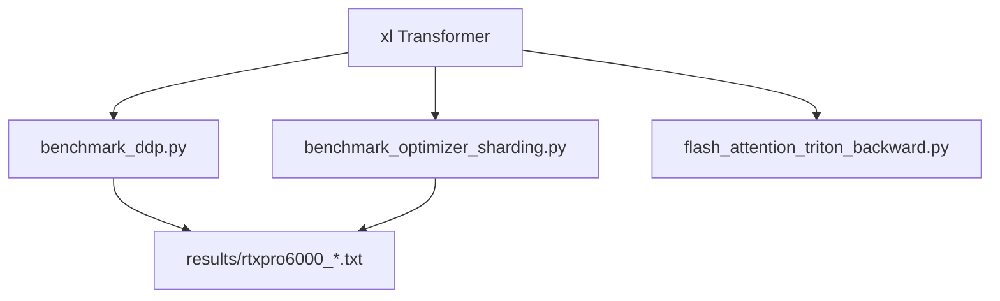

# Distributed Training, Sharding, and Triton Attention

Custom DDP, FSDP-style sharding, optimizer-state sharding, and a Triton attention forward and backward kernel. The assignment scaffolding and tests come from Stanford CS336. The implementations and the saved RTX PRO 6000 measurements are mine.

The two headline rows were checked against `results/rtxpro6000_naive_ddp.txt`, `results/rtxpro6000_overlap_ddp.txt`, and `results/rtxpro6000_optimizer_sharding_accounting.txt`. These benchmarks were not rerun for this page. The same numbers are in the repository root `results/systems_results.csv`.

## Problem

Replace stock distributed-training pieces and measure what changes:

1. Average gradients with a custom DDP wrapper, including a version that overlaps per-parameter communication with backward.
2. Shard parameters and optimizer state so rank 0 does not hold a full AdamW state.
3. Implement attention forward and backward in Triton.

## Personal contribution

- `cs336_systems/ddp.py`: naive per-parameter all-reduce and overlap with backward.
- `cs336_systems/fsdp.py`: parameter sharding across the forward and backward pass.
- `cs336_systems/optimizer_state_sharding.py`: AdamW state sharded across ranks.
- `cs336_systems/flash_attention.py` and `flash_attention_triton_backward.py`: Triton attention forward and backward.

These files are the completed implementations. The course `cs336-basics` package in this directory is the staff language-model code used as a starting point.

## Workflow

## Key results

| Result | Model | Baseline | Dataset | Seeds | GPU | Evaluation |
|---|---|---|---|---|---|---|
| DDP overlap, **1,225.548 → 1,022.0085 ms/step (−16.6%)** | Custom overlap DDP. xl shape in the log: vocab 10,000, `d_model=2560`, 32 layers, 32 heads, `d_ff=10240`, context 512, about 3.406B parameters. | Custom naive DDP in the same script. This is not native PyTorch DDP. Naive grad-sync time is 576.8879 ms/step, 47.07% of the step. | Synthetic. Loss is `logits.mean()`. | One timing run. Warmup 5, measure 10. | 2× RTX PRO 6000 Blackwell Server Edition. PyTorch 2.11.0+cu128, NCCL, conda base. | `python cs336_systems/benchmark_ddp.py --mode naive --world_size 2 --backend nccl` and the same command with `--mode overlap_params`. Global batch 4, local batch 2. A step is zero_grad, forward, backward, per-parameter all-reduce, and AdamW. Overlap launches communication during backward. |
| Optimizer-state sharding, rank-0 cumulative peak **63.756 → 44.850 GiB (−29.7%)** | Sharded AdamW state on the same xl shape. | Unsharded AdamW in a separate microbenchmark. | Synthetic forward and backward. Gradients are not all-reduced. | One accounting run. | Same 2× RTX PRO 6000 Blackwell Server Edition, PyTorch 2.11.0+cu128, NCCL. | `python -m cs336_systems.benchmark_optimizer_sharding`. Context 512, global batch 4, local batch 2. Mean step time rises **639.069 → 827.633 ms (+29.5%)**. |

The sharding run does not all-reduce gradients, so the memory drop does not by itself show the same convergence in synchronized training. Selected attention tests passing does not cover every dtype, shape, and causal branch.

## Code entry points

| Component | Path |
|---|---|
| Naive and overlap DDP | `cs336_systems/ddp.py` |
| DDP benchmark | `cs336_systems/benchmark_ddp.py` |
| FSDP-style sharding | `cs336_systems/fsdp.py` |
| Optimizer-state sharding | `cs336_systems/optimizer_state_sharding.py` |
| Sharding benchmark | `cs336_systems/benchmark_optimizer_sharding.py` |
| Triton attention | `cs336_systems/flash_attention.py`, `cs336_systems/flash_attention_triton_backward.py` |
| Saved DDP logs | `results/rtxpro6000_naive_ddp.txt`, `results/rtxpro6000_overlap_ddp.txt` |
| Saved sharding log | `results/rtxpro6000_optimizer_sharding_accounting.txt` |
| Handout | `cs336_assignment2_systems.pdf` |

## Setup

Dependencies are managed with `uv`. From this directory, `uv run python` installs the environment and can import `cs336_basics`. Run a benchmark with the commands in the table above, on two GPUs with NCCL. To run the course tests and pack a submission tarball, use `./test_and_make_submission.sh`.
