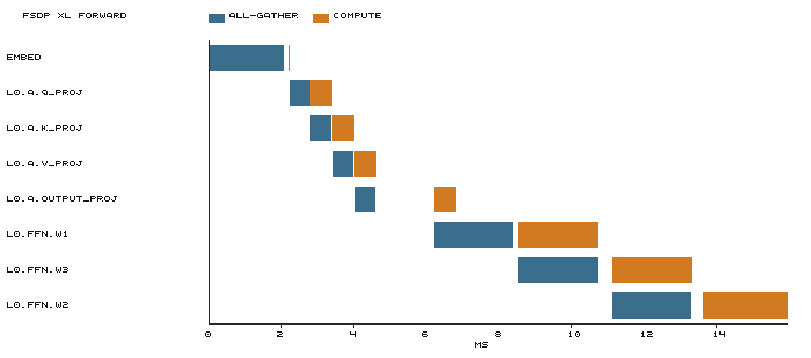

# CS336 Assignment 2 — Graded problems and answers

Source: `cs336_assignment2_systems.pdf`, Version 26.1.3. This note keeps every handout item marked **Problem (…)**, plus the optional **4.2.3** item that still asks for an implementation or a written answer. Section numbers stay as in the handout (for example `2.1.3`) along with the problem id (for example `benchmarking_script`). The problem statements follow the English handout, with page breaks and hyphenation removed and the meaning unchanged.

**Submission (handout page 1)**

- `writeup.pdf`: written answers
- `code.zip`: code, packed with `./test_and_make_submission.sh`

**Default model sizes (Table 1, §2.1.2)**

| Size | d_model | d_ff | num_layers | num_heads |
| --- | --- | --- | --- | --- |
| small | 768 | 3072 | 12 | 12 |
| medium | 1024 | 4096 | 24 | 16 |
| large | 1280 | 5120 | 36 | 20 |
| xl | 2560 | 10240 | 32 | 32 |
| 10B | 4608 | 12288 | 50 | 36 |

Unless noted otherwise, the vocabulary size is 10,000, the batch size is 4, and the context length is 512.

---

## 2 Profiling and Benchmarking

### 2.1.3 End-to-End Benchmarking

#### Problem (`benchmarking_script`): Benchmarking Script (4 points)

**(a)** Write a script to perform basic end-to-end benchmarking of the forward pass, backward pass, and optimizer step in your model. Specifically, your script should support the following:

- Given hyperparameters (e.g., number of layers), initialize a model.
- Generate a random batch of data.
- Run \(w\) warm-up steps (before you start measuring time), then time the execution of \(n\) steps (either only forward, forward and backward, or forward and backward with optimizer step, depending on an argument). For timing, you can use the Python `timeit` module (e.g., either using the `timeit` function, or using `timeit.default_timer()`, which gives you the system’s highest resolution clock, thus a better default for benchmarking than `time.time()`).
- Call `torch.cuda.synchronize()` after each step.

**Deliverable:** A script that will initialize a basics Transformer model with the given hyperparameters, create a random batch of data, and time forward-only, forward-and-backward, and full training steps that include the optimizer step.

**Answer (a)**

Implementation: `cs336_systems/benchmark_lm.py`. Three modes, `--mode forward` / `forward_backward` / `train`. `--timing total` times the whole step. `--timing stages` splits forward, loss, backward, and the optimizer, with `torch.cuda.synchronize()` between stages. Timing uses `timeit.default_timer`. `zero_grad` is not timed.

**(b)** Time the forward, backward, and optimizer step for the model sizes described in Section 2.1.2. Use 5 warmup steps and compute the average and standard deviation of timings over 10 measurement steps. How long does a forward pass take? How about a backward pass? Do you see high variability across measurements, or is the standard deviation small?

**Deliverable:** A 1-2 sentence response with your timings.

**Answer (b)**

Hardware: AutoDL, 1× NVIDIA RTX PRO 6000 Blackwell Server Edition (94.97 GiB). PyTorch 2.11.0+cu128, CUDA 12.8. Setup: batch 4, context 512, FP32, `torch.optim.AdamW`, `lr=1e-3`, seed 42, 5 warmup steps, 10 measured steps. `--mode train --timing stages`. The standard deviation is `pstdev`. Logs: `results/bench213_*_train_stages.json`.

| Model | Parameters | Forward mean ± std (ms) | Backward mean ± std (ms) | Optimizer mean ± std (ms) | Peak allocated / reserved (MiB) | Status |
| --- | ---: | ---: | ---: | ---: | ---: | --- |
| small | 128,625,408 | 19.529 ± 1.004 | 34.579 ± 0.674 | 8.014 ± 0.074 | 5144.79 / 5414.00 | OK |
| medium | 423,183,360 | 46.582 ± 0.041 | 95.566 ± 0.064 | 24.084 ± 0.060 | 14048.74 / 14518.00 | OK |
| large | 969,411,840 | 110.908 ± 0.044 | 217.942 ± 0.225 | 54.783 ± 0.108 | 28147.39 / 29786.00 | OK |
| xl | 3,406,809,600 | 328.710 ± 0.051 | 596.236 ± 0.682 | 188.441 ± 0.102 | 67110.95 / 71504.00 | OK |
| 10B | 12,832,823,808 | OOM | OOM | OOM | — | warmup step 1, forward QK `einsum`: tried to allocate another 144.00 MiB; GPU 94.97 GiB, process about 94.90 GiB, PyTorch allocated about 93.74 GiB |

From small through xl, backward is 1.77–2.05× the forward. Relative standard deviations for medium, large, and xl stay under 0.2% in every stage. The small forward is 19.529 ± 1.004 ms, about 5.1% relative, still a small swing. 10B never reached the measurement loop. The sum of the stages is not an end-to-end time.

**(c)** One caveat of benchmarking is not performing the warm-up steps. Repeat your analysis without the warm-up steps. How does this affect your results? Why do you think this happens? Also try to run the script with 1 or 2 warm-up steps. Why might the result still be different?

**Deliverable:** A 2-3 sentence response.

**Answer (c)**

Same RTX PRO 6000, `--mode train --timing total`, batch 4, context 512, FP32, `lr=1e-3`, 10 measured steps. Each warmup setting is a separate process. 10B already OOM'd on the forward in (b), so warmup was not swept for it.

| Model | warmup | Mean (ms) | Std (ms) | First step (ms) |
| --- | ---: | ---: | ---: | ---: |
| small | 0 | 113.733 | 158.246 | 588.470 |
| small | 1 | 60.735 | 0.896 | (excluded) |
| small | 2 | 60.242 | 0.953 | (excluded) |
| small | 5 | 60.631 | 1.501 | (excluded) |
| medium | 0 | 216.291 | 153.975 | 678.209 |
| medium | 1 | 164.801 | 0.714 | (excluded) |
| medium | 2 | 164.752 | 0.183 | (excluded) |
| medium | 5 | 164.578 | 0.084 | (excluded) |
| large | 0 | 426.982 | 137.915 | 840.725 |
| large | 1 | 380.608 | 0.259 | (excluded) |
| large | 2 | 380.296 | 0.088 | (excluded) |
| large | 5 | 380.298 | 0.038 | (excluded) |
| xl | 0 | 1154.952 | 137.064 | 1566.143 |
| xl | 1 | 1109.815 | 0.236 | (excluded) |
| xl | 2 | 1109.790 | 0.267 | (excluded) |
| xl | 5 | 1110.123 | 0.426 | (excluded) |

With no warmup, the first step inflates both the mean and the standard deviation. The small first step is 588.470 ms and later steps are about 60–61 ms. Medium is 678.209 versus about 164 ms, large 840.725 versus about 381 ms, and xl 1566.143 versus about 1109 ms. The first step is about 450–530 ms slower than what follows, and that gap does not scale with model size. That matches one-time cost from the first CUDA library call, the caching allocator, and lazy AdamW state initialization. With `warmup-steps=0` the script also notes that the first step initializes optimizer state. After one warmup step the standard deviation is already about 0.2–0.9 ms, and the mean is close to five warmup steps. A second warmup step does not guarantee a further drop. For small, warmup 5 has standard deviation 1.501 ms, higher than warmup 1. For xl, warmup 5 averages 1110.123 ms, slightly above warmup 1 at 1109.815 ms. Separate processes still differ a little in cache, clocks, and load.

---

### 2.1.4 Nsight Systems Profiler

#### Problem (`nsys_profile`): Nsight Systems Profiling (5 points)

Profile your forward pass, backward pass, and optimizer step using `nsys` with two model sizes from Table 1 of your choice as well as three power-of-two context lengths larger than 128, where the largest available size should be the longest context length you can fit in memory. Pick the combinations you think would be the most interesting to look at. For each profile answer the following questions:

Hardware matches 2.1.3: AutoDL, 1× RTX PRO 6000, PyTorch 2.11.0+cu128, Nsight Systems 2026.5.1. Models are Table 1 medium and large, batch 4, FP32. Medium context lengths are 512 / 1024 / 2048. Large context lengths are 256 / 512 / 1024. A 2026-09-16 probe showed that large, context 2048, batch 4, FP32 train OOMs, so the longest large setting is 1024. Train: `--mode train --timing total --nvtx --warmup-steps 1 --measurement-steps 1 --optimizer-class cs336_basics.optimizer:AdamW`. Inference: `--mode forward --inference`, otherwise the same. Capture is the `measurement` range. Reports and csv files are in `nsys214/`. The medium@512 train was recaptured in the same session after the GPU was already warm. The `:backward` GPU projection is only about 0.0008 ms in all six runs, so it is not used below.

**(a)** What is the total time spent on your forward pass? Does it match what we had measured before with the Python standard library?

**Deliverable:** A 1-2 sentence response.

**Answer (a)**

Forward time is the `:forward` Total Proj Time in the train `*_nvtx_gpu_proj_sum.csv` files, converted from nanoseconds to milliseconds. Context 512 is compared with the 2.1.3 staged forward from this run. The other lengths were not remeasured here. They are compared with the 2026-09-17 forward-total on the same GPU, without nsys.

| Model / length | GPU projected forward (ms) | GPU ops | CPU NVTX forward (ms) | Python forward (ms) | Projection vs Python |
| --- | ---: | ---: | ---: | ---: | --- |
| medium / 512 | 49.769 | 1424 | 44.283 | 46.582 ± 0.041 | about 6.8% higher |
| medium / 1024 | 138.913 | 1376 | 35.768 | 136.481 ± 0.102 | about 1.8% higher |
| medium / 2048 | 398.063 | 1376 | 101.073 | 397.178 ± 0.091 | about 0.2% higher |
| large / 256 | 58.026 | 2060 | 47.277 | 57.095 ± 0.069 | about 1.6% higher |
| large / 512 | 113.336 | 2060 | 71.247 | 110.908 ± 0.044 | about 2.2% higher |
| large / 1024 | 305.865 | 1916 | 141.095 | 305.633 ± 0.041 | about 0.1% higher |

All six GPU projections are the same order of magnitude as the synchronized Python forward. The largest gap is 6.8% at medium@512. The rest are at most 2.2%. The gap is a single nsys capture versus a 10-step mean. CPU NVTX is much shorter on long sequences. That is unsynchronized launch wall time, not the forward total.

**(b)** What CUDA kernel takes the most cumulative GPU time during the forward pass? How many times is this kernel invoked during a single forward pass of your model? Is it the same kernel that takes the most runtime when you do both forward and backward passes? (Hint: look at the “CUDA GPU Kernel Summary” under “Stats System View”, and filter using NVTX ranges to identify which parts of the model are responsible for which kernels.)

**Deliverable:** A 1-2 sentence response.

**Answer (b)**

Forward kernels come from `*_inference_all_cuda_gpu_kern_sum.csv`. Forward plus backward uses the train `*_nvtxname_cuda_gpu_kern_sum_nvtx-name.csv`: drop `optimizer/` rows, then merge kernel names after stripping the NVTX prefix.

| Model / length | Top forward kernel | ms / calls | Top forward+backward, excluding optimizer | ms / calls | Same kernel |
| --- | --- | ---: | --- | ---: | --- |
| medium / 512 | cutlass `sgemm_256x128_8x4_tn` | 26.271 / 144 | same tn GEMM | 26.297 / 144 | yes |
| medium / 1024 | cutlass `sgemm_128x256_8x4_tn` | 60.708 / 169 | same tn GEMM | 61.121 / 169 | yes |
| medium / 2048 | cutlass `sgemm_128x256_8x4_tn` | 82.292 / 72 | elementwise Mul | 148.709 / 388 | no |
| large / 256 | cutlass `sgemm_128x256_8x4_tn` | 32.606 / 109 | cutlass `sgemm_256x128_8x4_nn` | 36.198 / 253 | no |
| large / 512 | cutlass `sgemm_128x256_8x4_tn` | 83.630 / 253 | same tn GEMM | 83.679 / 253 | yes |
| large / 1024 | cutlass `sgemm_128x256_8x4_tn` | 159.995 / 253 | same tn GEMM | 160.646 / 253 | yes |

The top cumulative forward kernel is a GEMM in all six runs. After adding backward, four runs still have that same tn GEMM. medium@2048 switches to an elementwise multiply, and large@256 switches to an `nn` GEMM. Both of those remain after dropping `optimizer/` rows, so they come from the backward pass.

**(c)** Although the vast majority of FLOPs take place in matrix multiplications, you will notice that several other kernels still take a non-trivial amount of the overall runtime. What other kernels besides matrix multiplies do you see accounting for non-trivial CUDA runtime in the forward pass?

**Deliverable:** A 1-2 sentence response.

**Answer (c)**

Non-GEMM means kernels in the inference table whose names do not contain `gemm`, `cutlass`, or `sgemm`. The table lists only entries with `Time (%) ≥ 1%`. The combined share is relative to Total Time of every kernel in that table.

| Model / length | Non-GEMM total | Non-matmul ops with `Time (%) ≥ 1%` |
| --- | ---: | --- |
| medium / 512 | 20.3% | Mul 2.6% / 1.5% / 1.2%; Add 2.2% / 1.2%; Div 2.1%; where 2.1%; exp 1.5%; copy 1.1%; reduce Max 1.0% |
| medium / 1024 | 46.6% | where 6.4%; Mul 6.1% / 3.2% / 1.6%; exp 6.1%; Div 5.9%; Add 5.9%; reduce Sum 4.1%; reduce Max 4.1% |
| medium / 2048 | 60.1% | where 8.9%; Mul 8.8% / 3.2% / 1.3%; Div 8.8%; exp 8.7%; Add 8.7%; reduce Max 4.6%; reduce Sum 4.6% |
| large / 256 | 12.9% | Mul 2.4% / 1.3%; Add 1.0% |
| large / 512 | 20.2% | Div 2.5%; Add 2.5% / 1.0%; where 2.4%; exp 2.3%; Mul 2.1% / 1.9% / 1.3% |
| large / 1024 | 40.0% | where 5.4%; Mul 5.2% / 3.2% / 1.4%; exp 5.2%; Div 5.1%; Add 5.1%; reduce Sum 3.3%; reduce Max 3.3% |

These kernels come from an unfused softmax, the causal mask, normalization, and elementwise scaling. Longer sequences raise the non-GEMM share. At medium@2048, non-GEMM is already 60.1%, above GEMM.

**(d)** Profile running one complete training step with your implementation of AdamW (i.e., the forward pass, computing the loss and running a backward pass, and finally an optimizer step, as you’d do during training). How does the fraction of time spent on matrix multiplication change, compared to doing inference (forward pass only)? How about other kernels?

**Deliverable:** A 1-2 sentence response.

**Answer (d)**

Shares use the sum of Total Time in `cuda_gpu_kern_sum` as the denominator. GEMM still means a name containing `gemm`, `cutlass`, or `sgemm`. Inference is forward only, with autograd off. Train is one full step: loss, backward, and the course AdamW.

| Model / length | Inference GPU total (ms) | Inference GEMM / other | Full step GPU total (ms) | Step GEMM / other | GEMM share change (points) |
| --- | ---: | --- | ---: | --- | ---: |
| medium / 512 | 48.024 | 79.7% / 20.3% | 160.872 | 61.0% / 39.0% | −18.7 |
| medium / 1024 | 136.893 | 53.4% / 46.6% | 433.701 | 45.2% / 54.8% | −8.2 |
| medium / 2048 | 396.685 | 39.9% / 60.1% | 1246.274 | 34.4% / 65.6% | −5.5 |
| large / 256 | 55.603 | 87.1% / 12.9% | 196.020 | 61.7% / 38.3% | −25.4 |
| large / 512 | 111.707 | 79.8% / 20.2% | 368.156 | 60.6% / 39.4% | −19.2 |
| large / 1024 | 304.127 | 60.0% / 40.0% | 920.304 | 50.1% / 49.9% | −9.9 |

The GEMM share falls in all six runs, and the other-kernel share rises. Backward increases absolute GEMM time, but elementwise ops, reductions, and AdamW moment updates grow faster, so matrix multiplication is a smaller fraction of the step. The drop is larger on short sequences (25.4 points at large@256). The optimizer here is `cs336_basics.optimizer.AdamW`. Its milliseconds are not comparable to the `torch.optim.AdamW` numbers in 2.1.3.

**(e)** Compare the runtime of the softmax operation versus the matrix multiplication operations within the self-attention layer of your model during a forward pass. How does the difference in runtimes compare to the difference in FLOPs?

**Deliverable:** A 1-2 sentence response.

**Answer (e)**

Train `*_nvtxname_*` rows are grouped by the innermost NVTX range. Matmul counts only GEMMs inside `scores_matmul` and `attention_final_matmul`. Softmax counts every kernel under `attention_softmax`. Medium has 24 layers and large has 36. Both use head dimension \(d_h=64\).

| Model / length | QKᵀ GEMM (ms) | PV GEMM (ms) | Both matmuls (ms) | softmax (ms) | softmax / both matmuls |
| --- | ---: | ---: | ---: | ---: | ---: |
| medium / 512 | 1.675 | 1.327 | 3.002 | 3.549 | 1.182 |
| medium / 1024 | 6.655 | 6.004 | 12.659 | 35.793 | 2.828 |
| medium / 2048 | 24.605 | 19.572 | 44.177 | 140.698 | 3.185 |
| large / 256 | 0.861 | 0.674 | 1.535 | 1.842 | 1.200 |
| large / 512 | 2.926 | 2.633 | 5.558 | 9.528 | 1.714 |
| large / 1024 | 11.946 | 10.461 | 22.406 | 66.820 | 2.982 |

The two attention matmuls in a layer are about \(4BHL^2 d_h\) FLOPs. Softmax is \(O(BHL^2)\), so the matmul FLOP count is about \(4d_h=256\) times larger. On the GPU, softmax still takes 1.18–3.19× the two GEMMs. That reverses the FLOP ratio. An unfused softmax rereads the score matrix and launches several kernels, so time is set by bandwidth and launch overhead. The gap grows with sequence length.

---

### 2.1.5 Mixed Precision

#### Problem (`mixed_precision_accumulation`): Mixed-Precision Accumulation (1 point)

Run the following code and comment on the accuracy of the results.

```python
s = torch.tensor(0, dtype=torch.float32)
for i in range(1000):
    s += torch.tensor(0.01, dtype=torch.float32)
print(s)

s = torch.tensor(0, dtype=torch.float16)
for i in range(1000):
    s += torch.tensor(0.01, dtype=torch.float16)
print(s)

s = torch.tensor(0, dtype=torch.float32)
for i in range(1000):
    s += torch.tensor(0.01, dtype=torch.float16)
print(s)

s = torch.tensor(0, dtype=torch.float32)
for i in range(1000):
    x = torch.tensor(0.01, dtype=torch.float16)
    s += x.type(torch.float32)
print(s)
```

**Deliverable:** A 2-3 sentence response.

**Answer**

Ran `python -m cs336_systems.mixed_precision_accumulation` on AutoDL with PyTorch 2.11.0. The exact value is \(1000 \times 0.01 = 10\).

| Experiment | Accumulator | Each 0.01 addend | Run output |
| --- | --- | --- | --- |
| 1 | FP32 | FP32 | `tensor(10.0001)` |
| 2 | FP16 | FP16 | `tensor(9.9531, dtype=torch.float16)` |
| 3 | FP32 | FP16 | `tensor(10.0021)` |
| 4 | FP32 | Built as FP16, then `.type(float32)` | `tensor(10.0021)` |

FP32 accumulation is closest to 10. FP16 accumulation rounds the running sum back to FP16 on every add, so the error is largest and the result is 9.9531. The last two both accumulate in FP32, so they match each other and beat full FP16; `0.01` is already about 0.010002136 once it is created as FP16, and `.type(torch.float32)` cannot recover the lost precision.

#### Problem (`benchmarking_mixed_precision`): Benchmarking Mixed Precision (2 points)

**(a)** Consider the following model:

```python
class ToyModel(nn.Module):
    def __init__(self, in_features: int, out_features: int):
        super().__init__()
        self.fc1 = nn.Linear(in_features, 10, bias=False)
        self.ln = nn.LayerNorm(10)
        self.fc2 = nn.Linear(10, out_features, bias=False)
        self.relu = nn.ReLU()
    def forward(self, x):
        x = self.relu(self.fc1(x))
        x = self.ln(x)
        x = self.fc2(x)
        return x
```

Suppose we are training the model on a GPU and that the model parameters are originally in FP32. We’d like to use autocasting mixed precision with FP16. What are the data types of:

- the model parameters within the autocast context?
- the output of the first feed-forward layer (`ToyModel.fc1`)?
- the output of layer norm (`ToyModel.ln`)?
- the model’s predicted logits?
- the loss?
- the model’s gradients?

**Deliverable:** The data types for each of the components listed above.

**Answer (a)**

Parameters start in FP32 and the GPU uses FP16 autocast. Autocast chooses compute precision per op and does not convert parameters to FP16. The loss is the `cross_entropy` computed inside the autocast region.

| Object | dtype |
| --- | --- |
| Model parameters inside autocast | `torch.float32` |
| `fc1` output | `torch.float16` |
| LayerNorm output | `torch.float32` |
| logits (`fc2` output) | `torch.float16` |
| loss | `torch.float32` |
| Parameter gradients | `torch.float32` |

**(b)** You should have seen that FP16 mixed precision autocasting treats the layer normalization layer differently than the feed-forward layers. What parts of layer normalization are sensitive to mixed precision? If we use BF16 instead of FP16, do we still need to treat layer normalization differently? Why or why not?

**Deliverable:** A 2-3 sentence response.

**Answer (b)**

The precision-sensitive parts of LayerNorm are the mean and variance reductions, and the squares and reciprocal square root after subtracting the mean: FP16 has a narrow exponent range, so small variances and large-magnitude intermediates easily underflow or overflow. BF16 has the same exponent range as FP32, which reduces overflow, but the mantissa is only 7 bits, so reduction rounding remains; the whole LayerNorm still should not be run in pure BF16, and the statistics should still be computed in higher precision.

**(c)** Modify your benchmarking script to optionally run the model using mixed precision with BF16. Time the forward and backward passes with and without mixed-precision for each language model size described in Section 2.1.2. Compare the results of using full precision versus mixed precision, and comment on any trends as model size changes. You may find the `nullcontext` no-op context manager to be useful.

**Deliverable:** A 2-3 sentence response with your timings and commentary.

**Answer (c)**

Same RTX PRO 6000. Rerun on 2026-09-29. `--precision bf16`: parameters stay FP32, `torch.autocast(..., dtype=torch.bfloat16)` wraps forward and loss, and backward is outside autocast. Same protocol as 2.1.3 (b): `--mode train --timing stages`, batch 4, context 512, `torch.optim.AdamW`, `lr=1e-3`, `weight_decay=0.01`, seed 42, warmup 5, measure 10. Standard deviation is `pstdev`. Speedup is FP32 mean / BF16 mean. FP32 still uses `results/bench213_*_train_stages.json`. BF16 uses `results/bench215_{small,medium,large,xl}_bf16_train_stages_rerun.json`. The earlier `bench215_*_bf16_train_stages.json` files are a different measurement and are not used in the table below.

| Model | FP32 forward (ms) | BF16 forward (ms) | Forward speedup | FP32 backward (ms) | BF16 backward (ms) | Backward speedup |
| --- | ---: | ---: | ---: | ---: | ---: | ---: |
| small | 19.529 ± 1.004 | 21.190 ± 3.281 | 0.92× | 34.579 ± 0.674 | 36.511 ± 2.664 | 0.95× |
| medium | 46.582 ± 0.041 | 30.123 ± 5.094 | 1.55× | 95.566 ± 0.064 | 63.970 ± 5.475 | 1.49× |
| large | 110.908 ± 0.044 | 41.843 ± 1.166 | 2.65× | 217.942 ± 0.225 | 114.508 ± 0.552 | 1.90× |
| xl | 328.710 ± 0.051 | 102.389 ± 0.248 | 3.21× | 596.236 ± 0.682 | 241.820 ± 0.224 | 2.47× |
| 10B | OOM | OOM | — | OOM | OOM | — |

small has no speedup on forward or backward; BF16 is slightly slower than FP32. From medium to xl, forward speedup rises from 1.55× to 3.21× and backward from 1.49× to 2.47×, so larger models benefit more. The medium forward 10 runs jump between 23.5–35.3 ms, standard deviation 5.094 ms; backward standard deviation is 5.475 ms, so those two cells should not be over-read. 10B OOMs on the first warmup forward at `v_proj` `einsum`: tried to allocate another 42.00 MiB; GPU 94.97 GiB, process about 94.92 GiB, PyTorch allocated about 93.59 GiB. Parameters and AdamW state remain FP32; BF16 only reduces activations, which is not enough to fit 10B.

---

### 2.1.6 Profiling Memory

#### Problem (`memory_profiling`): Memory Profiling (4 points)

Profile your complete training step of forward pass, backward pass, and optimizer step of the xl model from Table 1 with context lengths of 128 and 2048.

**(a)** Add an option to your profiling script to run your model through the memory profiler.

It may be helpful to reuse some of your previous infrastructure (e.g., to activate mixed-precision, load specific model sizes, etc). Then, run your script to get a memory profile of the xl model when either doing inference only (just forward pass) or a full training step. What do your memory timelines look like? Can you tell which stage is running based on the peaks you see?

**Deliverable:** Two images of the “Active memory timeline” of an xl model, from the memory_viz tool: one for the forward pass, and one for running a full training step (forward and backward passes, then optimizer step), and a 2-3 sentence response.

**Answer (a)**

Screenshots use `mem216/xl_128_fp32_fwd.pickle` and `mem216/xl_128_fp32_train.pickle` (xl, batch 4, context 128, FP32, warmup 1, measure 1). The context-2048 train OOMs during warmup, so there is no timeline. Recording starts at `.to("cuda")`, so the first about 2.3 s of the plot is parameters moving onto the GPU, not the measurement step.

Forward-only is a flat band of about 12.7 GiB after parameters are resident, with a measured peak of 12.91 GiB that almost coincides with parameter occupancy; per-layer structure is not visible, and warmup cannot be told from measurement. The full training step keeps rising after parameters: warmup builds AdamW state, so 51.16 GiB is already allocated before measurement; the measured step spikes to 63.99 GiB, then `zero_grad(set_to_none=True)` drops the gradients and usage returns to about 38 GiB. Forward-only versus a full step can therefore be distinguished, but backward and the optimizer cannot be separated from peak shape alone.


**(b)** What is the peak memory usage of each context length when doing a forward pass? What about when doing a full training step?

**Deliverable:** A table with two numbers per context length.

**Answer (b)**

xl, batch 4, FP32, warmup 1, measure 1. Peak is `max_memory_allocated` over the measurement interval; GiB = MiB / 1024. Pickles are in `/root/autodl-tmp/mem216/`.

| Context length | Forward-only peak allocated | Full training-step peak allocated |
| --- | ---: | ---: |
| 128 | 13217.80 MiB (12.91 GiB) | 65528.13 MiB (63.99 GiB) |
| 2048 | 21810.46 MiB (21.30 GiB) | OOM |

The 2048 train OOMs on the first warmup forward at the QK `einsum`: tried to allocate another 2.00 GiB; GPU 94.97 GiB, process about 94.24 GiB, PyTorch allocated about 91.60 GiB. That 2 GiB matches the size of the FP32 attention scores `(4, 32, 2048, 2048)`. There is no pickle.

**(c)** Find the peak memory usage of the xl model when using mixed-precision, for both a forward pass and a full training step. Does mixed-precision significantly affect memory usage?

**Deliverable:** A 2-3 sentence response.

**Answer (c)**

Same configuration, `--precision bf16`: parameters stay FP32, autocast wraps forward and loss.

| Length | Precision | Forward-only peak allocated | Full training-step peak allocated |
| --- | --- | ---: | ---: |
| 128 | FP32 | 12.91 GiB | 63.99 GiB |
| 128 | BF16 | 19.14 GiB (19604.13 MiB) | 63.92 GiB (65451.55 MiB) |
| 2048 | FP32 | 21.30 GiB | OOM (QK `einsum`, 2.00 GiB) |
| 2048 | BF16 | 25.35 GiB (25960.96 MiB) | OOM (softmax `exp`, 2.00 GiB) |

BF16 does not clearly lower the peak. The context-128 full training step goes from 63.99 GiB to 63.92 GiB. Forward-only actually rises: 128 from 12.91 to 19.14 GiB, 2048 from 21.30 to 25.35 GiB. Parameters and AdamW state remain FP32, and autocast also leaves a BF16 weight copy. The 2048 train OOMs on the warmup forward under both precisions.

**(d)** Consider the xl model. Given our reference hyperparameters, what is the size of a tensor of activations in the Transformer residual stream, in single-precision? Give this size in MiB (i.e., divide the number of bytes by \(1024^2\)).

**Deliverable:** A 1-2 sentence response with your derivation.

**Answer (d)**

A residual-stream activation has shape \((B, L, d_{\mathrm{model}})\). For xl, take \(B=4\), \(d_{\mathrm{model}}=2560\), and 4 bytes per FP32 element:

\[
\frac{4 \times L \times 2560 \times 4}{1024^2} = 0.0390625\,L\ \mathrm{MiB}.
\]

The default \(L=512\) from 2.1.3 is **20 MiB**. This problem’s \(L=128\) and \(L=2048\) are **5 MiB** and **80 MiB**. That is a single tensor, not the sum of saved tensors across layers.

**(e)** Now look closely at the “Active Memory Timeline” from pytorch.org/memory_viz of a memory snapshot of the xl model doing a forward pass. When you reduce the “Detail” level, the tool hides the smallest allocations to the corresponding level (e.g., putting “Detail” at 10% only shows the 10% largest allocations). What is the size of the largest allocations shown? Looking through the stack trace, can you tell where those allocations come from?

**Deliverable:** A 1-2 sentence response.

**Answer (e)**

On the forward-only timeline of `mem216/xl_128_fp32_fwd.pickle`, after lowering Detail the largest blocks are **100.0 MiB** (104857600 bytes), with 96 of them live at once. The stack points to `model.to("cuda")` in `build_model_and_batch` in `benchmark_lm.py`, via `Module.to` → `_apply`. \(2560 \times 10240 \times 4 = 100\) MiB; these are the three SwiGLU weight matrices per layer, 32 layers, not residual activations (only 5 MiB at \(L=128\)).

The figure below searches `build_model_and_batch` in the memory_viz stack and opens one of the 100.0 MiB allocations. The call stack ends at `model.to` in `benchmark_lm.py:407`.


**(f)** Nsight Systems also has flags for memory profiling. You can combine these with the Nsight flags from before to understand what allocations are happening at different steps in your model’s lifespan. Use the PyTorch-provided NVTX labels to determine how much memory is saved for backward (these tensors are often called residuals) by a single TransformerBlock in your model. Note the 5 largest contributing operations, and what percentage of the overall memory they contribute.

During the backward pass, all these tensors will be freed, but new gradient tensors are emitted at the same time. Based on your profiles showing how much memory was allocated during the forward pass, and how much memory usage changes for every TransformerBlock in the backward pass, calculate how much memory the produced gradient tensors for a TransformerBlock take. Does the result match what you expect?

**Deliverable:** Screenshots from Nsight Systems and a 1-2 paragraph response.

**Answer (f)**

Setup: xl, batch 4, context 128, FP32, `--mode train`, warmup 1, measure 1. Report `nsys216/xl_128_fp32_train_mem.nsys-rep` (`--cuda-memory-usage true`, `--pytorch functions-trace,autograd-nvtx`, `PYTORCH_NO_CUDA_MEMORY_CACHING=1`, capture only `measurement`). The figure below is that interval in Nsight Systems: forward about 328 ms, backward about 792 ms, AdamW about 233 ms.


The forward NVTX of `BasicsTransformerLM.layers.0` lasts 10.68 ms. CUDA Memory Usage around that interval rises from 39025.67 MiB to 39191.87 MiB, a net **\(S=166.21\) MiB**. Forward net increase is the same for `layers.15` and `layers.31`. 32 layers \(\times 166.21\) MiB \(=5.20\) GiB, which matches the full `forward` rise from 38.11 GiB to 43.33 GiB (\(+5.23\) GiB). Inside the interval, the five largest allocations that remain until backward are all **20.00 MiB** (\(4 \times 128 \times 10240\) FP32, i.e. SwiGLU activations):

| Rank | Operation | Size (MiB) | Share of \(S\) |
| --- | --- | ---: | ---: |
| 1 | `aten::bmm` | 20.00 | 12.0% |
| 2 | `aten::sigmoid` | 20.00 | 12.0% |
| 3 | `aten::mul` | 20.00 | 12.0% |
| 4 | `aten::bmm` | 20.00 | 12.0% |
| 5 | `aten::mul` | 20.00 | 12.0% |

The five sum to 100.00 MiB, 60.2% of \(S\). All five are freed only after that layer’s forward ends.

In the window where the same layer’s backward frees those saved tensors, memory net-increases \(\Delta M=+233.81\) MiB (same for `layers.0`, `layers.15`, and `layers.31`). Gradient occupancy is taken as \(G=\Delta M+S=233.81+166.21=400.02\) MiB. With no bias, one block has \(P=4d^2+3d\,d_{\mathrm{ff}}+2d=104862720\) parameters, so FP32 gradients are \(4P/1024^2=400.02\) MiB. The two match. The measurement step starts with `zero_grad(set_to_none=True)`, so these gradients are reallocated during this backward.

---

## 3 Single-GPU Memory

### 3.2.1 Recomputation

#### Problem (`gradient_checkpointing`): Memory-Optimal Gradient Checkpointing (4 points)

Consider a Transformer with \(N\) identical blocks stacked sequentially. Without any checkpointing, all \(N\) blocks’ worth of residuals are kept alive simultaneously, giving \(O(N)\) peak activation memory. We have a free hand to wrap any subset of the forward pass in `checkpoint`, including nesting checkpoint calls inside one another.

**(a)** What checkpointing strategy minimizes peak activation memory, ignoring the compute cost? Describe how you would arrange the checkpoint calls (a code sketch is fine), and give the asymptotic peak activation memory and compute of your strategy as a function of \(N\). Assume the residuals saved by a single block dominate any per-checkpoint bookkeeping.

**Deliverable:** A 3-5 sentence description of the strategy and its asymptotic peak memory, plus a short code sketch.

**Answer (a)**

Ignoring compute cost, use nested prefix checkpoints: for \(n\) blocks, wrap the first \(n-1\) layers in one `checkpoint` and compute the last layer normally. Each recursive level recomputes its prefix from the same original input; the checkpoint only remembers the entry to that segment, so the input need not be copied again for every prefix. On backward, only the prefix needed by the current layer is recomputed to get that layer’s residuals, and those residuals are freed when that layer’s backward ends. So only a constant number of blocks’ activations are live at once, and peak activation memory is \(O(1)\). Recomputed prefix lengths are \(N-1,N-2,\ldots,1\); together with the original forward and backward, total compute is \(O(N^2)\).

```python
from torch.utils.checkpoint import checkpoint

def memory_minimal_forward(blocks, x):
    def run_prefix(original_x, n):
        if n == 1:
            return blocks[0](original_x)
        h = checkpoint(
            lambda z: run_prefix(z, n - 1),
            original_x,
            use_reentrant=False,
        )
        return blocks[n - 1](h)

    return run_prefix(x, len(blocks))
```

**(b)** Consider the xl model config with batch size 4 and sequence length 2048 as above. If you only have the time/compute budget to run one step of recomputation (meaning you may not nest checkpoint calls), what is the best checkpointing strategy to reduce peak memory? Profile your run’s peak memory to validate your hypothesis. Compare the peak memory of the next smaller and larger checkpointing block sizes to be sure.

**Deliverable:** A 3-5 sentence description of your reasoning along with the measured peak memory for your strategy.

**Answer (b)**

AutoDL RTX PRO 6000 Blackwell Server Edition. Table 1 xl (32 layers, 32 heads), batch 4, context 2048, FP32, eager. `--mode forward_backward` (no AdamW), warmup 1, measure 1. Consecutive \(k\) `TransformerBlock`s are wrapped in one `checkpoint`, `use_reentrant=False`, with no nesting inside a group. Peak is `max_memory_allocated` over the measurement interval. Logs and json: `results/checkpoint_xl_b4_ctx2048_fp32_fwd_bwd_k{1,2,4}_rerun.json`.

| Setting | Checkpoint block size \(k\) | Peak memory (GiB) | Measurement step (ms) |
| --- | --- | ---: | ---: |
| Chosen | 1 | 38.22 (39133.45 MiB) | 6831.952 |
| Next larger | 2 | 44.18 (45238.49 MiB) | 6958.931 |
| One step larger still | 4 | 56.10 (57447.73 MiB) | 7022.659 |

\(k=1\) is the smallest positive integer grouping without nesting, and the next larger block size is \(k=2\). \(k=1\) is lowest. \(k=2\) is 5.96 GiB higher and \(k=4\) is 17.88 GiB higher, about 6 GiB extra per additional live layer. A boundary checkpoint is only \(4\times2048\times2560\) FP32, i.e. 80 MiB, far smaller than the activations left live inside one layer. So this setting checkpoints every layer. \(k\approx\sqrt{32}\) would assume a checkpoint and one layer’s activations are the same order of magnitude, which does not hold here. \(k>4\) was not measured.

---

## 4 GPU Kernels

### 4.1.1 Benchmarking PyTorch Attention

#### Problem (`pytorch_attention`): PyTorch Attention Benchmarking (2 points)

**(a)** Benchmark your attention implementation at different scales. Write a script that will:

- (i) Fix the batch size to 8 and don’t use multihead attention (i.e. remove the head dimension).
- (ii) Iterate through the cartesian product of [16, 32, 64, 128] for the head embedding dimension \(d_{\mathrm{model}}\), and [256, 1024, 4096, 8192, 16384] for the sequence length.
- (iii) Create random inputs \(Q\), \(K\), \(V\) for the appropriate size.
- (iv) Time 100 forward passes through attention using the inputs.
- (v) Measure how much memory is in use before the backward pass starts, and time 100 backward passes.
- (vi) Make sure to warm up, and to call `torch.cuda.synchronize()` after each forward/backward pass.

Depending on your GPU, some of these configurations are expected to run out of memory. Report the timings (or out-of-memory errors) you get for these configurations. At what size do you get out-of-memory errors? Do the accounting for the memory usage of attention in one of the smallest configurations you find that runs out of memory (you can use the equations for memory usage of Transformers from Assignment 1). How does the memory saved for backward change with the sequence length? What would you do to eliminate this memory cost?

**Deliverable:** A table with your timings, your calculations for the memory usage, and a 1-2 paragraph response.

**Answer (a)**

AutoDL 1× NVIDIA RTX PRO 6000 Blackwell Server Edition (94.97 GiB). PyTorch 2.11.0+cu128, CUDA 12.8. `cs336_basics.model.scaled_dot_product_attention`, FP32, TF32 off. batch 8, inputs `(8, L, d)`, no head dimension, `mask=None`. warmup 10, measure 100 forwards and 100 backwards, with `torch.cuda.synchronize()` before and after each. Each configuration is a separate process. Times are the mean of those 100 runs (ms). Memory is the mean of `memory_allocated` before backward over 100 runs (MiB), not reserved and not peak. csv: `results/pytorch_attention_float32_rerun.csv`. All 20 configurations OK.

| d | Length | Forward (ms) | Backward (ms) | Memory before backward (MiB) | Status |
| --- | ---: | ---: | ---: | ---: | --- |
| 16 | 256 | 0.332 | 0.716 | 20.90 | OK |
| 16 | 1024 | 0.210 | 0.602 | 82.84 | OK |
| 16 | 4096 | 4.538 | 11.205 | 1050.62 | OK |
| 16 | 8192 | 17.760 | 44.050 | 4133.00 | OK |
| 16 | 16384 | 69.612 | 173.859 | 16441.75 | OK |
| 32 | 256 | 0.514 | 0.924 | 21.52 | OK |
| 32 | 1024 | 0.196 | 0.558 | 85.34 | OK |
| 32 | 4096 | 4.561 | 11.167 | 1060.62 | OK |
| 32 | 8192 | 17.718 | 43.962 | 4153.00 | OK |
| 32 | 16384 | 69.790 | 174.013 | 16481.75 | OK |
| 64 | 256 | 0.553 | 0.948 | 22.77 | OK |
| 64 | 1024 | 0.211 | 0.496 | 90.34 | OK |
| 64 | 4096 | 4.689 | 11.379 | 1080.62 | OK |
| 64 | 8192 | 18.217 | 44.676 | 4193.00 | OK |
| 64 | 16384 | 71.742 | 176.265 | 16561.75 | OK |
| 128 | 256 | 0.159 | 0.543 | 25.27 | OK |
| 128 | 1024 | 0.469 | 0.882 | 100.34 | OK |
| 128 | 4096 | 5.702 | 13.170 | 1120.62 | OK |
| 128 | 8192 | 22.212 | 51.199 | 4273.00 | OK |
| 128 | 16384 | 88.299 | 203.665 | 16721.75 | OK |

No OOM on this GPU. The largest setting is d=128, L=16384, 16721.75 MiB (16.33 GiB) before backward, below 94.97 GiB. Memory accounting below uses this setting. The 256.00 MiB baseline is Q, K, V, and a preallocated `grad_output`, four `(8, 16384, 128)` FP32 tensors. Before backward there is an extra 16465.75 MiB. Two `(8, L, L)` FP32 score/weight matrices are \(2\times 8\times 16384^{2}\times 4/1024^{2}=16384\) MiB, plus 64 MiB for the `(8, L, d)` output, totaling 16448 MiB, about 18 MiB from the extra 16465.75. At the same L, raising d from 16 to 128 only moves total occupancy from 16441.75 to 16721.75 MiB, so the dominant term barely depends on d.

What is saved for backward is mainly `(B, L, L)`, growing as \(\Theta(L^{2})\). At d=16, L from 4096 to 8192 to 16384 uses 1050.62, 4133.00, 16441.75 MiB, ratios 3.93 and 3.98. To remove this cost, do not leave the full score matrix for autograd; softmax in tiles, keep only the output and per-row logsumexp, and recompute local tiles on backward. Checkpointing the whole layer still allocates the full score matrix during recompute.

---

### 4.2 Benchmarking JIT-Compiled Attention

#### Problem (`torch_compile`): Torch Compile (2 points)

**(a)** Extend your attention benchmarking script to include a compiled version of your PyTorch implementation of attention, and compare its performance to the uncompiled version with the same configuration as the `pytorch_attention` problem above.

**Deliverable:** A table comparing your forward and backward pass timings for your compiled attention module with the uncompiled version from the `pytorch_attention` problem above.

**Answer (a)**

Same script and same grid as the previous problem. The compiled column is `--compile` (Inductor, `fullgraph=True`). Compilation happens on the first warmup forward and first warmup backward and is not included in the 100 measured runs. csv: `results/compiled_attention_float32_rerun.csv`. All 20 configurations OK.

| d | Length | Uncompiled forward (ms) | Compiled forward (ms) | Uncompiled backward (ms) | Compiled backward (ms) | Status |
| --- | ---: | ---: | ---: | ---: | ---: | --- |
| 16 | 256 | 0.332 | 0.373 | 0.716 | 0.468 | both OK |
| 16 | 1024 | 0.210 | 0.299 | 0.602 | 0.455 | both OK |
| 16 | 4096 | 4.538 | 1.682 | 11.205 | 4.508 | both OK |
| 16 | 8192 | 17.760 | 6.105 | 44.050 | 17.594 | both OK |
| 16 | 16384 | 69.612 | 23.669 | 173.859 | 70.221 | both OK |
| 32 | 256 | 0.514 | 0.592 | 0.924 | 0.528 | both OK |
| 32 | 1024 | 0.196 | 0.524 | 0.558 | 0.444 | both OK |
| 32 | 4096 | 4.561 | 1.713 | 11.167 | 4.640 | both OK |
| 32 | 8192 | 17.718 | 6.132 | 43.962 | 17.657 | both OK |
| 32 | 16384 | 69.790 | 23.435 | 174.013 | 69.020 | both OK |
| 64 | 256 | 0.553 | 0.523 | 0.948 | 0.293 | both OK |
| 64 | 1024 | 0.211 | 0.184 | 0.496 | 0.305 | both OK |
| 64 | 4096 | 4.689 | 1.809 | 11.379 | 4.791 | both OK |
| 64 | 8192 | 18.217 | 6.582 | 44.676 | 18.298 | both OK |
| 64 | 16384 | 71.742 | 25.344 | 176.265 | 71.276 | both OK |
| 128 | 256 | 0.159 | 0.634 | 0.543 | 0.553 | both OK |
| 128 | 1024 | 0.469 | 0.549 | 0.882 | 0.568 | both OK |
| 128 | 4096 | 5.702 | 2.825 | 13.170 | 6.607 | both OK |
| 128 | 8192 | 22.212 | 10.575 | 51.199 | 24.738 | both OK |
| 128 | 16384 | 88.299 | 41.948 | 203.665 | 98.595 | both OK |

Compilation is faster on long sequences. At d=16, L=16384, forward 69.612→23.669 ms and backward 173.859→70.221 ms. Short sequences are unstable; at d=16, L=256 the compiled forward 0.373 ms is slower than the uncompiled 0.332 ms. Memory before backward is almost unchanged: 16722.25 vs 16721.75 MiB at the largest setting. compile does not remove `(B, L, L)`.

**(b)** Now, compile your entire Transformer model in your end-to-end benchmarking script. How does the performance of the forward pass change? What about the combined forward and backward passes and optimizer steps?

**Deliverable:** A table comparing your vanilla and compiled Transformer model.

**Answer (b)**

Same RTX PRO 6000. `cs336_systems/benchmark_lm.py`, small and medium, batch 4, context 512, FP32, TF32 matmul off. warmup 5, measure 10, `--timing total`. Compilation is `--compile` wrapping the whole `BasicsTransformerLM` (default Inductor, not `fullgraph`). loss and `torch.optim.AdamW` are not compiled. eager and compiled each run `forward`, `forward_backward`, and `train`. The first warmup includes compilation (small forward about 15.8 s, medium forward about 30.8 s) and is not in the table. json: `results/torch_compile_{small,medium}_b4_ctx512_fp32_{forward,forward_backward,train}_total_{eager,compiled}_rerun.json`. The table is measurement-interval mean ± `pstdev` (ms).

| Model | Mode | eager (ms) | Compiled (ms) |
| --- | --- | ---: | ---: |
| small | Forward | 18.907 ± 0.016 | 16.255 ± 0.014 |
| small | Forward + backward | 55.219 ± 1.951 | 44.080 ± 0.476 |
| small | Full training step | 61.014 ± 0.332 | 51.466 ± 0.061 |
| medium | Forward | 48.242 ± 0.591 | 41.056 ± 0.091 |
| medium | Forward + backward | 143.368 ± 0.561 | 116.099 ± 0.062 |
| medium | Full training step | 166.367 ± 0.501 | 140.468 ± 0.433 |

Whole-model compile is a moderate speedup at L=512. small forward about 1.16×, forward plus backward about 1.25×, full step about 1.19×. medium forward about 1.18×, forward plus backward about 1.23×, full step about 1.18×. The gap between medium full step and forward plus backward is about 23.0 ms eager and about 24.4 ms compiled. AdamW is not compiled, so that time remains. This is smaller than the attention-only speedup at L=16384 in (a): here the sequence is only 512, and there are still embedding, FFN, and the LM head.

---

### 4.2.2 FlashAttention-2

#### Problem (`flash_forward`): FlashAttention-2 Forward Pass (15 points)

**(a)** Write a pure PyTorch (no Triton) `autograd.Function` that implements the FlashAttention-2 forward pass. This will be a lot slower than the regular PyTorch implementation, but will help you debug your Triton kernel.

Your implementation should take input \(Q\), \(K\), and \(V\) as well as a flag `is_causal` and produce the output \(O\) and the logsumexp value \(L\). You can ignore the `is_causal` flag for this task. The `autograd.Function` forward should then save \(L\), \(Q\), \(K\), \(V\), \(O\) for the backward pass and return \(O\). Remember that the implementation of the forward method of `autograd.Function` always takes the context as its first parameter. Any `autograd.Function` class needs to implement a backward method, but for now you can make it just raise `NotImplementedError`. If you need something to compare against, you can implement Equation 4 to Equation 6 and Equation 12 in PyTorch and compare your outputs.

The interface is then `def forward(ctx, Q, K, V, is_causal=False)`. Determine your own tile sizes, but make sure they are at least of size \(16 \times 16\). We will always test your code with dimensions that are powers of 2 and at least 16, so you don’t need to worry about out-of-bounds accesses.

**Deliverable:** A `torch.autograd.Function` subclass that implements FlashAttention-2 in the forward pass. To test your code, implement `[adapters.get_flashattention_autograd_function_pytorch]`. Then, run the test with `uv run pytest -k test_flash_forward_pass_pytorch` and make sure your implementation passes it.

**Answer (a)**

`FlashAttentionPyTorch` in `cs336_systems/flash_attention.py`. Tiles are 16×16. Running \(m\), \(l\), and the output accumulator are kept per tile; only \(O\) is returned; `save_for_backward(L, Q, K, V, O)`; \(L\) is FP32. `is_causal` defaults to `False`; when true, masked positions get \(-1\mathrm{e}6\) added to the scores. `backward` calls `flash_backward_pytorch`, not `NotImplementedError`. `get_flashattention_autograd_function_pytorch` in `tests/adapters.py` returns this class.

On AutoDL RTX PRO 6000, conda `python -m pytest -k test_flash_forward_pass_pytorch -q` is included in the same session: `test_flash_forward_pass_pytorch PASSED`. That run was 4 passed, 10 deselected, 27.31 s. `uv run` was not used.

**(b)** Write a Triton kernel for the forward pass of FlashAttention-2 following Algorithm 1. Then, write another subclass of `torch.autograd.Function` that calls this (fused) kernel in the forward pass, instead of computing the result in PyTorch. A few problem-specific tips:

- To debug, we suggest comparing the results of each Triton operation you perform with the tiled PyTorch implementation you wrote in part (a).
- Your launch grid should be set as \((T_q, \mathrm{batch\_size})\), meaning each Triton program instance will load only elements from a single batch index, and only read/write to a single query tile of \(Q\), \(O\), and \(L\).
- The kernel should only have a single loop, which will iterate key tiles \(1 \le j \le T_k\).
- Advance block pointers at the end of the loop.
- Use the function declaration below (using the block pointer we give you, you should be able to infer the setup of the rest of the pointers):

```python
@triton.jit
def flash_fwd_kernel(
    Q_ptr, K_ptr, V_ptr,
    O_ptr, L_ptr,
    stride_qb, stride_qq, stride_qd,
    stride_kb, stride_kk, stride_kd,
    stride_vb, stride_vk, stride_vd,
    stride_ob, stride_oq, stride_od,
    stride_lb, stride_lq,
    N_QUERIES, N_KEYS,
    scale,
    D: tl.constexpr,
    Q_TILE_SIZE: tl.constexpr,
    K_TILE_SIZE: tl.constexpr,
):
    # Program indices
    query_tile_index = tl.program_id(0)
    batch_index = tl.program_id(1)
    # Offset each pointer with the corresponding batch index
    # multiplied with the batch stride for each tensor
    Q_block_ptr = tl.make_block_ptr(
        Q_ptr + batch_index * stride_qb,
        shape=(N_QUERIES, D),
        strides=(stride_qq, stride_qd),
        offsets=(query_tile_index * Q_TILE_SIZE, 0),
        block_shape=(Q_TILE_SIZE, D),
        order=(1, 0),
    )
    ...
```

where `scale` is \(1/\sqrt{d}\) and `Q_TILE_SIZE` and `K_TILE_SIZE` are \(B_q\) and \(B_k\) respectively. You can tune these later.

These additional guidelines may help you avoid precision issues:

- The on chip buffers (\(O_i\), \(l\), \(m\)) should have dtype `tl.float32`. If you’re accumulating into an output buffer, use the `acc` argument (`acc = tl.dot(..., acc=acc)`).
- Cast \(\tilde{P}_i^{(j)}\) to the dtype of \(V^{(j)}\) before multiplying them, and cast \(O_i\) to the appropriate dtype before writing it to global memory. Casting is done with `tensor.to`. You can get the dtype of a tensor with `tensor.dtype`, and the dtype of a block pointer/pointer with `*_block_ptr.type.element_ty`.

**Deliverable:** A `torch.autograd.Function` subclass that implements FlashAttention-2 in the forward pass using your Triton kernel. Implement `[adapters.get_flash_autograd_function_triton]`. Then, run the test with `uv run pytest -k test_flash_forward_pass_triton` and make sure your implementation passes it.

**Answer (b)**

`flash_fwd_kernel` and `FlashAttentionTriton` in the same file. The grid is \((T_q,\ \mathrm{batch})\); the kernel only loops over key tiles and advances the block pointer at the end of the loop. On-chip \(O\), \(l\), and \(m\) are FP32, and accumulation uses `acc`. \(\tilde P\) is cast to \(V\)'s dtype before multiplying with \(V\), then \(O\) is cast back before the write. \(L\) is written as FP32. Tiles 16×16, `num_warps=4`.

The local adapter function is `get_flashattention_autograd_function_triton`, not `get_flash_autograd_function_triton` from the handout PDF. It returns `FlashAttentionTritonFull`. That class inherits `FlashAttentionTriton`'s forward and replaces backward with the optional Triton backward. So `test_flash_forward_pass_triton` runs this kernel for the forward.

Same pytest session: `test_flash_forward_pass_triton[False] PASSED`, `test_flash_forward_pass_triton[True] PASSED`.

**(c)** Add a flag as the last argument to your `autograd.Function` implementation for causal masking. This should be a boolean flag that, when set to True, enables an index comparison for causal masking. Your Triton kernel should have a corresponding additional parameter `is_causal: tl.constexpr` (this is a required type annotation). In Triton, construct appropriate index vectors for queries and keys, and compare them to form a square mask of size \(B_q \times B_k\). For elements that are masked out, add the constant value of `-1e6` to the corresponding elements of the attention score matrix \(S_i^{(j)}\). Make sure to save the mask flag for backward using `ctx.is_causal = is_causal`.

**Deliverable:** An additional flag for your `torch.autograd.Function` subclass that implements the FlashAttention-2 forward pass with causal masking using your Triton kernel. Make sure that the flag is optional and defaults to False so the previous tests still pass.

**Answer (c)**

`flash_fwd_kernel` has `is_causal: tl.constexpr`, default `False`. When true it compares query and key indices, adds \(-1\mathrm{e}6\) to masked \(S\), and sets `ctx.is_causal = is_causal`. The tiled PyTorch forward uses the same rule. `[False]` and `[True]` both passed; see (b).

#### Problem (`flash_backward`): FlashAttention-2 Backward Pass (5 points)

Implement the backward pass for your FlashAttention-2 `autograd.Function` using PyTorch (not Triton) and `torch.compile`. Your implementation should take the \(Q\), \(K\), \(V\), \(O\), \(dO\), and \(L\) tensors as inputs, and return \(dQ\), \(dK\) and \(dV\). Remember to compute and use the \(D\) vector. You may follow along the computations of Equation 13 to Equation 19.

**Deliverable:** To test your implementation, run `uv run pytest -k test_flash_backward`.

**Answer**

`flash_backward_pytorch` (`@torch.compile`) follows the handout: \(D=\mathrm{rowsum}(O\circ dO)\), then recomputes \(S,P\) to get \(dQ,dK,dV\). Causal masking adds \(-1\mathrm{e}6\) as in the forward. Both `FlashAttentionPyTorch.backward` and `FlashAttentionTriton.backward` call it. This is not the Triton backward; the optional Triton backward is `FlashAttentionTritonFull` in `flash_attention_triton_backward.py`.

2026-09-29, AutoDL 1× RTX PRO 6000, conda `base`, `python -m pytest -v tests/test_attention.py::test_flash_backward_pytorch tests/test_attention.py::test_flash_backward_triton`, 3 passed in 16.67s. Logged in `results/flash_backward_pytest_20260929.txt`. `test_flash_backward_pytorch PASSED` is the evidence for this problem: it only checks the compiled PyTorch backward with `is_causal=False`, not `FlashAttentionTritonFull`. The two Triton backward tests from the same run are recorded in 4.2.3.

#### Problem (`flash_benchmarking`): FlashAttention-2 Benchmarking (5 points)

**(a)** Write a benchmarking script using `triton.testing.do_bench` that compares the performance of your (partially) Triton implementation of FlashAttention-2 forward and backward passes with a regular PyTorch implementation (i.e., not using FlashAttention).

Specifically, you will report a table that includes latencies for forward, backward, and the end-to-end forward-backward pass, for both your Triton and PyTorch implementations. Randomly generate any necessary inputs before you start benchmarking, and run the benchmark on a single B200. Always use batch size 1 and causal masking. Sweep over the cartesian product of sequence lengths of various powers of 2 from 128 up to 65536, embedding dimension sizes of various powers of 2 from 16 up to size 128, and precisions of `torch.bfloat16` and `torch.float32`. You will likely need to adjust tile sizes depending on the input sizes.

**Deliverable:** A table of results comparing your implementation of FlashAttention-2 with the PyTorch implementation, using the settings above and reporting forward, backward, and end-to-end latencies.

**Answer (a)**

AutoDL 1× RTX PRO 6000 Blackwell Server Edition (94.97 GiB), not the B200 written in the handout. PyTorch 2.11.0+cu128, Triton 3.6.0. `cs336_systems/benchmark_flash_attention.py`, mean from `triton.testing.do_bench`. `rep_ms=100` is measurement duration, not 100 iterations. batch 1, causal. Lengths \(2^7\) through \(2^{16}\), \(d\in\{16,32,64,128\}\), BF16 and FP32. The PyTorch column is uncompiled `scaled_dot_product_attention` plus a causal mask. The Flash column is `FlashAttentionTriton`: Triton forward, compiled PyTorch backward, not `FlashAttentionTritonFull`. Tiles remain 16×16 and were not retuned per length. csv: `results/flash_benchmarking_rerun.csv`, 160 rows. Times in ms.

Standalone backward does one forward, keeps that graph, then repeats `backward`. Forward+backward rebuilds a graph each time and is not the sum of the two columns. Gradient zeroing is inside the timed function. On short sequences this fixed overhead is large, so the two columns should not be read as pure kernel time.

BF16, all 80 configurations OK.

| d | L | PyTorch forward | Flash forward | PyTorch backward | Flash backward | PyTorch forward+backward | Flash forward+backward |
| ---: | ---: | ---: | ---: | ---: | ---: | ---: | ---: |
| 16 | 128 | 0.029 | 0.010 | 0.353 | 0.186 | 1.408 | 0.687 |
| 16 | 256 | 0.030 | 0.012 | 0.370 | 0.252 | 1.442 | 0.341 |
| 16 | 512 | 0.034 | 0.018 | 0.301 | 0.225 | 1.420 | 0.733 |
| 16 | 1024 | 0.047 | 0.029 | 0.214 | 0.229 | 1.446 | 0.485 |
| 16 | 2048 | 0.088 | 0.051 | 0.200 | 0.204 | 0.507 | 0.256 |
| 16 | 4096 | 0.227 | 0.096 | 0.551 | 0.364 | 0.891 | 0.691 |
| 16 | 8192 | 1.338 | 0.204 | 3.072 | 1.688 | 4.291 | 1.886 |
| 16 | 16384 | 5.514 | 0.627 | 12.222 | 6.631 | 17.659 | 7.249 |
| 16 | 32768 | 21.666 | 2.193 | 48.294 | 26.193 | 69.868 | 28.509 |
| 16 | 65536 | 86.377 | 7.790 | 192.715 | 103.443 | 278.650 | 111.147 |
| 32 | 128 | 0.029 | 0.010 | 0.383 | 0.299 | 1.427 | 0.658 |
| 32 | 256 | 0.031 | 0.015 | 0.363 | 0.162 | 1.494 | 0.556 |
| 32 | 512 | 0.033 | 0.022 | 0.196 | 0.230 | 1.327 | 0.704 |
| 32 | 1024 | 0.048 | 0.038 | 0.174 | 0.287 | 1.393 | 0.714 |
| 32 | 2048 | 0.088 | 0.069 | 0.369 | 0.216 | 1.424 | 0.685 |
| 32 | 4096 | 0.229 | 0.133 | 0.536 | 0.368 | 1.646 | 0.875 |
| 32 | 8192 | 1.341 | 0.292 | 3.068 | 1.712 | 4.294 | 1.994 |
| 32 | 16384 | 5.511 | 1.060 | 12.240 | 6.634 | 17.682 | 7.693 |
| 32 | 32768 | 21.691 | 3.594 | 48.335 | 26.263 | 69.923 | 29.842 |
| 32 | 65536 | 86.297 | 14.017 | 192.414 | 104.757 | 278.449 | 118.701 |
| 64 | 128 | 0.029 | 0.011 | 0.376 | 0.195 | 1.425 | 0.630 |
| 64 | 256 | 0.030 | 0.015 | 0.261 | 0.211 | 0.863 | 0.717 |
| 64 | 512 | 0.034 | 0.023 | 0.378 | 0.213 | 1.443 | 0.398 |
| 64 | 1024 | 0.049 | 0.040 | 0.402 | 0.281 | 1.454 | 0.742 |
| 64 | 2048 | 0.098 | 0.074 | 0.191 | 0.276 | 1.012 | 0.769 |
| 64 | 4096 | 0.238 | 0.142 | 0.554 | 0.480 | 1.568 | 0.711 |
| 64 | 8192 | 1.346 | 0.329 | 3.147 | 1.783 | 4.379 | 2.097 |
| 64 | 16384 | 5.515 | 1.182 | 12.248 | 6.751 | 17.685 | 7.820 |
| 64 | 32768 | 21.702 | 3.984 | 48.381 | 26.884 | 70.018 | 30.848 |
| 64 | 65536 | 86.220 | 15.447 | 192.495 | 113.756 | 278.569 | 129.084 |
| 128 | 128 | 0.029 | 0.012 | 0.324 | 0.245 | 1.248 | 0.659 |
| 128 | 256 | 0.032 | 0.016 | 0.328 | 0.121 | 1.492 | 0.209 |
| 128 | 512 | 0.036 | 0.025 | 0.162 | 0.267 | 0.558 | 0.813 |
| 128 | 1024 | 0.052 | 0.044 | 0.190 | 0.145 | 1.339 | 0.415 |
| 128 | 2048 | 0.095 | 0.081 | 0.396 | 0.288 | 1.476 | 0.787 |
| 128 | 4096 | 0.250 | 0.174 | 0.537 | 0.608 | 1.614 | 0.911 |
| 128 | 8192 | 1.415 | 0.424 | 3.173 | 2.268 | 4.522 | 2.588 |
| 128 | 16384 | 5.590 | 1.643 | 12.337 | 8.376 | 17.852 | 9.902 |
| 128 | 32768 | 22.039 | 5.372 | 48.986 | 33.013 | 70.693 | 38.372 |
| 128 | 65536 | 87.421 | 21.222 | 193.454 | 133.041 | 280.977 | 154.474 |

FP32. PyTorch OOMs on backward warmup at L=65536 for all four d; forward times are still valid. Forward+backward includes that backward and was not rerun separately, so the table records OOM. Flash finished all four of those settings.

| d | L | PyTorch forward | Flash forward | PyTorch backward | Flash backward | PyTorch forward+backward | Flash forward+backward |
| ---: | ---: | ---: | ---: | ---: | ---: | ---: | ---: |
| 16 | 128 | 0.032 | 0.011 | 0.362 | 0.209 | 1.435 | 0.687 |
| 16 | 256 | 0.032 | 0.016 | 0.388 | 0.099 | 1.390 | 0.322 |
| 16 | 512 | 0.038 | 0.025 | 0.188 | 0.147 | 0.990 | 0.370 |
| 16 | 1024 | 0.056 | 0.043 | 0.192 | 0.139 | 0.553 | 0.388 |
| 16 | 2048 | 0.111 | 0.077 | 0.379 | 0.212 | 1.211 | 0.740 |
| 16 | 4096 | 0.382 | 0.183 | 1.144 | 0.357 | 1.477 | 0.533 |
| 16 | 8192 | 2.675 | 0.463 | 6.007 | 1.681 | 8.585 | 2.137 |
| 16 | 16384 | 10.430 | 1.761 | 23.576 | 6.626 | 33.931 | 8.293 |
| 16 | 32768 | 41.411 | 6.051 | 93.506 | 26.188 | 134.897 | 32.221 |
| 16 | 65536 | 165.172 | 23.823 | OOM | 103.536 | OOM | 127.229 |
| 32 | 128 | 0.032 | 0.014 | 0.398 | 0.091 | 1.524 | 0.484 |
| 32 | 256 | 0.033 | 0.022 | 0.411 | 0.150 | 1.619 | 0.673 |
| 32 | 512 | 0.037 | 0.037 | 0.389 | 0.218 | 1.509 | 0.616 |
| 32 | 1024 | 0.058 | 0.067 | 0.371 | 0.095 | 1.564 | 0.297 |
| 32 | 2048 | 0.115 | 0.126 | 0.238 | 0.214 | 0.621 | 0.679 |
| 32 | 4096 | 0.381 | 0.386 | 1.100 | 0.360 | 1.662 | 0.735 |
| 32 | 8192 | 2.685 | 1.059 | 6.025 | 1.705 | 8.632 | 2.759 |
| 32 | 16384 | 10.449 | 4.223 | 23.542 | 6.618 | 33.926 | 10.654 |
| 32 | 32768 | 41.422 | 14.641 | 93.475 | 26.254 | 134.805 | 40.873 |
| 32 | 65536 | 166.478 | 58.065 | OOM | 104.706 | OOM | 162.691 |
| 64 | 128 | 0.032 | 0.022 | 0.224 | 0.193 | 0.952 | 0.649 |
| 64 | 256 | 0.034 | 0.031 | 0.415 | 0.094 | 1.589 | 0.254 |
| 64 | 512 | 0.039 | 0.055 | 0.389 | 0.094 | 1.176 | 0.223 |
| 64 | 1024 | 0.062 | 0.103 | 0.390 | 0.260 | 1.524 | 0.675 |
| 64 | 2048 | 0.126 | 0.199 | 0.276 | 0.208 | 1.183 | 0.690 |
| 64 | 4096 | 0.414 | 0.666 | 1.184 | 0.472 | 1.759 | 1.127 |
| 64 | 8192 | 2.701 | 1.869 | 6.074 | 1.766 | 8.695 | 3.638 |
| 64 | 16384 | 10.512 | 7.427 | 23.650 | 6.739 | 34.097 | 14.006 |
| 64 | 32768 | 41.802 | 25.993 | 93.946 | 26.915 | 135.605 | 52.897 |
| 64 | 65536 | 173.372 | 103.712 | OOM | 114.714 | OOM | 218.372 |
| 128 | 128 | 0.035 | 0.030 | 0.310 | 0.202 | 1.375 | 0.457 |
| 128 | 256 | 0.035 | 0.052 | 0.344 | 0.202 | 1.545 | 0.678 |
| 128 | 512 | 0.042 | 0.096 | 0.417 | 0.153 | 1.544 | 0.390 |
| 128 | 1024 | 0.068 | 0.184 | 0.413 | 0.219 | 1.484 | 0.780 |
| 128 | 2048 | 0.172 | 0.359 | 0.399 | 0.287 | 1.461 | 0.687 |
| 128 | 4096 | 0.472 | 1.197 | 1.281 | 0.594 | 1.731 | 1.784 |
| 128 | 8192 | 2.892 | 4.517 | 6.393 | 2.227 | 9.255 | 6.320 |
| 128 | 16384 | 11.367 | 14.091 | 24.878 | 8.341 | 36.234 | 21.997 |
| 128 | 32768 | 45.198 | 50.827 | 98.815 | 32.997 | 143.273 | 83.818 |
| 128 | 65536 | 180.763 | 200.048 | OOM | 135.520 | OOM | 335.483 |

Flash’s forward advantage is largest on long sequences. BF16, d=16, L=65536 forward 86.377→7.790 ms. Backward is compiled PyTorch recomputing the full score matrix, not a tiled Triton backward, so the speedup is much smaller: 192.715→103.443 ms at the same setting. At FP32, L=65536, PyTorch backward does not fit; Flash still finishes forward and backward. For d=128 FP32 forward, Flash is slower than PyTorch at L=8192 and above (e.g. L=65536 is 200.048 vs 180.763 ms). Tiles are fixed at 16×16 and were not retuned by dimension. On short sequences both sides are only a few tenths of a millisecond, so order is unstable.

---

### 4.2.3 OPTIONAL: Triton backward pass

If you’re interested in getting more practice with Triton and/or having a fast leaderboard submission, we provide the tiled FlashAttention-2 backward pass below which you can implement in Triton. Algorithm 2 shows the FlashAttention-2 backward pass as it should be implemented in Triton. A key trick here is to compute \(P\) twice, once for \(dQ\) and again for \(dK\) and \(dV\). This lets us skip synchronization across thread blocks, meaning we can avoid slow atomics.

(Algorithm 2 is on handout page 29; the algorithm pseudocode is not restated here, to avoid formula page-break issues. Implement against the PDF.)

**Answer**

The implementation is `FlashAttentionTritonFull` in `cs336_systems/flash_attention_triton_backward.py`. Forward inherits `FlashAttentionTriton`; backward is Triton. `get_flashattention_autograd_function_triton` in `tests/adapters.py` returns this class.

In the same log `results/flash_backward_pytest_20260929.txt`, `test_flash_backward_triton[False] PASSED` and `test_flash_backward_triton[True] PASSED`. That is gradient correctness of the Triton backward, causal and non-causal. It does not replace the compiled PyTorch backward in 4.2.2, nor the 4.2.2 timing tables.

---

## 5 Distributed Data Parallel Training

### 5.1.1 Best Practices for Benchmarking Distributed Applications

#### Problem (`distributed_communication_single_node`): Distributed Communication (Single Node) (5 points)

Write a script to benchmark the runtime of the all-reduce operation in the single-node multi-process setup. The example code above may provide a reasonable starting point. Experiment with varying the following settings:

- **all-reduce data size:** float32 data tensors ranging over 1MB, 10MB, 100MB, 1GB.
- **Number of GPUs/processes:** 2, 4, or 6.

**Resource requirements:** Up to 6 GPUs. Each benchmarking run should take less than 5 minutes.

**Deliverable:** Plot(s) and/or table(s) comparing the various settings, with 2-3 sentences of commentary about your results and thoughts about how the various factors interact.

**Answer**

Script: `cs336_systems/benchmark_distributed_communication.py`. Single-node `mp.spawn`, NCCL backend. float32. 5 warmups (each with `synchronize()`), then 10 `all-reduce`s followed by one sync, then divide by 10. `all_gather_object` collects ranks; the table is the mean; under the same configuration the max is almost identical to the mean. 1024 MB is counted as \(1024\times 1024^{2}\) bytes, i.e. 1 GiB. No extra plot.

Hardware: AutoDL single node, 6× NVIDIA RTX PRO 6000 Blackwell Server Edition. PyTorch 2.11.0+cu128 (conda `base`). The process list includes 2, 4, 6, 8; 6 GPUs are visible, so 8 processes are skipped. Raw table: `results/rtxpro6000_all_reduce_results.csv`.

| Data size | 2 processes (ms) | 4 processes (ms) | 6 processes (ms) |
| --- | ---: | ---: | ---: |
| 1 MiB | 0.0712 | 0.1129 | 0.1236 |
| 10 MiB | 0.3703 | 0.5826 | 0.6821 |
| 100 MiB | 3.4419 | 5.6098 | 6.8285 |
| 1 GiB | 34.0251 | 59.0339 | 70.6647 |

At a fixed data size, more processes are slower: 1 GiB goes from 34.0 ms at 2 processes to 70.7 ms at 6. Each GPU holds the full tensor; what increases is the number of collective participants. From 100 MiB to 1 GiB, data is about 10.2× larger and time about 9.9–10.5× larger, so large messages scale nearly with bytes. From 1 MiB to 1 GiB the data is 1024× larger, but 2-process time only grows about 478×, so fixed launch overhead is a larger share of small messages.

---

### 5.2 A Naïve Implementation of Distributed Data Parallel Training

#### Problem (`naive_ddp`): Naïve DDP (5 points)

**Deliverable:** Implement a naïve form of distributed data parallel training that all-reduces individual parameter gradients after the backward pass. To test your implementation, implement `[adapters.get_ddp]` and (optionally) `[adapters.ddp_on_after_backward]`, then run `uv run pytest tests/test_ddp.py`.

**Answer**

Implementation: `DDPNaive` in `cs336_systems/ddp.py`. At init, rank 0’s parameters are `broadcast` to the others. `forward` delegates to the wrapped model. After backward, `finish_gradient_synchronization` `all_reduce`s (sum) each parameter that has a gradient, then divides by `world_size`. The timing entry point is `cs336_systems/benchmark_ddp.py --mode naive`, which constructs `DDPNaive` directly.

`get_ddp` in `tests/adapters.py` returns the later 5.3.2 `DDPOverlapIndividualParameters`, and `ddp_on_after_backward` calls `finish_gradient_synchronization`. So `tests/test_ddp.py` tests the overlapped version, not naïve `DDPNaive`. On 2026-09-28, `uv run pytest tests/test_ddp.py` was run 5 times on a local Mac; each run was 2 passed (ToyModel, ToyModelWithTiedWeights). Backend Gloo. There were hostname-resolution warnings; tests still passed.

#### Problem (`naive_ddp_benchmarking`): Naïve DDP Benchmarking (3 points)

In this naïve DDP implementation, parameter gradients are individually all-reduced across ranks after each backward pass. To better understand the overhead of data parallel training, create a script to benchmark your previously-implemented language model when trained with this naïve implementation of DDP. Measure the total time per training step and the proportion of time spent on communicating gradients. Collect measurements in the single-node setting (1 node x 2 GPUs) for the xl model size described in Section 2.1.2.

**Deliverable:** A description of your benchmarking setup, along with the measured time per training iteration and time spent communicating gradients for each setting.

**Answer**

Hardware: AutoDL single node, 2× NVIDIA RTX PRO 6000 Blackwell Server Edition. PyTorch 2.11.0+cu128, NCCL, conda `base`. Command: `python cs336_systems/benchmark_ddp.py --mode naive --world_size 2 --backend nccl`.

xl: vocab 10,000, context 512, \(d_{\mathrm{model}}=2560\), 32 layers, 32 heads, \(d_{\mathrm{ff}}=10240\). Global batch 4, batch 2 per GPU. 5 warmup steps, 10 measured steps. Loss is `mean()` of logits. A step includes `zero_grad`, forward, backward, per-parameter gradient `all-reduce`, and AdamW. Communication time is the wall clock of that per-parameter sync after backward and before `optimizer.step`, with `synchronize()` at both ends. Log: `results/rtxpro6000_naive_ddp.txt`.

| Setup | Time per step (ms) | Gradient communication (ms) | Communication share |
| --- | ---: | ---: | ---: |
| 1 node × 2 GPUs, xl | 1225.5480 | 576.8879 | 47.1% |

10 steps total 12.255 s. Gradient communication is about half of a step. The `barrier()` `device_id` warning appears before timing starts and is not counted in these 10 steps.

---

### 5.3.1 Reducing the Number of Communication Calls

#### Problem (`minimal_ddp_flat_benchmarking`): Minimal DDP with Flat Gradients Benchmarking (2 points)

Modify your minimal DDP implementation to communicate a tensor with flattened gradients from all parameters. Compare its performance with the minimal DDP implementation that issues an all-reduce for each parameter tensor under the previously-used conditions (1 node x 2 GPUs, xl model size as described in Section 2.1.2).

**Deliverable:** The measured time per training iteration and time spent communicating gradients under distributed data parallel training with a single batched all-reduce call. 1-2 sentences comparing the results when batching vs. individually communicating gradients.

**Answer**

Implementation: `DDPBatch` in `cs336_systems/ddp.py`. All parameter gradients are `flatten`ed into one tensor, one `all-reduce` is issued, then divide by `world_size` and `unflatten` back. Same command as 5.2, with `--mode` set to `batch_ddp`. Hardware still 2×RTX PRO 6000, xl, global batch 4. Communication timing wraps the entire `finish_gradient_synchronization`, so the flattened “gradient communication” includes concat and split, not only that one `all-reduce`. Log: `results/rtxpro6000_batch_ddp.txt`.

| Implementation | Time per step (ms) | Gradient communication (ms) | Communication share |
| --- | ---: | ---: | ---: |
| Per-parameter `all-reduce` (`naive`) | 1225.5480 | 576.8879 | 47.1% |
| Flattened single `all-reduce` (`batch_ddp`) | 1276.8456 | 624.1740 | 48.9% |

After flattening, a step is about 51 ms slower and the communication interval about 47 ms slower. On this machine, packing gradients into one large tensor and unpacking them costs more than the launch overhead saved by fewer small `all-reduce`s. 10 steps total 12.768 s.

---

### 5.3.2 Overlapping Computation with Communication of Individual Parameter Gradients

#### Problem (`ddp_overlap_individual_parameters`): DDP with Overlapping Individual Parameters (5 points)

Implement a Python class to handle distributed data parallel training. The class should wrap an arbitrary PyTorch `nn.Module` and take care of broadcasting the weights before training (so all ranks have the same initial parameters) and issuing communication calls for gradient averaging. We recommend the following public interface:

- `def __init__(self, module: torch.nn.Module)`: Given an instantiated PyTorch `nn.Module` to be parallelized, construct a DDP container that will handle gradient synchronization across ranks.
- `def forward(self, *inputs, **kwargs)`: Calls the wrapped module’s `forward()` method with the provided positional and keyword arguments.
- `def finish_gradient_synchronization(self)`: When called, wait for asynchronous communication calls to finish on the GPU.

To use this class to perform distributed training, we’ll pass it a module to wrap, and then add a call to `finish_gradient_synchronization()` before we run `optimizer.step()` to ensure that the optimizer step, an operation that depends on the gradients, can be safely queued:

```python
model = ToyModel().to(device)
ddp_model = DDP(model)
for _ in range(train_steps):
    x, y = get_batch()
    logits = ddp_model(x)
    loss = loss_fn(logits, y)
    loss.backward()
    ddp_model.finish_gradient_synchronization()
    optimizer.step()
```

**Deliverable:** Implement a container class to handle distributed data parallel training. This class should overlap gradient communication and the computation of the backward pass. To test your DDP class, first implement the adapters `[adapters.get_ddp]` and `[adapters.ddp_on_after_backward]` (the latter is optional, depending on your implementation you may not need it).

Then, to execute the tests, run `uv run pytest tests/test_ddp.py`. We recommend running the tests multiple times (e.g., 5) to ensure that it passes reliably.

**Answer**

Implementation: `DDPOverlapIndividualParameters` in `cs336_systems/ddp.py`. At init, rank 0’s parameters are `broadcast`. Each parameter that requires grad registers `register_post_accumulate_grad_hook`, which issues `all_reduce(..., async_op=True)` as soon as the gradient is accumulated. `finish_gradient_synchronization` `wait()`s every handle, then divides the summed gradients by `world_size`, after which `optimizer.step()` is allowed. `get_ddp` in `tests/adapters.py` returns this class; `ddp_on_after_backward` calls `finish_gradient_synchronization`. On 2026-09-28, `uv run pytest tests/test_ddp.py` was run 5 times on a local Mac; each run was 2 passed (ToyModel, ToyModelWithTiedWeights), backend Gloo.

#### Problem (`ddp_overlap_individual_parameters_benchmarking`): DDP Overlapping Individual Parameters Benchmarking (1 point)

**(a)** Benchmark the performance of your DDP implementation when overlapping backward pass computation with communication of individual parameter gradients. Compare its performance with our previously-studied settings (the minimal DDP implementation that either issues an all-reduce for each parameter tensor, or a single all-reduce on the concatenation of all parameter tensors) with the same setup: 1 node, 2 GPUs, and the xl model size described in Section 2.1.2.

**Deliverable:** The measured time per training iteration when overlapping the backward pass with communication of individual parameter gradients, with 1-2 sentences comparing the results.

**Answer (a)**

Command: `python cs336_systems/benchmark_ddp.py --mode overlap_params --world_size 2 --backend nccl`. Hardware and xl setup match 5.2. Overlapped communication is issued during backward; `finish_gradient_synchronization` only waits, so the script no longer reports a separate communication interval. Log: `results/rtxpro6000_overlap_ddp.txt`.

| Implementation | Time per step (ms) |
| --- | ---: |
| Per-parameter `all-reduce` (`naive`) | 1225.5480 |
| Flattened single `all-reduce` (`batch_ddp`) | 1276.8456 |
| Per-parameter communication overlapped with backward (`overlap_params`) | 1022.0085 |

The overlapped step is 1022.0 ms, 204 ms less than per-parameter and 255 ms less than flattened. 10 steps total 10.220 s. The naïve version has 577 ms in the post-backward communication interval; after overlapping, the full step only drops by about 204 ms, so communication is not fully hidden in backward and some of it remains on the critical path.

**(b)** Instrument your benchmarking code (using the 1 node, 2 GPUs, xl model size setup) with the Nsight profiler, comparing the initial DDP implementation with this overlapped implementation. Visually compare the two traces, and provide a profiler screenshot demonstrating that one implementation overlaps compute with communication while the other doesn’t.

**Deliverable:** 2 screenshots (one from the initial DDP implementation, and another from this DDP implementation that overlaps compute with communication) that visually show that communication is or isn’t overlapped with the backward pass.

**Answer (b)**

Same 2×RTX PRO 6000 machine and the same xl setup. The profile ran 1 warmup step plus 1 measurement step, only to inspect the timeline; it does not replace the 10-step timing table above. Command: `nsys profile --trace=cuda,nvtx,nccl`, with `--nvtx --warmup 1 --steps 1` on the script. Reports: `nsys_reports/ddp_naive_rtxpro6000.nsys-rep`, `nsys_reports/ddp_overlap_rtxpro6000.nsys-rep`. Times below come from `nsys_stats/ddp_*_nvtx_pushpop_trace.csv` and `ddp_*_cuda_gpu_trace.csv`, GPU 0. Zero is that process’s CPU start of `:measurement`. NCCL counts only GPU kernels whose names contain `ncclDevKernel`; other GPU ops are counted as compute.

The two GUI screenshots cannot by themselves support stage claims. When the overlapped run is zoomed to about 19–25 s, the green on CUDA HW around 19–21.2 s is on the **Memory** row, not the Kernel row. This measurement’s `:measurement` starts at 24.298 s, so that green is before the measurement step. The blue blocks on the Kernel row are GPU compute. CPU entering `:optimizer` only means the host has reached `optimizer.step()`; optimizer kernels on the GPU must be read from kernel start times.

Naïve version, GPU 0. CPU `:backward` ends at 387.0 ms. `ncclDevKernel_AllReduce` runs from 471.9 ms to 1050.2 ms, with 0 overlap with any non-NCCL GPU op. CPU `:grad_sync` is only 464.8–478.4 ms because `synchronize()` is written outside this NVTX range, so that short interval covers launch, not the 578 ms AllReduce on the GPU. The last AllReduce ends at 1050.2 ms; CPU `:optimizer` starts at 1050.3 ms, and the first optimizer kernel (`multi_tensor_apply_kernel`) at 1052.0 ms. Optimizer GPU kernels start only after communication finishes.


Exported GPU kernel plot of the same interval. Background bands are CPU NVTX; colored bars are GPU:


Overlapped version, GPU 0. CPU `:backward` is 74.6–397.7 ms. The first AllReduce launches at 164.8 ms, still inside that backward. GPU compute and NCCL are simultaneously on-device for 300.4 ms, of which 214.0 ms falls inside CPU `:backward`, 19.7 ms inside `:grad_sync`, and 66.7 ms inside CPU `:optimizer`. CPU `:optimizer` starts at 419.5 ms; 0.02 ms later the first non-NCCL GPU op (`memset`) appears; AllReduce has not finished yet, last one to 838.5 ms. So in the overlapped version, gradients are already being sent during backward compute, and optimizer GPU kernels start before communication finishes. Communication does not end when backward ends.


Exported GPU kernel plot of the same interval:


---

## 6 Optimizer State Sharding

#### Problem (`optimizer_state_sharding`): Optimizer State Sharding (15 points)

Implement a Python class to handle optimizer state sharding. The class should wrap an arbitrary input PyTorch `optim.Optimizer` and take care of synchronizing updated parameters after each optimizer step. We recommend the following public interface:

- `def __init__(self, params, optimizer_cls: Type[Optimizer], **kwargs: Any)`: Initializes the sharded state optimizer. `params` is a collection of parameters to be optimized (or parameter groups, in case the user wants to use different hyperparameters, such as learning rates, for different parts of the model); these parameters will be sharded across all the ranks. The `optimizer_cls` parameter specifies the type of optimizer to be wrapped (e.g., `optim.AdamW`). Finally, any remaining keyword arguments are forwarded to the constructor of the `optimizer_cls`. Make sure to call the `torch.optim.Optimizer` super-class constructor in this method.
- `def step(self, closure, **kwargs)`: Calls the wrapped optimizer’s `step()` method with the provided closure and keyword arguments. After updating the parameters, synchronize with the other ranks.
- `def add_param_group(self, param_group: dict[str, Any])`: This method should add a parameter group to the sharded optimizer. This is called during construction of the sharded optimizer by the super-class constructor and may also be called during training (e.g., for gradually unfreezing layers in a model). As a result, this method should handle assigning the model’s parameters among the ranks.

**Deliverable:** Implement a container class to handle optimizer state sharding. To test your sharded optimizer, first implement the adapter `[adapters.get_sharded_optimizer]`. Then, to execute the tests, run `uv run pytest tests/test_sharded_optimizer.py`. We recommend running the tests multiple times (e.g., 5) to ensure that they pass reliably.

**Answer**

Implementation: `OptimizerStateSharding` in `cs336_systems/optimizer_state_sharding.py`. `add_param_group` assigns owners by round-robin over parameter tensors (`index % world_size`); only this rank’s parameters enter the inner `AdamW`. `step` updates local parameters first, then `broadcast`s each parameter that requires grad from its owner. `get_sharded_optimizer` in `tests/adapters.py` returns this class.

2026-09-29, AutoDL container `autodl-container-0k07c6dhtz-22e6acd7`, conda `base`, `python -m pytest -q tests/test_sharded_optimizer.py` run 5 times. Each time `ToyModel` and `ToyModelWithTiedWeights` passed, 5×2 passed. Tests spawn 2 processes with Gloo; this machine has CUDA and model tensors are on GPU. Log: `results/rtxpro6000_sharded_optimizer_pytest.txt`.

#### Problem (`optimizer_state_sharding_accounting`): Optimizer State Sharding Accounting (5 points)

**(a)** Create a script to profile the peak memory usage when training language models with and without optimizer state sharding. Using the standard configuration (1 node, 2 GPUs, xl model size), report the peak memory usage after model initialization, directly before the optimizer step, and directly after the optimizer step. Do the results align with your expectations? Break down the memory usage in each setting (e.g., how much memory for parameters, how much for optimizer states, etc.).

**Deliverable:** 2-3 sentence response with peak memory usage results and a breakdown of how the memory is divided between different model and optimizer components.

**Answer (a)**

Hardware: AutoDL 2× RTX PRO 6000. PyTorch 2.11.0+cu128, NCCL. xl, context 512, global batch 4, batch 2 per GPU. Script `cs336_systems/benchmark_optimizer_sharding.py`; it does not wrap Chapter 5 DDP, so gradients are not `all-reduce`d. `peak` is `max_memory_allocated` since the last reset; `allocated` is occupancy at that instant. Log: `results/rtxpro6000_optimizer_sharding_accounting.txt`.

| Setting | rank | after_init peak / current (GiB) | before_step peak / current (GiB) | after_step peak / current (GiB) | Parameters | Gradients | AdamW state |
| --- | ---: | ---: | ---: | ---: | ---: | ---: | ---: |
| adamw | 0, 1 | 12.817 / 12.817 | 26.666 / 25.525 | 63.756 / 50.939 | 12.691 | 12.691 | 25.383 |
| sharded | 0 | 12.817 / 12.817 | 26.666 / 25.525 | 44.850 / 38.408 | 12.691 | 12.691 | 12.882 |
| sharded | 1 | 12.817 / 12.817 | 26.666 / 25.525 | 44.276 / 38.026 | 12.691 | 12.691 | 12.501 |

After init both sides have only parameters. Before `step` both add full gradients; AdamW state is still 0. After the first `step`, unsharded state is 25.383 GiB per GPU, exactly two FP32 moment tensors; sharded state is 12.882 + 12.501 = 25.383 GiB across two GPUs, not exactly equal because of tensor round-robin. Parameters and gradients are not split. The `after_step` peak is above current occupancy; the difference is this step’s temporary buffers.

**(b)** How does our implementation of optimizer state sharding affect training speed? Measure the time taken per iteration with and without optimizer state sharding for the standard configuration (1 node, 2 GPUs, xl model size).

**Deliverable:** 2-3 sentence response with your timings.

**Answer (b)**

Same script `--mode timing`, 5 warmup steps, 10 measured steps. A step includes `zero_grad`, forward, backward, and `optimizer.step`. The sharded `step` includes per-parameter `broadcast`. There is no gradient `all-reduce`.

| Setting | Time per step (ms) |
| --- | ---: |
| Unsharded `AdamW` | 639.069 |
| Sharded optimizer | 827.633 |

Sharding makes a step 188.6 ms slower. Each GPU updates about half the parameters, but after `step` every parameter is broadcast back from its owner; the extra communication here outweighs the saved updates.

**(c)** How does our approach to optimizer state sharding differ from ZeRO stage 1 (described as ZeRO-DP \(P_{os}\) in S. Rajbhandari, J. Rasley, O. Ruwase, and Y. He [5])?

**Deliverable:** 2-3 sentence summary of any differences, especially those related to memory and communication volume.

**Answer (c)**

This chapter only shards AdamW moments by parameter tensor; gradients remain full on every GPU, and after the update each parameter is `broadcast`. ZeRO stage 1 also shards optimizer state, but gradients are `reduce-scatter`ed by the same shard, each GPU keeps only its slice, then one `all-gather` reassembles the updated parameters. So ZeRO stage 1 reduces both gradients and moments and replaces DDP’s gradient `all-reduce` with that collective pair; this implementation only reduces moments, and if DDP is stacked on top, the parameter broadcast is an extra round of communication beyond the gradient `all-reduce`.

---

## 7 Fully-Sharded Data Parallel

#### Problem (`fsdp`): Fully-Sharded Data Parallel (15 points)

Implement a Python class for fully-sharded data parallel training. The class should wrap an arbitrary PyTorch `nn.Module` (your full model) and hook into or wrap any Linear or Embedding layer within it. We recommend the following public interface:

- `def __init__(self, module: torch.nn.Module, compute_dtype: torch.dtype | None = None)`: Given an instantiated PyTorch `nn.Module` to be parallelized, construct an FSDP module that will handle weight all-gathers and gradient reduce-scatters. Make sure that your hooks or your module wrappers all-gather the weights in time for the forward pass. To limit memory use, only start gathering after the layer two before the current one has completed its forward pass. In the backward pass, your hooks or module wrappers should all-gather to have the weights available for the computation. When the gradients are available, they should be reduce-scattered to the appropriate ranks. Make sure to free the gathered weights after use. When `compute_dtype` is provided, cast the weights to that dtype before communicating or using them for compute, while keeping master weights and optimizer updates in FP32.
- `def forward(self, *inputs, **kwargs)`: Calls the wrapped module’s `forward()` method with the provided positional and keyword arguments.
- `def finish_gradient_synchronization(self)`: When called, wait for asynchronous communication calls to finish on the GPU.

**Deliverable:** Implement a container class to handle fully sharded data parallel training. Each shard of this container should be compatible with the standard AdamW implementation from assignment 1. To test your FSDP implementation, implement the adapter `[adapters.get_fsdp]`. Run the tests with `uv run pytest tests/test_fsdp.py`. We recommend running the tests multiple times (e.g., 5) to catch any race conditions.

**Answer**

Implementation: `FullyShardedDataParallel` in `cs336_systems/fsdp.py`. Only the assignment `Linear` and `Embedding` layers are sharded; master weights stay FP32 and are split by rows across ranks. The first forward records layer order; afterwards `all-gather` is issued at most two layers ahead; the full weights are freed after use. Backward `all-gather`s weights again and `reduce-scatter`s gradients back to this rank’s shard. `compute_dtype` is used only for communication and compute; the optimizer still sees FP32 master weights. `get_fsdp` in `tests/adapters.py` returns this class.

2026-09-29, AutoDL 2× RTX PRO 6000, conda `base`, `python -m pytest -q tests/test_fsdp.py` run 5 times. Each run 4 passed: `test_fsdp_correctness` and `test_fsdp_gradient_sync` for `fp32` and `fp16`. Log: `results/rtxpro6000_fsdp_pytest.txt`.

#### Problem (`fsdp_accounting`): FSDP Accounting (5 points)

**(a)** Given your analysis in Section 6, how much memory do you expect to save from the peak by implementing FSDP? You can ignore the size of the preallocated buffers needed to all-gather weights to each GPU in your calculation.

**Deliverable:** 2-3 sentence response with your findings.

**Answer (a)**

From Chapter 6, unsharded xl on two GPUs after `step` has static occupancy per GPU of 12.691 GiB parameters, 12.691 GiB gradients, and 25.383 GiB AdamW state, totaling 50.765 GiB; the peak in that phase is 63.756 GiB. Two-GPU FSDP shards all three, so each GPU keeps half, about 25.383 GiB static, 25.383 GiB below that peak. The extra about 12.8 GiB in the peak is activations and temporary buffers; this calculation does not count that as savings, nor preallocated `all-gather` buffers. Chapter 6 optimizer sharding only saved about 12.7 GiB of moments; parameters and gradients stayed full.

**(b)** Profile the xl model on two GPUs and pay attention to the all-gather of weights. Does the communication finish in time for the forward pass?

**Deliverable:** 2-3 sentence response with your timings. Include screenshots of Nsight to back up your claims.

**Answer (b)**

Hardware: AutoDL 2× RTX PRO 6000. PyTorch 2.11.0+cu128, Nsight Systems 2026.5.1. xl, context 512, batch 4 per GPU, FP32. `benchmark_fsdp.py --profile` runs one warmup step, then wraps the next step in NVTX `measurement`. Report: `/root/autodl-tmp/nsys/fsdp_xl_rtxpro6000.nsys-rep`. The figure plots the first 8 sharded layers in GPU-projected time, from `nsys_stats/fsdp_xl_rtxpro6000_nvtx_gpu_proj_trace.csv`.

PID 9491 forward CPU time 224.785 ms, GPU projection 445.796 ms. The other rank is 232.320 ms / 453.235 ms. There are 226 `Linear` / `Embedding` layers in the forward; each layer’s compute starts after that layer’s `all-gather` ends. Median GPU time of `all-gather` is 1.243 ms, longest 4.240 ms; GPU time waiting for weights to be ready has median 0.026 ms, longest 0.148 ms, 14.582 ms over 226 layers. Communication finishes before that layer’s compute; most of the transfer overlaps the previous layer’s compute.



---

## 8 Analyzing Parallelism Strategies

### 8.1 Communication Primitives

#### Problem (`alternate_ring_all_reduce`): Alternate ring all-reduce (1 point)

Instead of implementing all-reduce as a ring reduce-scatter followed by a ring all-gather, let’s use the following algorithm:

For step \(t = 1, \ldots, N-1\), device \(i\) does the following:

- If \(t = 1\), initialize \(y \leftarrow x^{(i)}\), which stores the partial sum so far
- Send \(x^{((i-t+1) \bmod N)}\) to device \((i+1) \bmod N\)
- Receive \(x^{((i-t) \bmod N)}\) from device \((i-1) \bmod N\)
- Update your copy of the partial sum: \(y \leftarrow y + x^{((i-t) \bmod N)}\)

In the same setting as above (\(W\) egress bandwidth per device, each \(x^{(i)}\) is of size \(S\)), how long does this algorithm take?

**Deliverable:** An answer in terms of \(S\), \(N\), and \(W\), along with a one-sentence justification.

**Answer**

\[
(N-1)\frac{S}{W}.
\]

Each step sends a full tensor of size \(S\), there are \(N-1\) steps, and each device’s egress bandwidth is \(W\), so the time is \(N\) times that of a ring reduce-scatter.

---

### 8.2 Analyzing Data Parallel

#### Problem (`data_parallel_calcs`): Data parallel calculations (3 points)

We now have everything we need to calculate when data parallelism becomes communication bottlenecked. Let \(C\) (in FLOP/s) denote the device accelerator speed, and \(W\) (in bytes per second) denote each device’s egress bandwidth. We can then compute the computation time and communication time. Because computation and communication can be overlapped, we are bottlenecked when communication time becomes larger than computation time. We’ll assume that all weights and activations are in FP16 (i.e. two bytes).

**(a)** How many FLOPs are required to compute the backward pass, with \(N_{\mathrm{DP}}\) data parallelism? You can ignore all non-matmul operations. Recall that a matmul \((A,B)(B,C)\to(A,C)\) takes \(2ABC\) flops.

**Deliverable:** An answer in terms of \(B\), \(D\), \(D_{\mathrm{FF}}\), and \(N_{\mathrm{DP}}\), along with a one-sentence justification.

**Answer (a)**

\[
\frac{12BD D_{\mathrm{FF}}}{N_{\mathrm{DP}}}.
\]

Each device sees only \(B/N_{\mathrm{DP}}\) rows. Backward has 6 matmuls (\(d z\), \(d x_1 W_1^\top\), \(d x_2 W_2^\top\), \(d W_1\), \(d W_2\), \(d W_3\)), each \(2\cdot(B/N_{\mathrm{DP}})\cdot D\cdot D_{\mathrm{FF}}\) FLOPs; elementwise ops are ignored.

**(b)** How much communication time is required in the backward pass, with \(N_{\mathrm{DP}}\) data parallelism?

**Deliverable:** An answer in terms of a subset of \(B\), \(D\), \(D_{\mathrm{FF}}\), \(N_{\mathrm{DP}}\), and \(W\), along with a one-sentence justification.

**Answer (b)**

\[
\frac{2(N_{\mathrm{DP}}-1)}{N_{\mathrm{DP}}}\cdot\frac{6D D_{\mathrm{FF}}}{W}.
\]

At the end of backward, \(dW_1,dW_2,dW_3\) are all-reduced once. The three weight tensors have \(3DD_{\mathrm{FF}}\) FP16 elements, i.e. \(S=6DD_{\mathrm{FF}}\) bytes; the handout’s ring all-reduce time is \(\frac{2(N-1)}{N}\frac{S}{W}\).

**(c)** Fixing the other parameters, how large can \(N_{\mathrm{DP}}\) become before we’re communication bottlenecked?

**Deliverable:** An inequality with \(N_{\mathrm{DP}}\) on one side, and an expression in terms of a subset of \(B\), \(D\), \(D_{\mathrm{FF}}\), \(C\), and \(W\) on the other, along with a one-sentence justification.

**Answer (c)**

\[
N_{\mathrm{DP}} \le 1 + \frac{BW}{C}.
\]

Compute time is \(\frac{12BD D_{\mathrm{FF}}}{N_{\mathrm{DP}}C}\). When communication does not exceed compute, \(D D_{\mathrm{FF}}\) cancels and \(N_{\mathrm{DP}}-1\le BW/C\). One step larger, the gradient all-reduce is longer than backward compute.

---

### 8.3 Analyzing Fully Sharded Data Parallel

#### Problem (`fsdp_calcs`): Fully sharded data parallel calculations (3 points)

Under the same setting as the data parallel calculations, let’s calculate when FSDP becomes communication bottlenecked.

**(a)** How many FLOPs are required to compute the backward pass, with \(N_{\mathrm{FSDP}}\) FSDP? What about the forward pass?

**Deliverable:** Two answers in terms of \(B\), \(D\), \(D_{\mathrm{FF}}\), and \(N_{\mathrm{FSDP}}\), along with two one-sentence justifications.

**Answer (a)**

Backward \(\dfrac{12BD D_{\mathrm{FF}}}{N_{\mathrm{FSDP}}}\), forward \(\dfrac{6BD D_{\mathrm{FF}}}{N_{\mathrm{FSDP}}}\).

Weights are already all-gathered into full matrices before compute, so each device’s matmuls match data parallel except the batch is \(B/N_{\mathrm{FSDP}}\). Forward is the three matmuls \(xW_1\), \(xW_2\), \(zW_3\); backward is still those 6 matmuls, so exactly twice the forward.

**(b)** How much communication time is required in the backward pass, with \(N_{\mathrm{FSDP}}\) FSDP? What about the forward pass?

**Deliverable:** Two answers in terms of a subset of \(B\), \(D\), \(D_{\mathrm{FF}}\), \(N_{\mathrm{FSDP}}\), and \(W\), along with two one-sentence justifications.

**Answer (b)**

Backward

\[
\frac{2(N_{\mathrm{FSDP}}-1)}{N_{\mathrm{FSDP}}}\cdot\frac{6D D_{\mathrm{FF}}}{W},
\]

forward

\[
\frac{N_{\mathrm{FSDP}}-1}{N_{\mathrm{FSDP}}}\cdot\frac{6D D_{\mathrm{FF}}}{W}.
\]

The three FP16 weight tensors are \(6DD_{\mathrm{FF}}\) bytes in total. Forward is three all-gathers, together one ring all-gather of size \(6DD_{\mathrm{FF}}\). Backward all-gathers the same weights again, then reduce-scatters the three gradient tensors, so communication volume exactly doubles.

**(c)** Fixing the other parameters, how large can \(N_{\mathrm{FSDP}}\) become before the backward pass is communication bottlenecked? What about the forward pass?

**Deliverable:** Two inequalities with \(N_{\mathrm{FSDP}}\) on one side, and an expression in terms of a subset of \(B\), \(D\), \(D_{\mathrm{FF}}\), \(C\), and \(W\) on the other, along with two one-sentence justifications.

**Answer (c)**

Both backward and forward are

\[
N_{\mathrm{FSDP}} \le 1 + \frac{BW}{C}.
\]

Backward compute and communication are both twice the forward, so the two bounds coincide. They also match the data-parallel backward bound: FSDP backward replaces that all-reduce with all-gather plus reduce-scatter at the same byte count.

---

### 8.4 Analyzing Tensor Parallel

#### Problem (`tp_calcs`): Tensor parallel calculations (4 points)

Under the same setting as the DP and FSDP calculations, let’s calculate when TP becomes communication bottlenecked.

**(a)** Given input \(dY\) of size \((B, D)\) write out the backward pass of the tensor parallel strategy described above (where \(W_1^{(i)}\) and \(W_2^{(i)}\) have shape \((D, D_{\mathrm{FF}}/N_{\mathrm{TP}})\), and \(W_3^{(i)}\) has shape \((D_{\mathrm{FF}}/N_{\mathrm{TP}}, D)\)).

**Deliverable:** A series of equations describing the backward pass, in terms of \(dY\), sharded weights (\(W_1^{(i)}\), \(W_2^{(i)}\), \(W_3^{(i)}\)), activations saved from the forward pass (\(x\), \(x_1^{(i)}\), \(x_2^{(i)}\), \(z^{(i)}\), \(y^{(i)}\)), communication primitives, and any intermediate variables you’d like to define. The equations should produce each device’s gradients \(dW_1^{(i)}\), \(dW_2^{(i)}\), \(dW_3^{(i)}\), and the backward pass output \(dx\). Feel free to reference the non-sharded backward pass in Section 8.2 and modify it.

**Answer (a)**

The forward all-reduce gives every device the full \(y\), so \(dy\) is the same on every device. After \(W_3\) is split on the input dimension, \(dz\), both gated paths, and the three weight gradients can all finish locally; the input gradient is the sum of shards, then one all-reduce. \(y^{(i)}\) need not be used again.

\[
\begin{aligned}
dz^{(i)} &= dy\,(W_3^{(i)})^\top, \\
dx_2^{(i)} &= dz^{(i)} * f(x_1^{(i)}), \\
dx_1^{(i)} &= dz^{(i)} * f'(x_1^{(i)}) * x_2^{(i)}, \\
dW_3^{(i)} &= (z^{(i)})^\top dy, \\
dW_2^{(i)} &= x^\top dx_2^{(i)}, \\
dW_1^{(i)} &= x^\top dx_1^{(i)}, \\
dx^{(i)} &= dx_1^{(i)}(W_1^{(i)})^\top + dx_2^{(i)}(W_2^{(i)})^\top, \\
dx &= \mathrm{all\text{-}reduce}\bigl(\{dx^{(i)}\}_{i=0}^{N_{\mathrm{TP}}-1}\bigr).
\end{aligned}
\]

**(b)** How many FLOPs are required to compute the forward pass, with \(N_{\mathrm{TP}}\) TP? What about the backward pass?

**Deliverable:** Two answers in terms of \(B\), \(D\), \(D_{\mathrm{FF}}\), and \(N_{\mathrm{TP}}\), along with two one-sentence justifications.

**Answer (b)**

Forward \(\dfrac{6BD D_{\mathrm{FF}}}{N_{\mathrm{TP}}}\), backward \(\dfrac{12BD D_{\mathrm{FF}}}{N_{\mathrm{TP}}}\).

Each device holds only the \(D_{\mathrm{FF}}/N_{\mathrm{TP}}\) slice of the inner dimension; the three forward matmuls and six backward matmuls all shrink by that factor. The batch is not split.

**(c)** How much communication time is required in the forward pass, with \(N_{\mathrm{TP}}\) TP? What about the backward pass?

**Deliverable:** Two answers in terms of a subset of \(B\), \(D\), \(D_{\mathrm{FF}}\), \(N_{\mathrm{TP}}\), and \(W\), along with two one-sentence justifications.

**Answer (c)**

Both forward and backward are

\[
\frac{2(N_{\mathrm{TP}}-1)}{N_{\mathrm{TP}}}\cdot\frac{2BD}{W}.
\]

Forward all-reduces only \(y^{(i)}\); backward all-reduces only \(dx^{(i)}\). Both tensors are \((B,D)\) FP16, \(2BD\) bytes. After \(W_1,W_2\) are split on the output dimension, intermediate activations need not be gathered.

**(d)** Fixing the other parameters, how large can \(N_{\mathrm{TP}}\) become before the backward pass is communication bottlenecked? What about the forward pass?

**Deliverable:** Two inequalities with \(N_{\mathrm{TP}}\) on one side, and an expression in terms of a subset of \(B\), \(D\), \(D_{\mathrm{FF}}\), \(C\), and \(W\) on the other, along with two one-sentence justifications.

**Answer (d)**

Backward

\[
N_{\mathrm{TP}} \le 1 + \frac{3 D_{\mathrm{FF}} W}{C},
\]

forward

\[
N_{\mathrm{TP}} \le 1 + \frac{3 D_{\mathrm{FF}} W}{2C}.
\]

Communication is the same on both sides; backward compute is twice the forward, so forward hits the communication wall first. \(B\) and \(D\) each appear once in communication and compute and cancel; what remains is the inner dimension \(D_{\mathrm{FF}}\).

---

### 8.5 2D Parallelism (FSDP + TP)

#### Problem (`fsdp_tp_calcs`): 2D parallelism calculations (6 points)

Under the same setting as the calculations so far, let’s calculate when 2D parallelism becomes bottlenecked.

**(a)** How many FLOPs are required to compute the forward pass, with \(N_{\mathrm{FSDP}}\) FSDP + \(N_{\mathrm{TP}}\) TP?

**Deliverable:** An answer in terms of \(B\), \(D\), \(D_{\mathrm{FF}}\), \(N_{\mathrm{FSDP}}\), and \(N_{\mathrm{TP}}\), along with a one-sentence justification.

**Answer (a)**

\[
\frac{6BD D_{\mathrm{FF}}}{N_{\mathrm{FSDP}} N_{\mathrm{TP}}}.
\]

FSDP shrinks the batch to \(B/N_{\mathrm{FSDP}}\); TP shrinks the inner dimension to \(D_{\mathrm{FF}}/N_{\mathrm{TP}}\). After all-gather each device still does three matmuls, with FLOPs scaled by both factors.

**(b)** How much communication time is required in the forward pass, with \(N_{\mathrm{FSDP}}\) FSDP + \(N_{\mathrm{TP}}\) TP? Assume that the communication along each axis can be overlapped (in other words, the collectives along the FSDP axis can be overlapped with the collectives along the TP axis).

**Deliverable:** An answer in terms of a subset of \(B\), \(D\), \(D_{\mathrm{FF}}\), \(N_{\mathrm{FSDP}}\), \(N_{\mathrm{TP}}\), and \(W\), along with a one-sentence justification. Hint: The answer should be expressed as a max between two quantities (the FSDP and TP collective costs), since the two can be overlapped.

**Answer (b)**

\[
\max\!\left(
\frac{N_{\mathrm{FSDP}}-1}{N_{\mathrm{FSDP}}}\cdot\frac{6D D_{\mathrm{FF}}}{N_{\mathrm{TP}} W},\;
\frac{2(N_{\mathrm{TP}}-1)}{N_{\mathrm{TP}}}\cdot\frac{2BD}{N_{\mathrm{FSDP}} W}
\right).
\]

The FSDP axis is all-gather of the three weight tensors. TP has already shrunk each weight by \(N_{\mathrm{TP}}\), so the assembled byte count is \(6DD_{\mathrm{FF}}/N_{\mathrm{TP}}\). The TP axis is an all-reduce of activation \(y\); \(y\)’s batch is only \(B/N_{\mathrm{FSDP}}\), \(2BD/N_{\mathrm{FSDP}}\) bytes. The two axes can run together, so time is the slower of the two.

**(c)** Under the optimal setting of \(N_{\mathrm{TP}}\) and \(N_{\mathrm{FSDP}}\), how large can \(N = N_{\mathrm{TP}} N_{\mathrm{FSDP}}\) become before the forward pass is communication bottlenecked?

**Deliverable:** An inequality with \(N\) on one side, and an expression in terms of a subset of \(B\), \(D\), \(D_{\mathrm{FF}}\), \(C\), and \(W\) on the other, along with a few sentences and equations as justification.

**Answer (c)**

\[
N \le \left(1+\frac{BW}{C}\right)\left(1+\frac{3D_{\mathrm{FF}}W}{2C}\right).
\]

Forward compute time is \(T_{\mathrm{comp}}=\dfrac{6BD D_{\mathrm{FF}}}{N_{\mathrm{FSDP}}N_{\mathrm{TP}}C}\). The two axes overlap, so both \(T_{\mathrm{FSDP}}\le T_{\mathrm{comp}}\) and \(T_{\mathrm{TP}}\le T_{\mathrm{comp}}\) must hold.

On the FSDP axis \(N_{\mathrm{TP}}\) cancels, leaving the 8.3 forward bound: \(N_{\mathrm{FSDP}}\le 1+BW/C\). On the TP axis \(N_{\mathrm{FSDP}}\) cancels, leaving the 8.4 forward bound: \(N_{\mathrm{TP}}\le 1+\dfrac{3D_{\mathrm{FF}}W}{2C}\). The two bounds do not constrain each other; the product is maximized by taking each to its own upper bound.

**(d)** Now suppose the FSDP-axis and TP-axis collectives cannot be overlapped because they share the same network resources. Under the optimal setting of \(N_{\mathrm{TP}}\) and \(N_{\mathrm{FSDP}}\), how large can \(N = N_{\mathrm{TP}} N_{\mathrm{FSDP}}\) become before the forward pass is communication bottlenecked? Don’t worry about truncating \(N_{\mathrm{TP}}\) and \(N_{\mathrm{FSDP}}\) to be integers.

**Deliverable:** An inequality with \(N\) on one side, and an expression in terms of a subset of \(B\), \(D\), \(D_{\mathrm{FF}}\), \(C\), and \(W\) on the other, along with a few sentences and equations as justification.

**Answer (d)**

\[
N \le \frac{3BD_{\mathrm{FF}}W^{2}}{8C^{2}}.
\]

The two axes share egress bandwidth, so communication times add. For large device counts treat \((N-1)/N\) as 1; the boundary is

\[
\frac{6D D_{\mathrm{FF}}}{N_{\mathrm{TP}}W}+\frac{4BD}{N_{\mathrm{FSDP}}W}
=\frac{6BD D_{\mathrm{FF}}}{N_{\mathrm{FSDP}}N_{\mathrm{TP}}C}.
\]

Multiply both sides by \(N_{\mathrm{FSDP}}N_{\mathrm{TP}}W\), then divide by \(2D\):

\[
3D_{\mathrm{FF}}\,N_{\mathrm{FSDP}}+2B\,N_{\mathrm{TP}}=\frac{3BD_{\mathrm{FF}}W}{C}.
\]

Maximize \(N_{\mathrm{FSDP}}N_{\mathrm{TP}}\) on that line; the product is largest when the two terms each take half:

\[
N_{\mathrm{FSDP}}=\frac{BW}{2C},\qquad N_{\mathrm{TP}}=\frac{3D_{\mathrm{FF}}W}{4C}.
\]

The product is the bound above. Relative to the product \(\dfrac{3BD_{\mathrm{FF}}W^{2}}{2C^{2}}\) in (c) after also treating \((N-1)/N\) as 1, each axis here gets only half the communication budget, so the total device count drops to one quarter.

---

## 9 Leaderboard

#### Problem (`leaderboard`): Leaderboard: fastest training step (10 points)

The benchmark will be run at batch size 2 on two B200 GPUs. Your submission will be evaluated on wall-clock time for a complete training step: forward pass, loss, backward pass, and AdamW update.

From an empty PyTorch/Triton cache, your benchmarking run must complete within 10 minutes, so be careful with overly aggressive `torch.compile` and Triton autotuning.

**Deliverable:** Your best wall-clock time for a full forward-and-backward training step with AdamW.

We expect leaderboard submissions to beat the naïve baseline of 10 seconds.

Submit your result to the leaderboard here: https://github.com/stanford-cs336/assignment2-systems-leaderboard

Timing test from the handout (full training step, including `zero_grad`, cross-entropy, AdamW):

```python
class Config:
    ctx_len = 32768
    vocab_size = 151936
    d_model = 4096
    d_ff = 11008
    num_layers = 34
    num_heads = 32
    torch_dtype = torch.bfloat16
    is_causal = True
    batch_size = 2

cfg = Config()

def test_timing_forward_backward():
    labels, targets = torch.randint(high=cfg.vocab_size, size=(2, cfg.batch_size, cfg.ctx_len))
    model = BasicsTransformerLM(Config())
    optimizer = AdamW(model.parameters())
    def train_step():
        optimizer.zero_grad(set_to_none=True)
        res = model(labels)
        loss = cross_entropy(res, targets).sum()
        loss.backward()
        optimizer.step()
    timing_results = triton.testing.do_bench(train_step, rep=30_000, warmup=10_000)
    print(timing_results)
```

**Answer**

The implementation is in `leaderboard/model.py` and `leaderboard/benchmark.py`. A step includes `zero_grad`, forward, loss, backward, and `LeaderboardAdamW`. Input shape follows the handout: `(2, batch_size, 32768)`, i.e. `(2, 2, 32768)`. Attention uses PyTorch `scaled_dot_product_attention` (causal). The vocabulary is split in half by tensor parallel; cross-entropy is computed on both halves, and the mean matches `cs336_basics.cross_entropy(...).sum()`. Every layer uses activation checkpointing. `torch.compile` wraps each Transformer block; the timing command adds `--compile`.

2026-09-29, AutoDL container `autodl-container-lhy2360kfm-5d42460d`. NVIDIA RTX PRO 6000 Blackwell Server Edition, 97887 MiB per GPU, driver 580.95.05. PyTorch 2.11.0+cu128, CUDA 12.8, Triton 3.6.0, conda `base`. `PYTORCH_CUDA_ALLOC_CONF=expandable_segments:True`. Empty cache means deleting `~/.triton/cache` and pointing `TORCHINDUCTOR_CACHE_DIR` at an empty directory. `do_bench` uses `warmup=10000`, `rep=30000`, units milliseconds. This is a local self-test, not the official 2×B200 score.

CPU check `python -m leaderboard.benchmark --check` passed: `logit_max_abs=1.192e-06`, `loss_abs=0`, `embed_grad=5.588e-09`, `q_grad=8.062e-09`, `lm_head_grad=2.258e-08`.

When four GPUs were visible, data parallel 2 × tensor parallel 2, two replicas computed at once. The `do_bench` median of `python -m leaderboard.benchmark --compile` is **9775.345 ms** (about 9.78 s). The empty-cache run took about 3.3 minutes. The second step after warmup is 9.961 s; four-GPU peaks 44.7 / 41.3 / 44.7 / 41.3 GiB. Raw output: `results/leaderboard_4x6000/timing_compile.txt`.

Later the same day this container only saw two GPUs. On 2 GPUs the code uses tensor parallel only and does not split the batch. The `python -m leaderboard.benchmark --compile` median is **18732.75 ms** (about 18.73 s), whole run about 3.5 minutes. Second step 18.237 s, peaks 63.8 / 60.3 GiB. Raw output: `results/leaderboard_4x6000/timing_compile_2gpu.txt`. Both compiled timing backwards warned that the `AccumulateGrad` stream did not match the gradient stream; process exit codes were 0. That warning inserts an extra stream sync before accumulating gradients, and wall-clock time already includes it.

Same configuration, before compile (four GPUs, `--breakdown`, one step): forward 2.961 s, backward 8.663 s, AdamW 0.857 s, total 12.483 s. On the busiest GPU, forward attention is 0.907 s, cross-entropy forward is 0.207 s, and cross-entropy backward is 0.141 s. This breakdown is not the 9.78 s run above.

Three other runs were not used as submission times. The four-GPU `do_bench` median with a custom Triton backward is 105563 ms; the empty-cache run took about 15.5 minutes, over the handout’s 10 minutes, see `results/leaderboard_4x6000/timing.txt`. Uncompiled SDPA is 15396 ms, whole run about 3.6 minutes, see `results/leaderboard_4x6000/timing_sdpa.txt`. With checkpointing off, forward failed to allocate 512 MiB on GPU 0 with 94.03 GiB already allocated. Every-other-layer checkpointing failed to allocate 344 MiB with 94.06 GiB already allocated. The code still checkpoints every layer.

Summary table: `results/rtxpro6000_leaderboard.txt`.

---

## Problem checklist (for verification)

| Handout section | Problem ID | Points | Parts |
| --- | --- | --- | --- |
| 2.1.3 | `benchmarking_script` | 4 | (a)(b)(c) |
| 2.1.4 | `nsys_profile` | 5 | (a)(b)(c)(d)(e) |
| 2.1.5 | `mixed_precision_accumulation` | 1 | — |
| 2.1.5 | `benchmarking_mixed_precision` | 2 | (a)(b)(c) |
| 2.1.6 | `memory_profiling` | 4 | (a)(b)(c)(d)(e)(f) |
| 3.2.1 | `gradient_checkpointing` | 4 | (a)(b) |
| 4.1.1 | `pytorch_attention` | 2 | (a) |
| 4.2 | `torch_compile` | 2 | (a)(b) |
| 4.2.2 | `flash_forward` | 15 | (a)(b)(c) |
| 4.2.2 | `flash_backward` | 5 | — |
| 4.2.2 | `flash_benchmarking` | 5 | (a) |
| 4.2.3 | OPTIONAL Triton backward | — | optional |
| 5.1.1 | `distributed_communication_single_node` | 5 | — |
| 5.2 | `naive_ddp` | 5 | — |
| 5.2 | `naive_ddp_benchmarking` | 3 | — |
| 5.3.1 | `minimal_ddp_flat_benchmarking` | 2 | — |
| 5.3.2 | `ddp_overlap_individual_parameters` | 5 | — |
| 5.3.2 | `ddp_overlap_individual_parameters_benchmarking` | 1 | (a)(b) |
| 6 | `optimizer_state_sharding` | 15 | — |
| 6 | `optimizer_state_sharding_accounting` | 5 | (a)(b)(c) |
| 7 | `fsdp` | 15 | — |
| 7 | `fsdp_accounting` | 5 | (a)(b) |
| 8.1 | `alternate_ring_all_reduce` | 1 | — |
| 8.2 | `data_parallel_calcs` | 3 | (a)(b)(c) |
| 8.3 | `fsdp_calcs` | 3 | (a)(b)(c) |
| 8.4 | `tp_calcs` | 4 | (a)(b)(c)(d) |
| 8.5 | `fsdp_tp_calcs` | 6 | (a)(b)(c)(d) |
| 9 | `leaderboard` | 10 | — |
