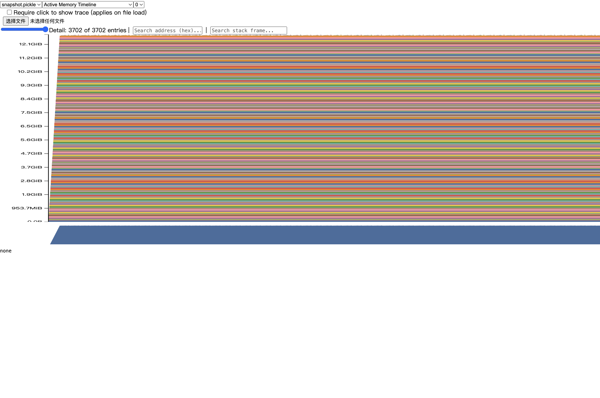
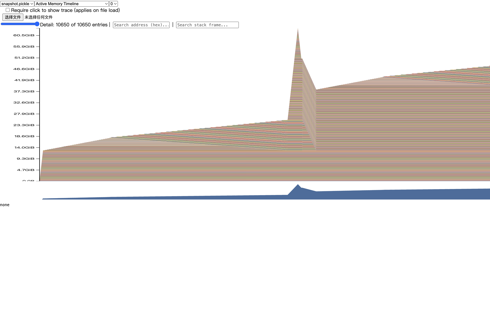
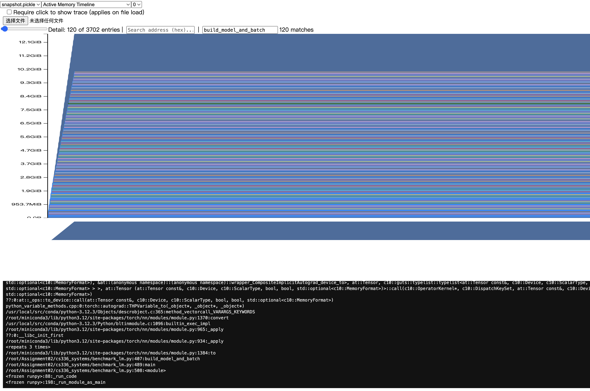
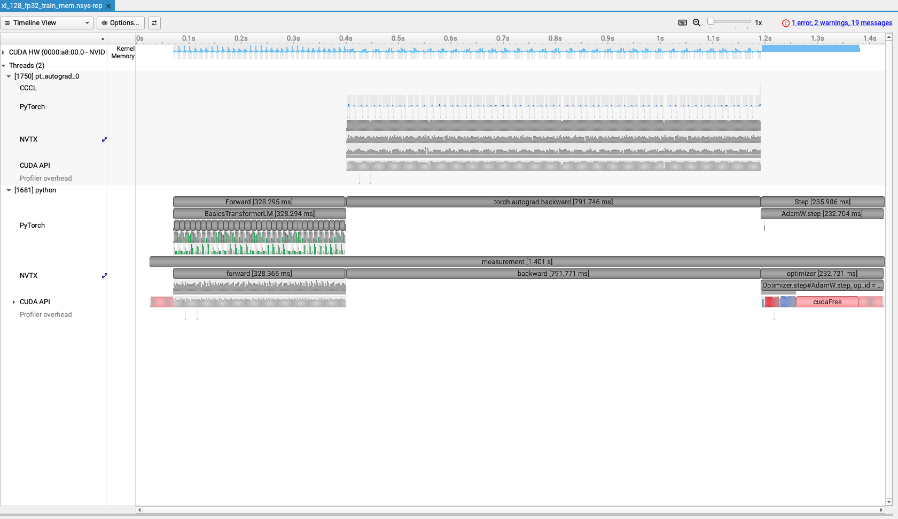
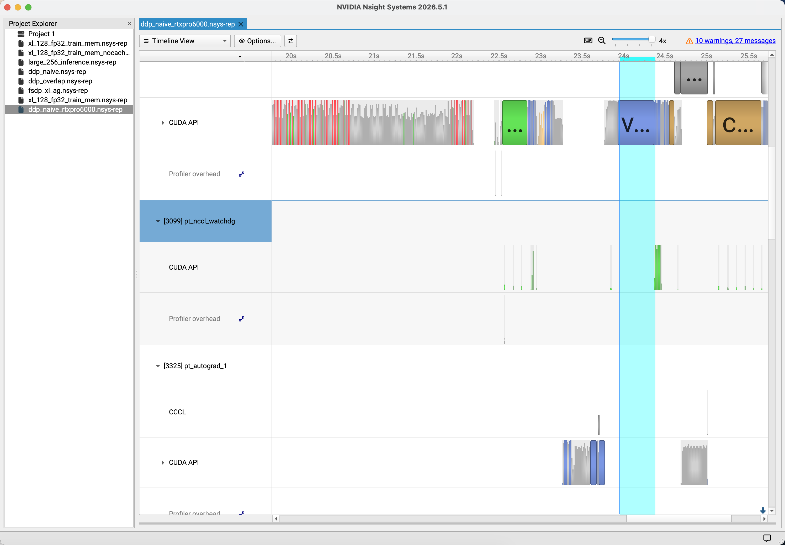
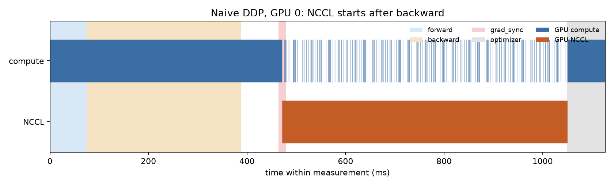
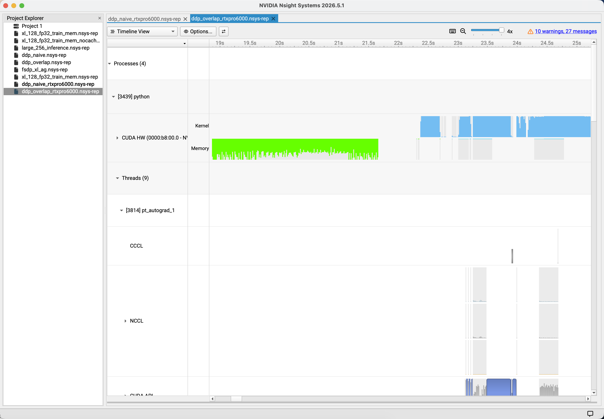
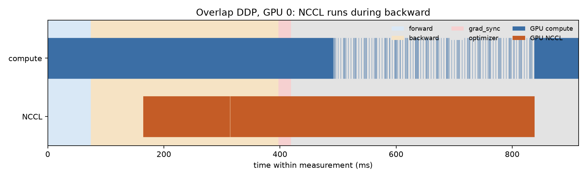

# CS336 Assignment 2 — 题目原文（计分题 / 需作答项）

来源：`cs336_assignment2_systems.pdf`，Version 26.1.3。本稿只收录讲义中带 **Problem (…)** 的题目，以及明确标为可选、但需要实现或作答的 **4.2.3**。题号保留讲义编号（如 `2.1.3`）与题目 ID（如 `benchmarking_script`）。正文按讲义英文原题整理，去掉分页与断行连字符，不改题意。

**整份作业提交物（讲义第 1 页）**

- `writeup.pdf`：书面题答案
- `code.zip`：代码（用 `./test_and_make_submission.sh` 打包）

**默认模型配置（Table 1，§2.1.2）**

| Size | d_model | d_ff | num_layers | num_heads |
| --- | --- | --- | --- | --- |
| small | 768 | 3072 | 12 | 12 |
| medium | 1024 | 4096 | 24 | 16 |
| large | 1280 | 5120 | 36 | 20 |
| xl | 2560 | 10240 | 32 | 32 |
| 10B | 4608 | 12288 | 50 | 36 |

除非另有说明，词表大小 10,000，batch size 4，context length 512。

---

## 2 Profiling and Benchmarking

### 2.1.3 End-to-End Benchmarking

#### Problem (`benchmarking_script`): Benchmarking Script (4 points)

**(a)** Write a script to perform basic end-to-end benchmarking of the forward pass, backward pass, and optimizer step in your model. Specifically, your script should support the following:

- Given hyperparameters (e.g., number of layers), initialize a model.
- Generate a random batch of data.
- Run \(w\) warm-up steps (before you start measuring time), then time the execution of \(n\) steps (either only forward, forward and backward, or forward and backward with optimizer step, depending on an argument). For timing, you can use the Python `timeit` module (e.g., either using the `timeit` function, or using `timeit.default_timer()`, which gives you the system’s highest resolution clock, thus a better default for benchmarking than `time.time()`).
- Call `torch.cuda.synchronize()` after each step.

**Deliverable:** A script that will initialize a basics Transformer model with the given hyperparameters, create a random batch of data, and time forward-only, forward-and-backward, and full training steps that include the optimizer step.

**答案 (a)**

实现：`cs336_systems/benchmark_lm.py`。三种模式 `--mode forward` / `forward_backward` / `train`；`--timing total` 测整步，`--timing stages` 分前向 / loss / 反向 / 优化器（阶段之间 `torch.cuda.synchronize()`）。计时用 `timeit.default_timer`；`zero_grad` 不计时。

**(b)** Time the forward, backward, and optimizer step for the model sizes described in Section 2.1.2. Use 5 warmup steps and compute the average and standard deviation of timings over 10 measurement steps. How long does a forward pass take? How about a backward pass? Do you see high variability across measurements, or is the standard deviation small?

**Deliverable:** A 1-2 sentence response with your timings.

**答案 (b)**

硬件：AutoDL 1× NVIDIA RTX PRO 6000 Blackwell Server Edition（94.97 GiB）。PyTorch 2.11.0+cu128，CUDA 12.8。配置：batch 4，context 512，FP32，`torch.optim.AdamW`，`lr=1e-3`，seed 42，warmup 5，测量 10。`--mode train --timing stages`。标准差为 `pstdev`。日志：`results/bench213_*_train_stages.json`。

| 模型 | 参数量 | 前向均值 ± 标准差（ms） | 反向均值 ± 标准差（ms） | 优化器均值 ± 标准差（ms） | 峰值 allocated / reserved（MiB） | 状态 |
| --- | ---: | ---: | ---: | ---: | ---: | --- |
| small | 128,625,408 | 19.529 ± 1.004 | 34.579 ± 0.674 | 8.014 ± 0.074 | 5144.79 / 5414.00 | OK |
| medium | 423,183,360 | 46.582 ± 0.041 | 95.566 ± 0.064 | 24.084 ± 0.060 | 14048.74 / 14518.00 | OK |
| large | 969,411,840 | 110.908 ± 0.044 | 217.942 ± 0.225 | 54.783 ± 0.108 | 28147.39 / 29786.00 | OK |
| xl | 3,406,809,600 | 328.710 ± 0.051 | 596.236 ± 0.682 | 188.441 ± 0.102 | 67110.95 / 71504.00 | OK |
| 10B | 12,832,823,808 | OOM | OOM | OOM | — | warmup 第 1 次 forward 的 QK `einsum`：再申请 144.00 MiB；卡 94.97 GiB，进程约 94.90 GiB，PyTorch allocated 约 93.74 GiB |

small–xl 反向约为前向的 1.77–2.05 倍。medium/large/xl 各阶段相对标准差均低于 0.2%；small 前向相对标准差约 5.1%（19.529 ± 1.004 ms），仍属小波动。10B 未能进入测量循环。阶段之和不能当作端到端时间。

**(c)** One caveat of benchmarking is not performing the warm-up steps. Repeat your analysis without the warm-up steps. How does this affect your results? Why do you think this happens? Also try to run the script with 1 or 2 warm-up steps. Why might the result still be different?

**Deliverable:** A 2-3 sentence response.

**答案 (c)**

同一张 RTX PRO 6000，`--mode train --timing total`，batch 4 / context 512 / FP32 / `lr=1e-3`，测量 10 次；每种 warmup 独立进程。10B 已在 (b) 前向 OOM，未扫 warmup。

| 模型 | warmup | 均值（ms） | 标准差（ms） | 首步（ms） |
| --- | ---: | ---: | ---: | ---: |
| small | 0 | 113.733 | 158.246 | 588.470 |
| small | 1 | 60.735 | 0.896 | （已排除） |
| small | 2 | 60.242 | 0.953 | （已排除） |
| small | 5 | 60.631 | 1.501 | （已排除） |
| medium | 0 | 216.291 | 153.975 | 678.209 |
| medium | 1 | 164.801 | 0.714 | （已排除） |
| medium | 2 | 164.752 | 0.183 | （已排除） |
| medium | 5 | 164.578 | 0.084 | （已排除） |
| large | 0 | 426.982 | 137.915 | 840.725 |
| large | 1 | 380.608 | 0.259 | （已排除） |
| large | 2 | 380.296 | 0.088 | （已排除） |
| large | 5 | 380.298 | 0.038 | （已排除） |
| xl | 0 | 1154.952 | 137.064 | 1566.143 |
| xl | 1 | 1109.815 | 0.236 | （已排除） |
| xl | 2 | 1109.790 | 0.267 | （已排除） |
| xl | 5 | 1110.123 | 0.426 | （已排除） |

不预热时均值和标准差都被第一步拉高：small 首步 588.470 ms（其后约 60–61 ms），medium 678.209 vs ~164 ms，large 840.725 vs ~381 ms，xl 1566.143 vs ~1109 ms；首步相对后续大约多 450–530 ms，并未随模型同比放大，符合 CUDA 库首次调用、分配器以及 AdamW 状态延迟初始化等一次性开销（`warmup-steps=0` 时脚本也提示第一步含优化器状态初始化）。预热 1 次后标准差已落到约 0.2–0.9 ms，均值与预热 5 次接近。预热 2 次并不保证再降（small 的 warmup 5 标准差 1.501 ms 反而高于 warmup 1；xl 的 warmup 5 均值 1110.123 ms 略高于 warmup 1 的 1109.815 ms），不同进程的缓存、时钟和负载仍会造成小幅差异。

---

### 2.1.4 Nsight Systems Profiler

#### Problem (`nsys_profile`): Nsight Systems Profiling (5 points)

Profile your forward pass, backward pass, and optimizer step using `nsys` with two model sizes from Table 1 of your choice as well as three power-of-two context lengths larger than 128, where the largest available size should be the longest context length you can fit in memory. Pick the combinations you think would be the most interesting to look at. For each profile answer the following questions:

硬件与 2.1.3 相同：AutoDL 1× RTX PRO 6000，PyTorch 2.11.0+cu128，Nsight Systems 2026.5.1。模型取 Table 1 的 medium 与 large，batch 4，FP32。medium 的 context 为 512 / 1024 / 2048；large 为 256 / 512 / 1024。沿用 2026-09-16 的探测，large、context 2048、batch 4、FP32 train 会 OOM，故 large 的最长档是 1024。train：`--mode train --timing total --nvtx --warmup-steps 1 --measurement-steps 1 --optimizer-class cs336_basics.optimizer:AdamW`。inference：`--mode forward --inference`，其余相同。捕获 `measurement` 区间。报告与 csv 在 `nsys214/`。medium@512 的 train 是同一次会话里 GPU 已热之后的重采。`:backward` 的 GPU 投影六组都只有约 0.0008 ms，下面不用它。

**(a)** What is the total time spent on your forward pass? Does it match what we had measured before with the Python standard library?

**Deliverable:** A 1-2 sentence response.

**答案 (a)**

前向总时间取 train `*_nvtx_gpu_proj_sum.csv` 里 `:forward` 的 Total Proj Time（纳秒换算成毫秒）。context 512 对照本次 2.1.3 的 stages 前向；其余长度本次没有重测，对照 2026-09-17 同一张卡、无 nsys 的 forward-total。

| 模型 / 长度 | GPU 投影前向（ms） | GPU ops | CPU NVTX 前向（ms） | Python 前向（ms） | 投影相对 Python |
| --- | ---: | ---: | ---: | ---: | --- |
| medium / 512 | 49.769 | 1424 | 44.283 | 46.582 ± 0.041 | 约高 6.8% |
| medium / 1024 | 138.913 | 1376 | 35.768 | 136.481 ± 0.102 | 约高 1.8% |
| medium / 2048 | 398.063 | 1376 | 101.073 | 397.178 ± 0.091 | 约高 0.2% |
| large / 256 | 58.026 | 2060 | 47.277 | 57.095 ± 0.069 | 约高 1.6% |
| large / 512 | 113.336 | 2060 | 71.247 | 110.908 ± 0.044 | 约高 2.2% |
| large / 1024 | 305.865 | 1916 | 141.095 | 305.633 ± 0.041 | 约高 0.1% |

六组 GPU 投影与同步 Python 前向同量级，最大偏差是 medium@512 的 6.8%，其余不超过 2.2%。差来自单步 nsys 捕获相对 10 次测量均值。CPU NVTX 在长序列上明显更短，那是未同步的提交墙钟，不能当作前向总时间。

**(b)** What CUDA kernel takes the most cumulative GPU time during the forward pass? How many times is this kernel invoked during a single forward pass of your model? Is it the same kernel that takes the most runtime when you do both forward and backward passes? (Hint: look at the “CUDA GPU Kernel Summary” under “Stats System View”, and filter using NVTX ranges to identify which parts of the model are responsible for which kernels.)

**Deliverable:** A 1-2 sentence response.

**答案 (b)**

前向 kernel 用 `*_inference_all_cuda_gpu_kern_sum.csv`。前向加反向用 train 的 `*_nvtxname_cuda_gpu_kern_sum_nvtx-name.csv`：去掉 `optimizer/` 行，再按去掉 NVTX 前缀后的 kernel 名合并。

| 模型 / 长度 | 前向第一 | ms / 次数 | 前向+反向第一（不含 optimizer） | ms / 次数 | 是否同一 kernel |
| --- | --- | ---: | --- | ---: | --- |
| medium / 512 | cutlass `sgemm_256x128_8x4_tn` | 26.271 / 144 | 同一 tn GEMM | 26.297 / 144 | 是 |
| medium / 1024 | cutlass `sgemm_128x256_8x4_tn` | 60.708 / 169 | 同一 tn GEMM | 61.121 / 169 | 是 |
| medium / 2048 | cutlass `sgemm_128x256_8x4_tn` | 82.292 / 72 | elementwise Mul | 148.709 / 388 | 否 |
| large / 256 | cutlass `sgemm_128x256_8x4_tn` | 32.606 / 109 | cutlass `sgemm_256x128_8x4_nn` | 36.198 / 253 | 否 |
| large / 512 | cutlass `sgemm_128x256_8x4_tn` | 83.630 / 253 | 同一 tn GEMM | 83.679 / 253 | 是 |
| large / 1024 | cutlass `sgemm_128x256_8x4_tn` | 159.995 / 253 | 同一 tn GEMM | 160.646 / 253 | 是 |

六组前向累计时间第一都是 GEMM。计入反向后，四组仍是同一个 tn GEMM；medium@2048 变成逐元素乘法，large@256 变成 `nn` GEMM。这两处在去掉 `optimizer/` 之后仍然成立，来自反向。

**(c)** Although the vast majority of FLOPs take place in matrix multiplications, you will notice that several other kernels still take a non-trivial amount of the overall runtime. What other kernels besides matrix multiplies do you see accounting for non-trivial CUDA runtime in the forward pass?

**Deliverable:** A 1-2 sentence response.

**答案 (c)**

非 GEMM 指 inference 表中名字不含 `gemm` / `cutlass` / `sgemm` 的 kernel。下表只列 `Time (%) ≥ 1%` 的项；合计占比相对该表全部 kernel 的 Total Time。

| 模型 / 长度 | 非 GEMM 合计 | `Time (%) ≥ 1%` 的非矩阵操作 |
| --- | ---: | --- |
| medium / 512 | 20.3% | Mul 2.6% / 1.5% / 1.2%；Add 2.2% / 1.2%；Div 2.1%；where 2.1%；exp 1.5%；copy 1.1%；reduce Max 1.0% |
| medium / 1024 | 46.6% | where 6.4%；Mul 6.1% / 3.2% / 1.6%；exp 6.1%；Div 5.9%；Add 5.9%；reduce Sum 4.1%；reduce Max 4.1% |
| medium / 2048 | 60.1% | where 8.9%；Mul 8.8% / 3.2% / 1.3%；Div 8.8%；exp 8.7%；Add 8.7%；reduce Max 4.6%；reduce Sum 4.6% |
| large / 256 | 12.9% | Mul 2.4% / 1.3%；Add 1.0% |
| large / 512 | 20.2% | Div 2.5%；Add 2.5% / 1.0%；where 2.4%；exp 2.3%；Mul 2.1% / 1.9% / 1.3% |
| large / 1024 | 40.0% | where 5.4%；Mul 5.2% / 3.2% / 1.4%；exp 5.2%；Div 5.1%；Add 5.1%；reduce Sum 3.3%；reduce Max 3.3% |

这些 kernel 来自未融合的 softmax、因果 mask、归一化和逐元素缩放。序列越长，非 GEMM 占比越高；medium@2048 上非 GEMM 已到 60.1%，超过 GEMM。

**(d)** Profile running one complete training step with your implementation of AdamW (i.e., the forward pass, computing the loss and running a backward pass, and finally an optimizer step, as you’d do during training). How does the fraction of time spent on matrix multiplication change, compared to doing inference (forward pass only)? How about other kernels?

**Deliverable:** A 1-2 sentence response.

**答案 (d)**

占比分母是 `cuda_gpu_kern_sum` 的 Total Time 之和。GEMM 仍按名字含 `gemm` / `cutlass` / `sgemm` 归类。inference 是仅前向、关闭 autograd；train 是含 loss、反向和自实现 AdamW 的完整一步。

| 模型 / 长度 | inference GPU 合计（ms） | inference GEMM / 其他 | 完整训练步 GPU 合计（ms） | 训练步 GEMM / 其他 | GEMM 占比变化（百分点） |
| --- | ---: | --- | ---: | --- | ---: |
| medium / 512 | 48.024 | 79.7% / 20.3% | 160.872 | 61.0% / 39.0% | −18.7 |
| medium / 1024 | 136.893 | 53.4% / 46.6% | 433.701 | 45.2% / 54.8% | −8.2 |
| medium / 2048 | 396.685 | 39.9% / 60.1% | 1246.274 | 34.4% / 65.6% | −5.5 |
| large / 256 | 55.603 | 87.1% / 12.9% | 196.020 | 61.7% / 38.3% | −25.4 |
| large / 512 | 111.707 | 79.8% / 20.2% | 368.156 | 60.6% / 39.4% | −19.2 |
| large / 1024 | 304.127 | 60.0% / 40.0% | 920.304 | 50.1% / 49.9% | −9.9 |

六组里 GEMM 占比都下降，其他 kernel 占比上升。反向会增加 GEMM 的绝对时间，但逐元素运算、归约和 AdamW 的矩更新增长更快，所以矩阵乘法的时间份额变小。短序列上降幅更大（large@256 降 25.4 个百分点）。这里的优化器是 `cs336_basics.optimizer.AdamW`，不要和 2.1.3 里 `torch.optim.AdamW` 的毫秒数比较。

**(e)** Compare the runtime of the softmax operation versus the matrix multiplication operations within the self-attention layer of your model during a forward pass. How does the difference in runtimes compare to the difference in FLOPs?

**Deliverable:** A 1-2 sentence response.

**答案 (e)**

用 train 的 `*_nvtxname_*`，按最内层 NVTX 归类。matmul 只计 `scores_matmul` 与 `attention_final_matmul` 里的 GEMM；softmax 计 `attention_softmax` 下的全部 kernel。medium 为 24 层，large 为 36 层。两档模型头维度都是 \(d_h=64\)。

| 模型 / 长度 | QKᵀ GEMM（ms） | PV GEMM（ms） | 两个 matmul（ms） | softmax（ms） | softmax / 两个 matmul |
| --- | ---: | ---: | ---: | ---: | ---: |
| medium / 512 | 1.675 | 1.327 | 3.002 | 3.549 | 1.182 |
| medium / 1024 | 6.655 | 6.004 | 12.659 | 35.793 | 2.828 |
| medium / 2048 | 24.605 | 19.572 | 44.177 | 140.698 | 3.185 |
| large / 256 | 0.861 | 0.674 | 1.535 | 1.842 | 1.200 |
| large / 512 | 2.926 | 2.633 | 5.558 | 9.528 | 1.714 |
| large / 1024 | 11.946 | 10.461 | 22.406 | 66.820 | 2.982 |

每层两次 attention 矩阵乘法合计约为 \(4BHL^2 d_h\) FLOPs，softmax 为 \(O(BHL^2)\)，matmul 的 FLOPs 大约是后者的 \(4d_h=256\) 倍。GPU 上 softmax 却是两次 GEMM 的 1.18–3.19 倍，和 FLOPs 比相反：未融合 softmax 要多次读写分数矩阵并启动多个 kernel，时间由带宽和启动开销决定。序列越长，这个差距越大。

---

### 2.1.5 Mixed Precision

#### Problem (`mixed_precision_accumulation`): Mixed-Precision Accumulation (1 point)

Run the following code and comment on the accuracy of the results.

```python
s = torch.tensor(0, dtype=torch.float32)
for i in range(1000):
    s += torch.tensor(0.01, dtype=torch.float32)
print(s)

s = torch.tensor(0, dtype=torch.float16)
for i in range(1000):
    s += torch.tensor(0.01, dtype=torch.float16)
print(s)

s = torch.tensor(0, dtype=torch.float32)
for i in range(1000):
    s += torch.tensor(0.01, dtype=torch.float16)
print(s)

s = torch.tensor(0, dtype=torch.float32)
for i in range(1000):
    x = torch.tensor(0.01, dtype=torch.float16)
    s += x.type(torch.float32)
print(s)
```

**Deliverable:** A 2-3 sentence response.

**答案**

在 AutoDL 上用 PyTorch 2.11.0 运行 `python -m cs336_systems.mixed_precision_accumulation`。精确值是 \(1000 \times 0.01 = 10\)。

| 实验 | 累加器 | 每次加上的 0.01 | 运行输出 |
| --- | --- | --- | --- |
| 1 | FP32 | FP32 | `tensor(10.0001)` |
| 2 | FP16 | FP16 | `tensor(9.9531, dtype=torch.float16)` |
| 3 | FP32 | FP16 | `tensor(10.0021)` |
| 4 | FP32 | 先建成 FP16，再 `.type(float32)` | `tensor(10.0021)` |

FP32 累加最接近 10。FP16 累加每次把和舍入回 FP16，误差最大，得到 9.9531。后两组都用 FP32 累加，所以结果相同，并且好于全 FP16；`0.01` 在建成 FP16 时已经变成约 0.010002136，再 `.type(torch.float32)` 恢复不了丢掉的精度。

#### Problem (`benchmarking_mixed_precision`): Benchmarking Mixed Precision (2 points)

**(a)** Consider the following model:

```python
class ToyModel(nn.Module):
    def __init__(self, in_features: int, out_features: int):
        super().__init__()
        self.fc1 = nn.Linear(in_features, 10, bias=False)
        self.ln = nn.LayerNorm(10)
        self.fc2 = nn.Linear(10, out_features, bias=False)
        self.relu = nn.ReLU()
    def forward(self, x):
        x = self.relu(self.fc1(x))
        x = self.ln(x)
        x = self.fc2(x)
        return x
```

Suppose we are training the model on a GPU and that the model parameters are originally in FP32. We’d like to use autocasting mixed precision with FP16. What are the data types of:

- the model parameters within the autocast context?
- the output of the first feed-forward layer (`ToyModel.fc1`)?
- the output of layer norm (`ToyModel.ln`)?
- the model’s predicted logits?
- the loss?
- the model’s gradients?

**Deliverable:** The data types for each of the components listed above.

**答案 (a)**

参数初始为 FP32，GPU 上使用 FP16 autocast。autocast 按算子选择计算精度，不把参数改成 FP16。loss 按 autocast 范围内的 `cross_entropy` 计。

| 对象 | dtype |
| --- | --- |
| autocast 内的模型参数 | `torch.float32` |
| `fc1` 输出 | `torch.float16` |
| LayerNorm 输出 | `torch.float32` |
| logits（`fc2` 输出） | `torch.float16` |
| loss | `torch.float32` |
| 参数梯度 | `torch.float32` |

**(b)** You should have seen that FP16 mixed precision autocasting treats the layer normalization layer differently than the feed-forward layers. What parts of layer normalization are sensitive to mixed precision? If we use BF16 instead of FP16, do we still need to treat layer normalization differently? Why or why not?

**Deliverable:** A 2-3 sentence response.

**答案 (b)**

LayerNorm 里对精度敏感的是均值和方差的归约，以及减均值之后的平方和倒数平方根：FP16 指数范围窄，小方差和大幅度中间值容易下溢或上溢。BF16 的指数范围与 FP32 相同，能减轻溢出，但尾数只有 7 位，归约舍入仍在，所以不能把整个 LayerNorm 改成纯 BF16，统计量仍应在更高精度里算。

**(c)** Modify your benchmarking script to optionally run the model using mixed precision with BF16. Time the forward and backward passes with and without mixed-precision for each language model size described in Section 2.1.2. Compare the results of using full precision versus mixed precision, and comment on any trends as model size changes. You may find the `nullcontext` no-op context manager to be useful.

**Deliverable:** A 2-3 sentence response with your timings and commentary.

**答案 (c)**

同一张 RTX PRO 6000。`--precision bf16`：参数保持 FP32，`torch.autocast(..., dtype=torch.bfloat16)` 包住 forward 与 loss，backward 在 autocast 外。与 2.1.3 (b) 同一口径：`--mode train --timing stages`，batch 4，context 512，`torch.optim.AdamW`，`lr=1e-3`，seed 42，warmup 5，测量 10。加速比是 FP32 均值 / BF16 均值。测量已完成；写入 `results/bench215_*_bf16_train_stages.json` 时因同名文件已存在而报 `FileExistsError`，下表用的是终端里的均值。

| 模型 | FP32 前向（ms） | BF16 前向（ms） | 前向加速比 | FP32 反向（ms） | BF16 反向（ms） | 反向加速比 |
| --- | ---: | ---: | ---: | ---: | ---: | ---: |
| small | 19.529 ± 1.004 | 20.431 ± 1.815 | 0.96× | 34.579 ± 0.674 | 36.264 ± 1.914 | 0.95× |
| medium | 46.582 ± 0.041 | 29.720 ± 5.469 | 1.57× | 95.566 ± 0.064 | 59.356 ± 2.277 | 1.61× |
| large | 110.908 ± 0.044 | 42.097 ± 1.458 | 2.63× | 217.942 ± 0.225 | 114.157 ± 0.080 | 1.91× |
| xl | 328.710 ± 0.051 | 102.758 ± 0.291 | 3.20× | 596.236 ± 0.682 | 242.461 ± 0.290 | 2.46× |
| 10B | OOM | OOM | — | OOM | OOM | — |

small 的前向和反向都没有加速，BF16 略慢于 FP32。从 medium 到 xl，前向加速比由 1.57× 升到 3.20×，反向由 1.61× 升到 2.46×，模型越大收益越明显。medium 前向 10 次在约 23 ms 与 33–38 ms 之间跳动，标准差 5.469 ms，1.57× 不宜读得过细。10B 在 warmup 第一次 forward 的 `v_proj` `einsum` 处 OOM：再申请 42.00 MiB；卡 94.97 GiB，进程约 94.92 GiB，PyTorch allocated 约 93.59 GiB。参数和 AdamW 状态仍是 FP32，BF16 只降低了激活，装不下 10B。

---

### 2.1.6 Profiling Memory

#### Problem (`memory_profiling`): Memory Profiling (4 points)

Profile your complete training step of forward pass, backward pass, and optimizer step of the xl model from Table 1 with context lengths of 128 and 2048.

**(a)** Add an option to your profiling script to run your model through the memory profiler.

It may be helpful to reuse some of your previous infrastructure (e.g., to activate mixed-precision, load specific model sizes, etc). Then, run your script to get a memory profile of the xl model when either doing inference only (just forward pass) or a full training step. What do your memory timelines look like? Can you tell which stage is running based on the peaks you see?

**Deliverable:** Two images of the “Active memory timeline” of an xl model, from the memory_viz tool: one for the forward pass, and one for running a full training step (forward and backward passes, then optimizer step), and a 2-3 sentence response.

**答案 (a)**

截图用 `mem216/xl_128_fp32_fwd.pickle` 和 `mem216/xl_128_fp32_train.pickle`（xl，batch 4，context 128，FP32，warmup 1，测量 1）。context 2048 的 train 在预热 OOM，没有时间线。记录从 `.to("cuda")` 开始，所以图的前大约 2.3 s 是参数上卡，不是测量步。

仅前向在参数到位后是一条约 12.7 GiB 的平带，测量峰值 12.91 GiB，和参数占用几乎重合，看不出逐层，也分不清 warmup 和测量。完整训练步在参数之后继续抬高：warmup 建好 AdamW 状态，测量前已有 51.16 GiB；测量步冲到 63.99 GiB，结束时 `zero_grad(set_to_none=True)` 把梯度丢掉，回到约 38 GiB。因此能区分「只有前向」和「完整一步」，但不能单凭峰形把 backward 和 optimizer 分开。





**(b)** What is the peak memory usage of each context length when doing a forward pass? What about when doing a full training step?

**Deliverable:** A table with two numbers per context length.

**答案 (b)**

xl，batch 4，FP32，warmup 1，测量 1。峰值是测量区间的 `max_memory_allocated`，GiB = MiB / 1024。pickle 在 `/root/autodl-tmp/mem216/`。

| Context length | 仅前向峰值 allocated | 完整训练步峰值 allocated |
| --- | ---: | ---: |
| 128 | 13217.80 MiB（12.91 GiB） | 65528.13 MiB（63.99 GiB） |
| 2048 | 21810.46 MiB（21.30 GiB） | OOM |

2048 的 train 在 warmup 第一次 forward 的 QK `einsum` 处 OOM：再申请 2.00 GiB；卡 94.97 GiB，进程约 94.24 GiB，PyTorch allocated 约 91.60 GiB。这 2 GiB 与 FP32 注意力分数 `(4, 32, 2048, 2048)` 的大小一致。没有 pickle。

**(c)** Find the peak memory usage of the xl model when using mixed-precision, for both a forward pass and a full training step. Does mixed-precision significantly affect memory usage?

**Deliverable:** A 2-3 sentence response.

**答案 (c)**

同一配置，`--precision bf16`：参数仍是 FP32，autocast 包住 forward 和 loss。

| 长度 | 精度 | 仅前向峰值 allocated | 完整训练步峰值 allocated |
| --- | --- | ---: | ---: |
| 128 | FP32 | 12.91 GiB | 63.99 GiB |
| 128 | BF16 | 19.14 GiB（19604.13 MiB） | 63.92 GiB（65451.55 MiB） |
| 2048 | FP32 | 21.30 GiB | OOM（QK `einsum`，2.00 GiB） |
| 2048 | BF16 | 25.35 GiB（25960.96 MiB） | OOM（softmax `exp`，2.00 GiB） |

BF16 没有明显降低峰值。context 128 的完整训练步从 63.99 GiB 到 63.92 GiB。仅前向反而升高：128 从 12.91 到 19.14 GiB，2048 从 21.30 到 25.35 GiB。参数和 AdamW 状态仍是 FP32，autocast 还会留下一份 BF16 权重副本。2048 的 train 在两种精度下都在预热前向 OOM。

**(d)** Consider the xl model. Given our reference hyperparameters, what is the size of a tensor of activations in the Transformer residual stream, in single-precision? Give this size in MiB (i.e., divide the number of bytes by \(1024^2\)).

**Deliverable:** A 1-2 sentence response with your derivation.

**答案 (d)**

一个残差流激活的形状是 \((B, L, d_{\mathrm{model}})\)。xl 取 \(B=4\)、\(d_{\mathrm{model}}=2560\)、FP32 每元素 4 字节：

\[
\frac{4 \times L \times 2560 \times 4}{1024^2} = 0.0390625\,L\ \mathrm{MiB}.
\]

2.1.3 的默认 \(L=512\) 是 **20 MiB**。本题的 \(L=128\) 与 \(L=2048\) 分别是 **5 MiB** 和 **80 MiB**。这是单个张量，不是各层保存张量之和。

**(e)** Now look closely at the “Active Memory Timeline” from pytorch.org/memory_viz of a memory snapshot of the xl model doing a forward pass. When you reduce the “Detail” level, the tool hides the smallest allocations to the corresponding level (e.g., putting “Detail” at 10% only shows the 10% largest allocations). What is the size of the largest allocations shown? Looking through the stack trace, can you tell where those allocations come from?

**Deliverable:** A 1-2 sentence response.

**答案 (e)**

在 `mem216/xl_128_fp32_fwd.pickle` 的仅前向时间线上，把 Detail 调低后最大的块是 **100.0 MiB**（104857600 字节），同时存活 96 块。stack 指向 `benchmark_lm.py` 的 `build_model_and_batch` 里 `model.to("cuda")`，经 `Module.to` → `_apply`。\(2560 \times 10240 \times 4 = 100\) MiB，这是每层三块 SwiGLU 权重、共 32 层，不是残差激活（\(L=128\) 时只有 5 MiB）。

下图在 memory_viz 里用 stack 搜索 `build_model_and_batch`，并点开其中一块 100.0 MiB 分配。调用栈止于 `benchmark_lm.py:407` 的 `model.to`。



**(f)** Nsight Systems also has flags for memory profiling. You can combine these with the Nsight flags from before to understand what allocations are happening at different steps in your model’s lifespan. Use the PyTorch-provided NVTX labels to determine how much memory is saved for backward (these tensors are often called residuals) by a single TransformerBlock in your model. Note the 5 largest contributing operations, and what percentage of the overall memory they contribute.

During the backward pass, all these tensors will be freed, but new gradient tensors are emitted at the same time. Based on your profiles showing how much memory was allocated during the forward pass, and how much memory usage changes for every TransformerBlock in the backward pass, calculate how much memory the produced gradient tensors for a TransformerBlock take. Does the result match what you expect?

**Deliverable:** Screenshots from Nsight Systems and a 1-2 paragraph response.

**答案 (f)**

配置：xl，batch 4，context 128，FP32，`--mode train`，warmup 1，测量 1。报告 `nsys216/xl_128_fp32_train_mem.nsys-rep`（`--cuda-memory-usage true`，`--pytorch functions-trace,autograd-nvtx`，`PYTORCH_NO_CUDA_MEMORY_CACHING=1`，只捕获 `measurement`）。下图是 Nsight Systems 里这一段：前向约 328 ms，反向约 792 ms，AdamW 约 233 ms。



`BasicsTransformerLM.layers.0` 的前向 NVTX 长 10.68 ms。该区间前后的 CUDA Memory Usage 从 39025.67 MiB 升到 39191.87 MiB，净增 **\(S=166.21\) MiB**。`layers.15` 与 `layers.31` 的前向净增相同。32 层 \(\times 166.21\) MiB \(=5.20\) GiB，与整段 `forward` 从 38.11 GiB 升到 43.33 GiB（\(+5.23\) GiB）相符。区间内仍留到反向、且最大的五次分配都是 **20.00 MiB**（\(4 \times 128 \times 10240\) 的 FP32，即 SwiGLU 激活）：

| 排名 | 操作 | 大小（MiB） | 占 \(S\) |
| --- | --- | ---: | ---: |
| 1 | `aten::bmm` | 20.00 | 12.0% |
| 2 | `aten::sigmoid` | 20.00 | 12.0% |
| 3 | `aten::mul` | 20.00 | 12.0% |
| 4 | `aten::bmm` | 20.00 | 12.0% |
| 5 | `aten::mul` | 20.00 | 12.0% |

五者合计 100.00 MiB，占 \(S\) 的 60.2%。这五块都在该层前向结束之后才释放。

同一层在反向里释放这些保存张量的窗口，显存净增 \(\Delta M=+233.81\) MiB（`layers.0`、`layers.15`、`layers.31` 相同）。梯度占用取 \(G=\Delta M+S=233.81+166.21=400.02\) MiB。无 bias 时一块的参数量 \(P=4d^2+3d\,d_{\mathrm{ff}}+2d=104862720\)，FP32 梯度为 \(4P/1024^2=400.02\) MiB。两者一致。测量步开头有 `zero_grad(set_to_none=True)`，这些梯度是在这次反向里重新分配的。

---

## 3 Single-GPU Memory

### 3.2.1 Recomputation

#### Problem (`gradient_checkpointing`): Memory-Optimal Gradient Checkpointing (4 points)

Consider a Transformer with \(N\) identical blocks stacked sequentially. Without any checkpointing, all \(N\) blocks’ worth of residuals are kept alive simultaneously, giving \(O(N)\) peak activation memory. We have a free hand to wrap any subset of the forward pass in `checkpoint`, including nesting checkpoint calls inside one another.

**(a)** What checkpointing strategy minimizes peak activation memory, ignoring the compute cost? Describe how you would arrange the checkpoint calls (a code sketch is fine), and give the asymptotic peak activation memory and compute of your strategy as a function of \(N\). Assume the residuals saved by a single block dominate any per-checkpoint bookkeeping.

**Deliverable:** A 3-5 sentence description of the strategy and its asymptotic peak memory, plus a short code sketch.

**答案 (a)**

不计计算量时，用嵌套的前缀 checkpoint：对 \(n\) 个 block，把前 \(n-1\) 层整段放进一次 `checkpoint`，最后一层正常计算。每一层递归都从同一份原始输入重算自己的前缀，checkpoint 只记住这段的入口，不必为每个前缀再拷一份输入。反向时，只重算当前层所需要的前缀，得到该层的残差，这一层反向结束就把这些残差释放。因此同时活着的激活只有常数个 block，峰值激活内存是 \(O(1)\)。重算的前缀长度是 \(N-1,N-2,\ldots,1\)，连同原来的前向和反向，总计算是 \(O(N^2)\)。

```python
from torch.utils.checkpoint import checkpoint

def memory_minimal_forward(blocks, x):
    def run_prefix(original_x, n):
        if n == 1:
            return blocks[0](original_x)
        h = checkpoint(
            lambda z: run_prefix(z, n - 1),
            original_x,
            use_reentrant=False,
        )
        return blocks[n - 1](h)

    return run_prefix(x, len(blocks))
```

**(b)** Consider the xl model config with batch size 4 and sequence length 2048 as above. If you only have the time/compute budget to run one step of recomputation (meaning you may not nest checkpoint calls), what is the best checkpointing strategy to reduce peak memory? Profile your run’s peak memory to validate your hypothesis. Compare the peak memory of the next smaller and larger checkpointing block sizes to be sure.

**Deliverable:** A 3-5 sentence description of your reasoning along with the measured peak memory for your strategy.

**答案 (b)**

AutoDL RTX PRO 6000 Blackwell Server Edition。Table 1 的 xl（32 层、32 头）、batch 4、context 2048、FP32、eager。`--mode forward_backward`（无 AdamW），warmup 1，测量 1。连续 \(k\) 个 `TransformerBlock` 包进一次 `checkpoint`，`use_reentrant=False`，组内不嵌套。峰值是测量区间的 `max_memory_allocated`。日志与 json：`results/checkpoint_xl_b4_ctx2048_fp32_fwd_bwd_k{1,2,4}_rerun.json`。

| 设置 | Checkpoint block size \(k\) | 峰值显存（GiB） | 测量步（ms） |
| --- | --- | ---: | ---: |
| 所选 | 1 | 38.22（39133.45 MiB） | 6831.952 |
| 相邻更大 | 2 | 44.18（45238.49 MiB） | 6958.931 |
| 再大一档 | 4 | 56.10（57447.73 MiB） | 7022.659 |

\(k=1\) 是非嵌套时最小的正整数分组，相邻更大的 block size 是 \(k=2\)。\(k=1\) 最低。\(k=2\) 比它高 5.96 GiB，\(k=4\) 比它高 17.88 GiB，每多留一层大约多 6 GiB。一段边界 checkpoint 只有 \(4\times2048\times2560\) 的 FP32，即 80 MiB，远小于一层里同时留下的激活。所以这一档取每层一段。\(k\approx\sqrt{32}\) 要假设一份 checkpoint 和一层激活同量级，这里不成立。未测 \(k>4\)。

---

## 4 GPU Kernels

### 4.1.1 Benchmarking PyTorch Attention

#### Problem (`pytorch_attention`): PyTorch Attention Benchmarking (2 points)

**(a)** Benchmark your attention implementation at different scales. Write a script that will:

- (i) Fix the batch size to 8 and don’t use multihead attention (i.e. remove the head dimension).
- (ii) Iterate through the cartesian product of [16, 32, 64, 128] for the head embedding dimension \(d_{\mathrm{model}}\), and [256, 1024, 4096, 8192, 16384] for the sequence length.
- (iii) Create random inputs \(Q\), \(K\), \(V\) for the appropriate size.
- (iv) Time 100 forward passes through attention using the inputs.
- (v) Measure how much memory is in use before the backward pass starts, and time 100 backward passes.
- (vi) Make sure to warm up, and to call `torch.cuda.synchronize()` after each forward/backward pass.

Depending on your GPU, some of these configurations are expected to run out of memory. Report the timings (or out-of-memory errors) you get for these configurations. At what size do you get out-of-memory errors? Do the accounting for the memory usage of attention in one of the smallest configurations you find that runs out of memory (you can use the equations for memory usage of Transformers from Assignment 1). How does the memory saved for backward change with the sequence length? What would you do to eliminate this memory cost?

**Deliverable:** A table with your timings, your calculations for the memory usage, and a 1-2 paragraph response.

**答案 (a)**

AutoDL 1× NVIDIA RTX PRO 6000 Blackwell Server Edition（94.97 GiB）。PyTorch 2.11.0+cu128，CUDA 12.8。`cs336_basics.model.scaled_dot_product_attention`，FP32，TF32 关。batch 8，输入 `(8, L, d)`，无多头维，`mask=None`。warmup 10，测量 100 次前向和 100 次反向，每次前后 `torch.cuda.synchronize()`。每一组单独进程。时间是这 100 次的均值（ms）。显存是反向前 `memory_allocated` 的 100 次均值（MiB），不是 reserved，也不是峰值。csv：`results/pytorch_attention_float32_rerun.csv`。20 组全部 OK。

| d | 长度 | 前向（ms） | 反向（ms） | 反向前显存（MiB） | 状态 |
| --- | ---: | ---: | ---: | ---: | --- |
| 16 | 256 | 0.332 | 0.716 | 20.90 | OK |
| 16 | 1024 | 0.210 | 0.602 | 82.84 | OK |
| 16 | 4096 | 4.538 | 11.205 | 1050.62 | OK |
| 16 | 8192 | 17.760 | 44.050 | 4133.00 | OK |
| 16 | 16384 | 69.612 | 173.859 | 16441.75 | OK |
| 32 | 256 | 0.514 | 0.924 | 21.52 | OK |
| 32 | 1024 | 0.196 | 0.558 | 85.34 | OK |
| 32 | 4096 | 4.561 | 11.167 | 1060.62 | OK |
| 32 | 8192 | 17.718 | 43.962 | 4153.00 | OK |
| 32 | 16384 | 69.790 | 174.013 | 16481.75 | OK |
| 64 | 256 | 0.553 | 0.948 | 22.77 | OK |
| 64 | 1024 | 0.211 | 0.496 | 90.34 | OK |
| 64 | 4096 | 4.689 | 11.379 | 1080.62 | OK |
| 64 | 8192 | 18.217 | 44.676 | 4193.00 | OK |
| 64 | 16384 | 71.742 | 176.265 | 16561.75 | OK |
| 128 | 256 | 0.159 | 0.543 | 25.27 | OK |
| 128 | 1024 | 0.469 | 0.882 | 100.34 | OK |
| 128 | 4096 | 5.702 | 13.170 | 1120.62 | OK |
| 128 | 8192 | 22.212 | 51.199 | 4273.00 | OK |
| 128 | 16384 | 88.299 | 203.665 | 16721.75 | OK |

这张卡上没有 OOM。最大一档是 d=128、L=16384，反向前 16721.75 MiB（16.33 GiB），低于 94.97 GiB。下面用这一档做显存核算。基线 256.00 MiB，是 Q、K、V 和事先分配的 `grad_output` 共 4 个 `(8, 16384, 128)` FP32。反向前多出 16465.75 MiB。两份 `(8, L, L)` FP32 分数/权重为 \(2\times 8\times 16384^{2}\times 4/1024^{2}=16384\) MiB，输出 `(8, L, d)` 再加 64 MiB，合计 16448 MiB，与多出的 16465.75 相差约 18 MiB。同一 L 下 d 从 16 增到 128，总占用只从 16441.75 增到 16721.75 MiB，主导项几乎不随 d 变。

为反向留下的主要是 `(B, L, L)`，按 \(\Theta(L^{2})\) 增长。d=16 时 L 从 4096 到 8192 再到 16384，占用 1050.62、4133.00、16441.75 MiB，倍率 3.93 和 3.98。要去掉这块显存，前向不要把完整分数矩阵留下来给 autograd；按块做 softmax，只保留输出和每行 logsumexp，反向再重算局部块。只对整层做 checkpoint 仍会在重算时分配完整分数矩阵。

---

### 4.2 Benchmarking JIT-Compiled Attention

#### Problem (`torch_compile`): Torch Compile (2 points)

**(a)** Extend your attention benchmarking script to include a compiled version of your PyTorch implementation of attention, and compare its performance to the uncompiled version with the same configuration as the `pytorch_attention` problem above.

**Deliverable:** A table comparing your forward and backward pass timings for your compiled attention module with the uncompiled version from the `pytorch_attention` problem above.

**答案 (a)**

与上一题同一脚本、同一网格。编译列为 `--compile`（Inductor，`fullgraph=True`）。编译发生在 warmup 的第一次前向和第一次反向，不进这 100 次。csv：`results/compiled_attention_float32_rerun.csv`。20 组全部 OK。

| d | 长度 | 原始前向（ms） | 编译前向（ms） | 原始反向（ms） | 编译反向（ms） | 状态 |
| --- | ---: | ---: | ---: | ---: | ---: | --- |
| 16 | 256 | 0.332 | 0.373 | 0.716 | 0.468 | 两组 OK |
| 16 | 1024 | 0.210 | 0.299 | 0.602 | 0.455 | 两组 OK |
| 16 | 4096 | 4.538 | 1.682 | 11.205 | 4.508 | 两组 OK |
| 16 | 8192 | 17.760 | 6.105 | 44.050 | 17.594 | 两组 OK |
| 16 | 16384 | 69.612 | 23.669 | 173.859 | 70.221 | 两组 OK |
| 32 | 256 | 0.514 | 0.592 | 0.924 | 0.528 | 两组 OK |
| 32 | 1024 | 0.196 | 0.524 | 0.558 | 0.444 | 两组 OK |
| 32 | 4096 | 4.561 | 1.713 | 11.167 | 4.640 | 两组 OK |
| 32 | 8192 | 17.718 | 6.132 | 43.962 | 17.657 | 两组 OK |
| 32 | 16384 | 69.790 | 23.435 | 174.013 | 69.020 | 两组 OK |
| 64 | 256 | 0.553 | 0.523 | 0.948 | 0.293 | 两组 OK |
| 64 | 1024 | 0.211 | 0.184 | 0.496 | 0.305 | 两组 OK |
| 64 | 4096 | 4.689 | 1.809 | 11.379 | 4.791 | 两组 OK |
| 64 | 8192 | 18.217 | 6.582 | 44.676 | 18.298 | 两组 OK |
| 64 | 16384 | 71.742 | 25.344 | 176.265 | 71.276 | 两组 OK |
| 128 | 256 | 0.159 | 0.634 | 0.543 | 0.553 | 两组 OK |
| 128 | 1024 | 0.469 | 0.549 | 0.882 | 0.568 | 两组 OK |
| 128 | 4096 | 5.702 | 2.825 | 13.170 | 6.607 | 两组 OK |
| 128 | 8192 | 22.212 | 10.575 | 51.199 | 24.738 | 两组 OK |
| 128 | 16384 | 88.299 | 41.948 | 203.665 | 98.595 | 两组 OK |

长序列上编译更快。d=16、L=16384 前向 69.612→23.669 ms，反向 173.859→70.221 ms。短序列不稳定，d=16、L=256 的编译前向 0.373 ms 慢于原始 0.332 ms。反向前显存几乎不变：最大档 16722.25 对 16721.75 MiB。compile 没有去掉 `(B, L, L)`。

**(b)** Now, compile your entire Transformer model in your end-to-end benchmarking script. How does the performance of the forward pass change? What about the combined forward and backward passes and optimizer steps?

**Deliverable:** A table comparing your vanilla and compiled Transformer model.

**答案 (b)**

同一张 RTX PRO 6000。`cs336_systems/benchmark_lm.py`，small 与 medium，batch 4，context 512，FP32，TF32 的 matmul 关闭。warmup 5，测量 10，`--timing total`。编译是 `--compile` 包整份 `BasicsTransformerLM`（默认 Inductor，不是 `fullgraph`）。loss 和 `torch.optim.AdamW` 未编译。eager 与编译各跑 `forward`、`forward_backward`、`train`。第一次 warmup 含编译（small 前向约 15.8 s，medium 前向约 30.8 s），不进下表。json：`results/torch_compile_{small,medium}_b4_ctx512_fp32_{forward,forward_backward,train}_total_{eager,compiled}_rerun.json`。下表是测量段均值 ± `pstdev`（ms）。

| 模型 | 模式 | eager（ms） | 编译（ms） |
| --- | --- | ---: | ---: |
| small | 前向 | 18.907 ± 0.016 | 16.255 ± 0.014 |
| small | 前向 + 反向 | 55.219 ± 1.951 | 44.080 ± 0.476 |
| small | 完整训练步 | 61.014 ± 0.332 | 51.466 ± 0.061 |
| medium | 前向 | 48.242 ± 0.591 | 41.056 ± 0.091 |
| medium | 前向 + 反向 | 143.368 ± 0.561 | 116.099 ± 0.062 |
| medium | 完整训练步 | 166.367 ± 0.501 | 140.468 ± 0.433 |

整网 compile 在 L=512 上是中等加速。small 前向约 1.16×，前向加反向约 1.25×，完整步骤约 1.19×。medium 前向约 1.18×，前向加反向约 1.23×，完整步骤约 1.18×。medium 完整步骤与前向加反向的差，eager 约 23.0 ms，编译后约 24.4 ms。AdamW 没有被编译，这段时间还在。这比 (a) 里单独 attention 在 L=16384 的加速小：这里序列只有 512，还有 embedding、FFN 和 LM head。

---

### 4.2.2 FlashAttention-2

#### Problem (`flash_forward`): FlashAttention-2 Forward Pass (15 points)

**(a)** Write a pure PyTorch (no Triton) `autograd.Function` that implements the FlashAttention-2 forward pass. This will be a lot slower than the regular PyTorch implementation, but will help you debug your Triton kernel.

Your implementation should take input \(Q\), \(K\), and \(V\) as well as a flag `is_causal` and produce the output \(O\) and the logsumexp value \(L\). You can ignore the `is_causal` flag for this task. The `autograd.Function` forward should then save \(L\), \(Q\), \(K\), \(V\), \(O\) for the backward pass and return \(O\). Remember that the implementation of the forward method of `autograd.Function` always takes the context as its first parameter. Any `autograd.Function` class needs to implement a backward method, but for now you can make it just raise `NotImplementedError`. If you need something to compare against, you can implement Equation 4 to Equation 6 and Equation 12 in PyTorch and compare your outputs.

The interface is then `def forward(ctx, Q, K, V, is_causal=False)`. Determine your own tile sizes, but make sure they are at least of size \(16 \times 16\). We will always test your code with dimensions that are powers of 2 and at least 16, so you don’t need to worry about out-of-bounds accesses.

**Deliverable:** A `torch.autograd.Function` subclass that implements FlashAttention-2 in the forward pass. To test your code, implement `[adapters.get_flashattention_autograd_function_pytorch]`. Then, run the test with `uv run pytest -k test_flash_forward_pass_pytorch` and make sure your implementation passes it.

**答案 (a)**

`cs336_systems/flash_attention.py` 的 `FlashAttentionPyTorch`。tile 为 16×16。按块维护 running \(m\)、\(l\) 和输出累加，只返回 \(O\)，`save_for_backward(L, Q, K, V, O)`，\(L\) 为 FP32。`is_causal` 默认 `False`；为真时被遮位置的分数加 \(-1\mathrm{e}6\)。`backward` 调用 `flash_backward_pytorch`，不是 `NotImplementedError`。`tests/adapters.py` 的 `get_flashattention_autograd_function_pytorch` 返回这个类。

AutoDL RTX PRO 6000，conda 的 `python -m pytest -k test_flash_forward_pass_pytorch -q` 包含在下面这一次里：`test_flash_forward_pass_pytorch PASSED`。这次一共 4 passed，10 deselected，27.31 s。没有用 `uv run`。

**(b)** Write a Triton kernel for the forward pass of FlashAttention-2 following Algorithm 1. Then, write another subclass of `torch.autograd.Function` that calls this (fused) kernel in the forward pass, instead of computing the result in PyTorch. A few problem-specific tips:

- To debug, we suggest comparing the results of each Triton operation you perform with the tiled PyTorch implementation you wrote in part (a).
- Your launch grid should be set as \((T_q, \mathrm{batch\_size})\), meaning each Triton program instance will load only elements from a single batch index, and only read/write to a single query tile of \(Q\), \(O\), and \(L\).
- The kernel should only have a single loop, which will iterate key tiles \(1 \le j \le T_k\).
- Advance block pointers at the end of the loop.
- Use the function declaration below (using the block pointer we give you, you should be able to infer the setup of the rest of the pointers):

```python
@triton.jit
def flash_fwd_kernel(
    Q_ptr, K_ptr, V_ptr,
    O_ptr, L_ptr,
    stride_qb, stride_qq, stride_qd,
    stride_kb, stride_kk, stride_kd,
    stride_vb, stride_vk, stride_vd,
    stride_ob, stride_oq, stride_od,
    stride_lb, stride_lq,
    N_QUERIES, N_KEYS,
    scale,
    D: tl.constexpr,
    Q_TILE_SIZE: tl.constexpr,
    K_TILE_SIZE: tl.constexpr,
):
    # Program indices
    query_tile_index = tl.program_id(0)
    batch_index = tl.program_id(1)
    # Offset each pointer with the corresponding batch index
    # multiplied with the batch stride for each tensor
    Q_block_ptr = tl.make_block_ptr(
        Q_ptr + batch_index * stride_qb,
        shape=(N_QUERIES, D),
        strides=(stride_qq, stride_qd),
        offsets=(query_tile_index * Q_TILE_SIZE, 0),
        block_shape=(Q_TILE_SIZE, D),
        order=(1, 0),
    )
    ...
```

where `scale` is \(1/\sqrt{d}\) and `Q_TILE_SIZE` and `K_TILE_SIZE` are \(B_q\) and \(B_k\) respectively. You can tune these later.

These additional guidelines may help you avoid precision issues:

- The on chip buffers (\(O_i\), \(l\), \(m\)) should have dtype `tl.float32`. If you’re accumulating into an output buffer, use the `acc` argument (`acc = tl.dot(..., acc=acc)`).
- Cast \(\tilde{P}_i^{(j)}\) to the dtype of \(V^{(j)}\) before multiplying them, and cast \(O_i\) to the appropriate dtype before writing it to global memory. Casting is done with `tensor.to`. You can get the dtype of a tensor with `tensor.dtype`, and the dtype of a block pointer/pointer with `*_block_ptr.type.element_ty`.

**Deliverable:** A `torch.autograd.Function` subclass that implements FlashAttention-2 in the forward pass using your Triton kernel. Implement `[adapters.get_flash_autograd_function_triton]`. Then, run the test with `uv run pytest -k test_flash_forward_pass_triton` and make sure your implementation passes it.

**答案 (b)**

同一个文件里的 `flash_fwd_kernel` 和 `FlashAttentionTriton`。grid 是 \((T_q,\ \mathrm{batch})\)，kernel 里只循环 key tiles，循环末尾推进 block pointer。片上 \(O\)、\(l\)、\(m\) 为 FP32，累加使用 `acc`。\(\tilde P\) 在与 \(V\) 相乘前转成 \(V\) 的 dtype，\(O\) 写回前再转回去。\(L\) 以 FP32 写出。tile 16×16，`num_warps=4`。

本地 adapter 的函数名是 `get_flashattention_autograd_function_triton`，不是讲义 PDF 里的 `get_flash_autograd_function_triton`。它返回 `FlashAttentionTritonFull`。这个类继承 `FlashAttentionTriton` 的前向，反向换成可选的 Triton 反向。因此 `test_flash_forward_pass_triton` 跑的前向就是这个 kernel。

同一次 pytest：`test_flash_forward_pass_triton[False] PASSED`，`test_flash_forward_pass_triton[True] PASSED`。

**(c)** Add a flag as the last argument to your `autograd.Function` implementation for causal masking. This should be a boolean flag that, when set to True, enables an index comparison for causal masking. Your Triton kernel should have a corresponding additional parameter `is_causal: tl.constexpr` (this is a required type annotation). In Triton, construct appropriate index vectors for queries and keys, and compare them to form a square mask of size \(B_q \times B_k\). For elements that are masked out, add the constant value of `-1e6` to the corresponding elements of the attention score matrix \(S_i^{(j)}\). Make sure to save the mask flag for backward using `ctx.is_causal = is_causal`.

**Deliverable:** An additional flag for your `torch.autograd.Function` subclass that implements the FlashAttention-2 forward pass with causal masking using your Triton kernel. Make sure that the flag is optional and defaults to False so the previous tests still pass.

**答案 (c)**

`flash_fwd_kernel` 有 `is_causal: tl.constexpr`，默认 `False`。为真时用 query、key 下标比较，被遮位置的 \(S\) 加 \(-1\mathrm{e}6\)，并且 `ctx.is_causal = is_causal`。PyTorch 分块前向使用同一条规则。`[False]` 和 `[True]` 都已通过，见 (b)。

#### Problem (`flash_backward`): FlashAttention-2 Backward Pass (5 points)

Implement the backward pass for your FlashAttention-2 `autograd.Function` using PyTorch (not Triton) and `torch.compile`. Your implementation should take the \(Q\), \(K\), \(V\), \(O\), \(dO\), and \(L\) tensors as inputs, and return \(dQ\), \(dK\) and \(dV\). Remember to compute and use the \(D\) vector. You may follow along the computations of Equation 13 to Equation 19.

**Deliverable:** To test your implementation, run `uv run pytest -k test_flash_backward`.

**答案**

`flash_backward_pytorch`（`@torch.compile`）按讲义计算 \(D=\mathrm{rowsum}(O\circ dO)\)，再重算 \(S,P\) 得到 \(dQ,dK,dV\)。causal 与前向一样加 \(-1\mathrm{e}6\)。`FlashAttentionPyTorch.backward` 和 `FlashAttentionTriton.backward` 都调用它。这不是 Triton 反向；可选 Triton 反向在 `flash_attention_triton_backward.py` 的 `FlashAttentionTritonFull`。

同一次 pytest：`test_flash_backward_pytorch PASSED`。`-k test_flash_backward` 还会匹配 `test_flash_backward_triton`，那一项测的是 `FlashAttentionTritonFull`，这次没有跑。

#### Problem (`flash_benchmarking`): FlashAttention-2 Benchmarking (5 points)

**(a)** Write a benchmarking script using `triton.testing.do_bench` that compares the performance of your (partially) Triton implementation of FlashAttention-2 forward and backward passes with a regular PyTorch implementation (i.e., not using FlashAttention).

Specifically, you will report a table that includes latencies for forward, backward, and the end-to-end forward-backward pass, for both your Triton and PyTorch implementations. Randomly generate any necessary inputs before you start benchmarking, and run the benchmark on a single B200. Always use batch size 1 and causal masking. Sweep over the cartesian product of sequence lengths of various powers of 2 from 128 up to 65536, embedding dimension sizes of various powers of 2 from 16 up to size 128, and precisions of `torch.bfloat16` and `torch.float32`. You will likely need to adjust tile sizes depending on the input sizes.

**Deliverable:** A table of results comparing your implementation of FlashAttention-2 with the PyTorch implementation, using the settings above and reporting forward, backward, and end-to-end latencies.

**答案 (a)**

AutoDL 1× RTX PRO 6000 Blackwell Server Edition（94.97 GiB），不是讲义写的 B200。PyTorch 2.11.0+cu128，Triton 3.6.0。`cs336_systems/benchmark_flash_attention.py`，`triton.testing.do_bench` 的 mean。`rep_ms=100` 是测量时长，不是 100 次。batch 1，causal。长度 \(2^7\) 到 \(2^{16}\)，\(d\in\{16,32,64,128\}\)，BF16 与 FP32。PyTorch 列是未编译的 `scaled_dot_product_attention` 加 causal mask。Flash 列是 `FlashAttentionTriton`：Triton 前向，反向是编译过的 PyTorch，不是 `FlashAttentionTritonFull`。tile 仍是 16×16，没有按长度再调。csv：`results/flash_benchmarking_rerun.csv`，160 行。时间单位 ms。

单独反向是先做一次前向，保留这张图，再反复 `backward`。前向加反向每次重新做一张图，不是两列相加。清梯度在被计时的函数里面。短序列上这个固定开销很大，两列不能当成纯 kernel 时间。

BF16，80 组全部 OK。

| d | L | PyTorch 前向 | Flash 前向 | PyTorch 反向 | Flash 反向 | PyTorch 前向+反向 | Flash 前向+反向 |
| ---: | ---: | ---: | ---: | ---: | ---: | ---: | ---: |
| 16 | 128 | 0.029 | 0.010 | 0.353 | 0.186 | 1.408 | 0.687 |
| 16 | 256 | 0.030 | 0.012 | 0.370 | 0.252 | 1.442 | 0.341 |
| 16 | 512 | 0.034 | 0.018 | 0.301 | 0.225 | 1.420 | 0.733 |
| 16 | 1024 | 0.047 | 0.029 | 0.214 | 0.229 | 1.446 | 0.485 |
| 16 | 2048 | 0.088 | 0.051 | 0.200 | 0.204 | 0.507 | 0.256 |
| 16 | 4096 | 0.227 | 0.096 | 0.551 | 0.364 | 0.891 | 0.691 |
| 16 | 8192 | 1.338 | 0.204 | 3.072 | 1.688 | 4.291 | 1.886 |
| 16 | 16384 | 5.514 | 0.627 | 12.222 | 6.631 | 17.659 | 7.249 |
| 16 | 32768 | 21.666 | 2.193 | 48.294 | 26.193 | 69.868 | 28.509 |
| 16 | 65536 | 86.377 | 7.790 | 192.715 | 103.443 | 278.650 | 111.147 |
| 32 | 128 | 0.029 | 0.010 | 0.383 | 0.299 | 1.427 | 0.658 |
| 32 | 256 | 0.031 | 0.015 | 0.363 | 0.162 | 1.494 | 0.556 |
| 32 | 512 | 0.033 | 0.022 | 0.196 | 0.230 | 1.327 | 0.704 |
| 32 | 1024 | 0.048 | 0.038 | 0.174 | 0.287 | 1.393 | 0.714 |
| 32 | 2048 | 0.088 | 0.069 | 0.369 | 0.216 | 1.424 | 0.685 |
| 32 | 4096 | 0.229 | 0.133 | 0.536 | 0.368 | 1.646 | 0.875 |
| 32 | 8192 | 1.341 | 0.292 | 3.068 | 1.712 | 4.294 | 1.994 |
| 32 | 16384 | 5.511 | 1.060 | 12.240 | 6.634 | 17.682 | 7.693 |
| 32 | 32768 | 21.691 | 3.594 | 48.335 | 26.263 | 69.923 | 29.842 |
| 32 | 65536 | 86.297 | 14.017 | 192.414 | 104.757 | 278.449 | 118.701 |
| 64 | 128 | 0.029 | 0.011 | 0.376 | 0.195 | 1.425 | 0.630 |
| 64 | 256 | 0.030 | 0.015 | 0.261 | 0.211 | 0.863 | 0.717 |
| 64 | 512 | 0.034 | 0.023 | 0.378 | 0.213 | 1.443 | 0.398 |
| 64 | 1024 | 0.049 | 0.040 | 0.402 | 0.281 | 1.454 | 0.742 |
| 64 | 2048 | 0.098 | 0.074 | 0.191 | 0.276 | 1.012 | 0.769 |
| 64 | 4096 | 0.238 | 0.142 | 0.554 | 0.480 | 1.568 | 0.711 |
| 64 | 8192 | 1.346 | 0.329 | 3.147 | 1.783 | 4.379 | 2.097 |
| 64 | 16384 | 5.515 | 1.182 | 12.248 | 6.751 | 17.685 | 7.820 |
| 64 | 32768 | 21.702 | 3.984 | 48.381 | 26.884 | 70.018 | 30.848 |
| 64 | 65536 | 86.220 | 15.447 | 192.495 | 113.756 | 278.569 | 129.084 |
| 128 | 128 | 0.029 | 0.012 | 0.324 | 0.245 | 1.248 | 0.659 |
| 128 | 256 | 0.032 | 0.016 | 0.328 | 0.121 | 1.492 | 0.209 |
| 128 | 512 | 0.036 | 0.025 | 0.162 | 0.267 | 0.558 | 0.813 |
| 128 | 1024 | 0.052 | 0.044 | 0.190 | 0.145 | 1.339 | 0.415 |
| 128 | 2048 | 0.095 | 0.081 | 0.396 | 0.288 | 1.476 | 0.787 |
| 128 | 4096 | 0.250 | 0.174 | 0.537 | 0.608 | 1.614 | 0.911 |
| 128 | 8192 | 1.415 | 0.424 | 3.173 | 2.268 | 4.522 | 2.588 |
| 128 | 16384 | 5.590 | 1.643 | 12.337 | 8.376 | 17.852 | 9.902 |
| 128 | 32768 | 22.039 | 5.372 | 48.986 | 33.013 | 70.693 | 38.372 |
| 128 | 65536 | 87.421 | 21.222 | 193.454 | 133.041 | 280.977 | 154.474 |

FP32。PyTorch 在 L=65536 的四档反向 warmup OOM；那一档的前向时间仍有效，前向加反向是未测，不是 OOM。Flash 这四档都跑完。

| d | L | PyTorch 前向 | Flash 前向 | PyTorch 反向 | Flash 反向 | PyTorch 前向+反向 | Flash 前向+反向 |
| ---: | ---: | ---: | ---: | ---: | ---: | ---: | ---: |
| 16 | 128 | 0.032 | 0.011 | 0.362 | 0.209 | 1.435 | 0.687 |
| 16 | 256 | 0.032 | 0.016 | 0.388 | 0.099 | 1.390 | 0.322 |
| 16 | 512 | 0.038 | 0.025 | 0.188 | 0.147 | 0.990 | 0.370 |
| 16 | 1024 | 0.056 | 0.043 | 0.192 | 0.139 | 0.553 | 0.388 |
| 16 | 2048 | 0.111 | 0.077 | 0.379 | 0.212 | 1.211 | 0.740 |
| 16 | 4096 | 0.382 | 0.183 | 1.144 | 0.357 | 1.477 | 0.533 |
| 16 | 8192 | 2.675 | 0.463 | 6.007 | 1.681 | 8.585 | 2.137 |
| 16 | 16384 | 10.430 | 1.761 | 23.576 | 6.626 | 33.931 | 8.293 |
| 16 | 32768 | 41.411 | 6.051 | 93.506 | 26.188 | 134.897 | 32.221 |
| 16 | 65536 | 165.172 | 23.823 | OOM | 103.536 | 未测 | 127.229 |
| 32 | 128 | 0.032 | 0.014 | 0.398 | 0.091 | 1.524 | 0.484 |
| 32 | 256 | 0.033 | 0.022 | 0.411 | 0.150 | 1.619 | 0.673 |
| 32 | 512 | 0.037 | 0.037 | 0.389 | 0.218 | 1.509 | 0.616 |
| 32 | 1024 | 0.058 | 0.067 | 0.371 | 0.095 | 1.564 | 0.297 |
| 32 | 2048 | 0.115 | 0.126 | 0.238 | 0.214 | 0.621 | 0.679 |
| 32 | 4096 | 0.381 | 0.386 | 1.100 | 0.360 | 1.662 | 0.735 |
| 32 | 8192 | 2.685 | 1.059 | 6.025 | 1.705 | 8.632 | 2.759 |
| 32 | 16384 | 10.449 | 4.223 | 23.542 | 6.618 | 33.926 | 10.654 |
| 32 | 32768 | 41.422 | 14.641 | 93.475 | 26.254 | 134.805 | 40.873 |
| 32 | 65536 | 166.478 | 58.065 | OOM | 104.706 | 未测 | 162.691 |
| 64 | 128 | 0.032 | 0.022 | 0.224 | 0.193 | 0.952 | 0.649 |
| 64 | 256 | 0.034 | 0.031 | 0.415 | 0.094 | 1.589 | 0.254 |
| 64 | 512 | 0.039 | 0.055 | 0.389 | 0.094 | 1.176 | 0.223 |
| 64 | 1024 | 0.062 | 0.103 | 0.390 | 0.260 | 1.524 | 0.675 |
| 64 | 2048 | 0.126 | 0.199 | 0.276 | 0.208 | 1.183 | 0.690 |
| 64 | 4096 | 0.414 | 0.666 | 1.184 | 0.472 | 1.759 | 1.127 |
| 64 | 8192 | 2.701 | 1.869 | 6.074 | 1.766 | 8.695 | 3.638 |
| 64 | 16384 | 10.512 | 7.427 | 23.650 | 6.739 | 34.097 | 14.006 |
| 64 | 32768 | 41.802 | 25.993 | 93.946 | 26.915 | 135.605 | 52.897 |
| 64 | 65536 | 173.372 | 103.712 | OOM | 114.714 | 未测 | 218.372 |
| 128 | 128 | 0.035 | 0.030 | 0.310 | 0.202 | 1.375 | 0.457 |
| 128 | 256 | 0.035 | 0.052 | 0.344 | 0.202 | 1.545 | 0.678 |
| 128 | 512 | 0.042 | 0.096 | 0.417 | 0.153 | 1.544 | 0.390 |
| 128 | 1024 | 0.068 | 0.184 | 0.413 | 0.219 | 1.484 | 0.780 |
| 128 | 2048 | 0.172 | 0.359 | 0.399 | 0.287 | 1.461 | 0.687 |
| 128 | 4096 | 0.472 | 1.197 | 1.281 | 0.594 | 1.731 | 1.784 |
| 128 | 8192 | 2.892 | 4.517 | 6.393 | 2.227 | 9.255 | 6.320 |
| 128 | 16384 | 11.367 | 14.091 | 24.878 | 8.341 | 36.234 | 21.997 |
| 128 | 32768 | 45.198 | 50.827 | 98.815 | 32.997 | 143.273 | 83.818 |
| 128 | 65536 | 180.763 | 200.048 | OOM | 135.520 | 未测 | 335.483 |

长序列上 Flash 的前向优势最大。BF16、d=16、L=65536 前向 86.377→7.790 ms。反向是编译 PyTorch 重算整块分数，不是分块 Triton 反向，所以加速小得多：同一档 192.715→103.443 ms。FP32、L=65536 时 PyTorch 反向装不下，Flash 仍能做完前向和反向。d=128 的 FP32 前向在 L=8192 及以上 Flash 慢于 PyTorch（例如 L=65536 为 200.048 对 180.763 ms）。tile 固定 16×16，没有按维度再调。短序列上两边都只有零点几毫秒，先后不稳定。

---

### 4.2.3 OPTIONAL: Triton backward pass

If you’re interested in getting more practice with Triton and/or having a fast leaderboard submission, we provide the tiled FlashAttention-2 backward pass below which you can implement in Triton. Algorithm 2 shows the FlashAttention-2 backward pass as it should be implemented in Triton. A key trick here is to compute \(P\) twice, once for \(dQ\) and again for \(dK\) and \(dV\). This lets us skip synchronization across thread blocks, meaning we can avoid slow atomics.

（Algorithm 2 见讲义第 29 页；此处不重排算法伪代码，以免公式分页错位。实现时请对照 PDF 原文。）

---

## 5 Distributed Data Parallel Training

### 5.1.1 Best Practices for Benchmarking Distributed Applications

#### Problem (`distributed_communication_single_node`): Distributed Communication (Single Node) (5 points)

Write a script to benchmark the runtime of the all-reduce operation in the single-node multi-process setup. The example code above may provide a reasonable starting point. Experiment with varying the following settings:

- **all-reduce data size:** float32 data tensors ranging over 1MB, 10MB, 100MB, 1GB.
- **Number of GPUs/processes:** 2, 4, or 6.

**Resource requirements:** Up to 6 GPUs. Each benchmarking run should take less than 5 minutes.

**Deliverable:** Plot(s) and/or table(s) comparing the various settings, with 2-3 sentences of commentary about your results and thoughts about how the various factors interact.

**答案**

脚本：`cs336_systems/benchmark_distributed_communication.py`。单机 `mp.spawn`，后端 NCCL。float32。预热 5 次（每次 `synchronize()`），正式 10 次 `all-reduce` 后同步一次，再除以 10。`all_gather_object` 汇总各 rank，表中为平均值；同配置下最大值与平均值几乎相同。1024 MB 按 \(1024\times 1024^{2}\) 字节计，即 1 GiB。未另作图。

硬件：AutoDL 单机 6× NVIDIA RTX PRO 6000 Blackwell Server Edition。PyTorch 2.11.0+cu128（conda `base`）。进程列表含 2、4、6、8；可见 GPU 为 6，8 进程跳过。原始表：`results/rtxpro6000_all_reduce_results.csv`。

| 数据量 | 2 进程（ms） | 4 进程（ms） | 6 进程（ms） |
| --- | ---: | ---: | ---: |
| 1 MiB | 0.0712 | 0.1129 | 0.1236 |
| 10 MiB | 0.3703 | 0.5826 | 0.6821 |
| 100 MiB | 3.4419 | 5.6098 | 6.8285 |
| 1 GiB | 34.0251 | 59.0339 | 70.6647 |

同一数据量下进程越多越慢：1 GiB 从 2 进程的 34.0 ms 增到 6 进程的 70.7 ms。每张卡都持有完整张量，增加的是集合通信的参与者。从 100 MiB 到 1 GiB，数据量约增 10.2 倍，耗时约增 9.9–10.5 倍，大消息接近按字节数增长。1 MiB 到 1 GiB 数据量增 1024 倍，2 进程耗时只增约 478 倍，小消息里固定启动开销占比更高。

---

### 5.2 A Naïve Implementation of Distributed Data Parallel Training

#### Problem (`naive_ddp`): Naïve DDP (5 points)

**Deliverable:** Implement a naïve form of distributed data parallel training that all-reduces individual parameter gradients after the backward pass. To test your implementation, implement `[adapters.get_ddp]` and (optionally) `[adapters.ddp_on_after_backward]`, then run `uv run pytest tests/test_ddp.py`.

**答案**

实现：`cs336_systems/ddp.py` 的 `DDPNaive`。初始化时把 rank 0 的参数 `broadcast` 到其余 rank。`forward` 转给原模型。`finish_gradient_synchronization` 在反向结束后，对每个已有梯度的参数做 `all_reduce`（求和）再除以 `world_size`。计时入口是 `cs336_systems/benchmark_ddp.py --mode naive`，直接构造 `DDPNaive`。

`tests/adapters.py` 的 `get_ddp` 返回的是后面 5.3.2 的 `DDPOverlapIndividualParameters`，`ddp_on_after_backward` 调用 `finish_gradient_synchronization`。因此 `tests/test_ddp.py` 测的是重叠版，不覆盖朴素版 `DDPNaive`。2026-09-28 在本机 Mac 上 `uv run pytest tests/test_ddp.py` 连跑 5 次，每次 2 passed（ToyModel、ToyModelWithTiedWeights）。后端是 Gloo。有 hostname 解析警告，测试仍通过。

#### Problem (`naive_ddp_benchmarking`): Naïve DDP Benchmarking (3 points)

In this naïve DDP implementation, parameter gradients are individually all-reduced across ranks after each backward pass. To better understand the overhead of data parallel training, create a script to benchmark your previously-implemented language model when trained with this naïve implementation of DDP. Measure the total time per training step and the proportion of time spent on communicating gradients. Collect measurements in the single-node setting (1 node x 2 GPUs) for the xl model size described in Section 2.1.2.

**Deliverable:** A description of your benchmarking setup, along with the measured time per training iteration and time spent communicating gradients for each setting.

**答案**

硬件：AutoDL 单机 2× NVIDIA RTX PRO 6000 Blackwell Server Edition。PyTorch 2.11.0+cu128，NCCL，conda `base`。命令：`python cs336_systems/benchmark_ddp.py --mode naive --world_size 2 --backend nccl`。

xl：词表 10,000，context 512，\(d_{\mathrm{model}}=2560\)，32 层，32 头，\(d_{\mathrm{ff}}=10240\)。全局 batch 4，每卡 batch 2。预热 5 步，正式 10 步。损失是 logits 的 `mean()`。一步包含 `zero_grad`、前向、反向、逐参数梯度 `all-reduce` 和 AdamW。通信时间是反向结束后、`optimizer.step` 之前那段逐参数同步的墙钟，两端都做了 `synchronize()`。日志：`results/rtxpro6000_naive_ddp.txt`。

| 配置 | 每步时间（ms） | 梯度通信（ms） | 通信占比 |
| --- | ---: | ---: | ---: |
| 1 node × 2 GPUs，xl | 1225.5480 | 576.8879 | 47.1% |

10 步合计 12.255 s。梯度通信约占一步的一半。`barrier()` 的 `device_id` 警告出现在计时开始之前，没有计入这 10 步。

---

### 5.3.1 Reducing the Number of Communication Calls

#### Problem (`minimal_ddp_flat_benchmarking`): Minimal DDP with Flat Gradients Benchmarking (2 points)

Modify your minimal DDP implementation to communicate a tensor with flattened gradients from all parameters. Compare its performance with the minimal DDP implementation that issues an all-reduce for each parameter tensor under the previously-used conditions (1 node x 2 GPUs, xl model size as described in Section 2.1.2).

**Deliverable:** The measured time per training iteration and time spent communicating gradients under distributed data parallel training with a single batched all-reduce call. 1-2 sentences comparing the results when batching vs. individually communicating gradients.

**答案**

实现：`cs336_systems/ddp.py` 的 `DDPBatch`。把全部参数梯度 `flatten` 成一个张量，做一次 `all-reduce` 再除以 `world_size`，然后 `unflatten` 写回。命令与 5.2 相同，只把 `--mode` 换成 `batch_ddp`。硬件仍是 2×RTX PRO 6000，xl，全局 batch 4。通信计时包住整个 `finish_gradient_synchronization`，因此展平版的「梯度通信」含拼接和拆开，不只是那一次 `all-reduce`。日志：`results/rtxpro6000_batch_ddp.txt`。

| 实现 | 每步时间（ms） | 梯度通信（ms） | 通信占比 |
| --- | ---: | ---: | ---: |
| 逐参数 `all-reduce`（`naive`） | 1225.5480 | 576.8879 | 47.1% |
| 展平后一次 `all-reduce`（`batch_ddp`） | 1276.8456 | 624.1740 | 48.9% |

展平后一步慢了约 51 ms，通信段慢了约 47 ms。在这台机器上，把梯度拼成一个大张量再拆回去的开销，大于少发多次小 `all-reduce` 省下的启动开销。10 步合计 12.768 s。

---

### 5.3.2 Overlapping Computation with Communication of Individual Parameter Gradients

#### Problem (`ddp_overlap_individual_parameters`): DDP with Overlapping Individual Parameters (5 points)

Implement a Python class to handle distributed data parallel training. The class should wrap an arbitrary PyTorch `nn.Module` and take care of broadcasting the weights before training (so all ranks have the same initial parameters) and issuing communication calls for gradient averaging. We recommend the following public interface:

- `def __init__(self, module: torch.nn.Module)`: Given an instantiated PyTorch `nn.Module` to be parallelized, construct a DDP container that will handle gradient synchronization across ranks.
- `def forward(self, *inputs, **kwargs)`: Calls the wrapped module’s `forward()` method with the provided positional and keyword arguments.
- `def finish_gradient_synchronization(self)`: When called, wait for asynchronous communication calls to finish on the GPU.

To use this class to perform distributed training, we’ll pass it a module to wrap, and then add a call to `finish_gradient_synchronization()` before we run `optimizer.step()` to ensure that the optimizer step, an operation that depends on the gradients, can be safely queued:

```python
model = ToyModel().to(device)
ddp_model = DDP(model)
for _ in range(train_steps):
    x, y = get_batch()
    logits = ddp_model(x)
    loss = loss_fn(logits, y)
    loss.backward()
    ddp_model.finish_gradient_synchronization()
    optimizer.step()
```

**Deliverable:** Implement a container class to handle distributed data parallel training. This class should overlap gradient communication and the computation of the backward pass. To test your DDP class, first implement the adapters `[adapters.get_ddp]` and `[adapters.ddp_on_after_backward]` (the latter is optional, depending on your implementation you may not need it).

Then, to execute the tests, run `uv run pytest tests/test_ddp.py`. We recommend running the tests multiple times (e.g., 5) to ensure that it passes reliably.

**答案**

实现：`cs336_systems/ddp.py` 的 `DDPOverlapIndividualParameters`。初始化时 `broadcast` rank 0 的参数。每个需要梯度的参数注册 `register_post_accumulate_grad_hook`，梯度一累积完就 `all_reduce(..., async_op=True)`。`finish_gradient_synchronization` 对每个 handle 调 `wait()`，再把梯度和除以 `world_size`，然后才可以 `optimizer.step()`。`tests/adapters.py` 的 `get_ddp` 返回这个类，`ddp_on_after_backward` 调用 `finish_gradient_synchronization`。2026-09-28 在本机 Mac 上 `uv run pytest tests/test_ddp.py` 连跑 5 次，每次 2 passed（ToyModel、ToyModelWithTiedWeights），后端 Gloo。

#### Problem (`ddp_overlap_individual_parameters_benchmarking`): DDP Overlapping Individual Parameters Benchmarking (1 point)

**(a)** Benchmark the performance of your DDP implementation when overlapping backward pass computation with communication of individual parameter gradients. Compare its performance with our previously-studied settings (the minimal DDP implementation that either issues an all-reduce for each parameter tensor, or a single all-reduce on the concatenation of all parameter tensors) with the same setup: 1 node, 2 GPUs, and the xl model size described in Section 2.1.2.

**Deliverable:** The measured time per training iteration when overlapping the backward pass with communication of individual parameter gradients, with 1-2 sentences comparing the results.

**答案 (a)**

命令：`python cs336_systems/benchmark_ddp.py --mode overlap_params --world_size 2 --backend nccl`。硬件与 xl 配置同 5.2。重叠版的通信在反向过程中发出，`finish_gradient_synchronization` 只负责等待，所以脚本不再单独报告一段通信时间。日志：`results/rtxpro6000_overlap_ddp.txt`。

| 实现 | 每步时间（ms） |
| --- | ---: |
| 逐参数 `all-reduce`（`naive`） | 1225.5480 |
| 展平后一次 `all-reduce`（`batch_ddp`） | 1276.8456 |
| 逐参数通信与反向重叠（`overlap_params`） | 1022.0085 |

重叠版一步 1022.0 ms，比逐参数版少 204 ms，比展平版少 255 ms。10 步合计 10.220 s。朴素版有 577 ms 落在反向之后的通信段；重叠之后整步只少了约 204 ms，说明通信没有全部藏进反向，仍有一部分留在关键路径上。

**(b)** Instrument your benchmarking code (using the 1 node, 2 GPUs, xl model size setup) with the Nsight profiler, comparing the initial DDP implementation with this overlapped implementation. Visually compare the two traces, and provide a profiler screenshot demonstrating that one implementation overlaps compute with communication while the other doesn’t.

**Deliverable:** 2 screenshots (one from the initial DDP implementation, and another from this DDP implementation that overlaps compute with communication) that visually show that communication is or isn’t overlapped with the backward pass.

**答案 (b)**

同一台 2×RTX PRO 6000、同一个 xl 配置。Profile 单独跑了 1 步预热加 1 步测量，只用来看时间线，不替换上面 10 步的计时表。命令是 `nsys profile --trace=cuda,nvtx,nccl`，脚本加了 `--nvtx --warmup 1 --steps 1`。报告：`nsys_reports/ddp_naive_rtxpro6000.nsys-rep`、`nsys_reports/ddp_overlap_rtxpro6000.nsys-rep`。下图用 GPU 0 的 kernel trace 画出：色带是 CPU 上的 NVTX 区间，色条是 GPU 上的计算或 NCCL。

朴素版：NCCL 在 backward 区间结束之后才开始，一直持续到 optimizer 之前。Nsight Systems 里把测量步放大到约 20–25.5 秒后的界面：



同一段的 GPU kernel 导出图：



重叠版：NCCL 在 backward 区间中途已经开始，并继续延伸到后面的 optimizer 区间。通信和反向计算有一段同时在 GPU 上跑，但没有在反向结束时全部完成。Nsight Systems 里放大到大约 19–25 秒的界面：CUDA HW 上绿色计算大约到 21.2 秒结束，NCCL 行的活动在大约 22.8–24.5 秒，和后面的蓝色 kernel 叠在同一段时间里。



同一段的 GPU kernel 导出图：



---

## 6 Optimizer State Sharding

#### Problem (`optimizer_state_sharding`): Optimizer State Sharding (15 points)

Implement a Python class to handle optimizer state sharding. The class should wrap an arbitrary input PyTorch `optim.Optimizer` and take care of synchronizing updated parameters after each optimizer step. We recommend the following public interface:

- `def __init__(self, params, optimizer_cls: Type[Optimizer], **kwargs: Any)`: Initializes the sharded state optimizer. `params` is a collection of parameters to be optimized (or parameter groups, in case the user wants to use different hyperparameters, such as learning rates, for different parts of the model); these parameters will be sharded across all the ranks. The `optimizer_cls` parameter specifies the type of optimizer to be wrapped (e.g., `optim.AdamW`). Finally, any remaining keyword arguments are forwarded to the constructor of the `optimizer_cls`. Make sure to call the `torch.optim.Optimizer` super-class constructor in this method.
- `def step(self, closure, **kwargs)`: Calls the wrapped optimizer’s `step()` method with the provided closure and keyword arguments. After updating the parameters, synchronize with the other ranks.
- `def add_param_group(self, param_group: dict[str, Any])`: This method should add a parameter group to the sharded optimizer. This is called during construction of the sharded optimizer by the super-class constructor and may also be called during training (e.g., for gradually unfreezing layers in a model). As a result, this method should handle assigning the model’s parameters among the ranks.

**Deliverable:** Implement a container class to handle optimizer state sharding. To test your sharded optimizer, first implement the adapter `[adapters.get_sharded_optimizer]`. Then, to execute the tests, run `uv run pytest tests/test_sharded_optimizer.py`. We recommend running the tests multiple times (e.g., 5) to ensure that they pass reliably.

#### Problem (`optimizer_state_sharding_accounting`): Optimizer State Sharding Accounting (5 points)

**(a)** Create a script to profile the peak memory usage when training language models with and without optimizer state sharding. Using the standard configuration (1 node, 2 GPUs, xl model size), report the peak memory usage after model initialization, directly before the optimizer step, and directly after the optimizer step. Do the results align with your expectations? Break down the memory usage in each setting (e.g., how much memory for parameters, how much for optimizer states, etc.).

**Deliverable:** 2-3 sentence response with peak memory usage results and a breakdown of how the memory is divided between different model and optimizer components.

**(b)** How does our implementation of optimizer state sharding affect training speed? Measure the time taken per iteration with and without optimizer state sharding for the standard configuration (1 node, 2 GPUs, xl model size).

**Deliverable:** 2-3 sentence response with your timings.

**(c)** How does our approach to optimizer state sharding differ from ZeRO stage 1 (described as ZeRO-DP \(P_{os}\) in S. Rajbhandari, J. Rasley, O. Ruwase, and Y. He [5])?

**Deliverable:** 2-3 sentence summary of any differences, especially those related to memory and communication volume.

---

## 7 Fully-Sharded Data Parallel

#### Problem (`fsdp`): Fully-Sharded Data Parallel (15 points)

Implement a Python class for fully-sharded data parallel training. The class should wrap an arbitrary PyTorch `nn.Module` (your full model) and hook into or wrap any Linear or Embedding layer within it. We recommend the following public interface:

- `def __init__(self, module: torch.nn.Module, compute_dtype: torch.dtype | None = None)`: Given an instantiated PyTorch `nn.Module` to be parallelized, construct an FSDP module that will handle weight all-gathers and gradient reduce-scatters. Make sure that your hooks or your module wrappers all-gather the weights in time for the forward pass. To limit memory use, only start gathering after the layer two before the current one has completed its forward pass. In the backward pass, your hooks or module wrappers should all-gather to have the weights available for the computation. When the gradients are available, they should be reduce-scattered to the appropriate ranks. Make sure to free the gathered weights after use. When `compute_dtype` is provided, cast the weights to that dtype before communicating or using them for compute, while keeping master weights and optimizer updates in FP32.
- `def forward(self, *inputs, **kwargs)`: Calls the wrapped module’s `forward()` method with the provided positional and keyword arguments.
- `def finish_gradient_synchronization(self)`: When called, wait for asynchronous communication calls to finish on the GPU.

**Deliverable:** Implement a container class to handle fully sharded data parallel training. Each shard of this container should be compatible with the standard AdamW implementation from assignment 1. To test your FSDP implementation, implement the adapter `[adapters.get_fsdp]`. Run the tests with `uv run pytest tests/test_fsdp.py`. We recommend running the tests multiple times (e.g., 5) to catch any race conditions.

#### Problem (`fsdp_accounting`): FSDP Accounting (5 points)

**(a)** Given your analysis in Section 6, how much memory do you expect to save from the peak by implementing FSDP? You can ignore the size of the preallocated buffers needed to all-gather weights to each GPU in your calculation.

**Deliverable:** 2-3 sentence response with your findings.

**(b)** Profile the xl model on two GPUs and pay attention to the all-gather of weights. Does the communication finish in time for the forward pass?

**Deliverable:** 2-3 sentence response with your timings. Include screenshots of Nsight to back up your claims.

---

## 8 Analyzing Parallelism Strategies

### 8.1 Communication Primitives

#### Problem (`alternate_ring_all_reduce`): Alternate ring all-reduce (1 point)

Instead of implementing all-reduce as a ring reduce-scatter followed by a ring all-gather, let’s use the following algorithm:

For step \(t = 1, \ldots, N-1\), device \(i\) does the following:

- If \(t = 1\), initialize \(y \leftarrow x^{(i)}\), which stores the partial sum so far
- Send \(x^{((i-t+1) \bmod N)}\) to device \((i+1) \bmod N\)
- Receive \(x^{((i-t) \bmod N)}\) from device \((i-1) \bmod N\)
- Update your copy of the partial sum: \(y \leftarrow y + x^{((i-t) \bmod N)}\)

In the same setting as above (\(W\) egress bandwidth per device, each \(x^{(i)}\) is of size \(S\)), how long does this algorithm take?

**Deliverable:** An answer in terms of \(S\), \(N\), and \(W\), along with a one-sentence justification.

---

### 8.2 Analyzing Data Parallel

#### Problem (`data_parallel_calcs`): Data parallel calculations (3 points)

We now have everything we need to calculate when data parallelism becomes communication bottlenecked. Let \(C\) (in FLOP/s) denote the device accelerator speed, and \(W\) (in bytes per second) denote each device’s egress bandwidth. We can then compute the computation time and communication time. Because computation and communication can be overlapped, we are bottlenecked when communication time becomes larger than computation time. We’ll assume that all weights and activations are in FP16 (i.e. two bytes).

**(a)** How many FLOPs are required to compute the backward pass, with \(N_{\mathrm{DP}}\) data parallelism? You can ignore all non-matmul operations. Recall that a matmul \((A,B)(B,C)\to(A,C)\) takes \(2ABC\) flops.

**Deliverable:** An answer in terms of \(B\), \(D\), \(D_{\mathrm{FF}}\), and \(N_{\mathrm{DP}}\), along with a one-sentence justification.

**(b)** How much communication time is required in the backward pass, with \(N_{\mathrm{DP}}\) data parallelism?

**Deliverable:** An answer in terms of a subset of \(B\), \(D\), \(D_{\mathrm{FF}}\), \(N_{\mathrm{DP}}\), and \(W\), along with a one-sentence justification.

**(c)** Fixing the other parameters, how large can \(N_{\mathrm{DP}}\) become before we’re communication bottlenecked?

**Deliverable:** An inequality with \(N_{\mathrm{DP}}\) on one side, and an expression in terms of a subset of \(B\), \(D\), \(D_{\mathrm{FF}}\), \(C\), and \(W\) on the other, along with a one-sentence justification.

---

### 8.3 Analyzing Fully Sharded Data Parallel

#### Problem (`fsdp_calcs`): Fully sharded data parallel calculations (3 points)

Under the same setting as the data parallel calculations, let’s calculate when FSDP becomes communication bottlenecked.

**(a)** How many FLOPs are required to compute the backward pass, with \(N_{\mathrm{FSDP}}\) FSDP? What about the forward pass?

**Deliverable:** Two answers in terms of \(B\), \(D\), \(D_{\mathrm{FF}}\), and \(N_{\mathrm{FSDP}}\), along with two one-sentence justifications.

**(b)** How much communication time is required in the backward pass, with \(N_{\mathrm{FSDP}}\) FSDP? What about the forward pass?

**Deliverable:** Two answers in terms of a subset of \(B\), \(D\), \(D_{\mathrm{FF}}\), \(N_{\mathrm{FSDP}}\), and \(W\), along with two one-sentence justifications.

**(c)** Fixing the other parameters, how large can \(N_{\mathrm{FSDP}}\) become before the backward pass is communication bottlenecked? What about the forward pass?

**Deliverable:** Two inequalities with \(N_{\mathrm{FSDP}}\) on one side, and an expression in terms of a subset of \(B\), \(D\), \(D_{\mathrm{FF}}\), \(C\), and \(W\) on the other, along with two one-sentence justifications.

---

### 8.4 Analyzing Tensor Parallel

#### Problem (`tp_calcs`): Tensor parallel calculations (4 points)

Under the same setting as the DP and FSDP calculations, let’s calculate when TP becomes communication bottlenecked.

**(a)** Given input \(dY\) of size \((B, D)\) write out the backward pass of the tensor parallel strategy described above (where \(W_1^{(i)}\) and \(W_2^{(i)}\) have shape \((D, D_{\mathrm{FF}}/N_{\mathrm{TP}})\), and \(W_3^{(i)}\) has shape \((D_{\mathrm{FF}}/N_{\mathrm{TP}}, D)\)).

**Deliverable:** A series of equations describing the backward pass, in terms of \(dY\), sharded weights (\(W_1^{(i)}\), \(W_2^{(i)}\), \(W_3^{(i)}\)), activations saved from the forward pass (\(x\), \(x_1^{(i)}\), \(x_2^{(i)}\), \(z^{(i)}\), \(y^{(i)}\)), communication primitives, and any intermediate variables you’d like to define. The equations should produce each device’s gradients \(dW_1^{(i)}\), \(dW_2^{(i)}\), \(dW_3^{(i)}\), and the backward pass output \(dx\). Feel free to reference the non-sharded backward pass in Section 8.2 and modify it.

**(b)** How many FLOPs are required to compute the forward pass, with \(N_{\mathrm{TP}}\) TP? What about the backward pass?

**Deliverable:** Two answers in terms of \(B\), \(D\), \(D_{\mathrm{FF}}\), and \(N_{\mathrm{TP}}\), along with two one-sentence justifications.

**(c)** How much communication time is required in the forward pass, with \(N_{\mathrm{TP}}\) TP? What about the backward pass?

**Deliverable:** Two answers in terms of a subset of \(B\), \(D\), \(D_{\mathrm{FF}}\), \(N_{\mathrm{TP}}\), and \(W\), along with two one-sentence justifications.

**(d)** Fixing the other parameters, how large can \(N_{\mathrm{TP}}\) become before the backward pass is communication bottlenecked? What about the forward pass?

**Deliverable:** Two inequalities with \(N_{\mathrm{TP}}\) on one side, and an expression in terms of a subset of \(B\), \(D\), \(D_{\mathrm{FF}}\), \(C\), and \(W\) on the other, along with two one-sentence justifications.

---

### 8.5 2D Parallelism (FSDP + TP)

#### Problem (`fsdp_tp_calcs`): 2D parallelism calculations (6 points)

Under the same setting as the calculations so far, let’s calculate when 2D parallelism becomes bottlenecked.

**(a)** How many FLOPs are required to compute the forward pass, with \(N_{\mathrm{FSDP}}\) FSDP + \(N_{\mathrm{TP}}\) TP?

**Deliverable:** An answer in terms of \(B\), \(D\), \(D_{\mathrm{FF}}\), \(N_{\mathrm{FSDP}}\), and \(N_{\mathrm{TP}}\), along with a one-sentence justification.

**(b)** How much communication time is required in the forward pass, with \(N_{\mathrm{FSDP}}\) FSDP + \(N_{\mathrm{TP}}\) TP? Assume that the communication along each axis can be overlapped (in other words, the collectives along the FSDP axis can be overlapped with the collectives along the TP axis).

**Deliverable:** An answer in terms of a subset of \(B\), \(D\), \(D_{\mathrm{FF}}\), \(N_{\mathrm{FSDP}}\), \(N_{\mathrm{TP}}\), and \(W\), along with a one-sentence justification. Hint: The answer should be expressed as a max between two quantities (the FSDP and TP collective costs), since the two can be overlapped.

**(c)** Under the optimal setting of \(N_{\mathrm{TP}}\) and \(N_{\mathrm{FSDP}}\), how large can \(N = N_{\mathrm{TP}} N_{\mathrm{FSDP}}\) become before the forward pass is communication bottlenecked?

**Deliverable:** An inequality with \(N\) on one side, and an expression in terms of a subset of \(B\), \(D\), \(D_{\mathrm{FF}}\), \(C\), and \(W\) on the other, along with a few sentences and equations as justification.

**(d)** Now suppose the FSDP-axis and TP-axis collectives cannot be overlapped because they share the same network resources. Under the optimal setting of \(N_{\mathrm{TP}}\) and \(N_{\mathrm{FSDP}}\), how large can \(N = N_{\mathrm{TP}} N_{\mathrm{FSDP}}\) become before the forward pass is communication bottlenecked? Don’t worry about truncating \(N_{\mathrm{TP}}\) and \(N_{\mathrm{FSDP}}\) to be integers.

**Deliverable:** An inequality with \(N\) on one side, and an expression in terms of a subset of \(B\), \(D\), \(D_{\mathrm{FF}}\), \(C\), and \(W\) on the other, along with a few sentences and equations as justification.

---

## 9 Leaderboard

#### Problem (`leaderboard`): Leaderboard: fastest training step (10 points)

The benchmark will be run at batch size 2 on two B200 GPUs. Your submission will be evaluated on wall-clock time for a complete training step: forward pass, loss, backward pass, and AdamW update.

From an empty PyTorch/Triton cache, your benchmarking run must complete within 10 minutes, so be careful with overly aggressive `torch.compile` and Triton autotuning.

**Deliverable:** Your best wall-clock time for a full forward-and-backward training step with AdamW.

We expect leaderboard submissions to beat the naïve baseline of 10 seconds.

Submit your result to the leaderboard here: https://github.com/stanford-cs336/assignment2-systems-leaderboard

讲义给出的计时测试（完整训练步，含 `zero_grad`、cross-entropy、AdamW）：

```python
class Config:
    ctx_len = 32768
    vocab_size = 151936
    d_model = 4096
    d_ff = 11008
    num_layers = 34
    num_heads = 32
    torch_dtype = torch.bfloat16
    is_causal = True
    batch_size = 2

cfg = Config()

def test_timing_forward_backward():
    labels, targets = torch.randint(high=cfg.vocab_size, size=(2, cfg.batch_size, cfg.ctx_len))
    model = BasicsTransformerLM(Config())
    optimizer = AdamW(model.parameters())
    def train_step():
        optimizer.zero_grad(set_to_none=True)
        res = model(labels)
        loss = cross_entropy(res, targets).sum()
        loss.backward()
        optimizer.step()
    timing_results = triton.testing.do_bench(train_step, rep=30_000, warmup=10_000)
    print(timing_results)
```

---

## 题目清单（核对用）

| 讲义编号 | Problem ID | 分值 | 子题 |
| --- | --- | --- | --- |
| 2.1.3 | `benchmarking_script` | 4 | (a)(b)(c) |
| 2.1.4 | `nsys_profile` | 5 | (a)(b)(c)(d)(e) |
| 2.1.5 | `mixed_precision_accumulation` | 1 | — |
| 2.1.5 | `benchmarking_mixed_precision` | 2 | (a)(b)(c) |
| 2.1.6 | `memory_profiling` | 4 | (a)(b)(c)(d)(e)(f) |
| 3.2.1 | `gradient_checkpointing` | 4 | (a)(b) |
| 4.1.1 | `pytorch_attention` | 2 | (a) |
| 4.2 | `torch_compile` | 2 | (a)(b) |
| 4.2.2 | `flash_forward` | 15 | (a)(b)(c) |
| 4.2.2 | `flash_backward` | 5 | — |
| 4.2.2 | `flash_benchmarking` | 5 | (a) |
| 4.2.3 | OPTIONAL Triton backward | — | 可选 |
| 5.1.1 | `distributed_communication_single_node` | 5 | — |
| 5.2 | `naive_ddp` | 5 | — |
| 5.2 | `naive_ddp_benchmarking` | 3 | — |
| 5.3.1 | `minimal_ddp_flat_benchmarking` | 2 | — |
| 5.3.2 | `ddp_overlap_individual_parameters` | 5 | — |
| 5.3.2 | `ddp_overlap_individual_parameters_benchmarking` | 1 | (a)(b) |
| 6 | `optimizer_state_sharding` | 15 | — |
| 6 | `optimizer_state_sharding_accounting` | 5 | (a)(b)(c) |
| 7 | `fsdp` | 15 | — |
| 7 | `fsdp_accounting` | 5 | (a)(b) |
| 8.1 | `alternate_ring_all_reduce` | 1 | — |
| 8.2 | `data_parallel_calcs` | 3 | (a)(b)(c) |
| 8.3 | `fsdp_calcs` | 3 | (a)(b)(c) |
| 8.4 | `tp_calcs` | 4 | (a)(b)(c)(d) |
| 8.5 | `fsdp_tp_calcs` | 6 | (a)(b)(c)(d) |
| 9 | `leaderboard` | 10 | — |
