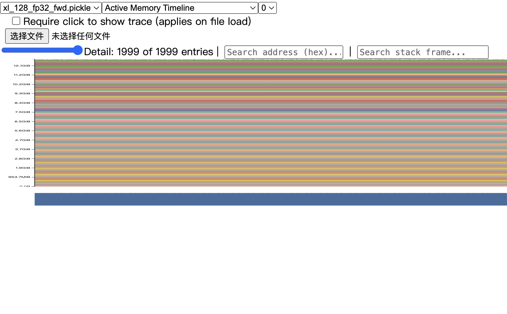
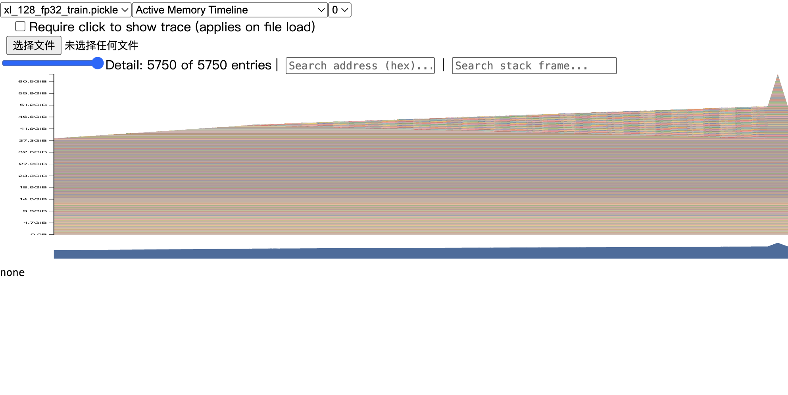
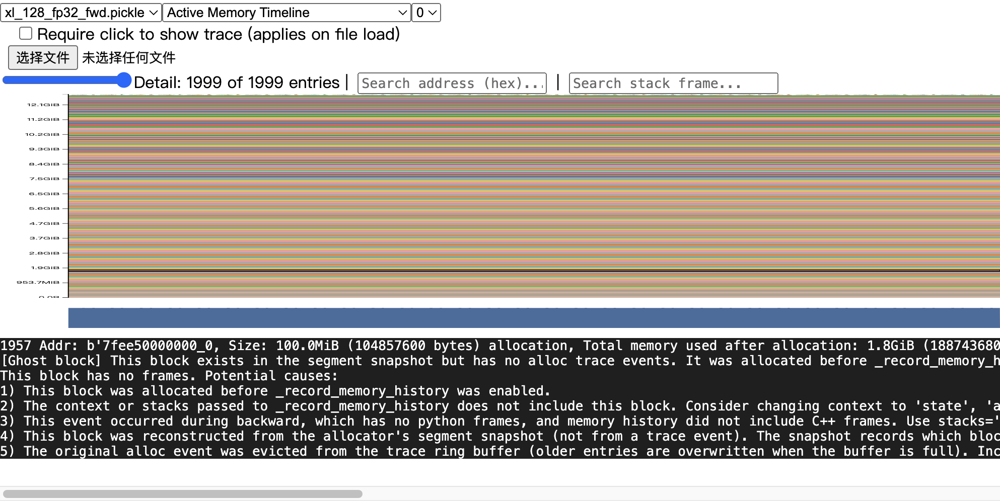
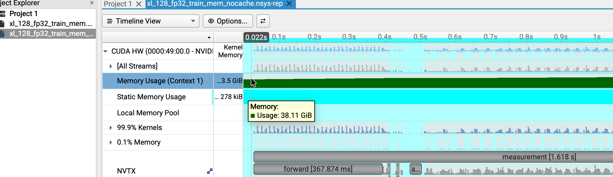
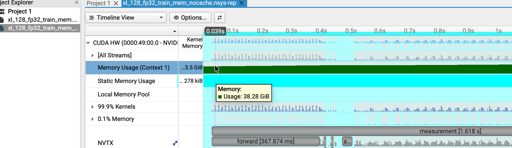

# CS336 Assignment 2 — Writeup

Systems and Parallelism · Spring 2026 · Handout Version 26.1.3

> **工作稿：以后只维护本文件**（不再向 `writeup_template.md` / `-1` / `-2` 写入新答案）。合并自上述三份草稿（2026-09-16）；2026-09-17 按附件核对，并在同步 compile JSON、`nvtx_gpu_proj_sum` 与 `flash_benchmarking.csv` 后修订报告口径。未重跑 GPU 实验，也未代写未完成计分分析。题目为中文摘要，不是逐字翻译。
>
> 原讲义：[cs336_assignment2_systems.pdf](./cs336_assignment2_systems.pdf)。最终提交要求为 `writeup.pdf` 和 `code.zip`；本文件是报告的 Markdown 编辑源。未代写尚未完成的计分分析。
>
> 表格可自行扩展，示例行不代表仅需运行这些配置。未运行、OOM、运行失败请分别注明，不要用 0 代替。实现题的答案栏用于记录代码位置和验证结果，不能替代代码提交。
>
> 对应范围：全部 27 道计分 Problem、58 个作答单元（带字母子题分别计数，无字母题各计一个），另附 1 个可选 Triton 反向记录区。环境信息、日志字段和辅助表格是模板补充，不是新增评分题。末尾提供逐题核对表。


### 本次填写范围与证据状态

本稿合并三份草稿中**已经写过**的内容。计时与 nsys 实验在 AutoDL RTX PRO 6000 上跑过；脚本为 `cs336_systems/benchmark.py`；报告与 csv 在 `nsys_reports/`、`nsys_stats/`，数字底表见 `notes/nsys_profile_tables.md`。下面区分已完成段落、仅有汇总表、以及仍待补测。

| 项目 | 合并后状态 |
| --- | --- |
| benchmarking_script | (a)(b) 有脚本记录、计时表和分析；(c) small/medium/large/xl 均有 warmup 0/1/2/5。本地缺原始终端日志 |
| nsys_profile (a)–(e) | 六组均有正文。(a) GPU 前向投影已写。(b) 前向用 inference kernel 表、前向+反向用 train `nvtx-name` 排除 `optimizer/`；(c) 与 (d) 同一份 inference 前向非 GEMM；(e) 全层 GPU kernel |
| mixed_precision_accumulation | **已在 AutoDL 用 PyTorch 跑讲义原代码**；默认打印与既有表一致 |
| benchmarking_mixed_precision | (a)(b) 为 dtype 推导，ToyModel 未在本次环境实测；(c) **small–xl 已测；10B BF16 同样 OOM** |
| memory_profiling | (a)–(d) 有截图/峰值/公式；(e) 最大块无 stack trace；(f) 与当前脚本 `zero_grad(set_to_none=True)` 需核对。xl@2048 train FP32/BF16 均 OOM |
| gradient_checkpointing | (a) 嵌套前缀已贴原文；(b) xl@2048 选 k=1（Table 1 的 32 头，未跟 3.2 节 16 头示例）；k=0 不是更小的 block size |
| pytorch_attention | **20 组 FP32 均 OK，本卡无 OOM**；表与 CSV 一致；不外推其他容量 GPU 的 OOM 档 |
| torch_compile (a) | **20 组 compiled 均 OK**；对比表已写；csv `results/compiled_attention_float32.csv` |
| torch_compile (b) | **small/medium@512 三列已齐**；compiled JSON 已在本地 `results/`，与表中均值一致 |
| flash_forward (a)(b)(c) | AutoDL 6 项 flash 测试 PASSED（含接上 Full 之后 15.27s 那次） |
| flash_backward | 必做仍为 `flash_backward_pytorch`；adapter 的 Triton 入口已换成 `FlashAttentionTritonFull` |
| 4.2.3 Triton backward | **已实现并通过** check 8 组 + `test_flash_backward_triton`；未重跑 160 组计时 |
| flash_benchmarking | **160 组已跑完**（156 OK，4 个 PyTorch FP32 L=65536 反向 OOM）；csv `results/flash_benchmarking.csv`。该表 Flash 行为 **Triton 前向 + 编译稠密反向**，不是 4.2.3 的 Full kernel |
| 第 5–7、9 章 | 未实现；6 个分布式 adapter 仍为 `NotImplementedError` |
| 第 8 章 | **纸面计算已写入** `alternate_ring_all_reduce` 至 `fsdp_tp_calcs` |

下文“待补测”表示当前附件无法支持结论，不表示耗时或显存为零；本稿尚不是所有实验完成后的提交终稿。

## 1. 基本信息与实验环境

第 1 章没有单独计分题。

- 姓名 / 学号：【待填写】
- 日期 / 提交版本：2026-09-18；核对口径（checkpoint 附件、Flash 计时表与 Full 反向分流）；未重跑 GPU；第 5–9 章仍缺。
- 代码 commit：【待填写】

| 项目 | 记录 |
| --- | --- |
| 当前可用 GPU（用户提供） | 1 × NVIDIA RTX PRO 6000 Blackwell Server Edition（约 97887 MiB / 96 GB） |
| 各实验实际 GPU / 数量 | AutoDL 单卡 NVIDIA RTX PRO 6000 Blackwell：small/medium/large/xl 分段计时成功；**10B 在默认 batch 4、context 512、FP32 train 下 OOM**（2026-09-16）。 |
| CPU / 主机内存 / 操作系统 | AutoDL：25 核 CPU，120 GB 内存，Ubuntu 22.04。 |
| 驱动 / CUDA / cuDNN / NCCL | AutoDL：驱动 595.71.05；`torch.version.cuda` 12.8；cuDNN pip 包 9.19.0.56（随 torch 2.11）。NCCL 待 nsys/多卡时再记。 |
| Python / PyTorch / Triton / Nsight Systems | AutoDL：Python 3.12.3（miniconda），PyTorch 2.11.0+cu128，Triton 3.6.0。不要 `uv run`。Nsight Systems CLI 2026.5.1；6 组报告见 `nsys_reports/`，csv 见 `nsys_stats/`，底表见 `notes/nsys_profile_tables.md`。writeup 中六组 nsys 的 (a)–(e) 已成段。 |
| 多卡互联 / 通信后端 | 本章目前单卡；未测。 |
| 随机种子 / 预热 / 测量次数 | `seed=42`。表 1 (b) 为 warmup 5、测量 10。6000 上 small/medium/large/xl 已跑 `--timing stages` 及三种 `--timing total`。10B warmup 首次 forward OOM。(c) 在 6000 上对 small/medium/large/xl 的 `--mode train --timing total` 扫了 warmup 0/1/2/5。 |
| 计时范围 / 同步方式 / 时间单位 | `timeit.default_timer`，每阶段/每步前后 `torch.cuda.synchronize()`；毫秒；标准差 `statistics.pstdev`。`zero_grad`、初始化、数据生成不计时。 |
| 显存指标 / 峰值统计区间 / 单位 | 测量区间 `max_memory_allocated` / `max_memory_reserved`，MiB。 |
| 与讲义指定硬件或设置的差异 | 非 B200。本章计时均来自 AutoDL 6000。表 1 (b)(c) 计时用 `torch.optim.AdamW`；`nsys_profile` 用 `--optimizer-class cs336_basics.optimizer:AdamW`。 |

### 默认模型配置（讲义 Table 1）

| 模型 | d_model | d_ff | 层数 | 头数 |
| --- | --- | --- | --- | --- |
| small | 768 | 3072 | 12 | 12 |
| medium | 1024 | 4096 | 24 | 16 |
| large | 1280 | 5120 | 36 | 20 |
| xl | 2560 | 10240 | 32 | 32 |
| 10B | 4608 | 12288 | 50 | 36 |

默认词表大小 10,000、batch size 4、context length 512；具体题目另有规定时以题目为准。单卡与多卡结果分开记录，指定 B200 的实验与其他硬件的实测结果明确区分。

第 2 章在引入 mixed precision 前以 FP32 参数和激活为基线。硬件差异记录仅用于解释结果，不表示课程允许以其他硬件替代指定 B200 或多卡实验。

## 2. Profiling and Benchmarking

### benchmarking_script — Benchmarking Script（4 分）

讲义第 3–4 页。

#### (a) 计时脚本

**题目**

编写脚本：根据超参数初始化模型、生成随机 batch；支持 w 次预热与 n 次测量，以及仅前向、前向加反向、前向加反向加优化器更新三种模式。使用适当的计时工具，并按题目要求在每一步后进行 GPU 同步。

**交付要求**：实现脚本。

**答案**

- 实现文件与入口：`cs336_systems/benchmark.py`；仓库根目录 `python -m cs336_systems.benchmark`（AutoDL 需 `PYTHONPATH` 含 `cs336-basics` 与仓库根，conda `base`，不要 `uv run`）。
- 三种模式的计时范围：`--mode forward` 只计前向；`--mode forward_backward` 为前向+loss+反向；`--mode train` 再加 `optimizer.step`。`--timing total` 同步后测整段；`--timing stages` 在 forward / loss / backward / optimizer 之间同步，**阶段之和不作端到端**。
- 运行配置与验证记录：默认 vocab 10000、batch 4、context 512、FP32 参数。AutoDL 已完成 small/medium/large/xl 的 train stages，以及这四档各自三种 `--timing total`。10B 同配置 OOM。(c) 已在 6000 上对 small/medium/large/xl 的 train total 跑 warmup 0/1/2（warmup 5 用 (b)）。

#### (b) 各模型耗时

**题目**

测量 Table 1 各模型的前向、反向和优化器更新耗时。使用 5 次预热、10 次正式测量，报告平均值和标准差，讨论测量是否存在明显波动。

**交付要求**：计时结果及 1–2 句分析。

**答案**

主表「前向 / 反向 / 优化器」来自 `--mode train --timing stages`。三种脚本模式的端到端时间来自 `--timing total`（small/medium/large/xl 已齐）。完整步骤与「前向+反向」不要用阶段加总。

| 模型 | 前向均值 ± 标准差（ms） | 反向均值 ± 标准差（ms） | 优化器均值 ± 标准差（ms） | 完整步骤均值 ± 标准差（ms） | 状态 |
| --- | --- | --- | --- | --- | --- |
| small | 19.859 ± 0.611 | 35.691 ± 1.502 | 8.334 ± 0.317 | 60.583 ± 0.752 | 6000；stages + total train，2026-09-16 |
| medium | 47.538 ± 0.697 | 95.274 ± 0.096 | 24.113 ± 0.086 | 164.884 ± 0.500 | 6000；stages + total train，2026-09-16 |
| large | 111.164 ± 0.462 | 217.619 ± 0.192 | 54.947 ± 0.195 | 380.215 ± 0.087 | 6000；stages + total train，2026-09-16 |
| xl | 329.053 ± 0.082 | 594.658 ± 0.381 | 188.653 ± 0.243 | 1108.998 ± 0.243 | 6000；stages + total train，2026-09-16 |
| 10B | OOM | OOM | OOM | OOM | 6000，默认 batch 4 / ctx 512 / FP32 train，warmup 首次 forward |

三种脚本模式中的“前向 + 反向”合计时间另记于下表，不能与上表的“反向本身”混淆。

| 模型 | 前向 + 反向均值 ± 标准差（ms） | 状态 |
| --- | --- | --- |
| small | 55.050 ± 2.577 | 6000，`--mode forward_backward --timing total`，2026-09-16 |
| medium | 141.808 ± 0.239 | 6000，`--mode forward_backward --timing total`，2026-09-16 |
| large | 326.770 ± 0.078 | 6000，`--mode forward_backward --timing total`，2026-09-16 |
| xl | 922.157 ± 0.356 | 6000，`--mode forward_backward --timing total`，2026-09-16 |
| 10B | 未提供独立 forward_backward 结果 | 已知 train 在预热前向 OOM；不能代替此模式的独立运行记录 |

small 三种 `--timing total` 模式：`--mode forward` 18.884 ± 0.206 ms（peak allocated 3915.05 / reserved 4048.00 MiB）；`--mode forward_backward` 55.050 ± 2.577 ms（4157.55 / 4288.00）；`--mode train` 60.583 ± 0.752 ms（5144.79 / 5456.00）。`--mode forward` 的 total 略低于 stages 的 forward 列（19.859 ms），因 stages 夹在完整 train 步里且阶段间有同步。

medium 三种 `--timing total`：forward 46.573 ± 0.140 ms（10573.98 / 10872.00 MiB）；forward_backward 141.808 ± 0.239 ms（10817.29 / 11256.00）；train 164.884 ± 0.500 ms（14048.74 / 14530.00）。stages 的 forward 列为 47.538 ms。

large 三种 `--timing total`：forward 110.682 ± 0.057 ms（20508.86 / 20576.00 MiB）；forward_backward 326.770 ± 0.078 ms（20751.37 / 20976.00）；train 380.215 ± 0.087 ms（28147.39 / 29776.00）。stages 的 forward 列为 111.164 ms。

xl 三种 `--timing total`：forward 328.563 ± 0.024 ms（40695.58 / 41452.00 MiB）；forward_backward 922.157 ± 0.356 ms（41118.37 / 42512.00）；train 1108.998 ± 0.243 ms（67110.95 / 71306.00）。stages 的 forward 列为 329.053 ms。

6000 train-stages 峰值显存（测量区间）：small 5144.79 / 5456.00 MiB；medium 14048.74 / 14530.00 MiB；large 28147.39 / 29776.00 MiB；xl 67110.95 / 71306.00 MiB。参数量 small 128,625,408；medium 423,183,360；large 969,411,840；xl 3,406,809,600。10B 在 warmup 第一次 `forward` 的 attention softmax（`nn_utils.softmax` → `torch.exp`）处 `torch.OutOfMemoryError`：试图再分配 144.00 MiB；卡容量 94.97 GiB，进程已占用约 94.87 GiB，PyTorch allocated 约 93.71 GiB。优化器均为 `torch.optim.AdamW`。loss 阶段 ~0.1–0.15 ms，不单独填表。

计时边界与各阶段测量方法：`stages` 下 forward / loss / backward / optimizer 分别同步计时；`total` 下整段 `run_step` 同步计时。清梯度在测量循环内但排除在计时外。

分析：small/medium/large/xl 的前向、反向与优化器耗时均随模型规模增大，反向约为前向的 1.80–2.00 倍；分阶段测量的相对标准差最高约 4.21%（small 反向），medium/large/xl 各阶段均低于 1.5%，整体波动较小。10B 在预热前向即 OOM，无法报告该配置耗时；端到端 train 时间低于阶段之和，与阶段间额外同步和不同测量运行相符，不能用阶段加总替代端到端结果。

#### (c) 预热的影响

**题目**

重复实验，比较不预热、预热 1 次、预热 2 次与原设置的结果。结果如何变化？为什么少量预热后的结果仍可能不同？

**交付要求**：2–3 句分析。

**答案**

AutoDL RTX PRO 6000。`--mode train --timing total`、batch 4、context 512、FP32、测量 10。每种 warmup 单独进程。warmup=5 与 (b) 为同一次运行。medium/large/xl 的 0/1/2 为 2026-09-17。

| 模型 / 模式 | 预热次数 | 测量次数 | 均值（ms） | 标准差（ms） |
| --- | --- | --- | --- | --- |
| small / train | 0 | 10 | 106.431 | 138.343 |
| small / train | 1 | 10 | 59.559 | 1.366 |
| small / train | 2 | 10 | 59.444 | 0.391 |
| small / train | 5 | 10 | 60.583 | 0.752 |
| medium / train | 0 | 10 | 216.592 | 135.451 |
| medium / train | 1 | 10 | 169.340 | 1.518 |
| medium / train | 2 | 10 | 168.038 | 0.304 |
| medium / train | 5 | 10 | 164.884 | 0.500 |
| large / train | 0 | 10 | 431.337 | 136.665 |
| large / train | 1 | 10 | 385.964 | 0.123 |
| large / train | 2 | 10 | 386.062 | 0.061 |
| large / train | 5 | 10 | 380.215 | 0.087 |
| xl / train | 0 | 10 | 1159.910 | 138.498 |
| xl / train | 1 | 10 | 1115.045 | 0.653 |
| xl / train | 2 | 10 | 1115.403 | 0.452 |
| xl / train | 5 | 10 | 1108.998 | 0.243 |

warmup=0 的 10 个样本：

- small：521.448, 61.165, 61.149, 61.038, 59.21, 59.213, 59.225, 59.665, 62.335, 59.865 ms（首步 521.448 ms，其后约 59–62 ms）
- medium：622.913, 174.41, 174.321, 171.73, 171.808, 171.035, 170.478, 169.403, 170.439, 169.379 ms（首步 622.913 ms，其后约 169–174 ms）
- large：841.333, 386.368, 385.667, 385.629, 385.688, 385.635, 385.696, 385.843, 385.775, 385.743 ms（首步 841.333 ms，其后约 385–386 ms）
- xl：1575.401, 1113.013, 1113.19, 1113.321, 1113.599, 1113.424, 1113.911, 1114.335, 1114.402, 1114.508 ms（首步 1575.401 ms，其后约 1113–1115 ms）

分析：四档模型在不预热时都被首步拉高：small 106.431 ± 138.343 ms、medium 216.592 ± 135.451 ms、large 431.337 ± 136.665 ms、xl 1159.910 ± 138.498 ms；首步相对后续步大约多 450–460 ms，数量级相近，说明这笔开销并未随模型同比放大，更符合 CUDA 库/内核首次使用、分配器及 AdamW 状态延迟初始化等一次性成本。预热 1 次后标准差已落到约 0.1–1.5 ms，均值接近预热 5 次：small 59.559 vs 60.583、medium 169.340 vs 164.884、large 385.964 vs 380.215、xl 1115.045 vs 1108.998 ms。预热 2 次并不保证进一步下降（large 386.062、xl 1115.403 均略高于各自的 warmup=1），不同进程的缓存、GPU 时钟和系统负载仍会造成小幅差异。10B 未进入可比较的 train 计时（warmup 首次 forward 即 OOM）。

### nsys_profile — Nsight Systems Profiling（5 分）

讲义第 6 页。选择 Table 1 中两种模型大小，以及三种大于 128 的 2 的幂次 context length，最大者为显存能容纳的最长长度。对前向、反向和优化器更新进行 profiling，按讲义排除预热区间；以下各题按所选配置填写。

- 两种模型：medium、large（AutoDL RTX PRO 6000，batch 4，FP32）。train：`--mode train --timing total --nvtx`。inference（(b)(c)(d) 前向）：`--mode forward --inference --timing total --nvtx`。
- 各模型的三种长度：medium 为 512 / 1024 / 2048（2048 为该卡 batch 4 FP32 train 能装下的最长 2 的幂）；large 为 256 / 512 / 1024（large@2048 探测 OOM，故最大为 1024）
- Profile 文件与 NVTX 区间：train 为 `nsys_reports/{medium,large}_{len}.nsys-rep`；inference 为同名加 `_inference`。捕获：`nsys profile --capture-range nvtx --nvtx-capture measurement -e NSYS_NVTX_PROFILER_REGISTER_ONLY=0`。脚本 NVTX 含 `warmup` / `measurement` / `forward` / `backward` / `optimizer` / `scaled_dot_product_attention` 等。数字底表：`notes/nsys_profile_tables.md`。均为 warmup 1、measurement 1。(a) 用 train 的 `nvtx_gpu_proj_sum` `:forward`；(b) 前向用 `*_inference_all_cuda_gpu_kern_sum.csv`，前向+反向用 `*_nvtxname_cuda_gpu_kern_sum_nvtx-name.csv` 排除 `optimizer/`；(c)(d) 前向非 GEMM / 对照用同一份 inference kernel 表；(e) 全层 GPU kernel。不用 `*_fwd_*` 的 CPU 窗口。

填写方式：对每个实际 profile 分别回答 (a)–(e)，在答案中标明模型和长度；可复制答案区或扩展表格，不能仅用一组结果代替全部配置。

#### (a) 前向总时间

**题目**：前向总耗时是多少？与 Python 标准库计时结果是否一致？

**交付要求**：1–2 句。

**答案**

口径：在已有六份 train `.nsys-rep` 上导出 `nvtx_gpu_proj_sum`，取 Range `:forward` 的 **Total Proj Time**（按 CUDA API correlation 把 GPU kernel 归到该 NVTX）。这与内部未同步的 CPU Range Time 不同。Python 对照仍为 2026-09-17 同一张 RTX PRO 6000、无 nsys、无 `--nvtx`、warmup 5、测量 10 的同步计时。csv：`nsys_stats/{medium,large}_{len}_nvtx_gpu_proj_sum.csv`。

**medium，context 512：** GPU 投影前向 49.591 ms（1424 个 GPU op），与 Python forward-total 46.573 ± 0.140 ms、stages-forward 47.538 ± 0.697 ms 同量级，分别约高 6.5% / 4.3%。CPU NVTX 为 48.779 ms，本组提交与执行重叠较少，故 CPU 墙钟也接近。

**medium，context 1024：** GPU 投影前向 138.267 ms（1376 op），与 Python 136.481 ± 0.102 ms / 136.447 ± 0.058 ms 分别约高 1.3% / 1.3%，可视为一致。CPU NVTX 仅 35.437 ms（约低 74%），是异步提交墙钟，不能当作 GPU 前向变快。

**medium，context 2048：** GPU 投影前向 398.605 ms（1376 op），与 Python 397.178 ± 0.091 ms / 397.072 ± 0.068 ms 分别约高 0.4% / 0.4%。CPU NVTX 101.614 ms 仍约低 74%；1260.158 ms 是 train-total，不能用作前向对照。

**large，context 256：** GPU 投影前向 58.430 ms（2060 op），与 Python 57.095 ± 0.069 ms / 57.200 ± 0.024 ms 分别约高 2.3% / 2.2%。CPU NVTX 48.367 ms 约低 15%，不能单独当成 GPU 延迟。

**large，context 512：** GPU 投影前向 113.023 ms（2060 op），与 Python 110.682 ± 0.057 ms / 111.164 ± 0.462 ms 分别约高 2.1% / 1.7%。CPU NVTX 73.157 ms 约低 34%，反映 CPU 提交结束后 GPU 仍在执行。

**large，context 1024：** GPU 投影前向 305.226 ms（1916 op），与 Python 305.633 ± 0.041 ms / 305.701 ± 0.061 ms 分别约低 0.1% / 0.2%，一致。CPU NVTX 140.558 ms 约低 54%；934.667 ms 是 train-total，不能用作前向对照。

**六组配置数据与统计说明**

下表以 **GPU 投影** 为 (a) 的前向总时间；CPU NVTX 只作对照，完整 CPU 表见 `notes/nsys_profile_tables.md`。

| 模型 / 长度 | GPU 投影 forward（ms） | GPU ops | CPU NVTX forward（ms） | Python forward-total（ms） | Python stages-forward（ms） | 投影 vs Python total |
| --- | ---: | ---: | ---: | ---: | ---: | --- |
| medium / 512 | 49.591 | 1424 | 48.779 | 46.573 ± 0.140 | 47.538 ± 0.697 | 约高 6.5%，同量级 |
| medium / 1024 | 138.267 | 1376 | 35.437 | 136.481 ± 0.102 | 136.447 ± 0.058 | 约高 1.3%，一致 |
| medium / 2048 | 398.605 | 1376 | 101.614 | 397.178 ± 0.091 | 397.072 ± 0.068 | 约高 0.4%，一致 |
| large / 256 | 58.430 | 2060 | 48.367 | 57.095 ± 0.069 | 57.200 ± 0.024 | 约高 2.3%，一致 |
| large / 512 | 113.023 | 2060 | 73.157 | 110.682 ± 0.057 | 111.164 ± 0.462 | 约高 2.1%，一致 |
| large / 1024 | 305.226 | 1916 | 140.558 | 305.633 ± 0.041 | 305.701 ± 0.061 | 约低 0.1%，一致 |

六组 GPU 投影与同步 Python 前向均对齐（最大偏差 medium@512 约 6.5%，其余 ≤2.3%）。偏差来自单步 nsys 捕获 vs 10 次测量均值，以及投影把 kernel 归到 NVTX 的方式。旧 CPU NVTX 在五组上明显偏短，不能报告为前向总时间。`:backward` 投影见 (b)，不能用于本题。

#### (b) 最耗时的 kernel

**题目**：前向中累计 GPU 时间最多的 CUDA kernel 是什么？单次前向调用多少次？计入反向后，最耗时的 kernel 是否改变？

**交付要求**：1–2 句。

**答案**

前向取独立 inference 的 `nsys_stats/*_inference_all_cuda_gpu_kern_sum.csv`（`--mode forward --inference`，完整前向 GPU kernel）。计入反向后取 train 的 `*_nvtxname_cuda_gpu_kern_sum_nvtx-name.csv`：去掉 `optimizer/` 前缀行，再按去掉 NVTX 前缀后的 kernel 名合并时间和次数；无前缀行多半是反向 launch，予以保留。不使用 `*_fwd_*`，也不使用整步 `*_all_cuda_gpu_kern_sum.csv`（含 AdamW）。`:backward` 投影不能用（六组仅约 0.0007 ms、1 个 GPU op）。

**medium，context 512：** 前向累计 GPU 时间最多的 kernel 为 cutlass `sgemm_256x128_…_tn`，26.058 ms、单次前向 **144** 次。计入反向（不含 optimizer）后仍是同一 kernel（26.245 ms / 144 次），排名未变。

**medium，context 1024：** 前向第一名为 cutlass `sgemm_128x256_…_tn`，61.659 ms、**169** 次。计入反向后仍是同一 kernel（60.840 ms / 169 次）。旧 `*_fwd_*` 窗口只有 45 次，是截断，不能当作单次前向调用数。

**medium，context 2048：** 前向第一名为 cutlass `sgemm_128x256_…_tn`，85.650 ms、**72** 次。计入反向后第一名变为 elementwise Mul（148.567 ms / 388 次）。排除 `optimizer/` 后仍然是 Mul，因此排名变化来自反向，不是 AdamW。旧窗口的 18 次是截断。

**large，context 256：** 前向第一名为 cutlass `sgemm_128x256_…_tn`，33.004 ms、**109** 次。计入反向后变为另一种 GEMM：cutlass `sgemm_256x128_…_nn`（36.128 ms / 253 次）。排除 optimizer 后仍然如此，变化来自反向。

**large，context 512：** 前向第一名为 cutlass `sgemm_128x256_…_tn`，85.545 ms、**253** 次。计入反向后仍是同一 kernel（83.545 ms / 253 次）。

**large，context 1024：** 前向第一名为 cutlass `sgemm_128x256_…_tn`，162.778 ms、**253** 次。计入反向后仍是同一 kernel（160.240 ms / 253 次）。

| 模型 / 长度 | 前向第一（inference） | ms / 次数 | 前向+反向第一（不含 optimizer） | ms / 次数 | 是否同一 kernel |
| --- | --- | ---: | --- | ---: | --- |
| medium / 512 | cutlass `sgemm_256x128_…_tn` | 26.058 / 144 | 同一 tn GEMM | 26.245 / 144 | 是 |
| medium / 1024 | cutlass `sgemm_128x256_…_tn` | 61.659 / 169 | 同一 tn GEMM | 60.840 / 169 | 是 |
| medium / 2048 | cutlass `sgemm_128x256_…_tn` | 85.650 / 72 | elementwise Mul | 148.567 / 388 | **否** |
| large / 256 | cutlass `sgemm_128x256_…_tn` | 33.004 / 109 | cutlass `sgemm_256x128_…_nn` | 36.128 / 253 | **否** |
| large / 512 | cutlass `sgemm_128x256_…_tn` | 85.545 / 253 | 同一 tn GEMM | 83.545 / 253 | 是 |
| large / 1024 | cutlass `sgemm_128x256_…_tn` | 162.778 / 253 | 同一 tn GEMM | 160.240 / 253 | 是 |

六组前向第一名都是 GEMM。计入反向后，四组仍是同一 tn GEMM；medium@2048 变为逐元素乘法，large@256 变为 `nn` GEMM。这两处变化在去掉 `optimizer/` 之后仍然成立，应归因于反向，而不是完整训练步里的 AdamW。旧 `--filter-nvtx forward` 表（如 medium@1024 的 45 次、medium@2048 的 18 次）不再使用。

#### (c) 非矩阵乘法开销

**题目**：哪些非矩阵乘法 kernel 占据了不可忽略的前向 CUDA 时间？

**交付要求**：1–2 句。

**答案**

与 (d) 相同：用 `*_inference_all_cuda_gpu_kern_sum.csv` 的完整前向 GPU kernel。非 GEMM = 名字不含 `gemm` / `cutlass` / `sgemm`（`magma_sgemmEx` 算 GEMM）。下面点名 `Time(%) ≥ 1%` 的非矩阵操作；合计占比相对该表全部 kernel 的 Total Time。不用 `*_fwd_*`。

**medium，context 512：** 非 GEMM 合计占前向 GPU 时间的 **20.2%**，主要包括 Mul（2.7% / 1.5% / 1.3%）、Add（2.2% / 1.2%）、Div（2.2%）、where（2.1%）、exp（1.5%）、reduce Max（1.1%）和 copy（1.0%）。逐元素、mask、指数、归约与拷贝的 FLOPs 少于 GEMM，但内存访问和多次 kernel 启动仍不可忽略。

**medium，context 1024：** 非 GEMM 合计 **46.2%**，主要包括 where（6.3%）、Mul（6.0% / 3.1% / 1.6%）、exp（6.0%）、Div（5.9%）、Add（5.9%）、reduce Max / Sum（各 4.1%）。序列变长后，未融合 softmax 一类的逐元素与归约占比明显升高。

**medium，context 2048：** 非 GEMM 合计 **59.3%**，已超过 GEMM 的 40.7%。主要包括 where（8.7%）、Div（8.7%）、Mul（8.6% / 3.2% / 1.3%）、exp（8.6%）、Add（8.6%）、reduce Max（4.6%）和 reduce Sum（4.5%）。不能用训练步里的 Mul 排名替代此前向明细。

**large，context 256：** 非 GEMM 合计 **12.6%**，矩阵乘法占主导；`Time(%) ≥ 1%` 的非 GEMM 为两个 Mul（2.5% / 1.3%）和一个 Add（1.0%），仍不可忽略。

**large，context 512：** 非 GEMM 合计 **19.9%**，主要包括 Div（2.5%）、Add（2.4% / 1.0%）、where（2.4%）、exp（2.3%）和三个 Mul（2.0% / 2.0% / 1.3%）。

**large，context 1024：** 非 GEMM 合计 **39.6%**，主要包括 where（5.4%）、Mul（5.2% / 3.1% / 1.5%）、exp（5.1%）、Div（5.0%）、Add（5.0%）、reduce Sum（3.3%）和 reduce Max（3.2%）。

| 模型 / 长度 | inference 前向非 GEMM 合计 | `Time(%) ≥ 1%` 的非矩阵操作 |
| --- | ---: | --- |
| medium / 512 | 20.2% | Mul 2.7% / 1.5% / 1.3%；Add 2.2% / 1.2%；Div 2.2%；where 2.1%；exp 1.5%；reduce Max 1.1%；copy 1.0% |
| medium / 1024 | 46.2% | where 6.3%；Mul 6.0% / 3.1% / 1.6%；exp 6.0%；Div 5.9%；Add 5.9%；reduce Max/Sum 各 4.1% |
| medium / 2048 | 59.3% | where 8.7%；Div 8.7%；Mul 8.6% / 3.2% / 1.3%；exp 8.6%；Add 8.6%；reduce Max 4.6%；reduce Sum 4.5% |
| large / 256 | 12.6% | Mul 2.5% / 1.3%；Add 1.0% |
| large / 512 | 19.9% | Div 2.5%；Add 2.4% / 1.0%；where 2.4%；exp 2.3%；Mul 2.0% / 2.0% / 1.3% |
| large / 1024 | 39.6% | where 5.4%；Mul 5.2% / 3.1% / 1.5%；exp 5.1%；Div 5.0%；Add 5.0%；reduce Sum 3.3%；reduce Max 3.2% |

这些非 GEMM 来自未融合的 softmax、因果 mask、归一化和逐元素缩放，与 (d) 中 inference 的「其他」列一致。序列越长，非 GEMM 占比越高；短序列上 GEMM 仍占主导，但逐元素与归约并未消失。

#### (d) 完整训练步骤的耗时构成

**题目**：对包含前向、loss、反向和 AdamW 更新的完整训练步骤进行 profiling。讲义原文要求与 **inference（仅前向、关闭 autograd）** 比较矩阵乘法及其他 kernel 的耗时占比。

**交付要求**：1–2 句。

**答案**

使用 train 与 inference 各 6 份报告，比较独立 inference 与完整训练步的 GPU kernel 时间构成。

train 使用已有的 `nsys_reports/{medium,large}_{len}.nsys-rep`，运行参数为 `--mode train`，优化器为自实现的 `cs336_basics.optimizer:AdamW`。inference 使用新采集的 `*_inference.nsys-rep`，运行参数为 `--mode forward --inference`，关闭 autograd，并采用相同的 nsys 捕获设置。

各类 kernel 的占比以 `cuda_gpu_kern_sum` 中 **Total Time 的加总值**为分母；名称包含 `gemm`、`cutlass` 或 `sgemm` 的 kernel 归为矩阵乘法（GEMM），其中包含 `magma_sgemmEx`，其余归为其他 kernel。本节不使用 `*_fwd_*` 统计或 NVTX `Time(%)` 计算占比。

**medium，context 512：** 独立 inference 中 GEMM 占 GPU kernel 时间的 **79.8%**，完整训练步为 **61.2%**（下降 **18.6 个百分点**）；其他 kernel 由 **20.2%** 升至 **38.8%**。完整训练步增加了 backward、loss 和 AdamW，虽然反向传播中的 GEMM 使其绝对时间由约 **38.0 ms** 增至 **97.6 ms**，但逐元素运算、归约和 AdamW 矩更新等非 GEMM kernel 的时间增长倍数更高，因此 GEMM 占比下降。

**medium，context 1024：** 独立 inference 中 GEMM 占 GPU kernel 时间的 **53.8%**，完整训练步为 **45.1%**（下降 **8.7 个百分点**）；其他 kernel 由 **46.2%** 升至 **54.9%**。完整训练步增加了 backward、loss 和 AdamW，反向传播也增加了 GEMM 的绝对时间，但非 GEMM kernel 的相对增幅更大，因此 GEMM 占比下降。

**medium，context 2048：** 独立 inference 中 GEMM 占 GPU kernel 时间的 **40.7%**，完整训练步为 **34.4%**（下降 **6.3 个百分点**）；其他 kernel 由 **59.3%** 升至 **65.6%**。完整训练步增加了 backward、loss 和 AdamW，反向传播也增加了 GEMM 的绝对时间，但非 GEMM kernel 的相对增幅更大，因此 GEMM 占比下降。

**large，context 256：** 独立 inference 中 GEMM 占 GPU kernel 时间的 **87.4%**，完整训练步为 **61.7%**（下降 **25.7 个百分点**）；其他 kernel 由 **12.6%** 升至 **38.3%**。完整训练步增加了 backward、loss 和 AdamW，反向传播也增加了 GEMM 的绝对时间，但非 GEMM kernel 的相对增幅更大，因此 GEMM 占比下降。

**large，context 512：** 独立 inference 中 GEMM 占 GPU kernel 时间的 **80.1%**，完整训练步为 **60.8%**（下降 **19.3 个百分点**）；其他 kernel 由 **19.9%** 升至 **39.2%**。完整训练步增加了 backward、loss 和 AdamW，反向传播也增加了 GEMM 的绝对时间，但非 GEMM kernel 的相对增幅更大，因此 GEMM 占比下降。

**large，context 1024：** 独立 inference 中 GEMM 占 GPU kernel 时间的 **60.4%**，完整训练步为 **50.0%**（下降 **10.4 个百分点**）；其他 kernel 由 **39.6%** 升至 **50.0%**。完整训练步增加了 backward、loss 和 AdamW，反向传播也增加了 GEMM 的绝对时间，但非 GEMM kernel 的相对增幅更大，因此 GEMM 占比下降。

| 模型 / 长度 | inference GPU 合计（ms） | inference GEMM / 其他 | 完整训练步 GPU 合计（ms） | 完整训练步 GEMM / 其他 | GEMM 占比变化（百分点） |
| --- | ---: | --- | ---: | --- | ---: |
| medium / 512 | 47.582 | 79.8% / 20.2% | 159.422 | 61.2% / 38.8% | −18.6 |
| medium / 1024 | 137.991 | 53.8% / 46.2% | 431.122 | 45.1% / 54.9% | −8.7 |
| medium / 2048 | 402.305 | 40.7% / 59.3% | 1245.825 | 34.4% / 65.6% | −6.3 |
| large / 256 | 56.040 | 87.4% / 12.6% | 196.265 | 61.7% / 38.3% | −25.7 |
| large / 512 | 113.909 | 80.1% / 19.9% | 365.618 | 60.8% / 39.2% | −19.3 |
| large / 1024 | 307.475 | 60.4% / 39.6% | 918.900 | 50.0% / 50.0% | −10.4 |

上述占比的分母是 **GPU kernel 执行时间之和**，不是墙钟时间。本组 AdamW 使用 assignment 1 的实现，其耗时不能与表 1 benchmarking 中的 `torch.optim.AdamW` 直接比较。`measurement` 中还包含一次 `zero_grad`；inference 下梯度原本为 `None`，对上述占比的影响很小。

#### (e) Softmax 与矩阵乘法

**题目**：比较前向 Attention 内 softmax 与矩阵乘法的耗时；耗时差异与 FLOPs 差异如何对应？

**交付要求**：1–2 句。

**答案**

口径：在已有六份 `.nsys-rep` 上导出 `cuda_gpu_kern_sum:nvtx-name`，按启动该 kernel 的 CUDA API **最内层 NVTX** 归类（correlation，不是 `--filter-nvtx` 的 CPU 时间窗，也不是默认 `inst=1`）。medium 各前缀 Instances=24，large 为 36，与层数一致。matmul 只计 `scores_matmul` / `attention_final_matmul` 中名字含 gemm/cutlass/sgemm 的 kernel；`attention_final_matmul` 里的 copy 不计入。softmax 计 `attention_softmax` 下全部 kernel（reduce Max / 减法 Add / exp / reduce Sum / Div），不含 `loss/` 下的 `cunn_SoftMax*`。csv：`nsys_stats/*_nvtxname_cuda_gpu_kern_sum_nvtx-name.csv`。

**medium，context 512：** 全 24 层 GPU：QKᵀ gemm 1.681 ms（magma `sgemmEx`），PV gemm 1.333 ms（cutlass `sgemm_64x64_…_nn`），两个 matmul 合计 3.014 ms；softmax 3.546 ms，约为 matmul 的 **1.177 倍**。softmax 由未融合的 Max、Add、exp、Sum、Div 五个 kernel 组成，尽管 FLOPs 更少，实际 GPU 时间已略高于两次 gemm。

**medium，context 1024：** 全 24 层 GPU：QKᵀ 6.532 ms，PV 6.000 ms，matmul 合计 12.532 ms；softmax 35.766 ms，约为 matmul 的 **2.854 倍**。序列变长后，逐元素/归约 kernel 的时间上升快于 gemm。

**medium，context 2048：** 全 24 层 GPU：QKᵀ 24.742 ms，PV 19.574 ms，matmul 合计 44.317 ms；softmax 140.694 ms，约为 matmul 的 **3.175 倍**。CPU NVTX 曾给出 14.96 倍，那是异步提交墙钟，**不能**当成 GPU softmax 慢 15 倍；GPU 比值约为 3.2。相对 L=512，两次 gemm 约增 14.7 倍（接近 \(L^2=16\)），softmax 约增 39.7 倍。

**large，context 256：** 全 36 层 GPU：QKᵀ 0.871 ms，PV 0.681 ms，matmul 合计 1.553 ms；softmax 1.851 ms，约为 matmul 的 **1.192 倍**。短序列上两者接近，softmax 仍略高。

**large，context 512：** 全 36 层 GPU：QKᵀ 2.932 ms，PV 2.623 ms，matmul 合计 5.555 ms；softmax 9.538 ms，约为 matmul 的 **1.717 倍**。

**large，context 1024：** 全 36 层 GPU：QKᵀ 11.872 ms，PV 10.446 ms，matmul 合计 22.318 ms；softmax 66.840 ms，约为 matmul 的 **2.995 倍**。与 medium 一样，更长的 L 上未融合 softmax 相对 gemm 更亏。

**六组配置数据与统计说明**

下表为 **GPU kernel 时间**（全层）。PV 列不含 copy。

| 模型 / 长度 | QKᵀ GPU（ms） | PV GPU（ms） | 两个 matmul GEMM（ms） | softmax GPU（ms） | softmax / 两个 matmul |
| --- | ---: | ---: | ---: | ---: | ---: |
| medium / 512 | 1.681 | 1.333 | 3.014 | 3.546 | 1.177 |
| medium / 1024 | 6.532 | 6.000 | 12.532 | 35.766 | 2.854 |
| medium / 2048 | 24.742 | 19.574 | 44.317 | 140.694 | 3.175 |
| large / 256 | 0.871 | 0.681 | 1.553 | 1.851 | 1.192 |
| large / 512 | 2.932 | 2.623 | 5.555 | 9.538 | 1.717 |
| large / 1024 | 11.872 | 10.446 | 22.318 | 66.840 | 2.995 |

每层两个 attention 矩阵乘法合计约为 \(4BHL^2d_h\) FLOPs，softmax 为 \(O(BHL^2)\)；两档模型 \(d_h=64\)，matmul FLOPs 大约是单次 \(O(BHL^2)\) 的 \(4d_h=256\) 倍。GPU 上 softmax 却是两次 gemm 的 1.18–3.18 倍，与 FLOPs 比相反：未融合 softmax 多次读写分数矩阵并启动五个 kernel，带宽和启动开销主导；gemm 更能吃满计算。序列越长，该差距越大。

曾用 CPU NVTX 得到过另一组比值（medium@2048 曾到 14.963 倍），那是异步提交墙钟，**不是 (e) 的结论**。错误口径对照表只保留在 `notes/nsys_profile_tables.md` 的「(e) 全层 NVTX 合计」一节。

### mixed_precision_accumulation — Mixed-Precision Accumulation（1 分）

讲义第 7–8 页。

**题目**

运行讲义给出的四组累加实验，均为反复累加 0.01，共 1000 次。比较不同输入与累加器精度、显式类型转换下的结果，并评论精度。具体表达式以讲义为准。

**交付要求**：2–3 句分析。

**答案**

精确数学结果为 $1000\times0.01=10$。已在 AutoDL 用 PyTorch 2.11.0 按讲义原代码运行（`python mixed_precision_accumulation.py`），四个 `print` 为：

```
tensor(10.0001)
tensor(9.9531, dtype=torch.float16)
tensor(10.0021)
tensor(10.0021)
```

这与先前按相同 FP16/FP32 格式逐步舍入的复核一致（PyTorch 默认打印位数更少）。

| 讲义实验 | PyTorch 默认打印 | 同精度细值 | 有符号误差：结果 − 10 | 绝对相对误差 |
| --- | --- | ---: | ---: | ---: |
| 1：FP32 累加器 / FP32 输入 | `tensor(10.0001)` | 10.0001335144 | +0.0001335144 | 0.001335% |
| 2：FP16 累加器 / FP16 输入 | `tensor(9.9531, dtype=torch.float16)` | 9.9531250000 | −0.0468750000 | 0.468750% |
| 3：FP32 累加器 / FP16 输入 | `tensor(10.0021)` | 10.0021362305 | +0.0021362305 | 0.021362% |
| 4：FP16 输入显式转为 FP32 后累加 | `tensor(10.0021)` | 10.0021362305 | +0.0021362305 | 0.021362% |

FP32 累加最接近 10，而 FP16 累加在每次写回累加器时舍入，导致更大的累计误差。第 3、4 组均使用 FP32 累加，因此结果一致且优于全 FP16；它们仍保留了输入在 FP16 中由 0.01 舍入为 0.01000213623046875 的误差，后续显式转为 FP32 无法恢复已丢失的精度。

### benchmarking_mixed_precision — Benchmarking Mixed Precision（2 分）

讲义第 8–9 页。

#### (a) ToyModel 的数据类型

**题目**：使用第 8 页的 ToyModel，参数初始为 FP32，在 GPU 上使用 FP16 autocast。分别报告参数、fc1 输出、LayerNorm 输出、logits、loss 和参数梯度的 dtype。

**交付要求**：列出每项数据类型。

**答案**

按 CUDA FP16 autocast 规则回答，假定 loss 是在 autocast 范围内调用的 `torch.nn.functional.cross_entropy`，参数保持原始 FP32；这是 dtype 推导，未在本次环境运行 GPU ToyModel。

| 对象 | dtype |
| --- | --- |
| autocast 内的模型参数 | `torch.float32` |
| fc1 输出 | `torch.float16` |
| LayerNorm 输出 | `torch.float32` |
| logits（fc2 输出） | `torch.float16` |
| loss（上述 cross_entropy） | `torch.float32` |
| 参数梯度（FP32 参数的 `.grad`） | `torch.float32` |

autocast 按操作选择计算精度，不会永久把参数改成 FP16；`linear` 使用低精度，`layer_norm` 和 `cross_entropy` 使用 FP32。题目未具体指定 loss 算子，因此 loss dtype 的结论依赖上述假设。依据：[PyTorch 2.11 AMP 的 CUDA 操作规则](https://docs.pytorch.org/docs/2.11/amp.html#cuda-op-specific-behavior)。

#### (b) 归一化与精度

**题目**：LayerNorm 的哪些部分对混合精度敏感？如果使用 BF16 而不是 FP16，是否仍需对 LayerNorm 特殊处理？为什么？

**交付要求**：2–3 句。

**答案**

LayerNorm 的均值、方差归约及去均值过程容易受到累加舍入和相近数相减的影响，平方与逆平方根又会放大动态范围不足或小方差的数值问题，因此这些计算宜使用 FP32。BF16 的指数范围与 FP32 相同，可缓解 FP16 的上溢/下溢，但其尾数精度更低，不能消除统计量的舍入误差，所以仍应保留高精度归约，而不是把整个 LayerNorm 直接改成纯 BF16。

#### (c) BF16 性能比较

**题目**：给计时脚本增加可选 BF16 混合精度模式。对 Table 1 各模型比较全精度与混合精度的前向、反向耗时，讨论随模型大小变化的趋势。

**交付要求**：计时结果及 2–3 句分析。

**答案**

AutoDL RTX PRO 6000。脚本 `--precision bf16`：参数保持 FP32，`torch.autocast(..., dtype=torch.bfloat16)` 包住 forward 与 loss，backward 在 autocast 外。与 FP32 主表同一口径：`--mode train --timing stages`，warmup 5、测量 10，batch 4、context 512、seed 42，无 `--nvtx`。优化器仍为 `torch.optim.AdamW`（不在本题比较范围内）。

| 模型 | FP32 前向（ms） | BF16 mixed 前向（ms） | 前向加速比 | FP32 反向（ms） | BF16 mixed 反向（ms） | 反向加速比 | 状态 |
| --- | ---: | ---: | ---: | ---: | ---: | ---: | --- |
| small | 19.859 ± 0.611 | 20.185 ± 1.800 | 0.98× | 35.691 ± 1.502 | 34.630 ± 1.659 | 1.03× | 2026-09-16 |
| medium | 47.538 ± 0.697 | 29.664 ± 4.946 | 1.60× | 95.274 ± 0.096 | 58.339 ± 1.153 | 1.63× | 同上；BF16 前向样本呈约 23 ms 与 34 ms 两档，标准差大 |
| large | 111.164 ± 0.462 | 41.602 ± 0.219 | 2.67× | 217.619 ± 0.192 | 115.218 ± 1.321 | 1.89× | 同上 |
| xl | 329.053 ± 0.082 | 102.596 ± 0.347 | 3.21× | 594.658 ± 0.381 | 242.019 ± 0.397 | 2.46× | 同上 |
| 10B | OOM（FP32 train，warmup 首次 forward / softmax） | OOM | — | OOM（未进入 backward） | OOM | — | BF16 同样在 warmup 首次 forward 的 attention `einsum`（QKᵀ）处 OOM：再申请 72.00 MiB；卡 94.97 GiB，进程约 94.90 GiB，PyTorch allocated 约 93.54 GiB |

加速比为 FP32 均值 / BF16 均值（大于 1 表示 BF16 更快）。small 前向没有加速（20.185 ms 略慢于 19.859 ms），反向也只有约 1.03×；从 medium 到 xl，前向加速比由约 1.60× 升至 3.21×，反向由约 1.63× 升至 2.46×，混合精度收益随模型变大而更明显，且前向加速一般高于反向。medium 前向 10 次样本在约 23 ms 与 34 ms 之间跳变，1.60× 不宜读得过精。10B 在同一 batch 4 / context 512 / train 配置下，BF16 仍在预热第一次前向 OOM（注意力分数 `einsum`，72 MiB），未能报告耗时；与 FP32 在 softmax/`exp` 处申请 144 MiB 失败相比，申请块约减半，但参数与优化器状态仍以 FP32 为主，显存并未降到能装下 10B。

### memory_profiling — Memory Profiling（4 分）

讲义第 9–10 页。使用 xl 模型、context length 128 和 2048。

#### (a) 显存时间线

**题目**：为脚本增加 memory profiling 选项，对比仅前向与完整训练步骤的 Active memory timeline。能否根据峰值辨认执行阶段？

**交付要求**：两张时间线截图（仅前向、完整步骤）和 2–3 句分析，明确截图的长度与精度等配置。

**答案**

截图配置：xl，batch 4，context **128**，**FP32**，warmup 5、measurement 1。仅前向为 `--mode forward --inference`；完整步骤为 `--mode train`（forward + loss + backward + AdamW）。记录在 warmup 之后开始，pickle 经 [memory_viz](https://pytorch.org/memory_viz) 打开 **Active Memory Timeline**。xl@2048 train 已 OOM，故时间线配对使用 L=128。

**仅前向：**



**完整训练步骤：**



推理时间线几乎是一条平带，峰值 12.91 GiB，与测量前参数占用 12.83 GiB 接近，无法从峰形区分「层与层」。完整步骤时间线从较高基线向上抬升，末尾出现尖峰，峰值 63.99 GiB：上升段与训练前向逐层保存激活相符；基线已含 warmup 后的 AdamW 状态，因此**不能**把末尾尖峰解释成优化器第一次建状态。没有 NVTX 对齐时，也不能把尖峰单独标成 backward 或 optimizer。

#### (b) 峰值显存

**题目**：两个长度在仅前向与完整训练步骤中的峰值显存分别是多少？

**交付要求**：每种长度两个数值的表格。

**答案**

口径：测量区间 `max_memory_allocated`，GiB = 脚本打印的 MiB / 1024。括号内为 reserved，不与 allocated 混用。xl@512 旧记录未填入。

| Context length | 仅前向峰值（GiB，allocated） | 完整步骤峰值（GiB，allocated） |
| --- | ---: | ---: |
| 128 | 12.91（reserved 12.94） | 63.99（reserved 69.51） |
| 2048 | 21.30（reserved 23.47） | OOM |

128 对应 13217.81 / 65528.13 MiB；2048 前向 21810.53 MiB。2048 train 在 warmup 首次 forward 的 attention `einsum`（QKᵀ）处 OOM：再申请 2.00 GiB；卡 94.97 GiB，进程约 94.14 GiB，PyTorch allocated 约 91.51 GiB。该 2 GiB 与 FP32 分数张量 `(4,32,2048,2048)` 的理论大小一致。L=128 前向的 (e) 最大块是 100 MiB 权重，不能用来替代 L=2048 这次 OOM 的归因。

#### (c) 混合精度显存

**题目**：测量混合精度下 xl 的仅前向与完整步骤峰值显存。混合精度是否显著影响显存占用？

**交付要求**：2–3 句，包含结果。

**答案**

| 长度 | 精度 | 仅前向峰值（GiB，allocated） | 完整步骤峰值（GiB，allocated） |
| --- | --- | ---: | ---: |
| 128 | FP32 | 12.91 | 63.99 |
| 128 | BF16 mixed | 19.14 | 63.92 |
| 2048 | FP32 | 21.30 | OOM（QKᵀ `einsum`，2.00 GiB） |
| 2048 | BF16 mixed | 25.35 | OOM（softmax `exp`，2.00 GiB） |

在本配置下 **BF16 mixed 没有显著降低峰值**：L=128 完整步骤 63.99 → 63.92 GiB，几乎不变；仅前向反而从 12.91 升到 19.14 GiB，L=2048 仅前向从 21.30 升到 25.35 GiB。参数与 AdamW 状态仍为 FP32，autocast 还可能缓存约 \(3.4\times10^9\times2\) B ≈ 6.3 GiB 的 BF16 权重副本，与推理峰值多出来的约 6 GiB 相符。L=2048 的 train 在 FP32/BF16 下都在预热前向 OOM，混合精度未能装下该完整步骤。

#### (d) 残差流激活大小

**题目**：在 xl 参考超参数下，单精度的一个 Transformer residual stream 激活张量有多大？以 MiB 表示（字节数除以 1024²），写明采用的配置。

**交付要求**：1–2 句及推导。

**答案**

一个残差流激活的形状为 $(B,L,d_{model})$，xl 使用 $B=4$、$d_{model}=2560$、FP32 每元素 4 字节，因此大小为

$$
M=\frac{4\times L\times2560\times4}{1024^2}=0.0390625L\ \mathrm{MiB}.
$$

按 Table 1 默认 $L=512$，结果为 **20 MiB**；本题显存实验的 $L=128$ 与 $L=2048$ 则分别为 **5 MiB** 和 **80 MiB**，这些均为单个张量，不是所有层保存张量总和。

#### (e) 最大分配的来源

**题目**：在 xl 前向的 Active Memory Timeline 中降低 Detail，观察最大分配的大小，并根据 stack trace 确定其来源。

**交付要求**：1–2 句。

**答案**

在 xl、L=128、FP32 **仅前向** 的 Active Memory Timeline 上点开最大块：大小为 **100.0 MiB**（104857600 bytes）。memory_viz 将其标为 **Ghost block**，没有 Python stack，因为该块在 `_record_memory_history()` 之前已经分配（模型 `.to("cuda")` / warmup）。**本题要求根据 stack trace 确定来源；当前最大块没有 stack，交付未完成。** 旁证是：100 MiB 恰好等于单个 SwiGLU 矩阵 `(2560, 10240)` 的 FP32 大小，snapshot 中此类块有 96 个（32 层 × 3 个 FFN 矩阵）；不是 attention 分数 `(4,32,128,128)`（仅 8 MiB）。若要满足 stack trace 要求，需要在模型上 GPU 之前开始 `_record_memory_history()`，现有 pickle 无法补上。



#### (f) Block 保存张量与梯度显存

**题目**：使用 Nsight 内存分析与 NVTX 标签，测量单个 TransformerBlock 为反向保存的张量占用；列出贡献最大的五个操作及占比。结合前向分配和反向显存变化，计算该 block 产生的梯度张量占用，并与预期比较。

**交付要求**：Nsight 截图及 1–2 段分析。

**答案**

配置：xl、$B=4$、$L=128$、FP32、`--mode train`；Nsight 报告 `nsys_reports/xl_128_fp32_train_mem_nocache.nsys-rep`（`--cuda-memory-usage true`、`--pytorch=functions-trace,autograd-nvtx`，测量区间关掉 CUDA caching allocator）。有 cache 的旧报告里 Memory Usage 钉在 9.5 GB，看不出按层台阶，不能用来填本题。NVTX 区间为 `BasicsTransformerLM.layers.0`（11.90 ms；GUI 标 11.465 ms）；`layers.15` 的 Memory Usage 净增与第 0 层相同。

GUI 在 Memory Usage (Context 1) 上：层前 **38.11 GiB**（0.022 s），`layers.0` 右沿附近 **38.28 GiB**（0.039 s）。按该层 NVTX 精确边界，占用从 38.111 GiB 升到 38.273 GiB，**$S=166.21$ MiB**。32 层 $\times 166.21$ MiB $\approx 5.19$ GiB，与整段 forward 的 38.11→43.35 GiB（+5.24 GiB）相符。166 MiB 不是 100 MiB 的权重 Ghost 块。层内未释放、且最大的五次分配都是 **20.00 MiB**（$4\times128\times10240$ FP32），来自 SwiGLU，不是 attention 分数（8 MiB）：





| 排名 | 保存张量对应操作 | 保存内存（MiB） | 占总保存张量比例 |
| --- | ---: | ---: | ---: |
| 1 | `aten::bmm`（SwiGLU / FFN） | 20.00 | 12.0% |
| 2 | `aten::sigmoid`（SiLU） | 20.00 | 12.0% |
| 3 | `aten::mul`（SiLU） | 20.00 | 12.0% |
| 4 | `aten::bmm`（SwiGLU / FFN） | 20.00 | 12.0% |
| 5 | `aten::mul`（FFN） | 20.00 | 12.0% |

五者合计 100.00 MiB，占 $S$ 的 60.2%。占比分母为上述 166.21 MiB；按底层 storage 计，不含已有参数。同一层反向子模块窗口占用净增 $\Delta M=+253.81$ MiB。理论参数梯度：无 bias 多头注意力、三矩阵 SwiGLU、两个 RMSNorm 时 $P_{block}=4d^2+3d\,d_{ff}+2d=104862720$，FP32 `.grad` 为 $4P_{block}/1024^2=400.01953125$ MiB。取 $G=(M_{after}-M_{before})+S=253.81+166.21=420.02$ MiB，比 400.02 MiB 多约 20 MiB（一块 SwiGLU 激活），与反向窗口内仍存活的中间梯度/临时张量相符。**不能默认 warmup 后 `.grad` 仍占用：** 当前 `cs336_systems/benchmark.py` 在 warmup 之后以及测量循环开头都执行 `zero_grad(set_to_none=True)`。若该 nsys 由这一版脚本生成，测量步反向会重新分配 `.grad`；「warmup 后 `.grad` 已存在」只有在当时脚本未把 grad 置 `None` 时才成立。生成该 profile 的脚本版本尚未与仓库逐行核对。

## 3. Single-GPU Memory

### gradient_checkpointing — Memory-Optimal Gradient Checkpointing（4 分）

讲义第 15 页。

#### (a) 允许嵌套的检查点策略

**题目**

考虑由 N 个相同 block 顺序堆叠的 Transformer，不使用 checkpoint 时峰值激活内存为 O(N)。允许对任意前向部分使用 checkpoint，也允许嵌套。忽略计算代价时，什么策略最小化峰值激活内存？描述安排，给出关于 N 的内存与计算渐近复杂度。假定单 block 的保存张量主导每个 checkpoint 的记账开销。

**交付要求**：3–5 句策略说明、渐近峰值内存，以及自己编写的简短代码草图；同时回答题目要求的计算复杂度。

**答案**

- 策略说明：To minimize peak activation memory without restricting computation, I would use recursively nested prefix checkpoints: for a sequence of \(n\) blocks, checkpoint the first \(n-1\) blocks and execute the last block normally. Each recursive prefix starts from the same original input, so its checkpoint references do not require separate copies of that input tensor. During backward, the required prefix is recomputed to recover the residuals of its last block, and those residuals are released after that block’s backward pass.
- 峰值激活内存复杂度：Ignoring per-checkpoint bookkeeping and assuming fixed-size blocks, only a constant number of blocks’ worth of activations need to be live at once, giving \(O(1)\) peak activation memory, which is asymptotically optimal.
- 计算复杂度：The recomputed prefixes have lengths \(N-1,N-2,\ldots,1\), giving \(O(N^2)\) total computation, including the original forward and backward passes.
- 自己编写的简短代码草图：

```python
from torch.utils.checkpoint import checkpoint

def memory_minimal_forward(blocks, x):
    def run_prefix(original_x, n):
        if n == 1:
            return blocks[0](original_x)

        # 递归 checkpoint 前 n-1 层
        h = checkpoint(
            lambda z: run_prefix(z, n - 1),
            original_x,
            use_reentrant=False,
        )

        # 第 n 层正常计算
        return blocks[n - 1](h)

    return run_prefix(x, len(blocks))
```

#### (b) 不允许嵌套的实验

**题目**：使用 xl、batch size 4、序列长度 2048。只允许一层重计算、不允许嵌套 checkpoint 时，什么安排最能降低峰值内存？用 profiling 验证，并与相邻更小、更大的 checkpoint block size 比较。

**交付要求**：3–5 句推理及实测峰值。

**答案**

AutoDL RTX PRO 6000。配置按 **Table 1 的 xl**（32 层 / **32 头**），不是讲义 3.2 节教学示例的 16 头；**未开** `--compile` / `--compile-blocks`。batch 4、context 2048、FP32。\(k=1/2/4\) 为 `--mode forward_backward`（无 AdamW）、warmup 1、测量 1。一层 recomputation：连续 \(k\) 个 `TransformerBlock` 包进一次 `checkpoint`，不嵌套。峰值取脚本测量区间 `max_memory_allocated`，GiB = MiB/1024。原始结果：`results/checkpoint_xl_b4_ctx2048_fp32_fwd_bwd_k{1,2,4}.json` 与对应 `.log`。

| 设置 | Checkpoint block size \(k\) | 峰值显存（GiB） |
| --- | --- | --- |
| 关闭 checkpoint（不是「更小的 block size」） | 0 | OOM。记录来自此前 **同规格 xl@2048 train** 的 warmup **首次 forward**（QK `einsum` 再申请 2.00 GiB 失败）。OOM 发生在第一次前向，当时还没有 AdamW 状态；因此可作「无 checkpoint 装不下」的历史证据，但不是与 \(k=1/2/4\) 同一次 `forward_backward` 测量 |
| 所选设置 | 1 | 38.22（39133.45 MiB） |
| 相邻更大 | 2 | 44.18（45238.49 MiB） |
| 再大一档（已测） | 4 | 56.10（57447.73 MiB） |

\(k=1\) 已是非嵌套下一层 recomputation 的最小正整数分组，不存在更小的 checkpoint block size。\(k=1/2/4\) 的端到端约 6.82 / 6.95 / 7.02 s。

推理与结论：L=2048 时单层注意力分数约 2 GiB，远大于段与段之间的残差，因此峰值由「正在重算的那一段里同时存活的激活」主导。**在已测的 \(k=1,2,4\) 中** \(k=1\) 最低（38.22 GiB），比 \(k=2\) 低约 6.0 GiB，比 \(k=4\) 低约 17.9 GiB，与多存几层激活相符。未测 \(k>4\)，不能把「\(k\) 越小越好」写成超出该范围的一般规律。课本 \(k \approx \sqrt{32}\) 假定一份 checkpoint 与一层激活同量级，在此不成立。所选安排为每层一段、不嵌套。

## 4. GPU Kernels

### pytorch_attention — PyTorch Attention Benchmarking（2 分）

讲义第 16 页。

#### (a) 基准与显存分析

**题目**

固定 batch size 8，移除多头维度。遍历 d ∈ {16, 32, 64, 128} 与序列长度 ∈ {256, 1024, 4096, 8192, 16384} 的笛卡尔积，随机生成 Q/K/V；先预热，在每次前向 / 反向后进行 GPU 同步，计时 100 次前向及 100 次反向，记录反向开始前的显存占用。报告耗时或 OOM，并回答从哪些规模开始 OOM；选择一个最小级别的 OOM 配置做显存核算，讨论为反向保存的内存如何随长度变化，以及怎样消除这部分成本。

**交付要求**：完整结果表、显存计算及 1–2 段分析。

**答案**

口径：AutoDL RTX PRO 6000（94.97 GiB），`cs336_basics.model.scaled_dot_product_attention`，FP32，TF32 关，B=8，Q/K/V `(8,L,d)`，无 mask、无多头。warmup 10，测量 100 次前向 + 100 次反向，每次前后 `torch.cuda.synchronize()`。显存是反向开始前 `memory_allocated` 的 100 次均值（不是 reserved，也不是 peak）。每组独立子进程。脚本 `cs336_systems/pytorch_attention.py`；csv `results/pytorch_attention_float32.csv`。时间单位 ms，显存单位 MiB。

下表为全部 20 组。

| d | 长度 | 前向（ms） | 反向（ms） | 反向前显存（MiB） | 状态 |
| --- | --- | --- | --- | --- | --- |
| 16 | 256 | 0.208 | 0.581 | 20.90 | OK |
| 16 | 1024 | 0.268 | 0.709 | 82.84 | OK |
| 16 | 4096 | 4.577 | 11.526 | 1050.63 | OK |
| 16 | 8192 | 17.746 | 44.245 | 4133.00 | OK |
| 16 | 16384 | 69.744 | 174.286 | 16441.75 | OK |
| 32 | 256 | 0.133 | 0.298 | 21.52 | OK |
| 32 | 1024 | 0.230 | 0.564 | 85.34 | OK |
| 32 | 4096 | 4.601 | 11.527 | 1060.63 | OK |
| 32 | 8192 | 17.752 | 44.193 | 4153.00 | OK |
| 32 | 16384 | 69.817 | 174.236 | 16481.75 | OK |
| 64 | 256 | 0.221 | 0.597 | 22.77 | OK |
| 64 | 1024 | 0.300 | 0.702 | 90.34 | OK |
| 64 | 4096 | 4.732 | 11.486 | 1080.63 | OK |
| 64 | 8192 | 18.242 | 44.968 | 4193.00 | OK |
| 64 | 16384 | 71.920 | 176.701 | 16561.75 | OK |
| 128 | 256 | 0.258 | 0.640 | 25.27 | OK |
| 128 | 1024 | 0.323 | 0.852 | 100.34 | OK |
| 128 | 4096 | 5.778 | 13.516 | 1120.63 | OK |
| 128 | 8192 | 22.277 | 51.564 | 4273.00 | OK |
| 128 | 16384 | 88.558 | 204.382 | 16721.75 | OK |

- OOM 配置及显存核算：20 组全部成功，本卡 **没有 OOM**。最大记录是 d=128、L=16384 的 **反向开始前** live allocated 16721.75 MiB（16.33 GiB），远小于 94.97 GiB。该值不是完整运行峰值（`max_memory_allocated`），不能用来确定另一张 16 GiB 或 24 GiB GPU 的最小 OOM 档。讲义要求的「最小 OOM 档」在此设备上不存在；下面只用本卡最大档做 \(\Theta(L^2)\) 核算。Q/K/V 与预分配的 `grad_output` 共 4 个 `(8,L,d)` FP32，基线 256.00 MiB，与 csv 一致。反向开始前多出 16465.75 MiB。两份 `(B,L,L)` FP32 为 \(2\times 8\times 16384^{2}\times 4/1024^{2}=16384\) MiB，输出 `(8,L,d)` 再加 64 MiB，合计 16448 MiB，与多出的 16465.75 只差约 18 MiB（softmax 归约和工作区）。同一 L 下 d 从 16 增到 128，总占用只从 16441.75 增到 16721.75（+280 MiB），说明主导项与 d 几乎无关。

- 随长度变化的分析：为反向保存的主要是注意力分数/权重的 `(B,L,L)`，按 \(\Theta(L^{2})\) 增长。d=16 时 L 加倍 4096→8192→16384，占用 1050.63→4133.00→16441.75 MiB，倍率 3.93×、3.98×，接近 4。L=256/1024 尚未被 \(L^{2}\) 完全主导，还叠着约 16–21 MiB 固定开销。时间同样在长序列上近似随 \(L^{2}\)：d=16 时 17.746→69.744 ms（约 3.93×）；d=16/32/64 几乎一样，d=128 才明显变慢。反向约为前向的 2.3–2.5 倍。

- 关于消除内存成本的回答：不要把完整 `(B,L,L)` 物化并留给 autograd。按块做 softmax、前向只保留输出和每行 logsumexp，反向再从 Q/K/V 重算局部块，显存从 \(\Theta(L^{2})\) 降到 \(\Theta(Ld)\)（后续 FlashAttention）。只对整层做 checkpoint 仍会在重算时分配完整分数矩阵，峰值还是 \(\Theta(L^{2})\)。

### torch_compile — Torch Compile（2 分）

讲义第 16–17 页。

#### (a) 编译 Attention

**题目**：在上一题相同配置下，比较原始 PyTorch Attention 与 torch.compile 版本的前向和反向时间。

**交付要求**：覆盖上一题配置的对比表。

**答案**

口径与上一题相同：B=8，FP32，TF32 关，warmup 10、测量 100，独立子进程。原始列为 `results/pytorch_attention_float32.csv`；编译列为 `python -m cs336_systems.pytorch_attention --compile`（Inductor，`fullgraph=True`），csv `results/compiled_attention_float32.csv`。下表用完整 20 组，不用 smoke。

| d | 长度 | 原始前向（ms） | 编译前向（ms） | 原始反向（ms） | 编译反向（ms） | 状态 |
| --- | --- | --- | --- | --- | --- | --- |
| 16 | 256 | 0.208 | 0.160 | 0.581 | 0.178 | 两组 OK |
| 16 | 1024 | 0.268 | 0.167 | 0.709 | 0.298 | 两组 OK |
| 16 | 4096 | 4.577 | 1.701 | 11.526 | 4.596 | 两组 OK |
| 16 | 8192 | 17.746 | 6.158 | 44.245 | 18.002 | 两组 OK |
| 16 | 16384 | 69.744 | 23.273 | 174.286 | 69.113 | 两组 OK |
| 32 | 256 | 0.133 | 0.163 | 0.298 | 0.182 | 两组 OK |
| 32 | 1024 | 0.230 | 0.176 | 0.564 | 0.295 | 两组 OK |
| 32 | 4096 | 4.601 | 1.664 | 11.527 | 4.583 | 两组 OK |
| 32 | 8192 | 17.752 | 6.184 | 44.193 | 18.016 | 两组 OK |
| 32 | 16384 | 69.817 | 23.416 | 174.236 | 69.364 | 两组 OK |
| 64 | 256 | 0.221 | 0.163 | 0.597 | 0.179 | 两组 OK |
| 64 | 1024 | 0.300 | 0.183 | 0.702 | 0.309 | 两组 OK |
| 64 | 4096 | 4.732 | 1.844 | 11.486 | 4.786 | 两组 OK |
| 64 | 8192 | 18.242 | 6.628 | 44.968 | 18.702 | 两组 OK |
| 64 | 16384 | 71.920 | 25.380 | 176.701 | 71.543 | 两组 OK |
| 128 | 256 | 0.258 | 0.165 | 0.640 | 0.186 | 两组 OK |
| 128 | 1024 | 0.323 | 0.248 | 0.852 | 0.451 | 两组 OK |
| 128 | 4096 | 5.778 | 2.865 | 13.516 | 6.788 | 两组 OK |
| 128 | 8192 | 22.277 | 10.651 | 51.564 | 24.998 | 两组 OK |
| 128 | 16384 | 88.558 | 41.866 | 204.382 | 98.550 | 两组 OK |

长序列上 compile 明显更快：d=16、L=16384 前向 69.744→23.273 ms（约 3.0×），反向 174.286→69.113 ms（约 2.5×）；d=128 同长度前向约 2.1×、反向约 2.1×。短序列不稳定，d=32、L=256 编译前向 0.163 ms 慢于原始 0.133 ms。反向前显存与 eager 几乎相同（最大档 16722 vs 16722 MiB），compile 没有消掉 `(B,L,L)`。

#### (b) 编译完整 Transformer

**题目**：在端到端脚本中编译整个 Transformer。前向和包含前向、反向及优化器更新的训练步骤性能如何变化？

**交付要求**：原始与编译模型的对比表。

**答案**

口径：AutoDL RTX PRO 6000，batch 4，context **512**，FP32，warmup 5、测量 10，`--timing total`，独立进程。原始列为 **第 2 章** `benchmarking_script` 已有数字（无 `--compile`）。编译列为 `--compile` 包整份 `BasicsTransformerLM`（默认 Inductor，非 `fullgraph`、非 `--compile-blocks`）；loss 与 `torch.optim.AdamW` 未编译。不要用误把 `--compile` 收成 `--compile-blocks` 的那次 15.899 ms。编译列 json 已同步到本地 `results/`，下表均值与 `timing_summary_ms.total` 一致。

| 模型 / 长度 | 版本 | 前向（ms） | 前向 + 反向（ms） | 完整步骤（ms） |
| --- | --- | --- | --- | --- |
| small / 512 | 原始 | 18.884 ± 0.206 | 55.050 ± 2.577 | 60.583 ± 0.752 |
| small / 512 | 编译 | 15.783 ± 0.209 | 42.894 ± 0.067 | 50.022 ± 0.023 |
| medium / 512 | 原始 | 46.573 ± 0.140 | 141.808 ± 0.239 | 164.884 ± 0.500 |
| medium / 512 | 编译 | 40.969 ± 0.019 | 116.978 ± 0.033 | 140.310 ± 0.051 |

实验设置与观察：整网 compile 在 L=512 上是中等加速，没有随模型明显变大。small 前向 18.884→15.783 ms（约 1.20×），前向+反向 55.050→42.894 ms（约 1.28×），完整步骤 60.583→50.022 ms（约 1.21×）。medium 前向 46.573→40.969 ms（约 1.14×），前向+反向 141.808→116.978 ms（约 1.21×），完整步骤 164.884→140.310 ms（约 1.17×）。medium 完整步骤与前向+反向相差约 23.3 ms，原始相差约 23.1 ms，AdamW 基本没变快（未编译）。这比 (a) 里单独 attention 在 L=16384 的 2–3× 小：这里序列只有 512，还有 embedding、FFN 和 LM head。本地 json：`results/torch_compile_small_b4_ctx512_fp32_{forward,forward_backward,train}_total_training_compiled.json` 与 medium 对应三份（均值 15.783±0.209、42.894±0.067、50.022±0.023 与 40.969±0.019、116.978±0.033、140.310±0.051）。

### flash_forward — FlashAttention-2 Forward Pass（15 分）

讲义第 26–27 页。

#### (a) PyTorch 前向

**题目**：使用纯 PyTorch autograd.Function 实现 FlashAttention-2 前向，输入 Q/K/V 和可暂时忽略的 is_causal 标志；计算 O 与 logsumexp L，保存 L/Q/K/V/O 供反向使用并返回 O。tile 至少为 16 × 16，测试维度为不小于 16 的 2 的幂。具体接口与公式见讲义。

**交付要求**：实现、接入 `adapters.get_flashattention_autograd_function_pytorch`，并通过 `test_flash_forward_pass_pytorch`。本阶段允许反向暂未实现，具体接口及占位要求见讲义第 26 页。

**答案**

- 实现文件与入口：`cs336_systems/flash_attention.py` 中的 `FlashAttentionPyTorch`（`torch.autograd.Function`）。tile 16×16，按 Algorithm 1 维护 running \(m/l\) 与输出累加；只返回 O；`save_for_backward(L, Q, K, V, O)`。**提交版本已实现 `is_causal`（默认 `False`，被遮位置加 \(-1e6\)），不是忽略该标志。** `backward` 调用 `flash_backward_pytorch`（`@torch.compile`），**不是** `NotImplementedError`；反向细节见 `flash_backward`。讲义第 26 页允许本小题阶段暂不实现反向，那是历史接口说明，与当前代码不一致。
- Adapter：`tests/adapters.py` 的 `get_flashattention_autograd_function_pytorch` 返回 `FlashAttentionPyTorch`。
- 测试结果与日志：AutoDL，conda `python -m pytest -k test_flash_forward_pass_pytorch -q` → `tests/test_attention.py::test_flash_forward_pass_pytorch PASSED`（1 passed, 13 deselected in 0.20s）。本地仓库没有这份 pytest 日志。

#### (b) Triton 前向

**题目**：按 Algorithm 1 实现 Triton FlashAttention-2 前向，并通过另一个 autograd.Function 调用。遵守第 26–27 页的 launch grid、循环、指针、精度及接口要求。

题目列出的具体约束与精度指导（不含实现）：

- Launch grid 为 (T_q, batch_size)，每个 program instance 对应单个 batch 的一个 query tile。
- Kernel 只包含遍历 key tiles 的一个循环，并在循环末尾推进 block pointers。
- 使用讲义给定的 kernel 参数声明及 Q block pointer 约定。
- 片上 O_i、l、m 缓冲使用 FP32；矩阵乘法的累加方式遵循讲义说明。
- P̃ 与 V 相乘前的数据类型转换，以及 O 写回前的数据类型转换，遵循第 27 页要求。

**交付要求**：实现并通过 `test_flash_forward_pass_triton`。

**接口名称核对**：PDF 第 27 页写作 `adapters.get_flash_autograd_function_triton`，但当前仓库 `tests/adapters.py` 实际定义为 `get_flashattention_autograd_function_triton`。接入本地测试时核对后者；这是 PDF 与代码的名称差异，不是两道不同题。

**答案**

- 实现文件与入口：`cs336_systems/flash_attention.py` 中的 `flash_fwd_kernel` 与 `FlashAttentionTriton`。grid `(T_q, batch)`，kernel 内只循环 key tiles，循环末尾 `advance`；片上 \(O/l/m\) 为 FP32。
- Adapter：`get_flashattention_autograd_function_triton` 返回 `FlashAttentionTriton`。
- 测试结果与日志：AutoDL `python -m pytest -k test_flash_forward_pass_triton -q`。加 causal 前：`[False] PASSED`，`[True] FAILED`。补 (c) 后两条均 PASSED（见下）。

#### (c) 因果遮罩

**题目**：在 autograd.Function 的最后一个参数位置增加可选布尔标志 is_causal，默认 False。Triton 对应参数必须使用 `tl.constexpr` 类型标注。按 query/key 索引比较形成 B_q × B_k 遮罩；题目指定对被遮挡的 attention score 加上 −1e6。将该标志保存在 context 的 is_causal 属性中供反向使用。

**交付要求**：支持 causal masking 的前向实现，并保持已有测试兼容。

**答案**

- 实现位置：`flash_fwd_kernel` 增加 `is_causal: tl.constexpr`；`FlashAttentionTriton.forward` 把它传入 kernel，默认 `False`。被遮位置给 \(S\) 加 \(-1e6\)（在 max/exp 之前）。`ctx.is_causal = is_causal`。PyTorch 分块前向使用同一条 \(i \ge j\) 规则。
- 遮罩开启 / 关闭的验证结果：`test_flash_forward_pass_triton[False] PASSED`；`test_flash_forward_pass_triton[True] PASSED`（2 passed, 12 deselected in 1.79s）。

### flash_backward — FlashAttention-2 Backward Pass（5 分）

讲义第 28 页。

**题目**：使用 PyTorch 与 torch.compile（本题不要求 Triton）实现反向。输入 Q/K/V/O/dO/L，输出 dQ/dK/dV；按讲义要求计算并使用 D，相关计算见式 (13)–(19)。

**交付要求**：实现并通过 `test_flash_backward`。

**答案**

- 实现文件与入口：`cs336_systems/flash_attention.py` 中 `flash_backward_pytorch`（`@torch.compile`，式 (13)–(19)，使用 \(D=\mathrm{rowsum}(O\circ dO)\)，重算 \(S,P\)）。`FlashAttentionPyTorch.backward` 与父类 `FlashAttentionTriton.backward` 仍调用它。可选 Triton 反向在 `FlashAttentionTritonFull`，见 4.2.3。
- 测试结果与日志：AutoDL `python -m pytest -k "test_flash_forward_pass or test_flash_backward" -q` → 6 passed, 8 deselected in 15.27s（adapter 已指向 Full）。`test_flash_backward_pytorch` 仍测编译反向。

### flash_benchmarking — FlashAttention-2 Benchmarking（5 分）

讲义第 28 页。

#### (a) 性能比较

**题目**

使用 triton.testing.do_bench 比较自己的 FlashAttention-2 与普通 PyTorch Attention，分别测前向、反向及前向加反向。输入预先生成；指定单张 B200、batch size 1、causal masking。扫描序列长度 128 至 65536 的 2 的幂、维度 16 至 128 的 2 的幂，以及 BF16 / FP32 的笛卡尔积。

**交付要求（讲义原要求）**：在单张 B200 上，按上述配置报告两种实现的前向、反向及前向加反向完整延迟表。

**答案**

**实测硬件与原要求的差异**：以下结果来自 AutoDL 单张 **RTX PRO 6000**，并非讲义指定的 B200；当前尚无 B200 实测结果。表格记录的是 RTX PRO 6000 上的性能，硬件差异说明不代表讲义允许替代指定设备。

测量口径：`triton.testing.do_bench` 均值（CUDA event ms），batch 1，causal，seed 42，TF32 matmul 关。PyTorch 基线为 `cs336_basics.model.scaled_dot_product_attention` + 下三角 mask；Flash 为 `FlashAttentionTriton.apply(..., True)`（前向 Triton，反向仍是编译后的稠密重算）。warmup-steps 5 + do_bench warmup 25 ms / rep 100 ms。tile 16×16。每组独立子进程。下表 160 行已与 2026-09-17 同步到本地的 `results/flash_benchmarking.csv` 核对；OOM 写 OOM，不用 0。

| 实际 GPU | 长度 | 维度 | dtype | 实现 | 前向（ms） | 反向（ms） | 前向 + 反向（ms） | 状态 |
| --- | --- | --- | --- | --- | --- | --- | --- | --- |
| RTX PRO 6000 | 128 | 16 | bfloat16 | PyTorch | 0.039 | 0.134 | 0.488 | OK |
| RTX PRO 6000 | 128 | 16 | bfloat16 | FlashAttention-2 | 0.011 | 0.068 | 0.375 | OK |
| RTX PRO 6000 | 256 | 16 | bfloat16 | PyTorch | 0.039 | 0.136 | 0.325 | OK |
| RTX PRO 6000 | 256 | 16 | bfloat16 | FlashAttention-2 | 0.012 | 0.166 | 0.288 | OK |
| RTX PRO 6000 | 512 | 16 | bfloat16 | PyTorch | 0.044 | 0.134 | 0.326 | OK |
| RTX PRO 6000 | 512 | 16 | bfloat16 | FlashAttention-2 | 0.017 | 0.071 | 0.153 | OK |
| RTX PRO 6000 | 1024 | 16 | bfloat16 | PyTorch | 0.055 | 0.135 | 0.330 | OK |
| RTX PRO 6000 | 1024 | 16 | bfloat16 | FlashAttention-2 | 0.028 | 0.153 | 0.240 | OK |
| RTX PRO 6000 | 2048 | 16 | bfloat16 | PyTorch | 0.101 | 0.229 | 0.326 | OK |
| RTX PRO 6000 | 2048 | 16 | bfloat16 | FlashAttention-2 | 0.051 | 0.105 | 0.175 | OK |
| RTX PRO 6000 | 4096 | 16 | bfloat16 | PyTorch | 0.235 | 0.570 | 0.753 | OK |
| RTX PRO 6000 | 4096 | 16 | bfloat16 | FlashAttention-2 | 0.096 | 0.380 | 0.464 | OK |
| RTX PRO 6000 | 8192 | 16 | bfloat16 | PyTorch | 1.355 | 3.099 | 4.344 | OK |
| RTX PRO 6000 | 8192 | 16 | bfloat16 | FlashAttention-2 | 0.205 | 1.701 | 1.882 | OK |
| RTX PRO 6000 | 16384 | 16 | bfloat16 | PyTorch | 5.525 | 12.25 | 17.69 | OK |
| RTX PRO 6000 | 16384 | 16 | bfloat16 | FlashAttention-2 | 0.663 | 6.640 | 7.281 | OK |
| RTX PRO 6000 | 32768 | 16 | bfloat16 | PyTorch | 21.68 | 48.34 | 69.85 | OK |
| RTX PRO 6000 | 32768 | 16 | bfloat16 | FlashAttention-2 | 2.328 | 26.22 | 28.50 | OK |
| RTX PRO 6000 | 65536 | 16 | bfloat16 | PyTorch | 86.27 | 192.61 | 278.56 | OK |
| RTX PRO 6000 | 65536 | 16 | bfloat16 | FlashAttention-2 | 8.228 | 103.39 | 111.55 | OK |
| RTX PRO 6000 | 128 | 32 | bfloat16 | PyTorch | 0.039 | 0.122 | 0.325 | OK |
| RTX PRO 6000 | 128 | 32 | bfloat16 | FlashAttention-2 | 0.010 | 0.062 | 0.143 | OK |
| RTX PRO 6000 | 256 | 32 | bfloat16 | PyTorch | 0.038 | 0.122 | 0.302 | OK |
| RTX PRO 6000 | 256 | 32 | bfloat16 | FlashAttention-2 | 0.014 | 0.175 | 0.256 | OK |
| RTX PRO 6000 | 512 | 32 | bfloat16 | PyTorch | 0.044 | 0.113 | 0.332 | OK |
| RTX PRO 6000 | 512 | 32 | bfloat16 | FlashAttention-2 | 0.022 | 0.160 | 0.252 | OK |
| RTX PRO 6000 | 1024 | 32 | bfloat16 | PyTorch | 0.083 | 0.138 | 0.322 | OK |
| RTX PRO 6000 | 1024 | 32 | bfloat16 | FlashAttention-2 | 0.038 | 0.249 | 0.271 | OK |
| RTX PRO 6000 | 2048 | 32 | bfloat16 | PyTorch | 0.101 | 0.182 | 0.333 | OK |
| RTX PRO 6000 | 2048 | 32 | bfloat16 | FlashAttention-2 | 0.069 | 0.130 | 0.249 | OK |
| RTX PRO 6000 | 4096 | 32 | bfloat16 | PyTorch | 0.236 | 0.554 | 0.752 | OK |
| RTX PRO 6000 | 4096 | 32 | bfloat16 | FlashAttention-2 | 0.132 | 0.383 | 0.511 | OK |
| RTX PRO 6000 | 8192 | 32 | bfloat16 | PyTorch | 1.355 | 3.094 | 4.341 | OK |
| RTX PRO 6000 | 8192 | 32 | bfloat16 | FlashAttention-2 | 0.292 | 1.724 | 2.006 | OK |
| RTX PRO 6000 | 16384 | 32 | bfloat16 | PyTorch | 5.522 | 12.26 | 17.72 | OK |
| RTX PRO 6000 | 16384 | 32 | bfloat16 | FlashAttention-2 | 1.069 | 6.638 | 7.640 | OK |
| RTX PRO 6000 | 32768 | 32 | bfloat16 | PyTorch | 21.71 | 48.28 | 69.81 | OK |
| RTX PRO 6000 | 32768 | 32 | bfloat16 | FlashAttention-2 | 3.588 | 26.28 | 29.86 | OK |
| RTX PRO 6000 | 65536 | 32 | bfloat16 | PyTorch | 86.22 | 192.40 | 278.45 | OK |
| RTX PRO 6000 | 65536 | 32 | bfloat16 | FlashAttention-2 | 14.01 | 104.75 | 118.72 | OK |
| RTX PRO 6000 | 128 | 64 | bfloat16 | PyTorch | 0.040 | 0.119 | 0.319 | OK |
| RTX PRO 6000 | 128 | 64 | bfloat16 | FlashAttention-2 | 0.011 | 0.064 | 0.140 | OK |
| RTX PRO 6000 | 256 | 64 | bfloat16 | PyTorch | 0.040 | 0.096 | 0.278 | OK |
| RTX PRO 6000 | 256 | 64 | bfloat16 | FlashAttention-2 | 0.015 | 0.101 | 0.210 | OK |
| RTX PRO 6000 | 512 | 64 | bfloat16 | PyTorch | 0.046 | 0.117 | 0.316 | OK |
| RTX PRO 6000 | 512 | 64 | bfloat16 | FlashAttention-2 | 0.024 | 0.127 | 0.220 | OK |
| RTX PRO 6000 | 1024 | 64 | bfloat16 | PyTorch | 0.058 | 0.155 | 0.327 | OK |
| RTX PRO 6000 | 1024 | 64 | bfloat16 | FlashAttention-2 | 0.040 | 0.148 | 0.332 | OK |
| RTX PRO 6000 | 2048 | 64 | bfloat16 | PyTorch | 0.107 | 0.554 | 0.766 | OK |
| RTX PRO 6000 | 2048 | 64 | bfloat16 | FlashAttention-2 | 0.075 | 0.141 | 0.288 | OK |
| RTX PRO 6000 | 4096 | 64 | bfloat16 | PyTorch | 0.246 | 0.582 | 0.772 | OK |
| RTX PRO 6000 | 4096 | 64 | bfloat16 | FlashAttention-2 | 0.143 | 0.489 | 0.630 | OK |
| RTX PRO 6000 | 8192 | 64 | bfloat16 | PyTorch | 1.362 | 3.167 | 4.433 | OK |
| RTX PRO 6000 | 8192 | 64 | bfloat16 | FlashAttention-2 | 0.330 | 1.789 | 2.079 | OK |
| RTX PRO 6000 | 16384 | 64 | bfloat16 | PyTorch | 5.527 | 12.27 | 17.72 | OK |
| RTX PRO 6000 | 16384 | 64 | bfloat16 | FlashAttention-2 | 1.188 | 6.733 | 7.848 | OK |
| RTX PRO 6000 | 32768 | 64 | bfloat16 | PyTorch | 21.72 | 48.39 | 70.00 | OK |
| RTX PRO 6000 | 32768 | 64 | bfloat16 | FlashAttention-2 | 3.959 | 26.89 | 30.85 | OK |
| RTX PRO 6000 | 65536 | 64 | bfloat16 | PyTorch | 86.25 | 192.52 | 278.62 | OK |
| RTX PRO 6000 | 65536 | 64 | bfloat16 | FlashAttention-2 | 15.45 | 113.63 | 129.02 | OK |
| RTX PRO 6000 | 128 | 128 | bfloat16 | PyTorch | 0.038 | 0.112 | 0.279 | OK |
| RTX PRO 6000 | 128 | 128 | bfloat16 | FlashAttention-2 | 0.012 | 0.129 | 0.277 | OK |
| RTX PRO 6000 | 256 | 128 | bfloat16 | PyTorch | 0.042 | 0.106 | 0.293 | OK |
| RTX PRO 6000 | 256 | 128 | bfloat16 | FlashAttention-2 | 0.016 | 0.482 | 0.362 | OK |
| RTX PRO 6000 | 512 | 128 | bfloat16 | PyTorch | 0.047 | 0.117 | 0.542 | OK |
| RTX PRO 6000 | 512 | 128 | bfloat16 | FlashAttention-2 | 0.025 | 0.144 | 0.273 | OK |
| RTX PRO 6000 | 1024 | 128 | bfloat16 | PyTorch | 0.062 | 0.127 | 0.283 | OK |
| RTX PRO 6000 | 1024 | 128 | bfloat16 | FlashAttention-2 | 0.044 | 0.099 | 0.147 | OK |
| RTX PRO 6000 | 2048 | 128 | bfloat16 | PyTorch | 0.107 | 0.188 | 0.343 | OK |
| RTX PRO 6000 | 2048 | 128 | bfloat16 | FlashAttention-2 | 0.080 | 0.298 | 0.377 | OK |
| RTX PRO 6000 | 4096 | 128 | bfloat16 | PyTorch | 0.259 | 0.564 | 0.762 | OK |
| RTX PRO 6000 | 4096 | 128 | bfloat16 | FlashAttention-2 | 0.174 | 0.614 | 0.747 | OK |
| RTX PRO 6000 | 8192 | 128 | bfloat16 | PyTorch | 1.427 | 3.200 | 4.554 | OK |
| RTX PRO 6000 | 8192 | 128 | bfloat16 | FlashAttention-2 | 0.424 | 2.245 | 2.598 | OK |
| RTX PRO 6000 | 16384 | 128 | bfloat16 | PyTorch | 5.600 | 12.36 | 17.89 | OK |
| RTX PRO 6000 | 16384 | 128 | bfloat16 | FlashAttention-2 | 1.619 | 8.361 | 9.918 | OK |
| RTX PRO 6000 | 32768 | 128 | bfloat16 | PyTorch | 21.99 | 48.96 | 70.67 | OK |
| RTX PRO 6000 | 32768 | 128 | bfloat16 | FlashAttention-2 | 5.374 | 33.02 | 38.37 | OK |
| RTX PRO 6000 | 65536 | 128 | bfloat16 | PyTorch | 87.36 | 193.50 | 280.92 | OK |
| RTX PRO 6000 | 65536 | 128 | bfloat16 | FlashAttention-2 | 21.22 | 132.97 | 154.48 | OK |
| RTX PRO 6000 | 128 | 16 | float32 | PyTorch | 0.042 | 0.129 | 0.315 | OK |
| RTX PRO 6000 | 128 | 16 | float32 | FlashAttention-2 | 0.011 | 0.100 | 0.252 | OK |
| RTX PRO 6000 | 256 | 16 | float32 | PyTorch | 0.043 | 0.137 | 0.316 | OK |
| RTX PRO 6000 | 256 | 16 | float32 | FlashAttention-2 | 0.016 | 0.080 | 0.226 | OK |
| RTX PRO 6000 | 512 | 16 | float32 | PyTorch | 0.050 | 0.127 | 0.323 | OK |
| RTX PRO 6000 | 512 | 16 | float32 | FlashAttention-2 | 0.024 | 0.103 | 0.222 | OK |
| RTX PRO 6000 | 1024 | 16 | float32 | PyTorch | 0.068 | 0.152 | 0.328 | OK |
| RTX PRO 6000 | 1024 | 16 | float32 | FlashAttention-2 | 0.042 | 0.086 | 0.216 | OK |
| RTX PRO 6000 | 2048 | 16 | float32 | PyTorch | 0.124 | 0.250 | 0.330 | OK |
| RTX PRO 6000 | 2048 | 16 | float32 | FlashAttention-2 | 0.077 | 0.099 | 0.177 | OK |
| RTX PRO 6000 | 4096 | 16 | float32 | PyTorch | 0.392 | 1.173 | 1.520 | OK |
| RTX PRO 6000 | 4096 | 16 | float32 | FlashAttention-2 | 0.183 | 0.371 | 0.546 | OK |
| RTX PRO 6000 | 8192 | 16 | float32 | PyTorch | 2.685 | 6.022 | 8.618 | OK |
| RTX PRO 6000 | 8192 | 16 | float32 | FlashAttention-2 | 0.464 | 1.692 | 2.124 | OK |
| RTX PRO 6000 | 16384 | 16 | float32 | PyTorch | 10.44 | 23.57 | 33.91 | OK |
| RTX PRO 6000 | 16384 | 16 | float32 | FlashAttention-2 | 1.716 | 6.615 | 8.296 | OK |
| RTX PRO 6000 | 32768 | 16 | float32 | PyTorch | 41.40 | 93.53 | 134.86 | OK |
| RTX PRO 6000 | 32768 | 16 | float32 | FlashAttention-2 | 6.042 | 26.16 | 32.21 | OK |
| RTX PRO 6000 | 65536 | 16 | float32 | PyTorch | 165.02 | — | — | OOM（backward_warmup；fwd 已测） |
| RTX PRO 6000 | 65536 | 16 | float32 | FlashAttention-2 | 23.81 | 103.38 | 127.11 | OK |
| RTX PRO 6000 | 128 | 32 | float32 | PyTorch | 0.041 | 0.121 | 0.379 | OK |
| RTX PRO 6000 | 128 | 32 | float32 | FlashAttention-2 | 0.014 | 0.047 | 0.122 | OK |
| RTX PRO 6000 | 256 | 32 | float32 | PyTorch | 0.044 | 0.117 | 0.356 | OK |
| RTX PRO 6000 | 256 | 32 | float32 | FlashAttention-2 | 0.022 | 0.046 | 0.114 | OK |
| RTX PRO 6000 | 512 | 32 | float32 | PyTorch | 0.047 | 0.133 | 0.352 | OK |
| RTX PRO 6000 | 512 | 32 | float32 | FlashAttention-2 | 0.036 | 0.081 | 0.193 | OK |
| RTX PRO 6000 | 1024 | 32 | float32 | PyTorch | 0.070 | 0.134 | 0.342 | OK |
| RTX PRO 6000 | 1024 | 32 | float32 | FlashAttention-2 | 0.064 | 0.070 | 0.146 | OK |
| RTX PRO 6000 | 2048 | 32 | float32 | PyTorch | 0.124 | 0.238 | 0.379 | OK |
| RTX PRO 6000 | 2048 | 32 | float32 | FlashAttention-2 | 0.122 | 0.122 | 0.249 | OK |
| RTX PRO 6000 | 4096 | 32 | float32 | PyTorch | 0.389 | 1.106 | 1.455 | OK |
| RTX PRO 6000 | 4096 | 32 | float32 | FlashAttention-2 | 0.372 | 0.366 | 0.730 | OK |
| RTX PRO 6000 | 8192 | 32 | float32 | PyTorch | 2.685 | 6.031 | 8.641 | OK |
| RTX PRO 6000 | 8192 | 32 | float32 | FlashAttention-2 | 1.018 | 1.711 | 2.717 | OK |
| RTX PRO 6000 | 16384 | 32 | float32 | PyTorch | 10.45 | 23.54 | 33.90 | OK |
| RTX PRO 6000 | 16384 | 32 | float32 | FlashAttention-2 | 4.055 | 6.617 | 10.66 | OK |
| RTX PRO 6000 | 32768 | 32 | float32 | PyTorch | 41.40 | 93.47 | 134.78 | OK |
| RTX PRO 6000 | 32768 | 32 | float32 | FlashAttention-2 | 14.62 | 26.26 | 40.85 | OK |
| RTX PRO 6000 | 65536 | 32 | float32 | PyTorch | 165.58 | — | — | OOM（backward_warmup；fwd 已测） |
| RTX PRO 6000 | 65536 | 32 | float32 | FlashAttention-2 | 58.02 | 104.64 | 162.57 | OK |
| RTX PRO 6000 | 128 | 64 | float32 | PyTorch | 0.041 | 0.154 | 0.376 | OK |
| RTX PRO 6000 | 128 | 64 | float32 | FlashAttention-2 | 0.018 | 0.049 | 0.121 | OK |
| RTX PRO 6000 | 256 | 64 | float32 | PyTorch | 0.043 | 0.133 | 0.436 | OK |
| RTX PRO 6000 | 256 | 64 | float32 | FlashAttention-2 | 0.030 | 0.084 | 0.186 | OK |
| RTX PRO 6000 | 512 | 64 | float32 | PyTorch | 0.048 | 0.139 | 0.345 | OK |
| RTX PRO 6000 | 512 | 64 | float32 | FlashAttention-2 | 0.053 | 0.097 | 0.211 | OK |
| RTX PRO 6000 | 1024 | 64 | float32 | PyTorch | 0.071 | 0.147 | 0.356 | OK |
| RTX PRO 6000 | 1024 | 64 | float32 | FlashAttention-2 | 0.100 | 0.132 | 0.246 | OK |
| RTX PRO 6000 | 2048 | 64 | float32 | PyTorch | 0.134 | 0.282 | 0.427 | OK |
| RTX PRO 6000 | 2048 | 64 | float32 | FlashAttention-2 | 0.202 | 0.127 | 0.311 | OK |
| RTX PRO 6000 | 4096 | 64 | float32 | PyTorch | 0.418 | 1.174 | 1.565 | OK |
| RTX PRO 6000 | 4096 | 64 | float32 | FlashAttention-2 | 0.661 | 0.464 | 1.086 | OK |
| RTX PRO 6000 | 8192 | 64 | float32 | PyTorch | 2.696 | 6.068 | 8.676 | OK |
| RTX PRO 6000 | 8192 | 64 | float32 | FlashAttention-2 | 1.800 | 1.751 | 3.544 | OK |
| RTX PRO 6000 | 16384 | 64 | float32 | PyTorch | 10.48 | 23.61 | 34.02 | OK |
| RTX PRO 6000 | 16384 | 64 | float32 | FlashAttention-2 | 7.173 | 6.689 | 13.86 | OK |
| RTX PRO 6000 | 32768 | 64 | float32 | PyTorch | 41.71 | 93.87 | 135.51 | OK |
| RTX PRO 6000 | 32768 | 64 | float32 | FlashAttention-2 | 26.06 | 26.86 | 52.91 | OK |
| RTX PRO 6000 | 65536 | 64 | float32 | PyTorch | 172.46 | — | — | OOM（backward_warmup；fwd 已测） |
| RTX PRO 6000 | 65536 | 64 | float32 | FlashAttention-2 | 103.84 | 114.70 | 218.49 | OK |
| RTX PRO 6000 | 128 | 128 | float32 | PyTorch | 0.047 | 0.187 | 0.324 | OK |
| RTX PRO 6000 | 128 | 128 | float32 | FlashAttention-2 | 0.029 | 0.095 | 0.168 | OK |
| RTX PRO 6000 | 256 | 128 | float32 | PyTorch | 0.046 | 0.148 | 0.332 | OK |
| RTX PRO 6000 | 256 | 128 | float32 | FlashAttention-2 | 0.050 | 0.052 | 0.146 | OK |
| RTX PRO 6000 | 512 | 128 | float32 | PyTorch | 0.053 | 0.149 | 0.366 | OK |
| RTX PRO 6000 | 512 | 128 | float32 | FlashAttention-2 | 0.092 | 0.164 | 0.383 | OK |
| RTX PRO 6000 | 1024 | 128 | float32 | PyTorch | 0.075 | 0.148 | 0.336 | OK |
| RTX PRO 6000 | 1024 | 128 | float32 | FlashAttention-2 | 0.177 | 0.100 | 0.297 | OK |
| RTX PRO 6000 | 2048 | 128 | float32 | PyTorch | 0.173 | 0.362 | 0.499 | OK |
| RTX PRO 6000 | 2048 | 128 | float32 | FlashAttention-2 | 0.364 | 0.276 | 0.612 | OK |
| RTX PRO 6000 | 4096 | 128 | float32 | PyTorch | 0.469 | 1.267 | 1.704 | OK |
| RTX PRO 6000 | 4096 | 128 | float32 | FlashAttention-2 | 1.191 | 0.573 | 1.716 | OK |
| RTX PRO 6000 | 8192 | 128 | float32 | PyTorch | 2.864 | 6.358 | 9.184 | OK |
| RTX PRO 6000 | 8192 | 128 | float32 | FlashAttention-2 | 4.111 | 2.188 | 6.471 | OK |
| RTX PRO 6000 | 16384 | 128 | float32 | PyTorch | 11.24 | 24.74 | 35.95 | OK |
| RTX PRO 6000 | 16384 | 128 | float32 | FlashAttention-2 | 13.66 | 8.336 | 21.99 | OK |
| RTX PRO 6000 | 32768 | 128 | float32 | PyTorch | 44.78 | 98.10 | 142.80 | OK |
| RTX PRO 6000 | 32768 | 128 | float32 | FlashAttention-2 | 50.85 | 32.98 | 83.83 | OK |
| RTX PRO 6000 | 65536 | 128 | float32 | PyTorch | 180.75 | — | — | OOM（backward_warmup；fwd 已测） |
| RTX PRO 6000 | 65536 | 128 | float32 | FlashAttention-2 | 200.12 | 135.28 | 335.42 | OK |

- 预热 / 测量配置 / tile 设置：warmup-steps 5；`do_bench` warmup 25 ms、rep 100 ms；tile 16×16。未按序列改 tile。
- 完整原始结果文件：`results/flash_benchmarking.csv`（160 行）。仅 **PyTorch FP32、L=65536、四个 d** 在 `backward_warmup` OOM（前向已测到约 165–181 ms）；Flash 这四组完整 OK。BF16 的 L=65536 两种实现都 OK。
- 观察：本表 Flash 列来自 `FlashAttentionTriton.apply`（Triton 前向 + `flash_backward_pytorch` 编译稠密反向），**不是** 4.2.3 的 `FlashAttentionTritonFull`。官方 `test_flash_backward_triton` 在 adapter 改为 Full 之后才走分块 Triton 反向；两套口径不要混读。长序列上本表 Flash 端到端仍快于 naive PyTorch，例如 FP32、d=64、L=32768 为 135.51→52.91 ms；BF16、d=16、L=65536 前向 86.27→8.23 ms。短序列或较大 d 时 Flash 前向有时更慢（tile 固定 16）。本表 Flash 反向仍物化 \(L\times L\)，所以反向往往远慢于前向。PyTorch FP32 L=65536 反向 OOM 是因为 naive 前向已保存完整分数矩阵；Flash 前向不存该矩阵，编译反向才重算，95 GiB 卡上仍能放下。未用 Full 反向重测这 160 组。

### 4.2.3 可选：Triton backward pass

**题目**：讲义第 28–29 页提供可选 Triton 反向扩展（Algorithm 2），未单列分值。

本区不替代 `flash_backward` 必做题；第 4.2.1 节 Weighted Sum 是讲解示例，没有独立 Problem 或 writeup 交付项。

**答案**

- 是否完成：是。按 Algorithm 2 两趟分块反向（先 \(\mathrm{d}K/\mathrm{d}V\)，再 \(\mathrm{d}Q\)），无 atomic；\(D\) 单独预计算。必做 `flash_backward` 仍是编译稠密公式。
- 实现位置与验证结果：`cs336_systems/flash_attention_triton_backward.py` 中 `flash_backward_triton` 与 `FlashAttentionTritonFull`（前向继承 `FlashAttentionTriton`）。`get_flashattention_autograd_function_triton` 返回 Full。AutoDL RTX PRO 6000：`python -m cs336_systems.check_flash_backward` 8 组 PASS（FP32/BF16，\(L=128\) 与 \(16\)，causal 开/关）；相对编译反向的 FP32 max abs 约 \(10^{-7}\)–\(10^{-6}\)；Full 路径 `optional backward calls=1`。随后 `python -m pytest -k "test_flash_forward_pass or test_flash_backward" -q` → 6 passed, 8 deselected in 15.27s。
- 性能记录（如有）：未用 Full 反向重跑 `flash_benchmarking` 160 组。第 4 章那张表仍是 Triton 前向 + 编译反向。

## 5. Distributed Data Parallel Training

### distributed_communication_single_node — Distributed Communication (Single Node)（5 分）

讲义第 32 页。

**题目**：编写单节点多进程 all-reduce 基准脚本，使用 float32 张量，数据量为 1MB、10MB、100MB、1GB，GPU / 进程数为 2、4、6。最多需要 6 张 GPU，每次 benchmark 应少于 5 分钟；遵循讲义的预热、同步与跨 rank 测量规范。

**交付要求**：不同设置的图和/或表，以及 2–3 句分析。

**答案**

- 脚本位置 / 后端 / 各 rank 统计方式：【待填写】
- 实际硬件与未完成的配置：【待填写】

| 数据量 | 2 GPU / 进程（ms） | 4 GPU / 进程（ms） | 6 GPU / 进程（ms） |
| --- | --- | --- | --- |
| 1MB | 待填写 | 待填写 | 待填写 |
| 10MB | 待填写 | 待填写 | 待填写 |
| 100MB | 待填写 | 待填写 | 待填写 |
| 1GB | 待填写 | 待填写 | 待填写 |

图（如有）：【待插入】

分析：【待填写】

### naive_ddp — Naïve DDP（5 分）

讲义第 33 页。

**题目**：实现基础 DDP，在反向完成后对各个参数梯度分别 all-reduce。

**交付要求**：接入 `adapters.get_ddp` 及按需使用的 `adapters.ddp_on_after_backward`，通过 `tests/test_ddp.py`。

**答案**

- 实现文件与入口：【待填写】
- Adapter：【待填写】
- 测试结果与日志：【待填写】

### naive_ddp_benchmarking — Naïve DDP Benchmarking（3 分）

讲义第 33 页。

**题目**：对基础 DDP 进行基准测试，测量每个完整训练步骤时间、梯度通信时间及其占比。指定单节点、2 张 GPU、xl 模型。

**交付要求**：实验设置说明，以及训练迭代与梯度通信时间。

**答案**

- 实验设置 / 计时范围：【待填写】

| 配置 | 每步时间（ms） | 梯度通信时间（ms） | 通信占比 |
| --- | --- | --- | --- |
| 1 node × 2 GPUs，xl | 待填写 | 待填写 | 待填写 |

### minimal_ddp_flat_benchmarking — Minimal DDP with Flat Gradients Benchmarking（2 分）

讲义第 34 页。

**题目**：修改基础 DDP，对所有参数梯度展平后的单个张量进行一次 all-reduce。在同一设置（单节点、2 GPU、xl）下与逐参数通信比较。

**交付要求**：每步训练时间、梯度通信时间，及 1–2 句比较。

**答案**

| 实现 | 每步时间（ms） | 梯度通信时间（ms） |
| --- | --- | --- |
| 逐参数 all-reduce | 待填写 | 待填写 |
| 单个展平张量 all-reduce | 待填写 | 待填写 |

比较：【待填写】

### ddp_overlap_individual_parameters — DDP with Overlapping Individual Parameters（5 分）

讲义第 35–36 页。

**题目**：实现包装 nn.Module 的 DDP 容器，保证初始参数一致，支持梯度平均，并使逐参数梯度通信与反向计算重叠。接口及同步要求见讲义。

讲义建议的公开接口为初始化、forward 和 `finish_gradient_synchronization`；forward 应转发原模型的输入参数，梯度同步完成的等待发生在优化器更新之前。

**交付要求**：实现、接入 DDP adapters，并通过 `tests/test_ddp.py`。讲义建议重复测试（例如 5 次）确认稳定性。

**答案**

- 实现文件 / 接口 / Adapter：【待填写】
- 测试次数、结果与日志：【待填写】

### ddp_overlap_individual_parameters_benchmarking — DDP Overlapping Individual Parameters Benchmarking（1 分）

讲义第 36 页。

#### (a) 性能比较

**题目**：在单节点、2 GPU、xl 下，比较通信与反向重叠的实现、逐参数基础 DDP、单次展平 all-reduce DDP。

**交付要求**：每步耗时与 1–2 句比较。

**答案**

| 实现 | 每步时间（ms） |
| --- | --- |
| 基础 DDP：逐参数通信 | 待填写 |
| 基础 DDP：展平通信 | 待填写 |
| 逐参数通信与反向重叠 | 待填写 |

比较：【待填写】

#### (b) 时间线证据

**题目**：使用 Nsight 比较初始 DDP 与重叠实现的时间线，展示通信与反向计算是否重叠。配置仍为单节点、2 GPU、xl。

**交付要求**：两张截图，分别对应初始实现和重叠实现。

**答案**

- 初始 DDP 截图及图注：【待插入】
- 重叠 DDP 截图及图注：【待插入】

## 6. Optimizer State Sharding

### optimizer_state_sharding — Optimizer State Sharding（15 分）

讲义第 37 页。

**题目**：实现优化器状态分片容器，封装任意输入 PyTorch Optimizer，在每次更新后同步更新过的参数。支持参数集合与 parameter groups、优化器参数转发、step 的 closure 与其他参数，以及训练期间添加 parameter group。构造与接口要求见讲义。

第 37 页还明确要求：初始化时调用 Optimizer 父类构造器；`add_param_group` 不仅会在训练中调用，也会由父类构造器调用，两种场景都需支持。

**交付要求**：实现并接入 `adapters.get_sharded_optimizer`，通过 `tests/test_sharded_optimizer.py`；讲义建议重复测试（例如 5 次）。

**答案**

- 实现文件与入口：【待填写】
- Adapter：【待填写】
- 测试次数、结果与日志：【待填写】

### optimizer_state_sharding_accounting — Optimizer State Sharding Accounting（5 分）

讲义第 38 页。标准配置：单节点、2 GPU、xl。

#### (a) 显存分析

**题目**：比较启用 / 不启用优化器状态分片，在模型初始化后、优化器更新前、优化器更新后的峰值显存。结果是否符合预期？拆分参数、优化器状态等组成。

**交付要求**：峰值与组成记录，以及 2–3 句说明。

**答案**

| 设置 | 初始化后峰值（GiB） | 更新前峰值（GiB） | 更新后峰值（GiB） |
| --- | --- | --- | --- |
| 不分片 | 待填写 | 待填写 | 待填写 |
| 优化器状态分片 | 待填写 | 待填写 | 待填写 |

| 设置 / 阶段 | 参数 | 梯度 | 优化器状态 | 激活 / 其他 | 单位 |
| --- | --- | --- | --- | --- | --- |
| 待填写 | 待填写 | 待填写 | 待填写 | 待填写 | 待填写 |

峰值统计区间与分析：【待填写】

#### (b) 训练速度

**题目**：优化器状态分片如何影响训练速度？测量标准配置下启用 / 不启用分片的每次迭代时间。

**交付要求**：计时与 2–3 句分析。

**答案**

| 设置 | 每步时间（ms） |
| --- | --- |
| 不分片 | 待填写 |
| 优化器状态分片 | 待填写 |

分析：【待填写】

#### (c) 与 ZeRO Stage 1 的比较

**题目**：本作业的优化器状态分片方法与讲义参考文献 [5] 中 ZeRO Stage 1（ZeRO-DP P_os）有何不同？重点比较内存与通信量。

**交付要求**：2–3 句。

**答案**

【待填写；注明参考文献中的对应位置】

## 7. Fully-Sharded Data Parallel

### fsdp — Fully-Sharded Data Parallel（15 分）

讲义第 38–39 页。

**题目**

实现包装 nn.Module 的 FSDP 容器，处理其中 Linear / Embedding 的权重分片与通信。满足前向和反向所需的权重 all-gather、梯度 reduce-scatter、权重使用后释放及最终同步要求。前向预取时机须符合讲义约束：目标层前面第二层完成前向后才开始收集。指定 compute_dtype 时，在通信及计算前转换权重，同时保留 FP32 主权重与优化器更新。具体接口以讲义为准。

讲义第 38 页还要求将不值得分片的小层标为不分片（本架构主要是归一化层）。第 39 页建议初始化、forward 和 `finish_gradient_synchronization` 接口；forward 转发原模型的输入参数。

**交付要求**：与 Assignment 1 AdamW 兼容的实现，接入 `adapters.get_fsdp`，通过 `tests/test_fsdp.py`。建议重复测试（例如 5 次）排查竞争条件。

本地测试补充说明（不是新增 PDF 题目）：当前 `tests/adapters.py` 还定义了 `fsdp_on_after_backward` 与 `fsdp_gather_full_params`，测试接入时一并核对这些接口的文档和调用处。

**答案**

- 实现文件与入口：【待填写】
- Adapter：【待填写】
- 测试次数、结果与日志：【待填写】

### fsdp_accounting — FSDP Accounting（5 分）

讲义第 39 页。

#### (a) 预期显存节省

**题目**：结合第 6 章分析，实现 FSDP 后预期峰值显存能节省多少？计算中可忽略为 all-gather 预分配的缓冲区。

**交付要求**：2–3 句。

**答案**

【待填写推导、对比基线和结果】

#### (b) 权重通信能否及时完成

**题目**：在两张 GPU 上 profile xl 模型，关注权重 all-gather。通信能否及时完成以供前向使用？

**交付要求**：计时、2–3 句分析，以及支持结论的 Nsight 截图。

**答案**

- 测量配置及时间：【待填写】
- Nsight 截图与图注：【待插入】
- 分析：【待填写】

## 8. Analyzing Parallelism Strategies

### 共同设定（题目给定条件）

使用讲义第 40–46 页的理想化模型与公式，不以本地硬件参数替代符号：

- N：设备数；S：通信张量字节数；W：每设备出口带宽（bytes/s）。
- C：每设备计算能力（FLOP/s）。
- FFN 输入形状为 (B, D)；W₁、W₂ 为 (D, D_FF)，W₃ 为 (D_FF, D)。
- FFN 前向 / 非分片反向由式 (20)–(30) 给定；各并行策略的具体操作按对应章节。
- DP / FSDP / TP 计算题沿用 FP16 权重与激活（每元素 2 字节），忽略非矩阵乘法运算。
- 计算与通信可重叠的假设、二维通信能否重叠的假设，以每个子题为准。

### alternate_ring_all_reduce — Alternate Ring All-Reduce（1 分）

讲义第 41 页。

**题目**：考虑讲义给出的替代 ring all-reduce 算法：N−1 轮中各设备沿环传递相应完整输入张量并累加，而非先 reduce-scatter 再 all-gather。在每个输入大小 S、每设备出口带宽 W 的条件下，该算法耗时多久？传递索引和具体算法以第 41 页为准。

**交付要求**：用 S、N、W 表达的时间及一句理由。

**答案**

- 时间表达式：\((N-1)S/W\)
- 理由（EN）：The algorithm takes \((N-1)S/W\) seconds, because it performs \(N-1\) rounds, each of which simultaneously sends an entire \(S\)-byte tensor from every device at bandwidth \(W\).
- 理由（中文）：该算法耗时 \((N-1)S/W\) 秒：共 \(N-1\) 轮，每一轮各设备同时发送一整份大小为 \(S\) 字节的张量，出口带宽为 \(W\)。与第 40 页标准 ring all-reduce（每步只传 \(S/N\)）不同，这里每步载荷是完整的 \(S\)。

### data_parallel_calcs — Data Parallel Calculations（3 分）

讲义第 42 页。按第 8.2 节的 DP 设置分析，通信超过计算时视为通信瓶颈。

#### (a) 反向计算量

**题目**：N_DP 路数据并行时，反向需要多少 FLOPs？忽略非矩阵乘法；矩阵 (A, B) 与 (B, C) 相乘按 2ABC FLOPs 计。

**交付要求**：含 B、D、D_FF、N_DP 的表达式及一句理由。

**答案**

- 表达式：\(12BDD_{\mathrm{FF}}/N_{\mathrm{DP}}\)（每设备）
- 理由（EN）：The backward pass contains six matrix multiplications, each requiring \(2(B/N_{\mathrm{DP}})DD_{\mathrm{FF}}\) FLOPs, giving \(12BDD_{\mathrm{FF}}/N_{\mathrm{DP}}\) FLOPs per device.
- 理由（中文）：反向含六个矩阵乘（式 (24)(27)(28)(29)(30)；\(dx\) 计两次），忽略逐元素运算。每个 matmul 为 \(2(B/N_{\mathrm{DP}})DD_{\mathrm{FF}}\) FLOPs，每设备合计 \(12BDD_{\mathrm{FF}}/N_{\mathrm{DP}}\)。

#### (b) 反向通信时间

**题目**：N_DP 路数据并行的反向通信耗时是多少？

**交付要求**：使用 B、D、D_FF、N_DP、W 中所需变量的表达式及一句理由。

**答案**

- 表达式：\(12(N_{\mathrm{DP}}-1)DD_{\mathrm{FF}}/(N_{\mathrm{DP}}W)\)
- 理由（EN）：All-reducing the three FP16 weight gradients involves \(6DD_{\mathrm{FF}}\) bytes, so the ring all-reduce communication time is \(12(N_{\mathrm{DP}}-1)DD_{\mathrm{FF}}/(N_{\mathrm{DP}}W)\). This uses the page-40 ring all-reduce cost \(\frac{2(N-1)}{N}\frac{S}{W}\) with \(S=6DD_{\mathrm{FF}}\) (or three separate all-reduces of \(2DD_{\mathrm{FF}}\) bytes each).
- 理由（中文）：三份 FP16 权重梯度共 \(3\times 2DD_{\mathrm{FF}}=6DD_{\mathrm{FF}}\) 字节。第 40 页 ring all-reduce 耗时 \(\frac{2(N-1)}{N}\frac{S}{W}\)，代入 \(S=6DD_{\mathrm{FF}}\)（或三次各 \(2DD_{\mathrm{FF}}\) 的 all-reduce）得 \(\frac{12(N_{\mathrm{DP}}-1)DD_{\mathrm{FF}}}{N_{\mathrm{DP}}W}\)。

#### (c) 可扩展设备数

**题目**：固定其他参数，N_DP 最大能增加到什么程度而不成为通信瓶颈？

**交付要求**：一侧为 N_DP 的不等式，另一侧使用 B、D、D_FF、C、W 中所需变量，附一句理由。

**答案**

- 不等式：\(N_{\mathrm{DP}}\le 1+BW/C\)
- 理由（EN）：Requiring communication time to be no greater than computation time gives \(N_{\mathrm{DP}}\le 1+BW/C\), beyond which gradient synchronization becomes the bottleneck.
- 理由（中文）：令 \(T_{\mathrm{comm}}\le T_{\mathrm{comp}}\)，即 \(\frac{12(N_{\mathrm{DP}}-1)DD_{\mathrm{FF}}}{N_{\mathrm{DP}}W}\le \frac{12BDD_{\mathrm{FF}}}{N_{\mathrm{DP}}C}\)。消去 \(D,D_{\mathrm{FF}},N_{\mathrm{DP}}\) 后得 \(N_{\mathrm{DP}}\le 1+BW/C\)；超过则梯度 all-reduce 成为瓶颈。\(D\) 与 \(D_{\mathrm{FF}}\) 消掉，可扩展规模由每卡 batch、带宽和算力决定。

### fsdp_calcs — Fully Sharded Data Parallel Calculations（3 分）

讲义第 43–44 页。沿用 DP 的假设，FSDP 通信操作按式 (34)–(44)。

#### (a) 前向与反向计算量

**题目**：N_FSDP 路 FSDP 的反向和前向分别需要多少 FLOPs？

**交付要求**：两个含 B、D、D_FF、N_FSDP 的表达式，各附一句理由。

**答案**

- 反向表达式：\(12BDD_{\mathrm{FF}}/N_{\mathrm{FSDP}}\)（每设备）
- 反向理由（EN）：The backward pass requires \(12BDD_{\mathrm{FF}}/N_{\mathrm{FSDP}}\) FLOPs per device, from six matrix multiplications on a batch shard of size \(B/N_{\mathrm{FSDP}}\).
- 反向理由（中文）：反向仍是六个 matmul，每卡 batch 为 \(B/N_{\mathrm{FSDP}}\)，故每设备 \(12BDD_{\mathrm{FF}}/N_{\mathrm{FSDP}}\) FLOPs。all-gather 不计入 FLOPs。
- 前向表达式：\(6BDD_{\mathrm{FF}}/N_{\mathrm{FSDP}}\)（每设备）
- 前向理由（EN）：The forward pass requires \(6BDD_{\mathrm{FF}}/N_{\mathrm{FSDP}}\) FLOPs per device, from three such matrix multiplications.
- 前向理由（中文）：前向三个 matmul（\(xW_1,xW_2,zW_3\)），每个 \(2(B/N_{\mathrm{FSDP}})DD_{\mathrm{FF}}\)，合计 \(6BDD_{\mathrm{FF}}/N_{\mathrm{FSDP}}\)。

#### (b) 前向与反向通信时间

**题目**：N_FSDP 路 FSDP 的反向和前向通信分别耗时多久？

**交付要求**：两个表达式，使用 B、D、D_FF、N_FSDP、W 中所需变量，各附一句理由。

**答案**

- 反向表达式：\(12(N_{\mathrm{FSDP}}-1)DD_{\mathrm{FF}}/(N_{\mathrm{FSDP}}W)\)
- 反向理由（EN）：The backward communication time is \(12(N_{\mathrm{FSDP}}-1)DD_{\mathrm{FF}}/(N_{\mathrm{FSDP}}W)\), consisting of weight all-gathers and gradient reduce-scatters.
- 反向理由（中文）：三份 FP16 权重（或梯度）合计 \(S=6DD_{\mathrm{FF}}\) 字节。ring all-gather 与 reduce-scatter 均为 \(\frac{N-1}{N}\frac{S}{W}\)（不是 all-reduce 的 \(\frac{2(N-1)}{N}\)）。反向先三次权重 all-gather，再三次梯度 reduce-scatter，故为 \(\frac{12(N_{\mathrm{FSDP}}-1)DD_{\mathrm{FF}}}{N_{\mathrm{FSDP}}W}\)。
- 前向表达式：\(6(N_{\mathrm{FSDP}}-1)DD_{\mathrm{FF}}/(N_{\mathrm{FSDP}}W)\)
- 前向理由（EN）：The forward communication time is \(6(N_{\mathrm{FSDP}}-1)DD_{\mathrm{FF}}/(N_{\mathrm{FSDP}}W)\), consisting only of weight all-gathers.
- 前向理由（中文）：前向只有三次权重 all-gather，体积同为 \(S=6DD_{\mathrm{FF}}\)，耗时 \(\frac{6(N_{\mathrm{FSDP}}-1)DD_{\mathrm{FF}}}{N_{\mathrm{FSDP}}W}\)。题目未假设三次 all-gather 互相重叠。

#### (c) 可扩展设备数

**题目**：固定其他参数，反向与前向分别允许 N_FSDP 增加到什么程度而不成为通信瓶颈？

**交付要求**：两个一侧为 N_FSDP 的不等式，使用 B、D、D_FF、C、W 中所需变量，各附一句理由。

**答案**

- 反向约束：\(N_{\mathrm{FSDP}}\le 1+BW/C\)
- 反向理由（EN）：The backward pass remains compute-bound when \(N_{\mathrm{FSDP}}\le 1+BW/C\), obtained by requiring its communication time to be no greater than its computation time.
- 反向理由（中文）：令反向 \(T_{\mathrm{comm}}\le T_{\mathrm{comp}}\)，与 DP 相同消元得 \(N_{\mathrm{FSDP}}\le 1+BW/C\)。
- 前向约束：\(N_{\mathrm{FSDP}}\le 1+BW/C\)
- 前向理由（EN）：The forward pass has the same bound because both its computation and communication costs are half those of the backward pass.
- 前向理由（中文）：前向的计算量与通信时间都恰好是反向的一半，不等式相同。因此 FSDP 可扩展的 \(N\) 上界与 DP 一样。

### tp_calcs — Tensor Parallel Calculations（4 分）

讲义第 44–45 页。使用式 (47)–(51) 的 TP 策略：W₁/W₂ 按输出维分片，W₃ 按输入维分片。

#### (a) 反向公式

**题目**：给定形状为 (B, D) 的 dy，写出此 TP 策略的反向过程。W₁⁽ⁱ⁾、W₂⁽ⁱ⁾ 的形状为 (D, D_FF/N_TP)，W₃⁽ⁱ⁾ 的形状为 (D_FF/N_TP, D)。使用 dy、分片权重、前向保存的 x、x₁⁽ⁱ⁾、x₂⁽ⁱ⁾、z⁽ⁱ⁾、y⁽ⁱ⁾、通信原语及必要中间变量，最终产生各设备的 dW₁⁽ⁱ⁾、dW₂⁽ⁱ⁾、dW₃⁽ⁱ⁾ 与 dx。可参考第 8.2 节的非分片反向过程。

**交付要求**：描述反向传播的一组公式。

**答案**

\(dY\in\mathbb{R}^{B\times D}\) 是 **all-reduce 之后** \(Y\) 的梯度；求和 all-reduce 的反向把同一份 \(dY\) 交给每张卡。设备 \(i\) 上：

\[
dZ^{(i)}=dY\bigl(W_3^{(i)}\bigr)^\top,\quad
dX_2^{(i)}=dZ^{(i)}\odot f\bigl(X_1^{(i)}\bigr),\quad
dX_1^{(i)}=dZ^{(i)}\odot f'\bigl(X_1^{(i)}\bigr)\odot X_2^{(i)}.
\]

\[
dW_3^{(i)}=\bigl(Z^{(i)}\bigr)^\top dY,\quad
dW_2^{(i)}=X^\top dX_2^{(i)},\quad
dW_1^{(i)}=X^\top dX_1^{(i)}.
\]

\[
G^{(i)}=dX_1^{(i)}\bigl(W_1^{(i)}\bigr)^\top+dX_2^{(i)}\bigl(W_2^{(i)}\bigr)^\top,\quad
dX=\operatorname{all\text{-}reduce}_{\mathrm{sum}}\bigl(\{G^{(i)}\}_{i=0}^{N_{\mathrm{TP}}-1}\bigr).
\]

- EN：The weight gradients require no TP communication because each device computes the gradients for its own weight shards using all \(B\) input rows.
- 中文：权重梯度不必再做 TP 通信：每卡已有完整 \(X\)（TP 不切 batch）和本地激活分片，直接得到本分片的 \(dW_1^{(i)},dW_2^{(i)},dW_3^{(i)}\)。\(dX\) 只需对本地贡献 \(G^{(i)}\) 做一次 sum all-reduce。

#### (b) 前向与反向计算量

**题目**：N_TP 路 TP 的前向和反向分别需要多少 FLOPs？

**交付要求**：两个含 B、D、D_FF、N_TP 的表达式，各附一句理由。

**答案**

- 前向表达式：\(6BDD_{\mathrm{FF}}/N_{\mathrm{TP}}\)（每设备）
- 前向理由（EN）：The forward pass contains three matrix multiplications, each requiring \(2BDD_{\mathrm{FF}}/N_{\mathrm{TP}}\) FLOPs.
- 前向理由（中文）：\(W_1,W_2,W_3\) 的 \(D_{\mathrm{FF}}\) 维按 \(N_{\mathrm{TP}}\) 切开，batch 仍为满的 \(B\)。三个 matmul 各 \(2BDD_{\mathrm{FF}}/N_{\mathrm{TP}}\)，合计 \(6BDD_{\mathrm{FF}}/N_{\mathrm{TP}}\)。
- 反向表达式：\(12BDD_{\mathrm{FF}}/N_{\mathrm{TP}}\)（每设备）
- 反向理由（EN）：The backward pass contains six such matrix multiplications, giving twice the forward computation cost.
- 反向理由（中文）：反向六个同类 matmul，为前向的两倍：\(12BDD_{\mathrm{FF}}/N_{\mathrm{TP}}\)。

#### (c) 前向与反向通信时间

**题目**：N_TP 路 TP 的前向与反向通信分别耗时多久？

**交付要求**：两个表达式，使用 B、D、D_FF、N_TP、W 中所需变量，各附一句理由。

**答案**

- 前向表达式：\(4(N_{\mathrm{TP}}-1)BD/(N_{\mathrm{TP}}W)\)
- 前向理由（EN）：The forward pass performs one all-reduce on the partial outputs of shape \((B,D)\), requiring \(2\frac{N_{\mathrm{TP}}-1}{N_{\mathrm{TP}}}\frac{2BD}{W}\) seconds in FP16.
- 前向理由（中文）：前向只对 \(Y^{(i)}\in\mathbb{R}^{B\times D}\) 做一次 all-reduce；FP16 下 \(S=2BD\)，ring all-reduce 为 \(\frac{2(N-1)}{N}\frac{S}{W}=\frac{4(N_{\mathrm{TP}}-1)BD}{N_{\mathrm{TP}}W}\)。\(W_1/W_2\) 之后无需 gather。
- 反向表达式：\(4(N_{\mathrm{TP}}-1)BD/(N_{\mathrm{TP}}W)\)
- 反向理由（EN）：The backward pass performs one all-reduce on the input-gradient contributions of the same shape, so its communication cost is identical.
- 反向理由（中文）：反向只对同形状的 \(G^{(i)}\) 做一次 all-reduce，时间与前向相同。

#### (d) 可扩展设备数

**题目**：固定其他参数，反向与前向分别允许 N_TP 增加到什么程度而不成为通信瓶颈？

**交付要求**：两个一侧为 N_TP 的不等式，使用 B、D、D_FF、C、W 中所需变量，各附一句理由。

**答案**

- 反向约束：\(N_{\mathrm{TP}}\le 1+3D_{\mathrm{FF}}W/C\)
- 反向理由（EN）：Requiring \(T_{\mathrm{comm,bwd}}\le T_{\mathrm{compute,bwd}}\) gives \(N_{\mathrm{TP}}\le 1+3D_{\mathrm{FF}}W/C\). The backward bound follows by comparing its all-reduce time with the time for six local matrix multiplications.
- 反向理由（中文）：\(\frac{4(N_{\mathrm{TP}}-1)BD}{N_{\mathrm{TP}}W}\le\frac{12BDD_{\mathrm{FF}}}{N_{\mathrm{TP}}C}\) 消元得 \(N_{\mathrm{TP}}\le 1+3D_{\mathrm{FF}}W/C\)。限制来自 \(D_{\mathrm{FF}}\)，不是 batch \(B\)。
- 前向约束：\(N_{\mathrm{TP}}\le 1+\frac{3}{2}D_{\mathrm{FF}}W/C\)
- 前向理由（EN）：The forward bound is stricter because the forward pass has half the computation cost but the same communication cost: \(N_{\mathrm{TP}}\le 1+\frac{3D_{\mathrm{FF}}W}{2C}\).
- 前向理由（中文）：前向通信量与反向相同、FLOPs 减半，故上界更严：\(N_{\mathrm{TP}}\le 1+\frac{3}{2}D_{\mathrm{FF}}W/C\)。

### fsdp_tp_calcs — 2D Parallelism Calculations（6 分）

讲义第 45–46 页。采用第 8.5 节和式 (52)–(59) 的二维配置，总设备数 N = N_TP × N_FSDP。

#### (a) 前向计算量

**题目**：N_FSDP 路 FSDP 与 N_TP 路 TP 组合时，前向需要多少 FLOPs？

**交付要求**：含 B、D、D_FF、N_FSDP、N_TP 的表达式及一句理由。

**答案**

记 \(F=N_{\mathrm{FSDP}}\)，\(T=N_{\mathrm{TP}}\)，\(N=FT\)。

- 表达式：\(6BDD_{\mathrm{FF}}/(N_{\mathrm{FSDP}}N_{\mathrm{TP}})\)（每设备）
- 理由（EN）：The forward pass contains three matrix multiplications, each requiring \(2(B/F)D(D_{\mathrm{FF}}/T)\) FLOPs because FSDP shards the batch dimension and TP shards the intermediate feature dimension.
- 理由（中文）：FSDP 把 batch 切成 \(B/F\)，TP 把中间维切成 \(D_{\mathrm{FF}}/T\)。前向三个 matmul 各 \(2(B/F)D(D_{\mathrm{FF}}/T)\) FLOPs，每设备合计 \(6BDD_{\mathrm{FF}}/(FT)\)。

#### (b) 两轴通信可重叠

**题目**：假设 FSDP 轴与 TP 轴通信可相互重叠，前向通信耗时是多少？

**交付要求**：使用 B、D、D_FF、N_FSDP、N_TP、W 中所需变量的表达式及一句理由。讲义提示以两轴通信代价的 max 表达。

**答案**

- FSDP 轴：\(T_{\mathrm{FSDP}}=\dfrac{6(N_{\mathrm{FSDP}}-1)DD_{\mathrm{FF}}}{N_{\mathrm{FSDP}}N_{\mathrm{TP}}W}\)
- TP 轴：\(T_{\mathrm{TP}}=\dfrac{4(N_{\mathrm{TP}}-1)BD}{N_{\mathrm{FSDP}}N_{\mathrm{TP}}W}\)
- 表达式：\(T_{\mathrm{comm}}=\max(T_{\mathrm{FSDP}},T_{\mathrm{TP}})\)
- 理由（EN）：The weight all-gathers communicate FP16 TP weight shards totaling \(6DD_{\mathrm{FF}}/T\) bytes, while the output all-reduce operates on \(2BD/F\) bytes; their costs combine as a maximum under the assumed overlap.
- 理由（中文）：FSDP 轴三次 all-gather 的完整张量合计 \(S=6DD_{\mathrm{FF}}/T\) 字节（三份已按 TP 切开的 FP16 权重），ring all-gather 为 \(\frac{F-1}{F}\frac{S}{W}\)。TP 轴对 \(Y^{(i,j)}\in\mathbb{R}^{B/F\times D}\) 做 all-reduce，\(S=2BD/F\)，时间为 \(\frac{2(T-1)}{T}\frac{S}{W}\)。两轴可重叠，故取 \(\max\)。

#### (c) 可重叠时的最优扩展规模

**题目**：最优选择 N_TP 和 N_FSDP 时，总设备数 N 最大能增加到什么程度，而前向仍未成为通信瓶颈？

**交付要求**：一侧为 N 的不等式，使用 B、D、D_FF、C、W 中所需变量，附若干句解释与公式。

**答案**

- 计算时间：\(T_{\mathrm{compute}}=6BDD_{\mathrm{FF}}/(N_{\mathrm{FSDP}}N_{\mathrm{TP}}C)\)
- 最优配置推导：\(T_{\mathrm{FSDP}}\le T_{\mathrm{compute}}\) 得 \(N_{\mathrm{FSDP}}\le 1+BW/C\)（与纯 FSDP 前向上界相同）；\(T_{\mathrm{TP}}\le T_{\mathrm{compute}}\) 得 \(N_{\mathrm{TP}}\le 1+\frac{3}{2}D_{\mathrm{FF}}W/C\)（与纯 TP 前向上界相同）。两约束独立，乘积在各自取上界时最大。
- N 的约束：\(N\le\bigl(1+BW/C\bigr)\bigl(1+\frac{3}{2}D_{\mathrm{FF}}W/C\bigr)\)
- 理由（EN）：The two constraints are independent, so their product is maximized by choosing each parallelism degree at its respective upper bound. For integer parallelism degrees, take the floor of each individual bound.
- 解释（中文）：可重叠时必须两条通信都不超过计算。\(F\) 受 batch \(B\) 限制，\(T\) 受 \(D_{\mathrm{FF}}\) 限制。连续情形下把两个上界相乘即总设备数上界。讲义不要求把 \(N_{\mathrm{TP}},N_{\mathrm{FSDP}}\) 截成整数；若要整数可对两个上界分别向下取整再相乘。

#### (d) 两轴通信不可重叠

**题目**：假设两轴共享网络资源而不能相互重叠。在最优 N_TP、N_FSDP 下，N 最大能增加到什么程度而前向未成为通信瓶颈？无需考虑把 N_TP 和 N_FSDP 截断为整数。

**交付要求**：一侧为 N 的不等式，使用 B、D、D_FF、C、W 中所需变量，附若干句解释与公式。

**答案**

记 \(\alpha=BW/C\)，\(\beta=\frac{3}{2}D_{\mathrm{FF}}W/C\)。不可重叠时 \(T_{\mathrm{comm}}=T_{\mathrm{FSDP}}+T_{\mathrm{TP}}\)。

- 推导：\(T_{\mathrm{comm}}\le T_{\mathrm{compute}}\) 等价于 \(\dfrac{N_{\mathrm{FSDP}}-1}{\alpha}+\dfrac{N_{\mathrm{TP}}-1}{\beta}\le 1\)，即 \(\beta F+\alpha T\le \alpha\beta+\alpha+\beta\)。令 \(K=\alpha\beta+\alpha+\beta\)。由 AM–GM，\(\alpha\beta\,FT\le\bigl((\beta F+\alpha T)/2\bigr)^2\le (K/2)^2\)，故 \(N=FT\le K^2/(4\alpha\beta)\)。等号在 \(\beta F=\alpha T\) 且紧约束时取到：\(F^*=K/(2\beta)\)，\(T^*=K/(2\alpha)\)。
- N 的约束（内部最优，等价写法）：
  \[
  N\le\frac{(\alpha\beta+\alpha+\beta)^2}{4\alpha\beta}
  =\frac{\bigl(B+\tfrac{3}{2}D_{\mathrm{FF}}+\tfrac{3BD_{\mathrm{FF}}W}{2C}\bigr)^2}{6BD_{\mathrm{FF}}}.
  \]
  后一式由 \(K=(W/C)\bigl(B+\frac{3}{2}D_{\mathrm{FF}}+\frac{3BD_{\mathrm{FF}}W}{2C}\bigr)\) 代入得到（符号相加只作代数简写）。
- 含边界 \(F,T\ge 1\) 的连续最优：
  \[
  N\le
  \begin{cases}
  1+\beta, & \alpha(\beta+1)<\beta\quad (F=1,\text{仅 TP}),\\[4pt]
  1+\alpha, & \beta(\alpha+1)<\alpha\quad (T=1,\text{仅 FSDP}),\\[4pt]
  \dfrac{(\alpha\beta+\alpha+\beta)^2}{4\alpha\beta}, & \text{otherwise}.
  \end{cases}
  \]
- 理由（EN）：Equality is attained at \(F^*=(\alpha\beta+\alpha+\beta)/(2\beta)\) and \(T^*=(\alpha\beta+\alpha+\beta)/(2\alpha)\), provided both are at least 1. The boundary cases correspond to using only TP (\(F=1\)) or only FSDP (\(T=1\)); otherwise the optimal allocation satisfies \(\beta F=\alpha T\).
- 解释（中文）：两轴不能重叠则通信时间相加。内部最优点满足 \(\beta F=\alpha T\)（两条通信与计算的相对占比相等）。若该点的 \(F^*<1\) 或 \(T^*<1\)，则退化为只做 TP 或只做 FSDP，上界分别是 \(1+\beta\) 与 \(1+\alpha\)。讲义不要求取整。

## 9. Leaderboard

### leaderboard — Leaderboard: Fastest Training Step（10 分）

讲义第 46–48 页。

**题目**

优化约 8B 模型的完整训练步骤，计时覆盖前向、loss、反向和 AdamW 更新。不得改变模型输入 / 输出行为，需通过正确性测试，且实现必须为自己编写，不得使用或复制已有实现。

计时边界还需对照第 47 页的基准函数：其训练步骤包含梯度清理，并按给定方式计算和归约 cross-entropy。调试时允许缩短测量与预热时间；正式记录须注明采用的设置。前 5–10 名提交会被复核正确性与性能。

指定条件：

| 参数 | 要求 |
| --- | --- |
| GPU | 2 × B200 |
| Batch size | 2 |
| Context length | 32768 |
| Vocab size | 151936 |
| d_model / d_ff | 4096 / 11008 |
| 层数 / 头数 | 34 / 32 |
| dtype / masking | BF16 / causal |
| 正式计时配置 | 讲义 do_bench：rep 30000 ms，warmup 10000 ms |
| 冷缓存运行限制 | 从空 PyTorch / Triton 缓存开始，benchmark 必须在 10 分钟内完成 |
| 讲义基线期望 | 超过朴素基线的性能（完整步骤少于 10 秒） |

**交付要求**：最佳完整训练步骤墙钟时间。讲义给出的[排行榜仓库](https://github.com/stanford-cs336/assignment2-systems-leaderboard)；提交结果与正式硬件设置对应。

**答案**

- 是否完成指定硬件实验：【待填写】
- 实际设备与正式配置的差异：【待填写】
- 最佳完整训练步骤耗时：【待填写，注明 ms 或 s】
- 从空缓存开始的总运行时间：【待填写】
- 正确性测试结果：【待填写】
- 对应代码版本与原始日志：【待填写】
- 排行榜提交记录（如有）：【待填写】

## 附录：原模板的 PDF 与模板逐题核对记录（2026-09-16）

> 以下为原模板已有记录，本次仅核对所附 Part 2 的原页码 2–10，未重新核验其余章节。

核对依据：本地 2026 版英文讲义 Version 26.1.3。共 27 道计分题，题框标示分值合计 137 分（仅为本文件题框分值之和，不推断课程最终计分规则）；58 个必做题作答单元，加 1 个可选记录区。下表的“对应”表示题号、分值、字母子题及答案区匹配，且已人工对照题意、实验设置和交付要求；模板仍为中文摘要，不替代讲义的公式、示例和算法正文。

| PDF Problem | PDF 页码 | 分值 | 子题 | 模板作答单元数 | 核对结果 |
| --- | --- | --- | --- | --- | --- |
| `benchmarking_script` | 3–4 | 4 | (a)、(b)、(c) | 3 | 对应 |
| `nsys_profile` | 6 | 5 | (a)、(b)、(c)、(d)、(e) | 5 | 对应 |
| `mixed_precision_accumulation` | 7–8 | 1 | 无字母子题 | 1 | 对应 |
| `benchmarking_mixed_precision` | 8–9 | 2 | (a)、(b)、(c) | 3 | 对应 |
| `memory_profiling` | 9–10 | 4 | (a)、(b)、(c)、(d)、(e)、(f) | 6 | 对应 |
| `gradient_checkpointing` | 15 | 4 | (a)、(b) | 2 | 对应 |
| `pytorch_attention` | 16 | 2 | (a) | 1 | 对应 |
| `torch_compile` | 16–17 | 2 | (a)、(b) | 2 | 对应 |
| `flash_forward` | 26–27 | 15 | (a)、(b)、(c) | 3 | 对应 |
| `flash_backward` | 28 | 5 | 无字母子题 | 1 | 对应 |
| `flash_benchmarking` | 28 | 5 | (a) | 1 | 对应 |
| `distributed_communication_single_node` | 32 | 5 | 无字母子题 | 1 | 对应 |
| `naive_ddp` | 33 | 5 | 无字母子题 | 1 | 对应 |
| `naive_ddp_benchmarking` | 33 | 3 | 无字母子题 | 1 | 对应 |
| `minimal_ddp_flat_benchmarking` | 34 | 2 | 无字母子题 | 1 | 对应 |
| `ddp_overlap_individual_parameters` | 35–36 | 5 | 无字母子题 | 1 | 对应 |
| `ddp_overlap_individual_parameters_benchmarking` | 36 | 1 | (a)、(b) | 2 | 对应 |
| `optimizer_state_sharding` | 37 | 15 | 无字母子题 | 1 | 对应 |
| `optimizer_state_sharding_accounting` | 38 | 5 | (a)、(b)、(c) | 3 | 对应 |
| `fsdp` | 38–39 | 15 | 无字母子题 | 1 | 对应 |
| `fsdp_accounting` | 39 | 5 | (a)、(b) | 2 | 对应 |
| `alternate_ring_all_reduce` | 41 | 1 | 无字母子题 | 1 | 对应 |
| `data_parallel_calcs` | 42 | 3 | (a)、(b)、(c) | 3 | 对应 |
| `fsdp_calcs` | 43–44 | 3 | (a)、(b)、(c) | 3 | 对应 |
| `tp_calcs` | 44–45 | 4 | (a)、(b)、(c)、(d) | 4 | 对应 |
| `fsdp_tp_calcs` | 46 | 6 | (a)、(b)、(c)、(d) | 4 | 对应 |
| `leaderboard` | 46–48 | 10 | 无字母子题 | 1 | 对应 |

### 原模板核对修订

- 未发现遗漏的计分题或字母子题；补充默认 FP32 基线、各 profile 分别作答的说明，以及前向加反向合计时间的记录位置。
- 修正 checkpointing (a) 的草图交付：需在报告中直接展示自己编写的草图，不能仅列文件位置。
- 明列 FlashAttention 前向的接口、执行约束和精度指导，并标注 PDF 与仓库 Triton adapter 名称不一致。
- 补充 Optimizer 父类构造、动态 parameter group、FSDP 小层不分片和公开接口要求。
- 补充 TP 反向题给定的分片形状、Leaderboard 的计时范围与提交入口。
- 保留可选 Triton 反向区；Weighted Sum 教学示例没有独立 writeup 题。
- 环境、日志与辅助表格属于记录工具；他种硬件实测不自动满足指定硬件条件。

## 附录：材料索引（可选）

| 题号 | 实现文件 | 原始结果 / 日志 | 图片 / Profile | 状态 |
| --- | --- | --- | --- | --- |
| benchmarking_script | `cs336_systems/benchmark.py` | 计时已写入第 2 章；本地缺原始终端日志 | — | (a)(b)(c) 已记录 |
| nsys_profile | 同上，`--nvtx`；inference 另采 `--mode forward --inference` | `nsys_stats/`（含 `*_nvtx_gpu_proj_sum.csv`、`*_inference_all_cuda_gpu_kern_sum.csv`、`*_nvtxname_cuda_gpu_kern_sum_nvtx-name.csv`）、`notes/nsys_profile_tables.md` | `nsys_reports/{medium,large}_{len}.nsys-rep` 与 `*_inference.nsys-rep` | (a)–(e) GPU 口径已写 |
| mixed_precision_accumulation | `mixed_precision_accumulation.py` | 四行 `print` 已贴入答案 | — | 已用 PyTorch 确认 |
| benchmarking_mixed_precision | `benchmark.py --precision bf16` | small–xl stages 已写入 (c) | — | (a) 未实测 ToyModel；10B BF16 OOM |
| memory_profiling | `--memory-snapshot`；(f) nsys `--cuda-memory-usage` | `mem_snapshots/*.pickle`（6 份）；nocache nsys | `*_timeline.png`、`*_largest_alloc.png`、`nsight_l0_*.png` | (e) 无 stack；(f) 需核对本脚本 |
| gradient_checkpointing | `benchmark.py --checkpoint-size` | `results/checkpoint_xl_b4_ctx2048_fp32_fwd_bwd_k{1,2,4}.{json,log}` | — | k=1/2/4 有峰值；k=0 为历史 train OOM |
| pytorch_attention | `cs336_systems/pytorch_attention.py` | `results/pytorch_attention_float32.csv`（20 行） | — | 本卡 20 组 OK |
| torch_compile (a) | 同上，`--compile` | `results/compiled_attention_float32.csv`（20 行） | — | 20 组 OK |
| torch_compile (b) | `benchmark.py --compile` | `results/torch_compile_{small,medium}_*_compiled.json`（6 份，已同步） | — | 表中均值与 json 一致 |
| flash_forward / flash_backward | `cs336_systems/flash_attention.py`；`tests/adapters.py` | AutoDL pytest 6 passed / 15.27s | — | Triton adapter 指向 Full |
| 4.2.3 Triton backward | `cs336_systems/flash_attention_triton_backward.py` | `check_flash_backward` 8 PASS | — | 可选；未重测 160 组 |
| flash_benchmarking | `cs336_systems/benchmark_flash_attention.py` | `results/flash_benchmarking.csv`（160 行） | — | 156 OK；Flash 列为编译反向；PyTorch FP32 L=65536 四组反向 OOM |
| 第 5–9 章 | adapter 仍为 `NotImplementedError` | — | — | 未开始 |

## 参考文献

1. CS336 Assignment 2 讲义 `[cs336_assignment2_systems.pdf](./cs336_assignment2_systems.pdf)`，Version 26.1.3：题意、配置及公式依据。本地不存在 `cs336_assignment2_systems_part2(1).pdf`。
2. `notes/nsys_profile_tables.md`，2026-09-16 起：六组 profile 的数字汇总、过滤限制、(a) 的 CPU NVTX 旧表，以及 (e) 的错误 CPU NVTX 对照；2026-09-17 增补 `nvtx_gpu_proj_sum` 与 inference/train GEMM 对照。
3. `writeup.md` 第 2 章已填实验记录：FP32 benchmarking 与 warmup 数据来源。
4. [PyTorch 2.11 Automatic Mixed Precision](https://docs.pytorch.org/docs/2.11/amp.html#cuda-op-specific-behavior)：ToyModel 的 CUDA autocast dtype 推导。


## 后续工作清单（2026-09-17）

按分值与依赖排序，不是按章节号。

1. **身份（无 GPU）**：补姓名学号、commit（当前工作区相对 `cf30ffe` 仍有未提交改动，提交前再填 hash）。compile JSON、flash csv、checkpoint 的 json/log 已在本地 `results/`。pytest 没有单独日志文件，以 writeup 中转述的 6 passed / 15.27s 为准。
2. **第 8 章纸面计算**：`alternate_ring_all_reduce` 至 `fsdp_tp_calcs` 已写入；提交前再通读一遍公式。
3. **Nsight 口径**：(a)–(e) 已按 GPU csv 写入。(b) 前向+反向排除 `optimizer/`，不用 `:backward` 投影；(c) 与 (d) 共用 inference kernel 表。旧 `*_fwd_*` 窗口不再作为结论。
4. **显存证据**：若要满足 (e) 的 stack trace，需在模型上 GPU 之前开始 memory history，现有 Ghost 图不够；(f) 核对该 nsys 所用脚本是否含 `zero_grad(set_to_none=True)`。
5. **分布式实现**：`tests/adapters.py` 中 DDP / sharded optimizer / FSDP 可先在 CPU（gloo）上写；6 卡 all-reduce 与 2 卡 xl 计时另排机器。
6. **flash_benchmarking**：160 组表已写入第 4 章；不必再扫。
7. **提交物**：`writeup.pdf`、`code.zip`；Leaderboard 最后。

填写进度约 44/58 个单元有正文；第 5–7 章与 Leaderboard 仍空。
