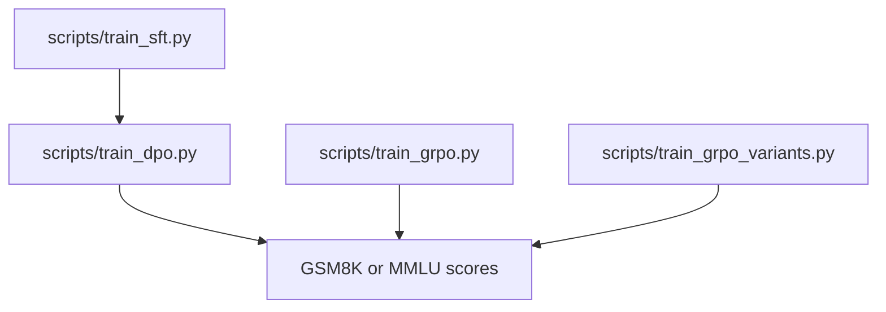

# SFT, DPO, and GRPO

Full-parameter supervised fine-tuning and DPO for Llama-3.1-8B, and GRPO for OLMo-2-0425-1B on GSM8K, including off-policy variants. The assignment scaffolding and tests come from Stanford CS336. The training code and the saved runs are mine.

The headline numbers were checked on October 7, 2026 against the committed logs. GPU training was not rerun for this page. All 14 GRPO configurations are in the repository root [`../results/grpo_config_summary.csv`](../results/grpo_config_summary.csv). SFT and DPO counts are in [`../results/sft_dpo_results.csv`](../results/sft_dpo_results.csv).

## Problem

Post-train a language model and record whether the recipe moves accuracy:

1. Fine-tune Llama-3.1-8B with full-parameter SFT, then run DPO from that checkpoint.
2. Train OLMo-2-0425-1B with on-policy GRPO and with off-policy clipped updates.
3. Score GSM8K answer accuracy and MMLU with the prompt, seed count, and question count attached to each number.

## Personal contribution

- Policy training in PyTorch with vLLM rollouts, weight synchronization, and rewards.
- On-policy GRPO in `cs336_alignment/grpo.py`, and off-policy clipping in `cs336_alignment/grpo_offpolicy.py`.
- Full-parameter SFT and the per-example DPO loss in `cs336_alignment/dpo.py`.
- The four-seed GSM8K runs and the Llama benchmark evaluations cited below.

`tests/adapters.py` calls this implementation.

## Workflow



## Key results

| Result | Model | Baseline | Dataset | Seeds | GPU | Evaluation |
|---|---|---|---|---|---|---|
| Off-policy clipped GRPO, **53.3%** mean answer accuracy, sample SD 2.2 percentage points | OLMo-2-0425-1B | On-policy standard GRPO at the same `1e-5` learning rate and `r1_zero` prompt. Standard mean is **38.1%** (`0.38134765625`). Standard takes 1 optimizer update per rollout batch; this run takes 32, so the comparison is not compute-matched. | GSM8K. First 6,400 rows of `data/gsm8k/train.jsonl`. Validation is the first **1,024** rows of `data/gsm8k/test.jsonl`, reused while configurations were selected. | **4 seeds, 0–3**, final step 200 | 2× RTX PRO 6000 Blackwell. Policy on `cuda:0`, vLLM on GPU 1. | Rollout batch 256, group size 8, temperature 1, top-p 1, 512 tokens, train batch 8, gradient accumulation 1, clip 0.2. Exact mean **0.532958984375**, sample SD **0.021681373690995244**. |
| SFT, MMLU **61.2%**, GSM8K **31.5%** | Llama-3.1-8B, full parameters, BF16 | Base zero-shot uses a different prompt, so that gap mixes prompt and training. Base MMLU is 8,153/14,042 and base GSM8K is 208/1,319. | One epoch on the safety-augmented UltraChat single-turn training set. That file is not committed. MMLU scored questions 14,042. GSM8K scored questions 1,319. | Training seed 0 | 1× RTX PRO 6000 | Alpaca prompt, greedy decoding, temperature 0, top-p 1, max tokens 512. Sequence length 512, microbatch 2, gradient accumulation 16, lr `2e-5`, AdamW. MMLU **8,598/14,042**. GSM8K **416/1,319**. |
| DPO, MMLU **60.3%**, GSM8K **29.7%** | Llama-3.1-8B initialized from the SFT checkpoint | Same Alpaca evaluation as SFT. Both scores are lower under this recipe. | Anthropic HH single-turn rows in `data/hh/`. 200 pairs held out. 49,188 training rows. beta 0.1. | Training seed 0 | Policy on `cuda:0`, frozen reference on `cuda:1` | lr `1e-6`, RMSprop, effective batch 64, greedy Alpaca evaluation. MMLU **8,470/14,042**. GSM8K **392/1,319**. |

The four `offpolicy_clip` final accuracies are 0.5380859375, 0.546875, 0.5458984375, and 0.5009765625. Clipped and unclipped off-policy means are close: 0.532958984375 and 0.530029296875. The 1,024 validation questions are a reused validation split, not an untouched final test.

## Code entry points

| Component | Path |
|---|---|
| On-policy GRPO | `cs336_alignment/grpo.py` |
| Off-policy GRPO | `cs336_alignment/grpo_offpolicy.py` |
| Recipe settings, including `offpolicy_clip` | `cs336_alignment/training_runtime.py` |
| DPO loss | `cs336_alignment/dpo.py` |
| SFT data | `cs336_alignment/sft_data.py` |
| Test adapters | `tests/adapters.py` |
| Train standard GRPO | `scripts/train_grpo.py` |
| Train variants and off-policy recipes | `scripts/train_grpo_variants.py` |
| Train SFT and DPO | `scripts/train_sft.py`, `scripts/train_dpo.py` |
| Saved GRPO runs | `results/offpolicy_clip_seed_0/` through `results/offpolicy_clip_seed_3/` |
| Saved benchmark summaries | `results_safety/` |
| Experiment notes | `writeup.md`, `writeup_safety.md` |
| Handouts | `cs336_spring2026_assignment5_alignment.pdf`, `cs336_spring2026_assignment5_supplement_safety_rlhf.pdf` |

## Setup

From this directory, with Python `>=3.12,<3.13`:

```sh
uv sync --no-install-package flash-attn
uv sync
```

`flash-attn` is required by the SFT and DPO scripts, which request `attn_implementation="flash_attention_2"`. The CPU unit tests do not need it.

```sh
uv run pytest tests/test_grpo.py
```

`tests/adapters.py` calls the completed implementations in `cs336_alignment/`. GSM8K, MMLU, and the four Anthropic HH training files are committed under `data/`. OLMo-2-0425-1B weights, Llama-3.1-8B weights, the SFT and DPO checkpoints, and the UltraChat training file are not. Commands, expected outputs, and the checks that have actually been run are in [`../docs/REPRODUCIBILITY.md`](../docs/REPRODUCIBILITY.md).
