# CS336 Assignment 5 Writeup

Problem statements are copied from `cs336_spring2026_assignment5_alignment.pdf` (English prose, not wrapped in code fences, so equations render). Written problems that do not need a GPU, code problems that passed the unit tests, and the chapter 4–7 experiments are filled in.

Submission: `writeup.pdf`, and `code.zip` produced by `test_and_make_submission.sh`.

## 3 Prompting

### 3.4 Experiments

#### Problem (prompting_baselines): Run OLMo-2-0425-1B on GSM8K (5 points)
Source:`cs336_spring2026_assignment5_alignment.pdf`

Run OLMo-2-0425-1B on GSM8K (5 points)

(a) Write a script to evaluate OLMo-2-0425-1B performance on GSM8K with zero-shot question_only, zero-shot r1_zero, and few-shot r1_zero_three_shot prompts.

Then, run your script and observe the outputs. For each prompt, how many model generations fall into each of the following categories: (1) correct with both format and correctness reward 1, (2) format reward 1 and correctness reward 0, (3) format reward 0 and correctness reward 0? Observing at least ten examples of category 2, how many model outputs are actually correct but just not parsed properly? What about category 3?

Deliverable: A few sentences of commentary, the evaluation metrics, and a few examples of prompts and responses.

(b) Observing the model outputs, characterize the model’s behavior with each prompt. For example, if we want the model to answer the question, is it enough to just provide the question, or does the model exhibit other behaviors besides just answering the question? How do the zero-shot r1_zero and few-shot r1_zero_three_shot prompts shape the model’s behavior?

Deliverable: A few sentences of commentary with supporting examples.


**Answer**

2026-09-29, AutoDL, 1× RTX PRO 6000, local weights `/root/autodl-tmp/models/OLMo-2-0425-1B`. The script is `cs336_alignment/prompting_baselines.py`, on the GSM8K test set of 1319 questions. The vLLM request sets `temperature=1.0` and `top_p=1.0` (the same top-p as the vLLM default) and `max_tokens=512`. `r1_zero` and `r1_zero_three_shot` stop at `</answer>` and keep that string. `question_only` does not set that stop string.

**(a)**

| prompt | format and answer correct | format correct, answer wrong | format wrong |
| --- | ---: | ---: | ---: |
| `question_only` | 2 (0.2%) | 292 (22.1%) | 1025 (77.7%) |
| `r1_zero` | 1 (0.1%) | 697 (52.8%) | 621 (47.1%) |
| `r1_zero_three_shot` | 267 (20.2%) | 978 (74.1%) | 74 (5.6%) |

The table is the three-way count printed by the test-set script. `prompting_baselines.py` does not save per-example outputs, and the original “look at 10 of each” pass was not kept in the repo, so the fractions below do not cite that pass. The examples come from the base-model validation file `val_rollouts_step_-1.jsonl` before training (seed 0, 1024 rows each). Rewards are the scores stored in that file.

The `question_only` template actually written into the prompt is `{question} Please put your final answer within \\boxed{{}}.` `render_prompt` replaces only `{question}` and does not collapse `{{` to `{`. The model sees a double backslash and double braces, not the `\boxed{}` used in the handout to describe scoring. The scorer still looks for `\boxed{...}` in the answer.

Example (`question_only`, format correct and answer wrong; gold answer 3). The prompt ends in `\\boxed{{}}`, and the response writes `\boxed{{7}}`:

```text
Prompt: …How many bolts in total does it take? Please put your final answer within \\boxed{{}}.
Response: …Total bolts for all robe outfits: 5 + 2 = 7. … \boxed{{7}}.
Ground truth: 3
format_reward: 1
answer_reward: 0
```

Example (`question_only`, format wrong). The response leaves the original question and has no parseable boxed answer:

```text
Response: Write your answer below to the answer above
Ground truth: 160
format_reward: 0
answer_reward: 0
```

Example (`r1_zero`, format correct and answer wrong). The `<answer>` says $18 a day, and the gold answer is 18, but `answer_reward` is still 0. The scorer does not reduce `$18` to `18`:

```text
Response: … </think> <answer> Janet has 16 - 3 (for breakfast) - 4 (for her muffins) = 9 fresh duck eggs daily. She sells her fresh duck eggs for $2 each, so she makes 9 x 2 = $18 a day at the farmers’ market. </answer>
Ground truth: 18
format_reward: 1
answer_reward: 0
```

Example (`r1_zero`, format wrong). The tags are not paired, and the number is not the gold answer:

```text
Response: … </think> Since white fiber is half mode of the blue one … So, it takes 1 + 3 + 2 = 6 bolts.</answer>
Ground truth: 3
format_reward: 0
answer_reward: 0
```

Example (`r1_zero_three_shot`, format correct and answer wrong). The tags are complete, and the number inside them is wrong:

```text
Response: … </think> <answer> $120 </answer>
Ground truth: 18
format_reward: 1
answer_reward: 0
```

These examples show the behavior, not a ten-example rate on the test set. Category 2 can contain an answer that a person would mark correct and the parser marks wrong (the `$18` above). Category 2 under three-shot can also be only an arithmetic error. Category 3 is a tag or boxed span that is not complete.

**(b)**

Putting only the question into `question_only` is not enough. The template asks for the answer inside `\\boxed{{}}`, and the model often still does not answer. The format-wrong response above does not give a boxed answer. It writes “Write your answer below to the answer above”.

Zero-shot `r1_zero` pulls about half of the outputs into `</think> <answer>`, but the reasoning often repeats the question or changes course. Only 1 of 1319 questions is correct in both format and answer.

Three-shot `r1_zero_three_shot` makes the model copy the tags in the examples. Format errors fall to 74/1319 (5.6%), and correct answers rise to 267/1319 (20.2%). The validation response above puts `$120` in a complete `<answer>`. The gold answer is 18. The error is arithmetic, not the tags.

---

## 4.1 Deriving on-policy GRPO

### 4.1.5 Baseline

#### Problem (baseline_calcs): Variance of the policy-gradient estimator (5 points)
Source:`cs336_spring2026_assignment5_alignment.pdf`

Compute the variance of the policy gradient estimator (5 points)

Let \(\pi_\theta\) define a policy over the binary action space \(\mathcal A=\{0,1\}\) with \(\pi_\theta(A=1)=p=\sigma(\theta)\), where \(\sigma\) represents the sigmoid function \(\sigma(\theta)=\frac{1}{1+e^{-\theta}}\). Our binary reward function will assign reward 1 to action \(A=1\) and reward 0 otherwise, or \(r(A)=\mathbf 1\{A=1\}\).

**(a)** Let the policy gradient estimator be given by

\[
\frac1n\sum_{i=1}^n r(A_i)\nabla_\theta\log\pi_\theta(A_i),
\tag{18}
\]

given \(n\) samples \(A_i\stackrel{iid}{\sim}\pi_\theta\). What is the variance of this estimator?

Deliverable: An expression in terms of \(n\) and \(p\), accompanied by a derivation.

**(b)** Let the baseline-adjusted policy gradient estimator be given by

\[
\frac1n\sum_{i=1}^n
(r(A_i)-b)\nabla_\theta\log\pi_\theta(A_i),
\tag{19}
\]

given \(n\) samples \(A_i\stackrel{iid}{\sim}\pi_\theta\). What is the variance of this estimator?

Deliverable: An expression in terms of \(n\), \(b\), and \(p\), accompanied by a derivation and some discussion.

**(c)** What is the resulting variance if we substitute the “population mean” baseline \(b=p\)? Compare this variance to that of the unadjusted policy gradient estimator: is it always lower, always higher, or sometimes higher or lower depending on \(p\)?


**Answer**

\(\nabla_\theta\log\pi_\theta(A=1)=1-p\) and \(\nabla_\theta\log\pi_\theta(A=0)=-p\). The summand in (18) is therefore 0 when \(A=0\), and \(1-p\) when \(A=1\). A single sample \(Z\) equals \(1-p\) with probability \(p\), and 0 otherwise.

\[
\mathbb E[Z]=p(1-p),\qquad
\mathbb E[Z^2]=p(1-p)^2,
\]

\[
\mathrm{Var}(Z)=p(1-p)^2-p^2(1-p)^2=p(1-p)^3.
\]

Averaging \(n\) independent samples, the variance in **(a)** is \(p(1-p)^3/n\).

**(b)** The summand is \((1-b)(1-p)\) when \(A=1\), and \(bp\) when \(A=0\). The expectation is still \(p(1-p)\), so any constant \(b\) leaves that expectation unchanged. The second moment is

\[
\mathbb E[Z_b^2]=p(1-b)^2(1-p)^2+(1-p)b^2p^2.
\]

Subtracting \([p(1-p)]^2\) gives \(\mathrm{Var}(Z_b)=p(1-p)(1-p-b)^2\). The variance of the average is

\[
\frac{p(1-p)(1-p-b)^2}{n}.
\]

\(b=0\) recovers (a). The variance is smaller as \(b\) gets closer to \(1-p\).

**(c)** Substituting \(b=p\) gives variance \(p(1-p)(1-2p)^2/n\). Relative to (a), the ratio is \((1-2p)^2/(1-p)^2\). It is lower when \(p<2/3\), equal when \(p=2/3\), and higher when \(p>2/3\). When \(p\) is near 1, \(A=0\) is rare, but \(b=p\) still adds a term of order \(p^2\) on those samples, so the noise is larger than with no baseline.

---

## 4.2 Implementing on-policy GRPO

### 4.2.1 Using Hugging Face models

#### Problem (tokenize_prompt_and_output): Prompt and output tokenization (1 point)
Source:`cs336_spring2026_assignment5_alignment.pdf`

Prompt and output tokenization (1 point)

Deliverable: Implement a method tokenize_prompt_and_output that tokenizes the prompt and output separately, concatenates them together without inserting special tokens, and constructs a response_mask. The following interface is recommended: def tokenize_prompt_and_output(

    prompt_strs: list[str],

    output_strs: list[str],

    tokenizer: PreTrainedTokenizer,

) -> dict[str, torch.Tensor]:

Tokenize the prompt and output strings, and construct a mask aligned with labels that is 1 for response tokens and 0 for other tokens (prompt or padding).

Args:

• prompt_strs: list[str] List of prompt strings.

• output_strs: list[str] List of output strings.

• tokenizer: PreTrainedTokenizer Tokenizer to use for tokenization.

Returns:

• dict[str, torch.Tensor]. Let prompt_and_output_lens be a list containing the lengths of the concatenated tokenized prompt and output strings. Then the returned dictionary should have the following keys:

- input_ids torch.Tensor of shape (batch_size, max(prompt_and_output_lens) - 1): the tokenized prompt and output strings, with the final token sliced off.

- labels torch.Tensor of shape (batch_size, max(prompt_and_output_lens) - 1): shifted input ids, i.e., the input ids without the first token.

14

- response_mask torch.Tensor of shape (batch_size, max(prompt_and_output_lens) - 1): a mask aligned with labels, with value 1 where the corresponding label token is part of the response and 0 otherwise.

To test your code, implement adapters.run_tokenize_prompt_and_output . Then, run the test with uv run pytest -k test_tokenize_prompt_and_output and make sure your implementation passes it.


**Answer**

Let `prompt_and_output_lens` be the list of lengths of the concatenated token sequences. The returned dictionary should contain:

- `input_ids`: shape
  `(batch_size, max(prompt_and_output_lens) - 1)`;
  the concatenated token sequence with the last token removed.
- `labels`: same shape; shifted input IDs, that is, the sequence with the first token removed.
- `response_mask`: same shape; aligned with `labels`, with 1 on label tokens that belong to the response and 0 on prompt and padding positions.

How to test: implement `adapters.run_tokenize_prompt_and_output` in `tests/adapters.py`, then run:

```bash
uv run pytest -k test_tokenize_prompt_and_output
```

The model forward pass can be written as:

```python
input_ids = train_batch["input_ids"].to(device)
labels = train_batch["labels"].to(device)
logits = model(input_ids).logits
```

The next function computes the conditional log-probability of each response token under the model. This is the core primitive for the policy gradient. RL also often logs per-token entropy, so the function also needs to support `return_token_entropy`.

The implementation is `tokenize_prompt_and_output` in `cs336_alignment/grpo.py`. The prompt and the output are encoded separately, with no special tokens, and concatenated directly. `input_ids` drops the last token, `labels` drops the first token, and `response_mask` is aligned with `labels`. On 2026-09-29, `.venv/bin/python -m pytest tests/test_grpo.py` on a local Mac reported 19 passed, including `test_tokenize_prompt_and_output`.

---

#### Problem (get_response_log_probs): Response log-probability and entropy (1 point)
Source:`cs336_spring2026_assignment5_alignment.pdf`

Response log-probs (and entropy) (1 point)

Deliverable: Implement a method get_response_log_probs that gets per-token conditional logprobabilities (given the previous tokens) from a causal language model, and optionally the entropy of the model’s next-token distribution.

The following interface is recommended: def get_response_log_probs(

    model: PreTrainedModel,

    input_ids: torch.Tensor,

    labels: torch.Tensor,

    return_token_entropy: bool = False,

) -> dict[str, torch.Tensor]:

Args:

• model: PreTrainedModel HuggingFace model used for scoring (placed on the correct device and in inference mode if gradients should not be computed).

• input_ids: torch.Tensor shape (batch_size, sequence_length), concatenated prompt + response tokens as produced by your tokenization method.

• labels: torch.Tensor shape (batch_size, sequence_length), labels as produced by your tokenization method.

• return_token_entropy: bool If True, also return per-token entropy.

Returns:

• dict[str, torch.Tensor].

- "log_probs" shape (batch_size, sequence_length), conditional log-probabilities log 𝑝𝜃(𝑥𝑡 | 𝑥<𝑡).

- "token_entropy" optional, shape (batch_size, sequence_length), per-token entropy for each position (present only if return_token_entropy=True).

To test your code, implement adapters.run_get_response_log_probs . Then run uv run pytest

-k test_get_response_log_probs and ensure the test passes.


**Answer**

  \[
  \log p_\theta(x_t\mid x_{<t}).
  \]
- `"token_entropy"`: optional, same shape, present only when `return_token_entropy=True`.

Test:

```bash
uv run pytest -k test_get_response_log_probs
```

`get_response_log_probs` applies `log_softmax` to `model(input_ids).logits` and gathers the log-probabilities at `labels`. When `return_token_entropy=True`, it computes the entropy of that same distribution at each position. `test_get_response_log_probs` passed in the same test run.

---

## 4.2 Implementing on-policy GRPO

### 4.2.3 Components of GRPO

#### Problem (compute_rollout_rewards): Computing rollout rewards (1 point)
Source:`cs336_spring2026_assignment5_alignment.pdf`

Computing the rewards of rollouts (1 point)

Deliverable: Implement a method compute_rollout_rewards that calculates raw rewards for each rollout response.

The following interface is recommended: def compute_rollout_rewards(

    reward_fn: Callable[[str, str], dict[str, float]],

    rollout_responses: list[str],

    repeated_ground_truths: list[str],

) -> tuple[torch.Tensor, dict[str, float]]:

Compute rewards for a list of rollout responses, along with metadata for the reward components.

Args:

• reward_fn: Callable[[str, str], dict[str, float]] Scores the rollout responses against the ground truths, producing a dict with keys "reward", "format_reward", and "answer_reward".

• rollout_responses: list[str] Rollouts from the policy. The length of this list is rollout_batch_size = n_prompts_per_rollout_batch * group_size.

• repeated_ground_truths: list[str] The ground truths for the examples. The length of this list is rollout_batch_size, because the ground truth for each example is repeated group_size times.

Returns:

• tuple[torch.Tensor, dict[str, float]].

- raw_rewards shape (rollout_batch_size,). Unnormalized rewards for each rollout response.

- metadata Reward statistics to log. At minimum, include the mean total and format rewards over the rollout batch.

To test your code, implement adapters.run_compute_rollout_rewards . Then, run the test with uv run pytest -k compute_rollout_rewards and make sure your implementation passes it.


**Answer**

`compute_rollout_rewards` calls `reward_fn` on each rollout, collects `"reward"` into a `float32` vector, and records the mean total, format, and answer rewards. `test_compute_rollout_rewards` passed.

---

#### Problem (compute_group_normalized_rewards_grpo): Group normalization (1 point)
Source:`cs336_spring2026_assignment5_alignment.pdf`

Group normalization (1 point)

Deliverable: Implement a method compute_group_normalized_rewards that normalizes raw rewards within their groups and returns the normalized rewards along with any metadata you think is useful.

For now, you only need to support baseline = "mean" and advantage_normalizer = "std". Feel free to raise a NotImplementedError for unsupported inputs. In later parts of the assignment we will implement the other options and run ablations. Remember to add advantage_eps to the normalizer to avoid division by zero.

The following interface is recommended: def compute_group_normalized_rewards(

    raw_rewards: torch.Tensor,

    group_size: int,

    baseline: Literal["mean", "none"] = "mean",

    advantage_eps: float = 1e-6,

    advantage_normalizer: Literal["std", "none", "mean"] = "std",

):

Compute advantages by applying the requested baseline and normalization within each group.

Args:

• raw_rewards: torch.Tensor shape (rollout_batch_size,). Unnormalized rewards for each rollout response, where rollout_batch_size = n_prompts_per_rollout_batch * group_size.

• group_size: int Number of responses per question (group).

• baseline: Literal["mean", "none"] For this problem, support mean, which subtracts the pergroup mean reward. Later, none will mean no baseline subtraction.

• advantage_eps: float Small constant to avoid division by zero in normalization.

• advantage_normalizer: Literal["std", "none", "mean"] For this problem, support std, which divides by the per-group standard deviation. Later, none will mean no normalization and mean will mean divide by the per-group mean reward.

Returns:

• tuple[torch.Tensor, dict[str, float]].

- advantages shape (rollout_batch_size,). Group-normalized rewards for each rollout response.

- metadata your choice of other statistics to log (e.g. mean, std, max/min of rewards).

To test your code, implement adapters.run_compute_group_normalized_rewards . Then, run the test with uv run pytest -k compute_group_normalized_rewards_grpo and make sure your implementation passes it.


**Answer**

\[
J_\theta^{\text{GRPO-on-policy}}
=
\frac1{BG}
\sum_{i=1}^{B}\sum_{j=1}^{G}
\frac1{\operatorname{len}(y^{(i,j)})}
\sum_{t=1}^{\operatorname{len}(y^{(i,j)})}
\frac{r(y^{(i,j)}\mid x^{(i)})-\mu_i}{\operatorname{std}_i}
\log\pi_\theta(y_t^{(i,j)}\mid x^{(i)},y_{<t}^{(i,j)}).
\tag{32}
\]

This expression is not a loss that training should keep decreasing in the usual sense. It is only an objective whose derivative is the policy gradient we want.

Because a PyTorch optimizer defaults to gradient descent, the implementation should return the **negative** of this objective.

`compute_policy_gradient_loss` computes the loss term for each token and each sequence; `aggregate_loss_across_microbatch` then aggregates over the token and sequence dimensions.

With `baseline="mean"` and `advantage_normalizer="std"`, `compute_group_normalized_rewards` groups by `group_size`, subtracts the within-group mean, and divides by that group's sample standard deviation plus `advantage_eps`. `test_compute_group_normalized_rewards_grpo` passed.

---

#### Problem (compute_policy_gradient_loss_on_policy): On-policy policy gradient (1 point)
Source:`cs336_spring2026_assignment5_alignment.pdf`

On-policy policy gradient (1 point)

Deliverable: Implement a method compute_policy_gradient_loss that computes the per-token policy-gradient loss given raw rewards or pre-computed advantages.

For now, we will assume all rollouts are on-policy, so you only need to support importance_reweighting_method = "none", and you can ignore the old-log-prob and clipping arguments. Feel free to raise a NotImplementedError for unsupported inputs. We will implement clipping later in the assignment.

The following interface is recommended: def compute_policy_gradient_loss(

    raw_rewards_or_advantages: torch.Tensor,

    policy_log_probs: torch.Tensor,

    importance_reweighting_method: Literal["none", "noclip", "grpo", "gspo"] = "none",

    old_log_probs: torch.Tensor | None = None,

    cliprange: float | None = None,

    response_mask: torch.Tensor | None = None,

) -> tuple[torch.Tensor, dict[str, torch.Tensor]]:

Compute the policy-gradient loss at every token, where raw_rewards_or_advantages is either the raw reward or an already-normalized advantage.

Args:

• raw_rewards_or_advantages: torch.Tensor Shape (batch_size,) or (batch_size, 1), scalar reward/advantage for each rollout response.

• policy_log_probs: torch.Tensor Shape (batch_size, sequence_length), logprobs for each token.

• importance_reweighting_method: Literal["none", "noclip", "grpo", "gspo"] "none": no importance reweighting; "noclip": apply importance reweighting without clipping; "grpo": do

PPO/GRPO-style token-level reweighting and clipping; "gspo": do GSPO-style sequence-level reweighting and clipping.

• old_log_probs: torch.Tensor | None Required unless importance_reweighting_method =

"none"; shape (batch_size, sequence_length).

• cliprange: float | None = None Clip parameter 𝜀, required when importance_reweighting_method is "grpo" or "gspo".

• response_mask: torch.Tensor | None = None Optional shape (batch_size, sequence_length) mask over response tokens. Required for GSPO implementations that average the sequencelevel log-ratio over response tokens only.

Returns:

• tuple[torch.Tensor, dict[str, torch.Tensor]].

- per_token_policy_gradient_loss Shape (batch_size, sequence_length), the per-token policy-gradient loss (to be aggregated across the batch and sequence dimensions in the training loop).

- metadata Statistics from the underlying loss call, such as clip-fraction components.

To test your code, implement adapters.run_compute_policy_gradient_loss . Then run uv run pytest -k test_compute_policy_gradient_loss_on_policy and ensure the test passes.


**Answer**

When `importance_reweighting_method="none"`, the per-token loss is `-(advantage * log_prob)`. The sign is negative because the optimizer performs gradient descent. `test_compute_policy_gradient_loss_on_policy` passed.

---

#### Problem (aggregate_loss_across_microbatch_sequence): Aggregate loss across tokens and sequences (0.5 points)
Source:`cs336_spring2026_assignment5_alignment.pdf`

Aggregate loss across tokens and sequences (0.5 points)

Deliverable: Implement a method aggregate_loss_across_microbatch that takes in the pertoken policy-gradient loss and the response mask, and outputs the average loss. For now, we will use standard GRPO aggregation, which involves first averaging within each sequence, and then averaging over sequences, so you can assume loss_normalization = "sequence". Feel free to raise a NotImplementedError for unsupported inputs.

The following interface is recommended: def aggregate_loss_across_microbatch(

    per_token_policy_gradient_loss: torch.Tensor,

    mask: torch.Tensor,

    loss_normalization: Literal["sequence", "constant"] = "sequence",

    normalization_constant: int | None = None,

) -> torch.Tensor:

Aggregate the per-token policy-gradient loss according to the response mask and lossnormalization strategy.

Args:

• per_token_policy_gradient_loss: torch.Tensor Shape (batch_size, sequence_length), the per-token policy-gradient loss (to be aggregated across the batch and sequence dimensions in the training loop).

• mask torch.Tensor of shape (batch_size, sequence_length) denoting which positions should be included in the loss.

• loss_normalization: Literal["sequence", "constant"] = "sequence" "sequence": average loss over each sequence, then average over sequences; "constant": normalize total loss by a constant.

• normalization_constant: int | None = None The constant to divide total loss by; required if loss_normalization = "constant".

Returns:

• loss: torch.Tensor A scalar containing the average loss. Make sure you can later call backward on this loss.

To test your code, implement adapters.run_aggregate_loss_across_microbatch . Then run uv run pytest -k test_aggregate_loss_across_microbatch_sequence and ensure the test passes.

20


**Answer**

When `loss_normalization="sequence"`, average the positions where the mask is true within each sequence, then average over sequences. `test_aggregate_loss_across_microbatch_sequence` passed.

---

## 4.2 Implementing on-policy GRPO

### 4.2.4 GRPO training step

#### Problem (grpo_train_step_standard_on_policy): GRPO train step (5 points)
Source:`cs336_spring2026_assignment5_alignment.pdf`

GRPO train step (5 points)

Deliverable: Implement a single batch update for policy gradients, given the model, tokenizer, and rollouts. For this part of the assignment, you only need to implement this function for standard GRPO in the on-policy setting, or baseline = "mean", advantage_normalizer = "std", importance_reweighting_method = "none", and loss_normalization = "sequence". Feel free to raise a NotImplementedError for unsupported inputs.

The following interface is recommended: def grpo_train_step(

    model: PreTrainedModel,

    tokenizer: PreTrainedTokenizer,

    optimizer: Optimizer,

    gradient_accumulation_steps: int,

    max_grad_norm: float | None,

    reward_fn: Callable[[str, str], dict[str, float]],

    repeated_prompts: list[str],

    rollout_responses: list[str],

    repeated_ground_truths: list[str],

    group_size: int,

    # Reward normalization

    baseline: Literal["mean", "none"] = "mean",

    advantage_eps: float = 1e-6,

    advantage_normalizer: Literal["std", "none", "mean"] = "std",

    # Importance reweighting and clipping

    importance_reweighting_method: Literal["none", "noclip", "grpo", "gspo"] = "none",

    old_log_probs: torch.Tensor | None = None,

    cliprange: float | None = None,

    # Loss normalization

    loss_normalization: Literal["sequence", "constant"] = "sequence",

    normalization_constant: int | None = None,

) -> tuple[torch.Tensor, dict[str, torch.Tensor | float]]:

Execute forward-and-backward passes, with gradient_accumulation_steps microbatches.

Args:

• model: PreTrainedModel HuggingFace model to train.

• tokenizer: PreTrainedTokenizer Tokenizer to use for tokenization.

• optimizer: Optimizer Optimizer for the model.

• gradient_accumulation_steps: int Number of microbatches per optimizer step.

• max_grad_norm: float | None If not None, clip the gradient norm to this value before calling optimizer.step().

• reward_fn: Callable[[str, str], dict[str, float]] Scores the rollout responses against the ground truths, producing a dict with keys "reward", "format_reward", and "answer_reward".

• repeated_prompts: list[str] The prompts for the examples. The length of this list is rollout_batch_size, because the prompt for each example is repeated group_size times.

• rollout_responses: list[str] Rollouts from the policy. The length of this list is rollout_batch_size = n_prompts_per_rollout_batch * group_size.

• repeated_ground_truths: list[str] The ground truths for the examples. The length of this list is rollout_batch_size, because the ground truth for each example is repeated group_size times.

• group_size: int Number of responses per question (group).

• baseline: Literal["mean", "none"] If mean, subtract the per-group mean reward; if none, do nothing.

• advantage_eps: float Small constant to avoid division by zero in normalization.

• advantage_normalizer: Literal["std", "none", "mean"] If std, divide by the per-group standard deviation; if none, do nothing; if mean, divide by the per-group mean reward.

• importance_reweighting_method: Literal["none", "noclip", "grpo", "gspo"] "none": no importance reweighting; "noclip": apply importance reweighting without clipping; "grpo": do

PPO/GRPO-style token-level reweighting and clipping; "gspo": do GSPO-style sequence-level reweighting and clipping.

• old_log_probs: torch.Tensor | None Required unless importance_reweighting_method =

"none"; shape (batch_size, sequence_length).

• cliprange: float | None = None Clip parameter 𝜀, required when importance_reweighting_method is "grpo" or "gspo".

• loss_normalization: Literal["sequence", "constant"] = "sequence" "sequence": average loss over each sequence, then average over sequences; "constant": normalize total loss by a constant

(fixed for all of training).

• normalization_constant: int | None = None The constant to divide total loss by; required if loss_normalization = "constant".

Returns:

• tuple[torch.Tensor, dict[str, torch.Tensor]].

- loss scalar tensor. The batch loss, adjusted for gradient accumulation. We return this so we can log it.

- metadata Dict with metadata from the underlying loss call, gradient norm before clipping, and any other statistics you might want to log.

To test your code, implement adapters.run_grpo_train_step . Then run uv run pytest -k test_grpo_train_step_standard_on_policy and confirm it passes.


**Answer**

`grpo_train_step` first computes rewards and advantages for the whole batch, then runs the forward and backward passes by microbatch. Under sequence normalization, each microbatch loss is multiplied by `microbatch_size / batch_size`. After all backward passes, `clip_grad_norm_` returns the global gradient norm **before clipping**, then `optimizer.step()` is called and the gradients are cleared to `None`. The returned `metadata` contains `loss`, `grad_norm`, `token_entropy`, `mean_reward`, and `mean_format_reward` (for on-policy runs the metadata from the underlying `compute_policy_gradient_loss` is empty). `test_grpo_train_step_standard_on_policy` passed. Full GSM8K training is not part of this problem's unit test.

---

## 4.3 Experiments

#### Problem (grpo_experiments_standard_on_policy): Use GRPO to improve OLMo-2-0425-1B performance on GSM8K (about 2 B200 hours, 10 points)
Source:`cs336_spring2026_assignment5_alignment.pdf`

Use GRPO to improve OLMo-2-0425-1B performance on GSM8K (2 B200 hrs) (10 points)

(a) Write a script that runs the GRPO training loop given a model name, prompt, training set file path, validation set file path, sampling hyperparameters, and training hyperparameters.

At a high level, the script will involve first initializing the vLLM server, wandb logging, datasets, model, and optimizer. Then, the training loop involves repeating the following: sync weights with the vLLM server, produce training rollouts, take policy gradients on training batches, and periodically check performance on the validation set (while logging generations).

Deliverable: A script to run GRPO (standard, on-policy) on task GSM8K and model OLMo-2-0425-1B.

(b) Run the script for roughly 50 steps and confirm that you see validation rewards improving, along with sensible rollouts over time. Note: it is normal for the reward to start close to zero, and depending on the random seed it may take a few steps before we sample rollouts with non-zero rewards and the model starts improving.

Deliverable: Evidence that convinced you that your script is correct (e.g. validation rewards improving each step, reasonable-looking rollouts).

(c) Once you have confidence that the script is correct, run it using the hyperparameters provided above, with 4 random seeds, for OLMo-2-0425-1B on GSM8K. You should use the zero-shot r1_zero prompt. If the code is correct, you should see that validation rewards improve as the model is trained.

Log the following metrics, and produce plots of them over time, while noting the variance between runs (e.g. by plotting mean/std or min/max over runs).

• The loss.

• Gradient norm.

• Token entropy.

• Train rewards (total, format).

• Val rewards (total, format).

• Val average response length.

• Anything else you think could be useful for debugging.

Please also log the rollouts periodically and observe them. Do the responses improve as a result of training?

Deliverable: A few sentences of commentary and a plot for each metric, describing how it changes over training and how much variance there is between runs.

Deliverable: A few examples of the model rollouts before and after training.

Deliverable: A procedure that achieves a final validation accuracy of at least 25%, averaged across random seeds.


**Answer**

2026-10-02, AutoDL, 2× RTX PRO 6000 Blackwell (96GB each). Training is on physical GPU 0 and vLLM is on physical GPU 1. The model is the local `/root/autodl-tmp/models/OLMo-2-0425-1B`. The entry point is `scripts/train_grpo.py`. The four seeds are launched serially by `scripts/run_all_experiments.sh standard`. The prompt is zero-shot `r1_zero`. Hyperparameters follow the handout: 6400 training examples, 1024 validation examples, learning rate \(1\times10^{-5}\), 256 responses per step, group size 8, 32 gradient-accumulation steps, AdamW \((\beta_1,\beta_2)=(0.9,0.95)\), weight decay 0, gradient clipping 1.0, temperature 1.0, top-p 1.0, and a maximum of 512 tokens. Validation runs every 10 steps, and training rollouts are saved every 40 steps. For `r1_zero`, the total reward matches the answer reward, so the validation total-reward curve and the answer accuracy are the same curve.

**(a)** The script starts from the model, prompt, train and validation files, and the sampling and training hyperparameters. In the loop it first syncs the current policy to vLLM and clears the prefix cache, then samples rollouts, takes one on-policy update, and periodically logs generations on the validation set.

**(b)** Seed 0 was run for 50 steps first, in `results/smoke_seed0`. The validation answer reward is still 0.1% at steps \(-1\) and 20, 0.3% at step 30, rises to 11.6% at step 40, and is 29.0% at step 50. For the first 20-plus steps the training reward and the loss are 0: the 8 responses in a group have the same reward, the advantage is 0, and that step updates no parameters. Validation accuracy rises only after the first correct rollouts appear. After training, responses put the calculation inside `<answer>` instead of emitting only an unclosed reasoning span.

**(c)** Each of the four seeds runs 200 steps, in `results/standard_seed_0` through `results/standard_seed_3`. The final validation answer rewards are 47.9%, 45.6%, 12.3%, and 46.7%, with mean **38.1%**, above 25%. Seed 2 pulls the mean down; the other three are above 45%, and all stay near 45% after step 100. The gap across seeds is mainly in steps 40–80: seeds 0 and 3 rise first, seed 1 is about 20 steps later, and seed 2 stays near 12%.

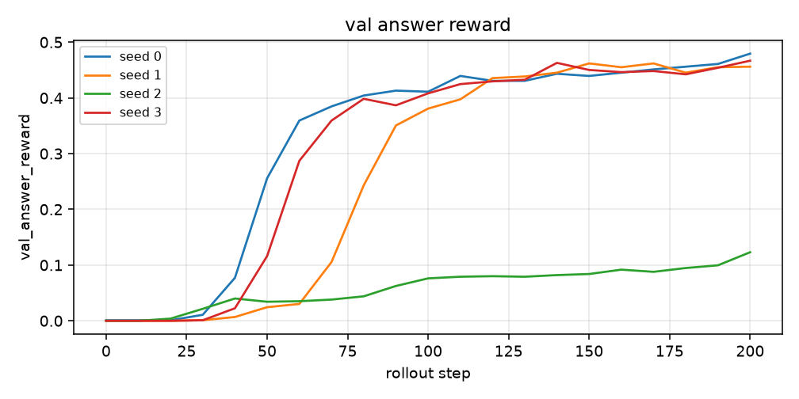

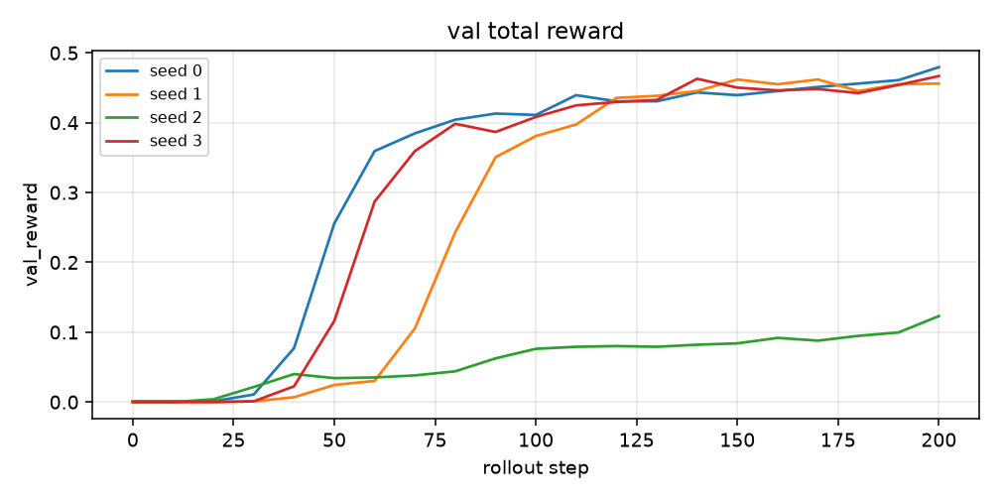

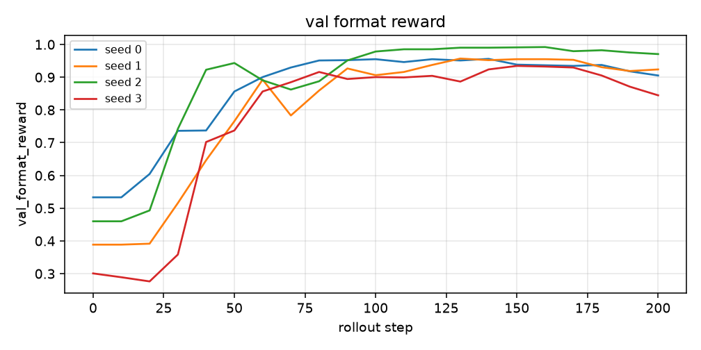

The validation format reward rises to 84%–97% for all four seeds. The total reward coincides with the answer reward. The share of format-correct, answer-wrong outputs falls on the successful seeds and stays high on seed 2: its format reward is 97.1% and its answer reward is only 12.3%.

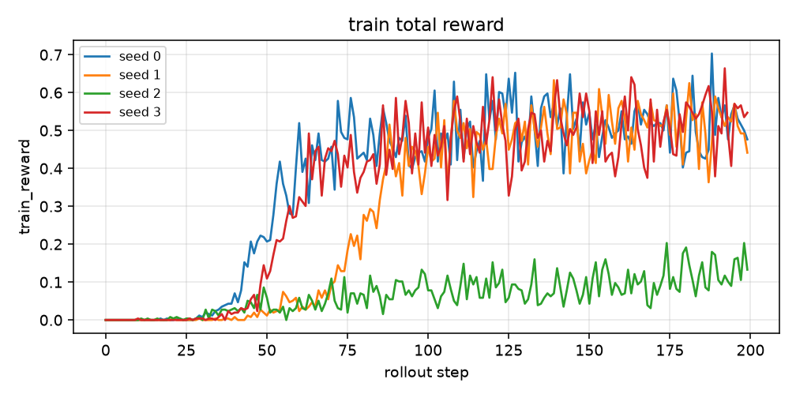

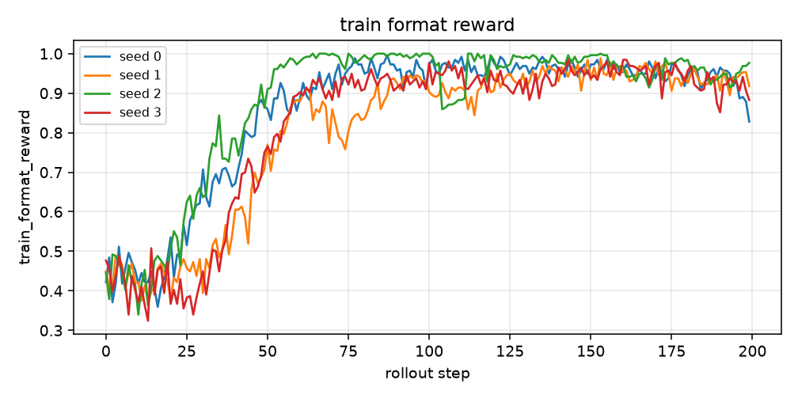

The training total reward moves with the validation answer reward. Successful seeds have a training reward of about 0.45–0.55 in the second half; seed 2 mostly stays below 0.15. The format reward also rises, and the spread across seeds is smaller than for the total reward.

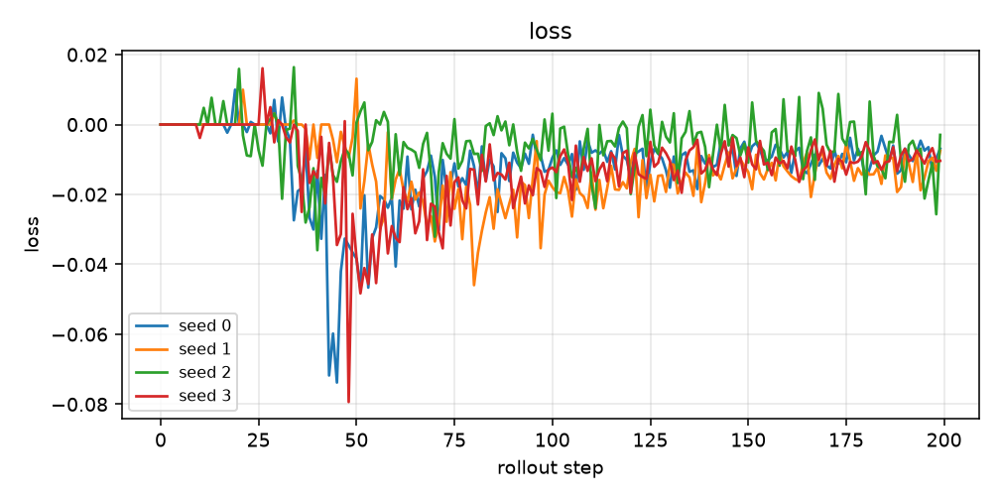

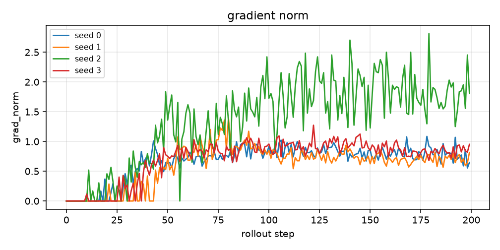

The loss is the negated policy gradient, so it falls below 0 as more tokens are correct, rather than moving toward 0 like cross-entropy. For the first 20–30 steps the loss and the gradient norm are 0 for all four seeds. After that the loss settles around \(-0.04\) to \(-0.01\) and does not diverge. The logged `grad_norm` is the norm before clipping, and the clip cap is 1.0. The medians for seeds 0, 1, and 3 are 0.71–0.84, and only 5, 12, and 20 of the 200 steps exceed 1. Seed 2 is higher: 143/200 steps are greater than 1, the median is 1.48, and the maximum is 2.81, so those updates are clipped to 1.0.

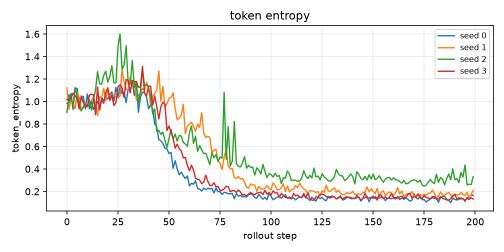

Token entropy starts fluctuating near 1 and, after step 40, falls to 0.15–0.2 as accuracy rises. Seed 2 drops later and stays near 0.3 in the second half, more uncertain than the other three. This plot averages every response token in the step, including steps where the whole group's advantage is 0 and therefore no parameters are updated. The current `grpo_train_step` computes entropy only on the nonzero-advantage sequences passed into the model. Later experiments that use this code cannot compare entropy numbers directly with this plot.

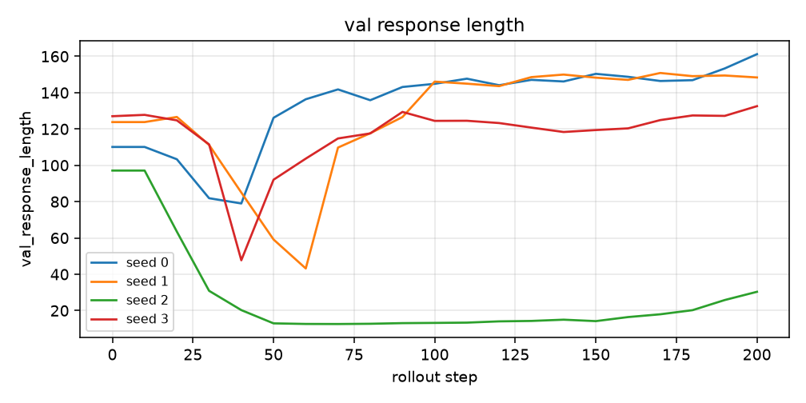

The three successful seeds first shorten responses to about 50–80 tokens before accuracy rises, then lengthen them to 130–160. Seed 2 falls from about 100 tokens to around 15 and ends at 30.3. It learns the short `<answer>` format, but often compresses the reasoning into one line and gets the arithmetic wrong. Of the 256 training responses in `results/standard_seed_2/rollouts_step_40.jsonl`, 168 still contain the placeholder sentence from the prompt, "reasoning process here", for example `reasoning process here </think> <answer> 95 </answer>`.

Before training (seed 0, validation, format wrong and answer wrong). The gold answer is 3:

> A robe takes 2 bolts of blue fiber and half that much white fiber. How many bolts in total does it take?
>
> It would take 1 bolt for each 50% of the white fiber if each piece takes the same amount of bolt. Since white fiber is half mode of the blue one, it would need 3 bolts for 50% of it. And for the actual 100%, which is 2 bolts, it would need 2 bolts. So, it takes 1 + 3 + 2 = 6 bolts.

The same question after training:

> A robe takes 2 bolts of blue fiber and half that much white fiber. So, it takes 2 bolts of blue fiber and 1 bolt of white fiber. In total, it takes 2 + 1 = 3 bolts of fiber for the robe. `</think> <answer> 3 </answer>`

On another question, before training the weekly distance is computed as 810 and the tag is not closed. The gold answer is 540. After training it is written as \(60\times 3\times 3=540\) and placed inside `<answer>`. Responses can become correct with training, but seed 2 shows that this does not happen for every random seed.

---

#### Problem (grpo_learning_rate): Tune the learning rate (about 4 B200 hours, 3 points)
Source:`cs336_spring2026_assignment5_alignment.pdf`

Tune the learning rate (4 B200 hrs) (3 points)

Starting from the suggested hyperparameters, perform a sweep over the learning rates (at least one learning rate less than the recommended default, and one learning rate greater than it), and report the final validation rewards (or note divergence if the optimizer diverges). Based on the amount of variance you observed in the previous part, you should decide how many random seeds you want to use for each training run. For the rest of the assignment, feel free to use your tuned learning rate instead of the suggested default, if you would like.

Deliverable: A plot of final validation reward versus learning rate, with a few sentences of commentary.


**Answer**

In section 4.3 one seed stays at 12.3%, and the sample standard deviation is about 17 percentage points, so each learning rate still uses 4 seeds. The other hyperparameters match standard GRPO. The comparison is \(5\times10^{-6}\), the handout default \(1\times10^{-5}\), and \(3\times10^{-5}\). The \(1\times10^{-5}\) numbers are taken directly from `results/standard_seed_*` and were not rerun. No run shows gradient explosion or a diverging loss.

| Learning rate | Final validation answer reward of the four seeds | Mean | Sample standard deviation |
| --- | --- | ---: | ---: |
| \(5\times10^{-6}\) | 39.4%, 39.5%, 36.5%, 38.8% | 38.5% | 1.4 pp |
| \(1\times10^{-5}\) | 47.9%, 45.6%, 12.3%, 46.7% | 38.1% | 17.2 pp |
| \(3\times10^{-5}\) | 53.2%, 4.1%, 4.7%, 49.6% | 27.9% | 27.2 pp |

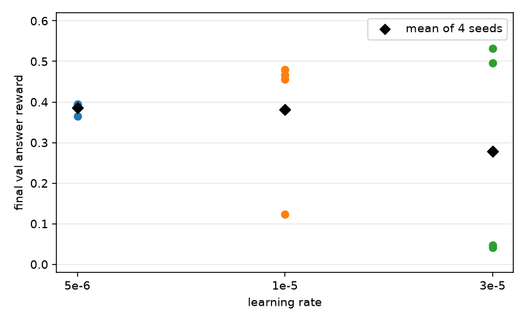

Successful seeds at all three learning rates land in 36%–53%. The mean is almost determined by the failed seeds: all four runs at \(5\times10^{-6}\) succeed, the mean matches the default learning rate, and the spread is much smaller. The best seed at \(3\times10^{-5}\) is the highest, at 53.2%, but two runs fall to about 4%, the final responses are only about 11 tokens, and the format reward is 100%. After the learning rate is increased, the model more readily collapses to very short outputs that are format-correct and answer-wrong. The later prompt ablation still uses \(1\times10^{-5}\), so it stays comparable with the `r1_zero` results above. If the goal is stability, \(5\times10^{-6}\) is the better choice.

---

#### Problem (grpo_prompt_ablation): Prompt ablation (about 4 B200 hours, 3 points)
Source:`cs336_spring2026_assignment5_alignment.pdf`

Prompt ablation (4 B200 hrs) (3 points)

Run the GRPO script with the question_only prompt and the r1_zero_three_shot prompt, with a few random seeds. Compared to the zero-shot r1_zero prompt results above, how do these prompts perform? Which prompts have the best average reward, and the lowest variance? Are there other systematic differences in the other logged metrics? Based on the variance between runs, how confident are you in your findings?

Deliverable: Commentary, supported by plots for referenced metrics.


**Answer**

The learning rate is fixed at \(1\times10^{-5}\), and the other hyperparameters match section 4.3. `question_only` and `r1_zero_three_shot` each use 4 seeds. Zero-shot `r1_zero` uses the four standard runs above.

| prompt | Final validation answer reward of the four seeds | Mean | Sample standard deviation |
| --- | --- | ---: | ---: |
| `r1_zero` | 47.9%, 45.6%, 12.3%, 46.7% | 38.1% | 17.2 pp |
| `question_only` | 45.2%, 40.1%, 44.5%, 45.5% | 43.8% | 2.5 pp |
| `r1_zero_three_shot` | 51.0%, 54.0%, 50.9%, 51.2% | 51.8% | 1.5 pp |

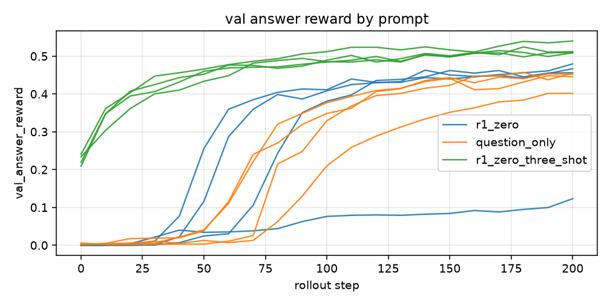

The highest mean reward and the smallest spread is `r1_zero_three_shot`. All four seeds are in 50.9%–54.0%, with no failed run. `question_only` also succeeds on all four runs. Its mean is about 6 percentage points above zero-shot `r1_zero`, mainly because one `r1_zero` run falls to 12.3%. Dropping that run, the other three `r1_zero` seeds overlap with `question_only`.

At step 0, `r1_zero_three_shot` already has a validation answer reward of about 20%, matching the few-shot baseline in chapter 3, and then continues up to 51%. The other two prompts have to learn the format from near 0, and they rise clearly only after step 40.

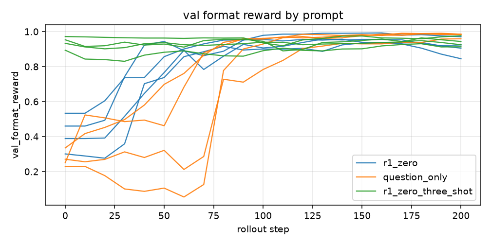

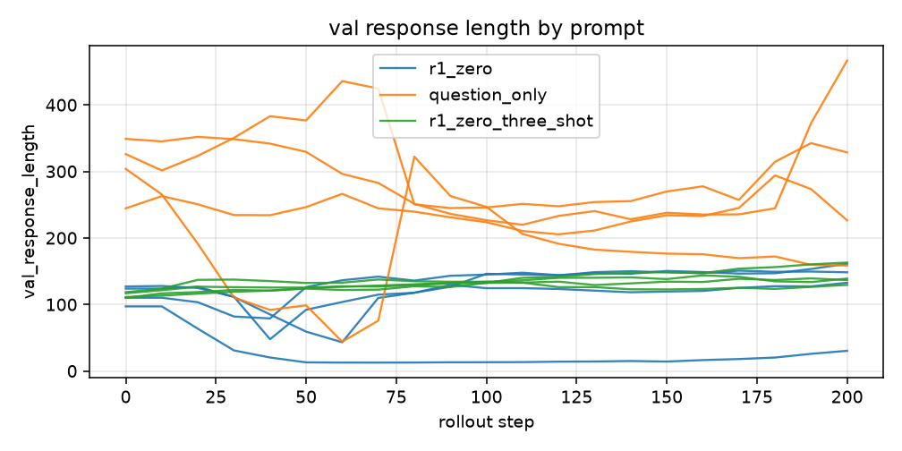

Format rewards are high at the end for all of them. The difference is length: `r1_zero_three_shot` stays around 130–160 tokens; successful `r1_zero` is in the same range, and the failed run shrinks to 30 tokens. `question_only` does not have this short-answer collapse, but the answers are longer. The four seeds end between 158 and 466 tokens, with a large gap across seeds.

Within the four seeds, every `r1_zero_three_shot` run is above the mean of the other two prompts, and the within-group standard deviation is only 1.5 percentage points, so the claim that it is best is fairly well supported. Whether `question_only` is stably better than zero-shot `r1_zero` is less certain: the gap comes mainly from one failed `r1_zero` seed.

---

## 5 RL algorithm variants

### 5.1 Dr. GRPO

#### Problem (think_about_length_normalization): Think about length normalization (1 point)
Source:`cs336_spring2026_assignment5_alignment.pdf`

Think about length normalization (1 point)

Before running any experiments, think about the difference between normalizing each sequence by sequence length, versus normalizing all sequences by the same constant. What are the pros and cons of each approach? Are there specific settings or examples where one approach seems better?

Deliverable: A few sentences of discussion.


**Answer**

Averaging by each sequence's own length makes that sequence's total gradient the advantage times the average of the per-token score gradients. The advantage only sets this sequence's coefficient relative to the other sequences. The magnitude and direction of the gradient are still set by \(\nabla_\theta\log\pi_\theta(y_t\mid x,y_{<t})\). Sequence length does not change that advantage coefficient, so a short answer is not drowned out by a long answer just because it has fewer tokens. As an objective, this is equivalent to multiplying each token by \(1/\mathrm{len}(y)\) inside the surrogate. What is optimized is no longer the equal-per-rollout \(\nabla\mathbb E[r]\); it is a length-weighted policy gradient. The cost is that each token's gradient in a long answer is scaled down, so the model has little incentive to write a correct chain of reasoning out at length. With a fixed constant \(Z\), every token has the same weight. A long correct answer contributes more tokens and a larger total gradient, and answers tend to grow during training. On a short-answer task such as GSM8K, length normalization is the better fit if the goal is to stop the model from earning updates by stretching the output. A fixed constant is the better fit if a correct long chain should receive an update proportional to its token count.

---

#### Problem (compute_group_normalized_rewards_drgrpo): Dr. GRPO group normalization (0.5 points)

Source:`cs336_spring2026_assignment5_alignment.pdf`

Problem (compute_group_normalized_rewards_drgrpo): Dr. GRPO Group normalization (0.5 points)

Deliverable: Update your method `compute_group_normalized_rewards` to support `advantage_normalizer = "none"`. While Dr. GRPO uses `baseline = "mean"`, for this problem, please also add support for `baseline = "none"`.

To test your code, implement `adapters.run_compute_group_normalized_rewards`. Then, run the test with:

```bash
uv run pytest -k compute_group_normalized_rewards_drgrpo
```

and make sure your implementation passes it.

**Answer**

When `advantage_normalizer="none"`, the code no longer divides by the standard deviation. `baseline="mean"` only subtracts the within-group mean; `baseline="none"` uses the raw reward. `test_compute_group_normalized_rewards_drgrpo` passed.

---

#### Problem (aggregate_loss_across_microbatch_constant): Dr. GRPO loss aggregation (0.5 points)
Source:`cs336_spring2026_assignment5_alignment.pdf`

Dr. GRPO loss aggregation (0.5 points)

Deliverable: Update your method aggregate_loss_across_microbatch to support loss_normalization = "constant".

To test your code, implement adapters.run_aggregate_loss_across_microbatch . Then run uv run pytest -k test_aggregate_loss_across_microbatch_constant and ensure the test passes.


**Answer**

When `loss_normalization="constant"`, the losses inside the mask are summed and divided by the given constant. `test_aggregate_loss_across_microbatch_constant` passed. In the training step this normalization is not multiplied by `microbatch_size / batch_size`.

---

## 5 RL algorithm variants

### 5.2 Rejection Fine-Tuning

#### Problem (think_about_rft): Think about RFT (2 points)
Source:`cs336_spring2026_assignment5_alignment.pdf`

Think about RFT (2 points)

Recall that the RFT objective (with constant normalization) is given by

\[
J_\theta = \frac{1}{Z}\sum_x\sum_{j=1}^{G}
\mathbf 1\{r(y^{(j)}\mid x)=1\}
\log \pi_\theta(y^{(j)}\mid x),
\tag{35}
\]

where \(x\) is the prompt, each \(y^{(j)}\) denotes a response \(y^{(j)} \stackrel{iid}{\sim} \pi_\theta(\cdot \mid x)\), \(G\) is the number of generations we sample from the policy, \(Z\) is our constant normalizer, and \(r\) is the reward function. The RFT gradient is then given by \(\nabla_\theta J_\theta\).

In contrast, the on-policy Dr. GRPO policy gradient estimator (i.e. GRPO with constant normalization and no std normalization) is given by

\[
\frac{1}{Z}\sum_x\sum_{j=1}^{G}
\left(r(y^{(j)}\mid x)-\mu\right)
\nabla_\theta\log\pi_\theta(y^{(j)}\mid x),
\tag{36}
\]

where \(\mu\) denotes the group mean \(\mu = \frac{1}{G}\sum_{j=1}^{G} r(y^{(j)}\mid x)\). Assuming our reward function \(r\) is binary, compare and contrast these objectives. Do they have the same expectation? Which do you expect to have lower variance? Intuitively, are there situations where you would prefer one or the other?

Deliverable: A few sentences of discussion.


**Answer**

When the reward is 0/1, \(\mathbf 1\{r=1\}=r\). The expected RFT gradient is \(\mathbb E[r\nabla_\theta\log\pi_\theta]=\nabla\mathbb E[r]\). Dr. GRPO uses \((r-\mu)\) on each sample, where \(\mu\) is the within-group mean. Subtracting a constant baseline that does not depend on \(\theta\) does not change the expectation, so as \(G\to\infty\) and \(\mu\to\eta(x)=\mathbb E[r\mid x]\) both expectations target \(\nabla\mathbb E[r]\). For finite \(G\), \(\mu\) is a within-group random variable, and the expected gradient is smaller than \(\nabla\mathbb E[r]\) by a factor of about \((1-1/G)\) (about 12.5% when \(G=8\)). It is only approximately unbiased.

**Variance:** The \(p<2/3\) result in 4.1.5 belongs only to that one-parameter binary-action model. There \(\nabla_\theta\log\pi(A=1)=1-p\) and \(\nabla_\theta\log\pi(A=0)=-p\) are fixed by the action, so the single-sample variance is \(p(1-p)^3\) when \(b=0\) and \(p(1-p)(1-2p)^2\) when \(b=p\). A binary reward only turns RFT's multiplier into \(r\in\{0,1\}\) and Dr. GRPO's multiplier into \(r-\mu\). A language model's \(\nabla_\theta\log\pi(y\mid x)\) is the sum of per-token scores. After correctness is known it still varies with the content and length of the answer; it is not \(1-p\) or \(-p\). So \(p<2/3\) does not predict which estimator has lower variance on GSM8K.

When score-gradient scales are similar within a group, I expect Dr. GRPO to have lower variance: on an all-correct group RFT still adds those \(\nabla\log\pi\) terms, while Dr. GRPO's advantage is 0; on a mixed group the magnitude of \(r-\mu\) is also smaller than RFT's \(0/1\) weights. If correct answers are systematically longer and have a larger score norm, this centering need not reduce gradient variance, and the binary reward alone does not decide which is lower.

**Behavioral difference:** With `baseline="mean"`, a group whose rewards are all the same (all correct or all wrong) has advantage 0 everywhere, so that group has no gradient. RFT (`baseline="none"`) still upweights those samples on an all-correct group. An all-wrong group produces no gradient under either method: RFT's weight is 0, and Dr. GRPO is also 0 after subtracting the mean. If the goal is only to upweight correct rollouts, and all-correct groups should not be wiped out by the baseline, RFT is preferable.

---

## 5 RL algorithm variants

### 5.3 MaxRL

#### Problem (derive_difficulty_reweightings): Derive difficulty reweightings induced by different advantage normalizers (6 points)
Source:`cs336_spring2026_assignment5_alignment.pdf`

Derive difficulty reweightings induced by different advantage normalizers (6 points)

Recall that in aggregate over prompts, the standard policy gradient is given by

\[
\nabla_\theta J_\theta = \nabla_\theta\mathbb E_{x\sim\rho}\left[\mathbb E_{y\sim\pi_\theta} r(y\mid x)\right].
\tag{39}
\]

where \(\rho\) is our prompt distribution over prompts \(x\), \(\pi_\theta\) denotes our policy, and \(r(y\mid x)\) denotes whether \(y\) is a correct response to \(x\). In this problem, we will derive the surrogate objectives optimized by our GRPO variants, where these surrogates take the form

\[
\nabla_\theta J_{\theta,w} = \nabla_\theta \mathbb E_{x\sim\rho}\left[ w(x,\operatorname{stopgrad}(\pi_\theta)) \mathbb E_{y\sim\pi_\theta} r(y\mid x)\right].
\tag{40}
\]

for some reweighting over prompts \(w\) (where we do not differentiate through \(w\)).

**(a)** Recall that the Dr. GRPO policy gradient estimator is given by

\[
\mathbb E_{x\sim\rho}\left[
\frac{1}{Z}\sum_{j=1}^{G}
(r(y^{(j)}\mid x)-\mu)
\nabla_\theta\log\pi_\theta(y^{(j)}\mid x)
\right],
\tag{41}
\]

where \(\mu = \frac{1}{G}\sum_{j=1}^{G} r(y^{(j)}\mid x)\). Setting the constant normalizer \(Z=G\) and taking group size \(G\to\infty\), for what reweighting function \(w\) is this estimator equivalent to optimizing the surrogate objective \(J_{\theta,w}\)?

Deliverable: An expression in terms of a subset of the problem parameters, with a few sentences of justification.

**(b)** Assuming constant normalization, the GRPO estimator differs from Dr. GRPO in that it divides by the standard deviation:

\[
\mathbb E_{x\sim\rho}\left[
\frac{1}{Z}\sum_{j=1}^{G}
\frac{r(y^{(j)}\mid x)-\mu}{\mathrm{std}}
\nabla_\theta\log\pi_\theta(y^{(j)}\mid x)
\right].
\tag{42}
\]

Setting the constant normalizer \(Z=G\) and taking group size \(G\to\infty\), for what reweighting function \(w\) is this estimator equivalent to optimizing the surrogate objective \(J_{\theta,w}\)?

Deliverable: An expression in terms of a subset of the problem parameters, with a few sentences of justification.

**(c)** MaxRL instead divides by the group mean, or

\[
\mathbb E_{x\sim\rho}\left[
\frac{1}{Z}\sum_{j=1}^{G}
\frac{r(y^{(j)}\mid x)-\mu}{\mu}
\nabla_\theta\log\pi_\theta(y^{(j)}\mid x)
\right].
\tag{43}
\]

Setting the constant normalizer \(Z=G\) and taking group size \(G\to\infty\), for what reweighting function \(w\) is this estimator equivalent to optimizing the surrogate objective \(J_{\theta,w}\)?

Deliverable: An expression in terms of a subset of the problem parameters, with a few sentences of justification.


**Answer**

Let \(\eta(x)=\mathbb E_{y\sim\pi_\theta}[r(y\mid x)]\). The score-function identity gives \(\nabla_\theta\eta(x)=\mathbb E[(r-\eta)\nabla_\theta\log\pi_\theta]\). With \(Z=G\) and \(G\to\infty\), the group mean \(\mu\to\eta(x)\) and the standard deviation converges to \(\sqrt{\mathrm{Var}(r\mid x)}\). The variance of a binary reward is \(\eta(1-\eta)\).

**(a)** The Dr. GRPO limit is \(\mathbb E_x[\nabla_\theta\eta(x)]\), that is, \(w(x)=1\).

**(b)** After dividing by the standard deviation, the gradient becomes \(\mathbb E_x[\nabla_\theta\eta(x)/\sqrt{\eta(x)(1-\eta(x))}]\). This is \(w(x)=1/\sqrt{\eta(x)(1-\eta(x))}\), and \(w\) is not differentiated. The weight is large when \(\eta\) is near 0 or 1, so prompts that are almost all wrong or almost all correct inside the group are amplified.

**(c)** MaxRL divides by \(\mu\to\eta\), so the gradient is \(\mathbb E_x[\nabla_\theta\eta(x)/\eta(x)]\). This corresponds to \(w(x)=1/\eta(x)\). Prompts with lower average reward get larger weight.

---

#### Problem (compute_group_normalized_rewards_maxrl): MaxRL group normalization (0.5 points)

Source:`cs336_spring2026_assignment5_alignment.pdf`

Problem (compute_group_normalized_rewards_maxrl): MaxRL Group normalization (0.5 points)

Deliverable: Update your method `compute_group_normalized_rewards` to support `advantage_normalizer = "mean"`. Like `advantage_normalizer = "std"`, you should add `advantage_eps` to the normalizer to avoid division by zero.

To test your code, implement `adapters.run_compute_group_normalized_rewards`. Then, run the test with:

```bash
uv run pytest -k compute_group_normalized_rewards_maxrl
```

and make sure your implementation passes it.

**Answer**

When `advantage_normalizer="mean"`, subtract the within-group mean and then divide by the within-group mean reward plus `advantage_eps`. `test_compute_group_normalized_rewards_maxrl` passed.

---

#### Problem (think_about_advantage_normalization): Think about advantage normalization (2 points)

Source:`cs336_spring2026_assignment5_alignment.pdf`

Think about advantage normalization (2 points)

Before running any experiments, think about the difference between normalizing the group advantages by the group std, the group mean, or doing no advantage normalization. What are the pros and cons of each approach? Are there specific settings or examples where one approach seems better?

Deliverable: A few sentences of discussion.

**Answer**

**Divide by the within-group standard deviation (GRPO, `baseline="mean"`):** Advantages from different prompts are closer in scale. If every reward in the group is the same, subtracting the mean makes the advantage **all zeros first**, and dividing by \(\sigma+\varepsilon\) still leaves 0. That is **no signal**, not amplification by \(\varepsilon\). The case that really has "denominator \(\to 0\) while the numerator is nonzero" is **`baseline="none"` and then dividing by the std**: for example, a binary-reward group that is all correct has raw advantage 1 everywhere and \(\sigma=0\), which gives a huge weight of about \(1/\varepsilon\).

**Divide by the within-group mean (MaxRL, `baseline="mean"`):** The implementation is \((r-\mu)/(\mu+\varepsilon)\). The direction still upweights hard prompts with low \(\mu\). When the group is all wrong or all correct the numerator is 0 first, the advantage is still 0, and \(\varepsilon\) does not amplify those groups. With \(G=8\), \(\varepsilon=10^{-6}\), and exactly one correct sample, \(\mu=1/8\), the correct sample is about \(0.875/0.125=7\), and \(\varepsilon\) changes that by only about \(10^{-5}\) relatively; the incorrect samples are about \(-1\). In the same group, using the standard deviation as the denominator, the correct sample is about 2.5. MaxRL is larger because the denominator is \(\mu\) rather than the std, with magnitude about \(G-1\). The \(w(x)=1/\eta(x)\) in section 5.3 is the prompt weight as \(G\to\infty\), not an upper bound from \(\varepsilon\) on a single group.

**No normalization (the advantage part of Dr. GRPO / RFT):** The scale follows the reward and the baseline directly. Paired with a constant loss, a long answer has more tokens and a larger total gradient. On GSM8K, with binary 0/1 rewards and groups that are often all wrong, I prefer **not dividing by the std**: under a mean baseline, std normalization of the many identical groups does not create a contrastive signal, and on mixed groups it adds an extra difficulty reweighting (see the derivation in 5.3).

---

## 5 RL algorithm variants

### 5.4 Experiments

#### Problem (grpo_train_step_variants_on_policy): GRPO train-step variants (2.5 points)
Source:`cs336_spring2026_assignment5_alignment.pdf`

GRPO train step variants (2.5 points)

Deliverable: Update your grpo_train_step method to support the full range of on-policy variants (still with importance_reweighting_method = "none"). These options include baseline:

Literal["mean", "none"], advantage_normalizer: Literal["std", "none", "mean"], and loss_normalization: Literal["sequence", "constant"]. Also, to speed up training, your method should avoid passing zero advantage sequences into the model.

Note that for baseline = "none", the incorrect samples get zero reward and therefore zero weight in the loss, so it is unnecessary to pass them through the model. You can take advantage of this fact to adjust the implementation and speed up training.

To test your code, implement adapters.run_grpo_train_step . Then run uv run pytest -k test_grpo_train_step_variants_on_policy and confirm it passes.


**Answer**

`grpo_train_step` now supports the full set of on-policy variants. Under a **fixed rollout-batch layout**, it skips sequences with `advantage == 0` inside each microbatch (it does not first shrink the batch to an arbitrary length, which would risk `batch_size // grad_accum` being 0). For sequence normalization it uses the **original microbatch sequence count** as the denominator so the gradient matches the unpruned version. If a whole step has no nonzero-advantage sequence, it still writes the gradients as 0 and calls `optimizer.step()`, so Adam momentum decays on a zero gradient. All four combinations in `test_grpo_train_step_variants_on_policy` passed. The training entry point is `--recipe` in `scripts/train_grpo_variants.py`.

---

#### Problem (grpo_experiments_variants_on_policy): Compare the performance of different RL algorithms (about 8 B200 hours, 10 points)
Source:`cs336_spring2026_assignment5_alignment.pdf`

Compare the performance of different RL algorithms (8 B200 hrs) (10 points)

Keeping hyperparameters fixed with respect to your standard GRPO training runs (for your choice of learning rate), run the following variations, with 4 random seeds each. You should use the zero-shot r1_zero prompt.

• GRPO_constant: standard GRPO, but doing constant normalization for loss aggregation, rather than sequence normalization.

• Dr_GRPO: GRPO_constant but with advantage_normalizer = "none".

• RFT: GRPO_constant but with advantage_normalizer = "none" and baseline = "none". Note that for this method, there is no need to pass incorrect samples through the model being trained, which should speed up training.

• MaxRL: GRPO_constant but with advantage_normalizer = "mean". Note that the original MaxRL implementation normalizes the loss by the number of tokens per microbatch, but we will use constant normalization instead.

Compared to the standard GRPO runs you ran previously, how do these methods perform?

Which methods have the best average performance, and which methods have the lowest variance? Are there methods that you think would benefit from more hyperparameter tuning?

Based on the variance between runs, how confident are you in your findings?

Deliverable: Commentary, supported by plots for referenced metrics.


**Answer**

The learning rate is still \(1\times10^{-5}\), the prompt is still zero-shot `r1_zero`, and the other hyperparameters match standard GRPO. Each of the four variants uses 4 seeds, compared with `results/standard_seed_*`.

| Method | Final validation answer reward of the four seeds | Mean | Sample standard deviation |
| --- | --- | ---: | ---: |
| Standard GRPO | 47.9%, 45.6%, 12.3%, 46.7% | 38.1% | 17.2 pp |
| GRPO constant | 49.9%, 51.5%, 49.4%, 47.7% | 49.6% | 1.6 pp |
| Dr. GRPO | 48.4%, 49.3%, 49.6%, 49.4% | 49.2% | 0.5 pp |
| MaxRL | 50.6%, 49.2%, 44.8%, 45.9% | 47.6% | 2.7 pp |
| RFT | 47.5%, 44.8%, 48.6%, 46.5% | 46.9% | 1.6 pp |

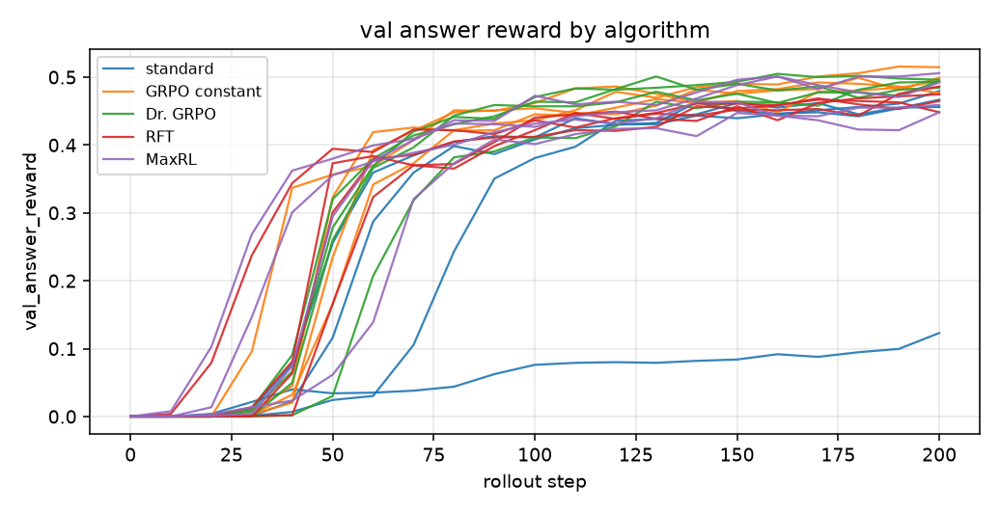

The highest mean is GRPO constant, at 49.6%. Dr. GRPO is only 0.4 percentage points lower, and its sample standard deviation is only 0.5 percentage points, the smallest spread. All 16 constant-normalization runs fall in 44.8%–51.5%, and none repeats the standard-GRPO seed that falls to 12.3%. The worst constant run (47.7%) already matches the best standard-GRPO seed (47.9%).

This gap is clearer than the gaps among the four variants. The difference between GRPO constant and Dr. GRPO is smaller than their own standard deviations, so it does not support a claim that dividing by the within-group standard deviation helps. RFT has the lowest mean, but all four runs are in 44.8%–48.6%, still above the standard-GRPO mean. MaxRL varies more than the other three variants.

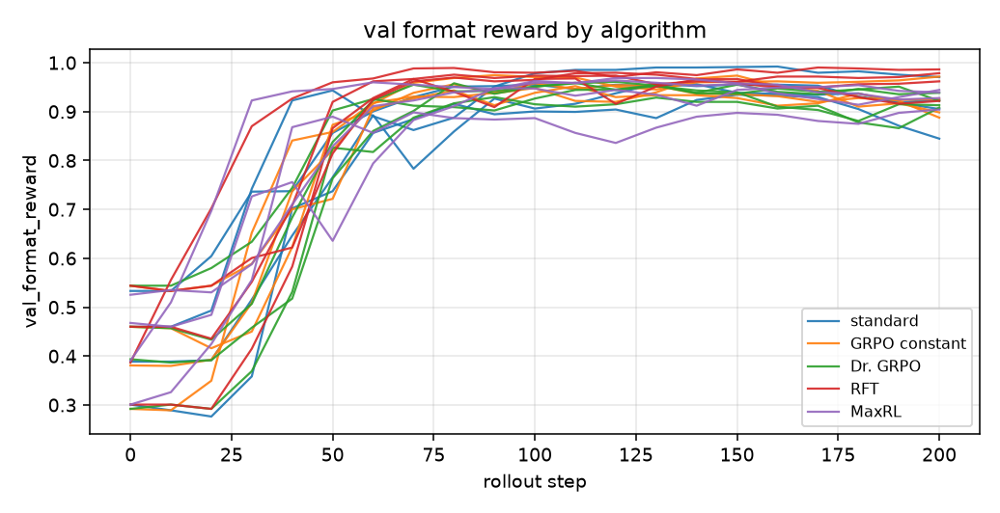

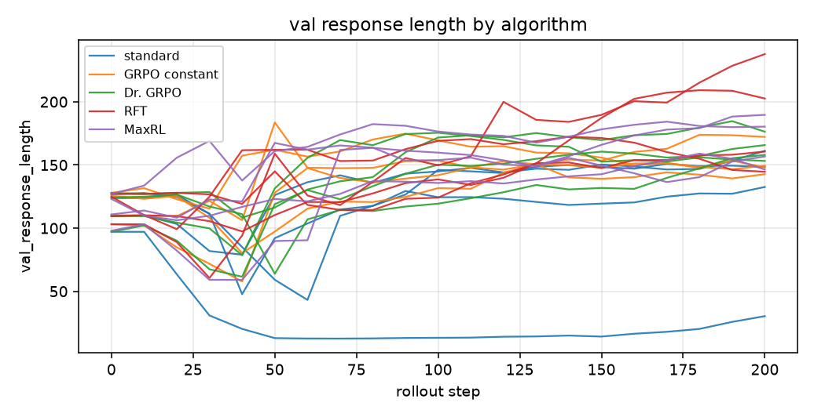

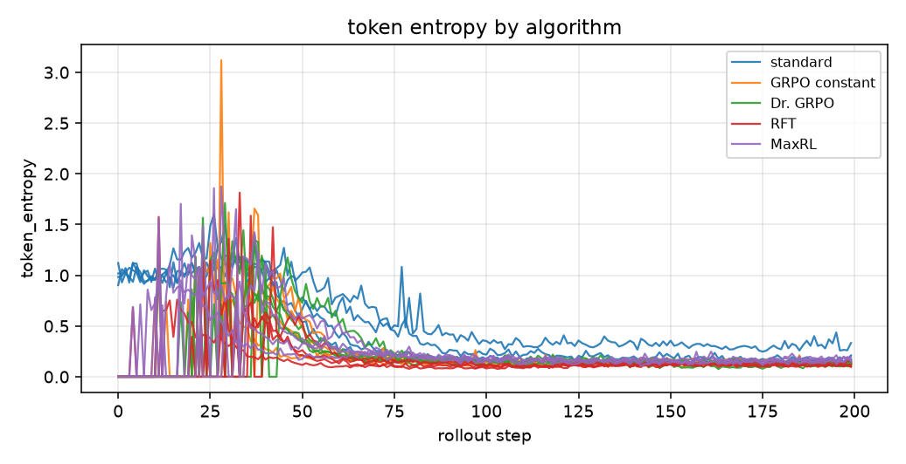

Format rewards all end above 84%, and the methods do not separate. On length, the failed standard-GRPO run shrinks to 30 tokens; successful standard runs are about 130–160. GRPO constant and Dr. GRPO finish in 143–176, more aligned across seeds. RFT is the longest and the most spread out, from 145 to 238. MaxRL is in 146–190.

This entropy plot cannot be compared with standard GRPO as higher or lower. The standard experiment averages every response token in the step, so a step whose whole-group advantage is 0 still has entropy around 1. The variants use the current `grpo_train_step`: they average only nonzero-advantage sequences; when a whole step has no such sequence, the log writes 0 and marks `token_entropy_skipped`. The first several dozen steps sitting at 0 on the plot are those skipped steps, not measured entropy. So one cannot say the variants are more certain than standard GRPO, and one cannot compare them by saying "the failed seed stays at 0.33 and the other methods do not."

Standard GRPO is the method most worth retuning the learning rate for. It is the only method that shows the short-answer collapse, and \(5\times10^{-6}\) already shows that lowering the learning rate removes that failure. RFT's length spans nearly 100 tokens; if one cares whether answers keep getting longer, length normalization is also worth looking at on its own. At the single learning rate \(1\times10^{-5}\), GRPO constant and Dr. GRPO have all four results packed within two percentage points. That only says the four runs are tight at this learning rate. It does not imply that the mean reward would stay put at another learning rate.

In these 16 runs at fixed hyperparameters, none lands on the standard-GRPO seed at 12.3%. The standard-GRPO mean of 38.1% is pulled down by that one run, so "above this mean" mainly reflects that the failure did not recur. Whether GRPO constant or Dr. GRPO is higher, and whether RFT is truly below them, is not resolved by the present spread: it does not cover differences of a few percentage points.

---

## 6 Off-policy RL

### 6.2 PPO/GRPO-style importance reweighting and clipping

#### Problem (derive_surrogate_objectives): Derive surrogate objectives for importance-reweighting methods (2 points)
Source:`cs336_spring2026_assignment5_alignment.pdf`

Derive surrogate objectives for importance reweighting approaches (2 points)

Above, we saw that token-level importance reweighting optimizes expected reward under surrogate policies where we sample from the old policy for all but one position. Suppose we instead consider a “pairwise” importance reweighting approach given by the following policy gradient estimator:

∑

𝐿

2 𝑡=1 𝜋𝜃(𝑦2𝑡−1 | 𝑥, 𝑦<2𝑡−1)𝜋𝜃(𝑦2𝑡 | 𝑥, 𝑦<2𝑡) 𝜋0(𝑦2𝑡−1 | 𝑥, 𝑦<2𝑡−1)𝜋0(𝑦2𝑡 | 𝑥, 𝑦<2𝑡)𝑟(𝑦 | 𝑥)∇𝜃[log(𝜋𝜃(𝑦2𝑡−1 | 𝑥, 𝑦<2𝑡−1)𝜋𝜃(𝑦2𝑡 | 𝑥, 𝑦<2𝑡))](55) where 𝜋𝜃 is our current policy, 𝜋0 is our stale sampling policy, and 𝑦 ∼ 𝜋0(𝑦 | 𝑥). What surrogate objective is this estimator optimizing?

Deliverable: An expression in terms of a subset of the problem parameters, accompanied by a derivation.


**Answer**

\[
\sum_{t=1}^{L/2}
\frac{
\pi_\theta(y_{2t-1}\mid x,y_{<2t-1})
\pi_\theta(y_{2t}\mid x,y_{<2t})
}{
\pi_0(y_{2t-1}\mid x,y_{<2t-1})
\pi_0(y_{2t}\mid x,y_{<2t})
}
 r(y\mid x)
 \nabla_\theta\left[
 \log\left(
 \pi_\theta(y_{2t-1}\mid x,y_{<2t-1})
 \pi_\theta(y_{2t}\mid x,y_{<2t})
 \right)
 \right].
\tag{55}
\]

where:

- \(\pi_\theta\) is the current policy;
- \(\pi_0\) is the stale sampling policy;
- \(y\sim\pi_0(y\mid x)\).

What surrogate objective does this estimator optimize?


Let the \(t\)-th token pair occupy positions \(\{2t-1,2t\}\). Define a surrogate policy \(\tilde\pi_t\): these two positions are sampled from the current policy \(\pi_\theta\), and the other positions are sampled from the old policy \(\pi_0\). Its importance weight relative to \(\pi_0\) is exactly the product of the two ratios in the problem, and

\[
\nabla_\theta\log\tilde\pi_t(y\mid x)
=
\nabla_\theta\log\pi_\theta(y_{2t-1}\mid x,y_{<2t-1})
+
\nabla_\theta\log\pi_\theta(y_{2t}\mid x,y_{<2t}).
\]

Following the form of handout equation (51), equation (55) optimizes the sum of expected rewards under these surrogate policies. It is a scalar objective, not a gradient:

\[
J_{\text{pair}}(x)
=\sum_{t=1}^{L/2}
\mathbb E_{y\sim\tilde\pi_t(y\mid x)}[r(y\mid x)].
\]

Rewriting with importance sampling so that \(y\sim\pi_0\), the objective itself is still

\[
J_{\text{pair}}(x)
=\sum_{t=1}^{L/2}
\mathbb E_{y\sim\pi_0(y\mid x)}
\left[
\frac{
\pi_\theta(y_{2t-1}\mid x,y_{<2t-1})
\pi_\theta(y_{2t}\mid x,y_{<2t})
}{
\pi_0(y_{2t-1}\mid x,y_{<2t-1})
\pi_0(y_{2t}\mid x,y_{<2t})
}
\, r(y\mid x)
\right].
\]

Differentiating in \(\theta\) and applying the log-derivative then yields the estimator in the problem. The right-hand side carries the score, not \(\mathbb E[r]\):

\[
\nabla_\theta J_{\text{pair}}(x)
=\sum_{t=1}^{L/2}
\mathbb E_{y\sim\pi_0(y\mid x)}
\left[
\frac{
\pi_\theta(y_{2t-1}\mid x,y_{<2t-1})
\pi_\theta(y_{2t}\mid x,y_{<2t})
}{
\pi_0(y_{2t-1}\mid x,y_{<2t-1})
\pi_0(y_{2t}\mid x,y_{<2t})
}
\, r(y\mid x)
\,
\nabla_\theta\log\big(
\pi_\theta(y_{2t-1}\mid x,y_{<2t-1})
\pi_\theta(y_{2t}\mid x,y_{<2t})
\big)
\right].
\]

(Taking the expectation of \(x\) under the prompt distribution \(\rho\) gives the full-dataset objective.)

---

#### Problem (compute_policy_gradient_loss_off_policy): Off-policy policy gradient with token-level reweighting (1 point)
Source:`cs336_spring2026_assignment5_alignment.pdf`

Off-policy policy gradient with tokenlevel reweighting (1 point)

Deliverable: Update your method compute_policy_gradient_loss to support importance_reweighting_method = "noclip" or "grpo", which use the old_log_probs and cliprange arguments. old_log_probs denotes the per-token log probabilities under the model used to generate the rollouts, and you’ll have to add a few lines to your training script to compute these. cliprange denotes the clipping strength parameter 𝜀.

To test your code, implement adapters.run_compute_policy_gradient_loss . Then run uv run pytest -k test_compute_policy_gradient_loss_off_policy and ensure the test passes.

Note: while clipping is motivated in PPO as a way to prevent the current policy from straying too far from the old policy, it can also be viewed as a way to reduce the variance of the importance reweighted estimator, since we are squashing importance weight terms that are too large. If we are less concerned with straying far from the old policy and want to be more aggressive in our updates, a much simpler and more direct way to control the variance is to just upper-bound-clip the importance weight in the gradient estimator directly:

\[
\hat g \leftarrow
\frac{1}{BG}\sum_{i,j}
\frac{1}{\mathrm{len}(y^{(i,j)})}
\sum_t
\min(w_t^{(i,j)},1+\varepsilon)\,
A^{(i,j)}
\nabla_\theta\log\pi_\theta(y_t\mid x,y_{<t}).
\tag{61}
\]

where unlike PPO/GRPO we still take non-zero gradient through actions that are upweighted by more than \(1+\varepsilon\). This simpler clipping procedure is proposed in CISPO [MiniMax et al., 2025] (note: they also normalize by per-group token count instead of per-sequence length, but we write the sequence-normalized objective for simplicity). Optionally, you’re welcome to try out CISPO and compare it to the other clipping methods.


**Answer**

\[
\hat g \leftarrow
\frac{1}{BG}\sum_{i,j}
\frac{1}{\mathrm{len}(y^{(i,j)})}
\sum_t
\min(w_t^{(i,j)},1+\varepsilon)
A^{(i,j)}
\nabla_\theta\log\pi_\theta(y_t\mid x,y_{<t}).
\tag{61}
\]

The difference from PPO/GRPO is that even if a positive-advantage action has already been upweighted by the current policy by more than a factor of \(1+\varepsilon\), it still keeps a nonzero gradient; only the importance weight itself is truncated.

This simpler clipping method comes from **CISPO** [MiniMax et al., 2025]. The original paper also normalizes by the group's token count rather than by each sequence length; for simplicity this is written only as a sequence-normalized objective.

This method is optional. One can also try CISPO and compare it with the other clipping methods.

The per-token `noclip` loss is \(-(A w_t)\), where \(w_t=\exp(\log\pi_\theta-\log\pi_0)\). `grpo` uses PPO's \(\min(Aw_t, A\mathrm{clip}(w_t,1-\varepsilon,1+\varepsilon))\) and then negates it. The **`clip_fraction`** in the metadata is the fraction of response tokens whose ratio falls outside \([1-\varepsilon,1+\varepsilon]\). It is not the fraction of gradients that are clipped to 0: when the advantage is positive and \(w<1-\varepsilon\), or the advantage is negative and \(w>1+\varepsilon\), the \(\min\) still takes the unclipped branch. `test_compute_policy_gradient_loss_off_policy` passed. The CISPO variant above clips only the weights of positive advantages, and it was not implemented in this run.

---

## 6 Off-policy RL

### 6.3 GSPO

#### Problem (think_about_importance_reweighting): Think about importance reweighting (2 points)
Source:`cs336_spring2026_assignment5_alignment.pdf`

Think about importance reweighting (2 points)

Consider three possible importance reweighting strategies for off-policy RL: (a) no importance reweighting, (b) PPO/GRPO-style clipped token-level importance reweighting, and (c) GSPOstyle clipped sequence-level importance reweighting using the geometric mean. In terms of trading off bias and variance, where does each approach lie on the spectrum? Can you think of situations where one approach might intuitively be better than the others?

Deliverable: A few sentences of commentary.


**Answer**

The comparison below covers only the three strategies in the problem (no reweighting / PPO/GRPO **token-level clip** / GSPO **geometric mean + clip**).

All samples come from the old policy \(\pi_0\). The target to match is \(\nabla\mathbb E_{y\sim\pi_\theta}[r]\), or a surrogate expectation of the form in equation (51). When \(\pi_0\) does not depend on \(\theta\), \(\nabla\mathbb E_{y\sim\pi_0}[r]=0\), so it cannot be used as the baseline. The three weights also have to be kept separate: no ratio, a single-token ratio \(w_t\), the joint ratio \(\prod_s w_s\), and the geometric mean \(\exp(\mathrm{mean}_t\log w_t)=(\prod_t w_t)^{1/\mathrm{len}(y)}\).

| Strategy | What it matches before clipping | Weight | Bias | Variance |
| --- | --- | --- | --- | --- |
| (a) No reweighting | Only when \(\pi_\theta=\pi_0\), the sampling expectation of \(r\nabla\log\pi_\theta\) matches \(\nabla\mathbb E_{y\sim\pi_\theta}[r]\) | none | Once the policies separate, the sampling distribution is not the current policy | No IS weight, so this extra variance is the smallest |
| (b) Token-level, before clipping | What it matches is equation (51): only the \(t\)-th token comes from \(\pi_\theta\). It is not joint IS, so in general it does not match \(\nabla\mathbb E_{y\sim\pi_\theta}[r]\) | One \(w_t\) per position, not \(\prod_s w_s\) | Prefix and suffix both come from \(\pi_0\); clipping then zeros the gradient on the side that matches the sign of the advantage | Lower than the joint product, because it does not multiply \(\mathrm{len}(y)\) ratios together. Clipping further compresses the tail on that side |
| (c) GSPO geometric mean, before clipping | Also not joint IS. The joint ratio is \(\prod_t w_t\); the geometric mean adds a power of \(1/\mathrm{len}(y)\) | \(\exp(\mathrm{mean}_t\log w_t)\) | Biased relative to joint IS; that power also becomes a length average inside the gradient. Clipping adds another layer | Lower than the joint product; a sequence has only one scalar, and the whole span of \(\log\pi\) is tied together |

Intuition: (a) fits the first few of 32 updates, while the policy is still close to the sampling policy; (b) replaces the joint product with a single-token ratio, which lowers variance at the cost of surrogate bias; (c) sits between (b) and the full joint ratio. It is more stable than the product when answers are long, but it is not an unbiased substitute for the joint ratio. Clipping is about which side's tail is cut off, not about which of the three weights is closer to the expectation under \(\pi_0\).

---

#### Problem (compute_policy_gradient_loss_off_policy_gspo): Off-policy policy gradient with sequence-level reweighting (1 point)
Source:`cs336_spring2026_assignment5_alignment.pdf`

Off-policy policy gradient with sequence-level reweighting (1 point)

Deliverable: Update your method compute_policy_gradient_loss to support importance_reweighting_method = "gspo", which uses the old_log_probs and cliprange arguments. old_log_probs denotes the per-token log probabilities under the model used to generate the rollouts, and you’ll have to add a few lines to your training script to compute these. cliprange denotes the clipping strength parameter 𝜀. As above, return the negative objective so that minimizing the loss performs gradient ascent.

To test your code, implement adapters.run_compute_policy_gradient_loss . Then run uv run pytest -k test_compute_policy_gradient_loss_off_policy_gspo and ensure the test passes.


**Answer**

`gspo` averages \(\log\pi_\theta-\log\pi_0\) over response tokens and then exponentiates, producing a sequence-level ratio. It then uses the same clip and \(\min\) as GRPO and writes that scalar onto every position of the sequence. The geometric mean is implemented as a mean of logs, which avoids overflow from the product. `test_compute_policy_gradient_loss_off_policy_gspo` passed.

---

## 6 Off-policy RL

### 6.4 Experiments

#### Problem (grpo_train_step_off_policy): Off-policy GRPO train step (2.5 points)
Source:`cs336_spring2026_assignment5_alignment.pdf`

Off-policy GRPO train step (2.5 points)

Deliverable: Update your grpo_train_step method to support the off-policy arguments

(importance_reweighting_method, old_log_probs, cliprange). The function should now support the full range of arguments.

To test your code, implement adapters.run_grpo_train_step . Then run uv run pytest -k test_grpo_train_step_off_policy and confirm it passes.


**Answer**

`grpo_train_step` passes `old_log_probs`, `cliprange`, and `importance_reweighting_method` to `compute_policy_gradient_loss` and records `clip_fraction`. `test_grpo_train_step_off_policy` passed. Under `--recipe offpolicy_*`, `scripts/train_grpo_variants.py` takes 32 updates on each inference batch (`train_batch_size=8`) and, after the rollout, uses `compute_old_log_probs` to freeze the sampling policy's log-probabilities.

---

#### Problem (grpo_experiments_off_policy): Compare the performance of different off-policy algorithms (about 8 B200 hours, 10 points)
Source:`cs336_spring2026_assignment5_alignment.pdf`

Compare the performance of different off-policy algorithms (8 B200 hrs) (10 points)

Keeping hyperparameters fixed with respect to your standard GRPO training runs (for your choice of learning rate), run the following variations, with 4 random seeds each. You should use the zero-shot r1_zero prompt. If you would like, you can choose your favorite RL algorithm variant from the previous section instead of sticking with the standard version.

• offpolicy_naive: Instead of making inference and training batch size equal (both 256), reduce the training batch size to 1/32nd of the inference batch size (\(256/32 = 8\)). Remember to reduce the number of gradient accumulation steps by the same factor so we continue fully utilizing our GPUs. Keep importance_reweighting_method = "none".

• offpolicy_noclip: offpolicy_naive with importance_reweighting_method = "noclip".

• offpolicy_clip: offpolicy_naive with importance_reweighting_method = "grpo".

• offpolicy_gspo: offpolicy_naive with importance_reweighting_method = "gspo".

In addition to the metrics you’re already logging, make sure to also log the clip fraction.

Compared to the fully on-policy GRPO runs you ran previously, how do these methods perform?

How does going off-policy affect training stability and variance between runs? How do the two clipping methods differ in terms of the clip fraction, and which one seems more stable? Are there methods that you think would benefit from more hyperparameter tuning? Based on the variance between runs, how confident are you in your findings?

Deliverable: Commentary, supported by plots for referenced metrics.


**Answer**

The learning rate is still \(1\times10^{-5}\), and the prompt is still zero-shot `r1_zero`, matching standard GRPO. Each rollout has 256 responses, split into 32 updates of 8 responses each, and the number of gradient-accumulation steps is 1. Each of the four methods uses 4 seeds. `clip_fraction` is logged on every training step of `offpolicy_clip` and `offpolicy_gspo`.

| Method | Final validation answer reward of the four seeds | Mean | Sample standard deviation |
| --- | --- | ---: | ---: |
| Standard GRPO | 47.9%, 45.6%, 12.3%, 46.7% | 38.1% | 17.2 pp |
| off-policy naive | 53.9%, 53.7%, 49.0%, 38.9% | 48.9% | 7.0 pp |
| noclip | 50.2%, 54.2%, 55.0%, 52.6% | 53.0% | 2.1 pp |
| GRPO clip | 53.8%, 54.7%, 54.6%, 50.1% | 53.3% | 2.2 pp |
| GSPO | 51.9%, 47.9%, 52.9%, 48.6% | 50.3% | 2.4 pp |

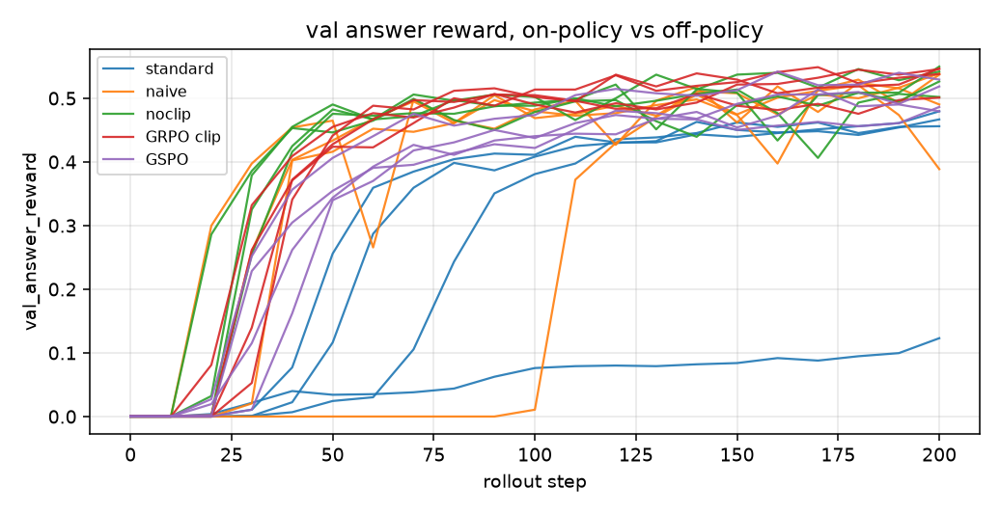

Splitting one large update into 32 small updates, with no importance weighting, already raises the mean from 38.1% to 48.9% and lowers the standard deviation from 17.2 to 7.0 percentage points. After adding the unclipped ratio, all four runs are in 50.2%–55.0%, with mean 53.0%. GRPO clip is almost the same, with mean 53.3% and standard deviation 2.2 percentage points. GSPO's mean is 50.3%, slightly lower, and its spread is similar to token-level clipping. None of the four off-policy methods repeats the standard-GRPO seed that falls to 12.3%. The weakest naive run is 38.9%; the lowest of the other three is GSPO at 47.9%.

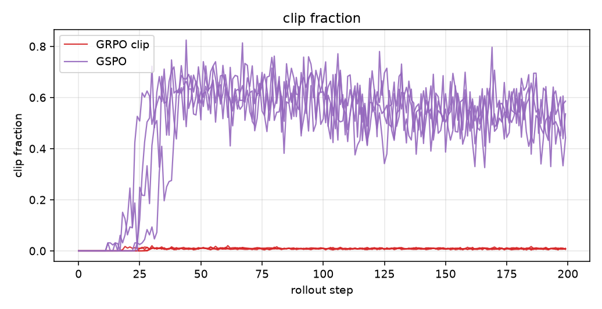

The two clipping methods differ in the fraction of ratios that fall outside the interval, not in whether the final accuracy matches. `clip_fraction` records the fraction of response tokens whose ratio falls outside \([1-\varepsilon,1+\varepsilon]\). It is not the fraction of gradients set to 0, and it is not a fraction of sequences. When the advantage is positive and the ratio is below \(1-\varepsilon\), or the advantage is negative and the ratio is above \(1+\varepsilon\), PPO's \(\min\) still uses the unclipped branch. GSPO broadcasts one sequence ratio onto every token of that sequence, so its `clip_fraction` is a sequence fraction weighted by response length.

GRPO clip uses `cliprange` 0.2. After step 100 the clip fraction is about 0.9%, and all four seeds are in 0.81%–0.90%. Few tokens fall outside, which is why the curve overlaps noclip. GSPO uses `cliprange` \(3\times10^{-4}\). Over the same period about 55% of tokens fall outside, and the four seeds are in 52%–56%. That means about half of the tokens lie outside the interval; it cannot be read directly as half of the sequences being clamped. The standard deviation of accuracy matches GRPO clip, about 2 percentage points, and the mean is still about 3 percentage points lower.

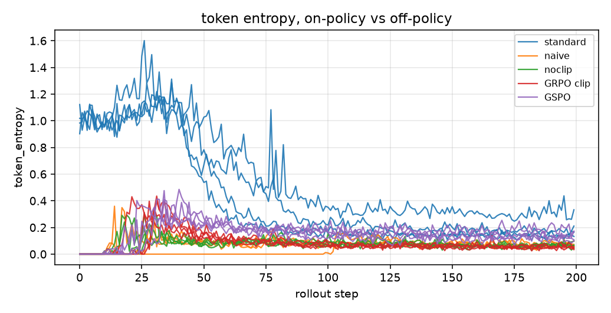

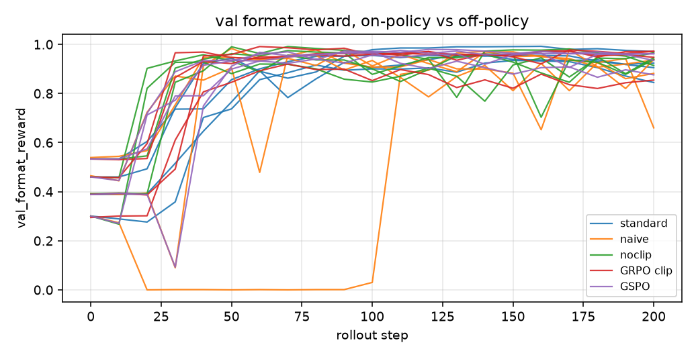

This entropy plot likewise cannot support a conclusion that "off-policy is lower." The standard curve counts every response token. Each off-policy point is the arithmetic mean of up to 32 small updates: each update counts only nonzero-advantage sequences, and an update whose whole group has advantage 0 is recorded as 0. The log marks `token_entropy_skipped` only when all 32 updates are skipped. The zeros in the early part of the plot are those skipped steps. Later steps are no longer marked as skipped, but the average can still mix in zeros from updates that did not compute entropy, and the denominator is not the same set of tokens as in the standard experiment. One naive seed has a format reward of only 66.0%; the other three methods are all above 85%. Response length does not shrink again into the failure mode of 30 tokens.

Naive is the method most worth retuning. It has no importance weighting, one of the four runs falls clearly behind, and the standard deviation is still 7 percentage points. About half of GSPO's tokens fall outside the interval, so the interval may be too tight; whether widening `cliprange` would move it toward noclip was not measured in this experiment. At \(1\times10^{-5}\), noclip and GRPO clip both have all four runs in 50%–55%. That only says the four runs are tight at this learning rate. It does not imply that the mean reward would stay put if the hyperparameters were tuned further.

In this set of runs at fixed hyperparameters, the lowest of the 12 runs that use a ratio is 47.9%, above the standard-GRPO mean of 38.1% and above its 12.3% seed. The standard mean is pulled down by that one run, so these 12 runs being above the mean says that this kind of failure did not recur, not that they would still be better after changing the learning rate. Noclip and GRPO clip cannot be separated as to which is higher. The out-of-range fraction for token-level clipping is about 0.9%, which is consistent with the overlap with noclip. GSPO's mean is about 3 percentage points lower; compared with a standard deviation of 2 percentage points, one cannot yet say it is definitely worse.

---

## 7 Try your own policy-gradient estimator

#### Problem (try_your_own): Try your own policy-gradient estimator (10 points)
Source:`cs336_spring2026_assignment5_alignment.pdf`

Try your own policy gradient estimator (10 points)

Now that you’ve seen a variety of policy gradient estimators that have been proposed in the literature, along with some of the theory behind them, it’s time for you to propose your own!

Here are some suggestions:

• You could try a different advantage estimator, inducing a different reweighting over prompts.

• You could try a different importance reweighting strategy.

• You could try a different reward baseline in the advantage estimator.

Propose your own policy gradient estimator. Then, run it on the same RL setting of OLMo-2-0425-1B on GSM8K and compare it to the approaches we’ve already tried as baselines, using multiple random seeds and keeping problem parameters fixed to make the results comparable. Please change just one thing relative to the approaches tried so far (i.e. there should be at least one previous approach covered in this assignment such that your approach changes only one thing).

What is the theoretical justification or intuition behind your proposed change? Does your proposed change beat the baselines?

Deliverable: Commentary, supported by plots for referenced metrics, and optionally mathematical derivations if they are useful in justifying your approach.


**Answer**

Relative to standard GRPO, only one thing changes: the advantage goes from \((r-\mu)/\mathrm{std}\) to \(r-\mu\). The baseline is still the within-group mean, the loss is still averaged by sequence, the prompt is still zero-shot `r1_zero`, the learning rate is still \(1\times10^{-5}\), and the other hyperparameters are unchanged. When only a few answers in a group are correct, the standard deviation is small, and dividing by it amplifies those few advantages. After removing that step, a group with identical rewards still gets 0; a mixed group is weighted only by distance from the mean, and is no longer amplified by within-group fluctuation. Dr. GRPO also removes the standard deviation, but it also changes the loss to constant normalization, so it cannot isolate the standard-deviation term. This run splits that term out and compares four seeds with standard GRPO and Dr. GRPO.

| Method | Final validation answer reward of the four seeds | Mean | Sample standard deviation |
| --- | --- | ---: | ---: |
| Standard GRPO | 47.9%, 45.6%, 12.3%, 46.7% | 38.1% | 17.2 pp |
| No std division, sequence average | 51.3%, 49.0%, 48.0%, 45.9% | 48.6% | 2.2 pp |
| Dr. GRPO | 48.4%, 49.3%, 49.6%, 49.4% | 49.2% | 0.5 pp |

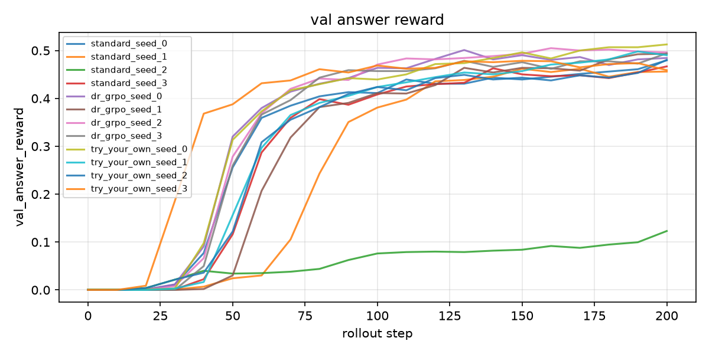

All four runs fall in 45.9%–51.3%, and none repeats the standard-GRPO seed that falls to 12.3%. The mean of 48.6% is above standard GRPO's 38.1%. That gap comes mainly from the one failure: the other three standard-GRPO runs are 45.6%–47.9% and overlap these four. The highest, 51.3%, is above standard GRPO's best of 47.9%, but the lowest, 45.9%, sits with the successful standard seeds. Four seeds do not separate "dropping the std is more accurate than a successful standard GRPO."

Compared with Dr. GRPO, the mean is only 0.6 percentage points lower, and this run's own sample standard deviation is 2.2 percentage points. Once the standard deviation has already been removed, switching sequence averaging back to constant normalization is a difference the present spread does not resolve.

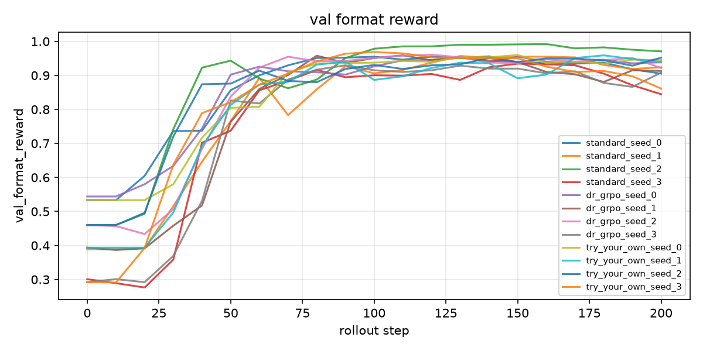

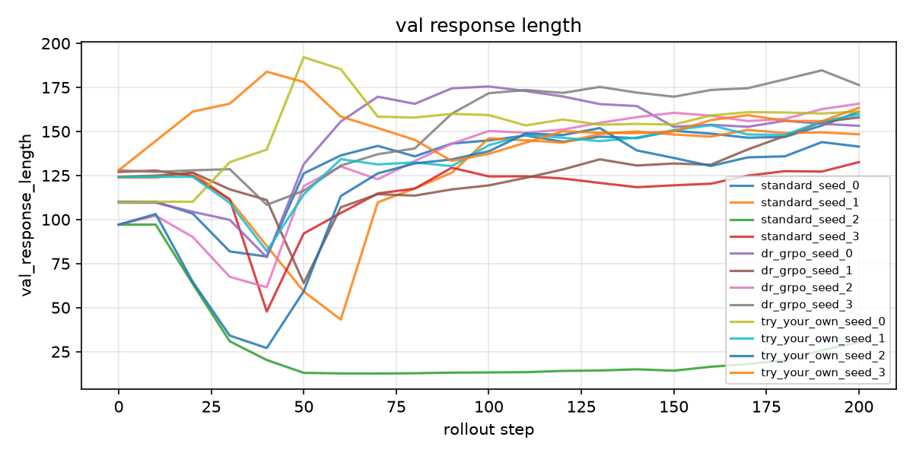

Format reward is 86.1%–95.2% on all four runs. Response length is 141–163 tokens, and it does not shrink to the 30 tokens of the failed standard-GRPO seed. Length and format both show that this run does not enter that short-answer collapse, but accuracy does not stably exceed the already successful standard GRPO, and it does not exceed Dr. GRPO.

---

---
